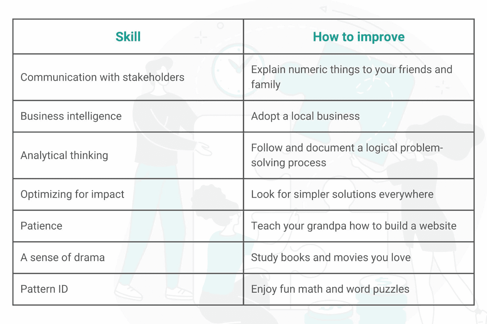

# 数据科学家与其他职业不同的七项独特技能

> 原文：[`www.kdnuggets.com/2022/05/7-unique-skills-set-data-scientists-apart-professions.html`](https://www.kdnuggets.com/2022/05/7-unique-skills-set-data-scientists-apart-professions.html)

成为数据科学家归结为：处理数据、提取洞察并传达这些洞察。这分解为七项独特的技能，没有其他职位需要这些技能，即便是数据分析师和数据工程师等紧密相关的职位。

* * *

## 我们的三大课程推荐

 1\. [谷歌网络安全证书](https://www.kdnuggets.com/google-cybersecurity) - 快速进入网络安全职业的快车道。

 2\. [谷歌数据分析专业证书](https://www.kdnuggets.com/google-data-analytics) - 提升你的数据分析能力

 3\. [谷歌 IT 支持专业证书](https://www.kdnuggets.com/google-itsupport) - 支持你的组织的 IT 需求

* * *

要 [成为数据科学家](https://www.stratascratch.com/blog/how-to-become-a-data-scientist-from-scratch/)，尤其是成为一名优秀的数据科学家，你需要掌握这七项技能来完成工作并脱颖而出。这七项技能也能很好地转移到其他职业。

从事数据科学工作的有趣之处在于，硬技能的需求并不像软技能那样高。任何人都可以学习 Python 编程。你工作的公司明年可能会迁移到新的基础设施。硬技能是可选的。相比之下，软技能是不可谈判的，且更难获得。没有八周的商业思维训练营，也没有分析性问题解决的证书。

那么，哪些七项技能使数据科学家与其他数据职位不同呢？让我们深入了解一下。

# 1\. 与你的利益相关者沟通

数据科学家在业务中占据一个稍显危险的领域：他们必须轻松地将技术用途转化为业务语言，并反向转换。作为数据科学家，你需要以技术团队能够理解的方式传达发现，同时构建图表帮助业务团队理解你的惊人发现对业务的影响。

例如，你可能需要向你的（技术）数据工程师解释为什么他们需要为你以不同的方式构建数据。然后，你可能需要将这一结果与（业务方）老板分享，解释他们为什么应该关心。

这不是一份容易的工作。大多数数据职位要么只涉及技术，要么只涉及业务。只有数据科学家被要求每天在技术与业务之间跳跃。

你如何改进这一点？你可以和你的非技术朋友和家人练习业务方面的事情。看看是否能让他们对你的数据感兴趣。你可以通过询问技术团队他们需要什么，以及如何与他们更紧密地合作，来改善你的技术团队沟通。通常，他们不会对你给出的答案感到害羞。

# 2\. 商业智能

许多人认为数据科学家是每天都在处理数字的人。事实远非如此。虽然数据科学家确实会处理数字和清理数据，但他们的主要角色之一是批判性地思考他们的发现，并提出对未来业务有影响的问题。

例如，假设一个化妆品公司被要求通过增加个性化来提升利润。数据科学家必须了解业务运作，以便建立一个预测模型，让她能够说：“好吧，平均客户都有一张忠诚卡，对吧？我们可以用它来将交易匹配到个人。然后我们可以预测客户 A 会需要指甲油去除剂，而客户 B 则更感兴趣腮红。”

某些工作会关注数字背后的内容。其他则关注客户行为。只有数据科学家必须理解两者。了解业务运作和关键绩效指标（KPIs）对于成为一名优秀的数据科学家至关重要。

提升商业智能技能的最佳方式是参与一个商业项目——甚至不必是你自己的！也许你喜欢一个盆栽植物公司或一个你钟爱的餐馆。习惯性地询问他们的业务运作情况，以及哪些见解对他们的成长有帮助。然后你可以将这些技能应用到自己的工作中。

# 3\. 解决问题的分析和结构化思维

数据科学家每天都会遇到各种棘手的问题。然而，数据科学家没有时间在闲暇时完全解决和解开所有这些问题。相反，数据科学家必须能够以结构化和分析的方式思考问题。

这又回到数据科学家被期望同时兼顾技术和业务两个方面的情况。外部客户或内部业务团队通常会将一个问题交给你。这些团队可能对他们期望的结果没有清晰的想法。作为数据科学家，你需要将问题简化到核心要素，做出假设，并考虑如何证明和解决它。

数据科学家还会面临复杂和混乱的数据集，他们会被要求挖掘这些数据以创建预测性和有用的模型供业务使用。为此，数据科学家需要有结构化和逻辑化的问题解决方法。

有一个很好的过程可以跟随，如果你想提升你的结构化思维技能。首先，了解如何识别问题。当你面对新情境时，考虑一下情况。接下来，提出问题以深入了解问题的核心。为什么会这样？你忽略了什么？之后，确定你的偏见。养成确定假设的习惯。接着，预见障碍——情况中可能会出现什么问题？可能会产生什么后果？最后，练习在不使用 Google 的情况下找出答案。（你可以使用 Google 来检查自己，但你要养成独立思考的习惯。）

有一个很好的指南可以参考 [这里](https://towardsdatascience.com/mastering-the-most-important-skill-in-data-science-critical-thinking-27316aa80f0b) 以获取进一步的指导和示例。

# 4. 以影响力为优化目标

这也被称为“不要过于兴奋”。数据科学家需要知道如何构建复杂且吸引人的模型。但数据科学家也需要知道何时这种做法不是必要的，也许简单的分析就足够了。

初级数据科学家倾向于构建稳健且深度的机器学习模型来回答简单问题。而更好的数据科学家则保持分析的简单性，以便回答问题。这就是为什么区分数据科学家的关键技能之一是避免为了复杂而复杂。

在数据科学领域，识别并使用最快、最简单的方法来回答问题的能力被高度低估。提高的最佳方法就是问自己：有没有更简单的方法？几乎总是有的。

# 5. 耐心

成为数据科学家的一部分就是能够应对各种挑战。有些商业人士会要求他们不理解的技术东西。有些技术人员会要求商业图景无法允许的东西。在这些中间，数据科学家需要搞清楚谁的需求需要满足，以及何时满足。这需要很多冷静的深呼吸。

例如，数据科学家 Paul May [写道](https://towardsdatascience.com/the-struggles-of-a-data-scientist-38ec17e76eba) 他看到 [数据科学公司](https://www.stratascratch.com/blog/11-best-companies-to-work-for-as-a-data-scientist/) “要求在项目中使用神经网络（因为它很吸引人），即使它完全不合适或相比替代算法表现较差。”数据科学家必须决定：是找办法让它工作？还是告诉他们的商业负责人这没有意义？

作为数据科学家，你需要忍受对你工作的误解，被分配与数据相关的任何任务，因为这在你的职位名称中，人们认为你做的事是魔法，因为数据领域不被理解。耐心是数据科学领域任何人的重要美德。

这是一项难以实践的技能。我的最佳建议是教会朋友或亲戚一些极其技术性的内容，并优雅且有见地地回答他们的每一个问题。

# 6\. 戏剧感

你是否认识你社交圈中那个讲故事特别出色的朋友？在他们的故事结束时，大家都会和他们一起笑。他们有着无与伦比的时间感和叙事能力。这就是数据科学家所需要的技能。

[数据科学中的故事讲述](https://www.stratascratch.com/blog/how-to-tell-your-story-in-an-interview/)占据了很大一部分。不仅仅是讲故事，还要是令人信服的讲故事。作为公司技术和业务两方面的纽带，你需要以一种让利益相关者在意的方式分享数据。这其中很大一部分归结为戏剧感。

任何人都可以制作一个分享有趣数据的幻灯片。数据科学家需要以风格、魅力，甚至戏剧感来做到这一点。

改进的一个很棒（且有趣）的方法是观看电影和阅读书籍。识别出你对所消费故事的喜好和不喜好。它们使用了什么样的预示？英雄之旅如何传达情感和结果？

# 7\. 模式识别

有一种观点认为直觉是错误的，只有数据是正确的。但这并不完全正确。毕竟，我们雇佣的是人，而不是机器，因为机器（目前）无法复制我们的直觉和模式识别能力。

在数据科学中，模式识别是一个关键的软技能。数据科学家必须从大量的数据中筛选，直到对潜在的显著信号有感觉。然后，他们需要再次查看数据以验证自己的直觉。但是，能够相信自己的直觉来发现模式与分析数据所需的技术技能同样重要。

这就是为什么许多数据科学家提倡依靠直觉并跟随数据的原因。面对如此海量的数据，数据科学家需要知道从哪里开始查看。你可以使用大量有趣的文字或数学游戏来练习你直觉性的模式识别技能，比如[Brilliant.org](https://brilliant.org/practice/pattern-recognition-intro/)。

## 这七种独特的技能造就了一个数据科学家。

直到你能诚实地说自己具备这七种“软”技能，你才算完全发挥了作为数据科学家的潜力。这七种技能使数据科学家与其他数据相关工作的区别开来。

正如你可能注意到的，很多这些技能都涉及到在公司业务和技术领域的略微尴尬的位置（能够走这条线也需要一个额外的第八种软技能：幽默感）。但许多这些技能也依赖于自信，例如信任自己的直觉；以及个性，例如耐心处理重复的误解或荒谬的要求。

这七项技能难以培养，稀缺而宝贵。如果你具备这些技能，希望你的工作场所能够欣赏你！

如果你还想了解作为数据科学家需要具备哪些技术技能，可以阅读这篇文章“[*作为数据科学家你需要哪些技能？*](https://www.stratascratch.com/blog/what-skills-do-you-need-as-a-data-scientist/)”。

**[内特·罗西迪](https://www.stratascratch.com)** 是一位数据科学家和产品战略专家。他还是一名兼职教授，教授分析学，并且是 [StrataScratch](https://www.stratascratch.com/) 的创始人，该平台帮助数据科学家通过顶级公司的真实面试题来准备面试。可以通过 [Twitter: StrataScratch](https://twitter.com/StrataScratch) 或 [LinkedIn](https://www.linkedin.com/in/nathanrosidi/) 与他联系。

### 主题相关内容

+   [5 个让数据科学家与其他职业区别开来的因素](https://www.kdnuggets.com/2021/11/5-things-set-data-scientist-apart-other-professions.html)

+   [如何通过数据驱动的 AI 让自己与其他申请者区别开来](https://www.kdnuggets.com/2022/12/set-apart-applicants-datacentric-ai.html)

+   [数据科学家、数据工程师及其他数据相关职业的解释](https://www.kdnuggets.com/2021/05/data-scientist-data-engineer-data-careers-explained.html)

+   [如何在预算有限的情况下设置你的数据科学技术栈](https://www.kdnuggets.com/2022/01/data-science-stack-budget.html)

+   [如何在 Python 中找到集合差异](https://www.kdnuggets.com/2023/03/find-set-difference-python.html)

+   [机器学习不像你的大脑 第六部分：…的重要性](https://www.kdnuggets.com/2022/08/machine-learning-like-brain-part-6-importance-precise-synapse-weights-ability-set-quickly.html)
