# 数据科学的 8 个基础统计概念

> 原文：[`www.kdnuggets.com/2020/06/8-basic-statistics-concepts.html`](https://www.kdnuggets.com/2020/06/8-basic-statistics-concepts.html)

统计学是一种数学分析形式，利用量化模型和表示法处理给定的实验数据或现实生活研究。统计学的主要优点在于信息的呈现方式简单明了。最近，我回顾了所有统计材料，并整理了成为数据科学家的 8 个基本统计概念！

+   理解分析类型

+   概率

+   中央趋势

+   变异性

+   变量之间的关系

+   概率分布

+   假设检验与统计显著性

+   回归分析

* * *

## 我们的前三个课程推荐

 1\. [谷歌网络安全证书](https://www.kdnuggets.com/google-cybersecurity) - 快速开启网络安全职业生涯。

 2\. [谷歌数据分析专业证书](https://www.kdnuggets.com/google-data-analytics) - 提升你的数据分析能力

 3\. [谷歌 IT 支持专业证书](https://www.kdnuggets.com/google-itsupport) - 支持你的组织的 IT

* * *

# 理解分析类型

**描述性分析** 告诉我们过去发生了什么，并通过提供背景帮助企业了解其表现，以帮助利益相关者解读信息。

**诊断分析** 进一步分析描述性数据，帮助你理解过去发生的事情的原因。

**预测分析** 预测未来最可能发生的情况，并根据信息提供可操作的洞察。

**规范分析** 提供关于如何利用预测的建议，并引导可能的行动以找到解决方案。

# 概率

**概率** 是衡量事件在随机实验中发生可能性的指标。

**补集**：P(A) + P(A’) = 1

**交集**：P(A∩B) = P(A)P(B)

**并集**：P(A∪B) = P(A) + P(B) − P(A∩B)

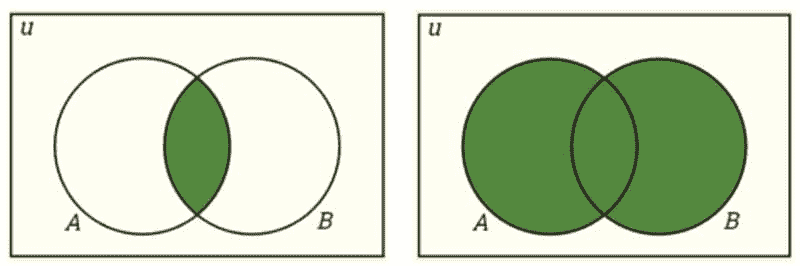

交集与并集。

**条件概率**：P(A|B) 是某事件发生与一个或多个其他事件的关系的概率度量。P(A|B)=P(A∩B)/P(B)，当 P(B)>0 时。

**独立事件**：如果一个事件的发生不影响另一个事件的发生概率，则这两个事件是独立的。P(A∩B)=P(A)P(B)，其中 P(A) != 0 和 P(B) != 0 ，P(A|B)=P(A)，P(B|A)=P(B)

**互斥事件**：如果两个事件不能同时发生，则它们是互斥的。P(A∩B)=0 和 P(A∪B)=P(A)+P(B)。

**贝叶斯定理**描述了基于可能与事件相关的条件的先验知识来计算事件发生的概率。

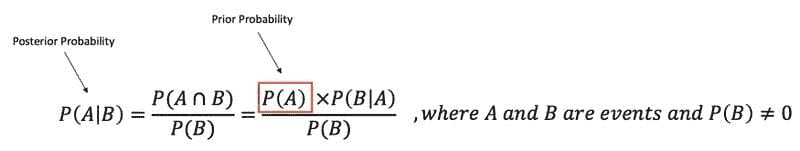

贝叶斯定理。

# 中心倾向

**均值**：数据集的平均值。

**中位数**：有序数据集中的中间值。

**众数**：数据集中最频繁出现的值。如果数据中有多个值出现频率最高，则为多峰分布。

**偏度**：衡量对称性的度量。

**峰度**：衡量数据相对于正态分布是否具有重尾或轻尾的度量。

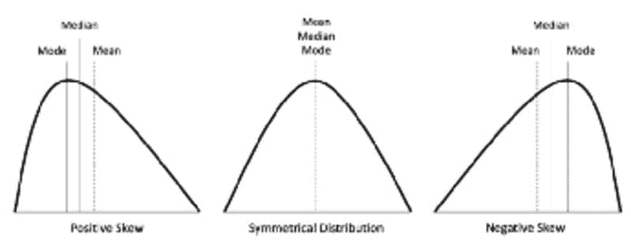

[偏度](https://codeburst.io/2-important-statistics-terms-you-need-to-know-in-data-science-skewness-and-kurtosis-388fef94eeaa)。

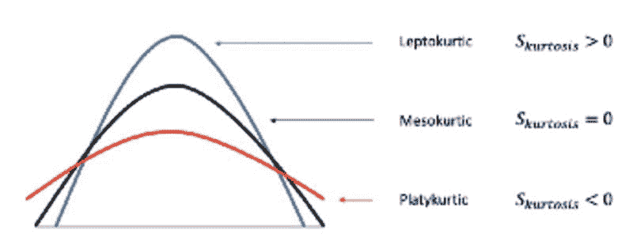

[峰度](https://www.researchgate.net/figure/Illustration-of-the-skewness-and-kurtosis-values-and-how-they-correlate-with-the-shape-of_fig1_298415862)。

# 变异性

**范围**：数据集中最高值和最低值之间的差异。

**百分位数、四分位数和四分位距（IQR）**

+   **百分位数**— 指示某一百分比的观察值落在观察组中的值的度量。

+   **分位数**— 将数据点的数量划分为四个大致相等的部分或四分之一的值。

+   **四分位距（IQR）**— 基于将数据集划分为四分位数的统计离散性和变异性的度量。IQR = Q3 − Q1

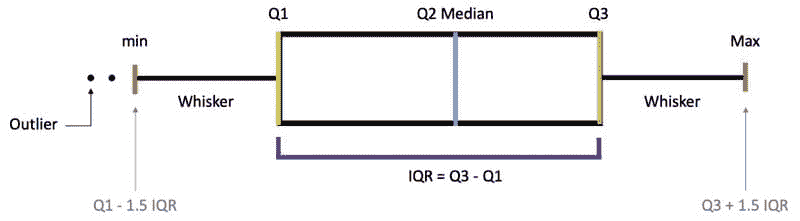

百分位数、四分位数和四分位距（IQR）。

**方差**：值与均值之间的平均平方差，用于衡量数据相对于均值的分散程度。

**标准差**：每个数据点与均值之间的标准差，以及方差的平方根。

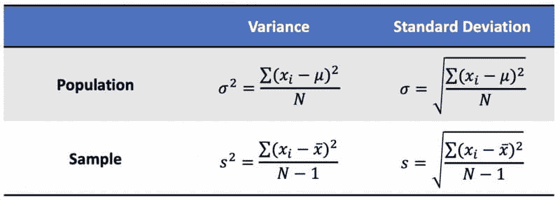

总体和样本方差及标准差。

**标准误差**（**SE**）：对抽样分布标准差的估计。

总体和样本标准误差。

# 变量之间的关系

**因果关系**：两个事件之间的关系，其中一个事件受另一个事件的影响。

**协方差**：两个或更多变量之间联合变异性的定量度量。

**相关性**：衡量两个变量之间的关系，其范围从 *-1 到 1*，是协方差的归一化版本。

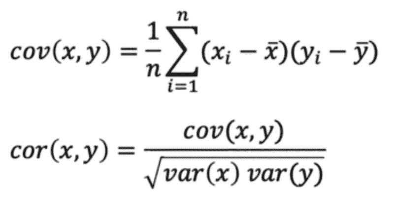

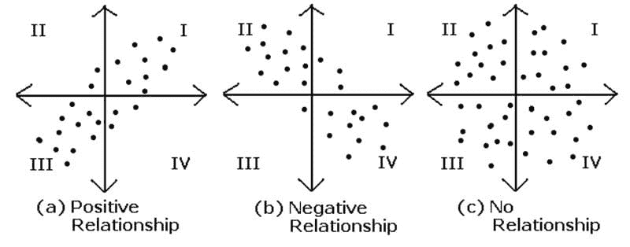

[协方差与相关性](https://acadgild.com/blog/covariance-and-correlation)。

# 概率分布

## 概率分布函数

**概率质量函数 (PMF)**：一个函数，给出*离散随机变量*恰好等于某个值的概率。

**概率密度函数 (PDF)**：一个用于*连续数据*的函数，其中任何给定样本的值可以解释为提供随机变量取该样本值的相对可能性。

**累积分布函数 (CDF)**：一个函数，给出随机变量小于或等于某个值的概率。

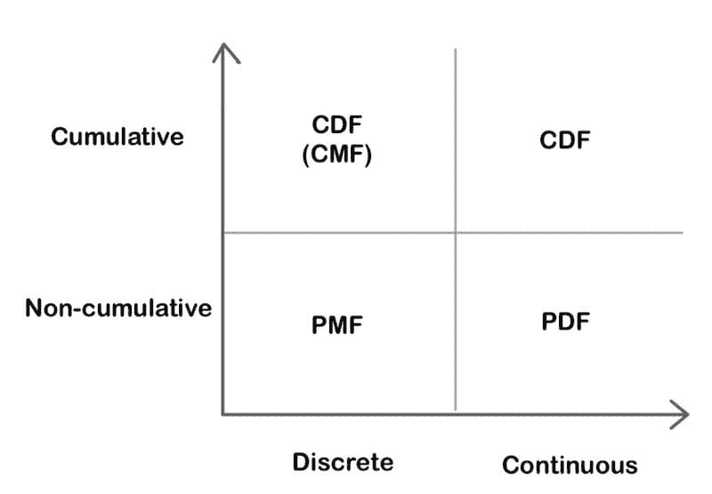

PMF、PDF 和 CDF 的比较。

## 连续概率分布

**均匀分布**：也称为矩形分布，是一种所有结果都同样可能的概率分布。

**正态/高斯分布**：分布的曲线呈钟形且对称，与**中心极限定理**有关，即样本均值的抽样分布随着样本量的增大趋近于正态分布。

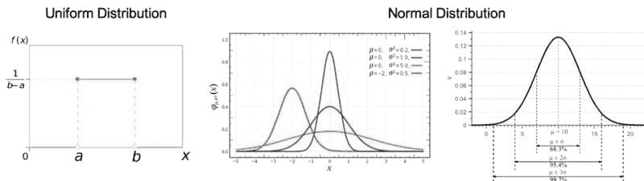

**指数分布**：描述*泊松*点过程中的事件之间时间的概率分布。

**卡方分布**：标准正态偏差平方和的分布。

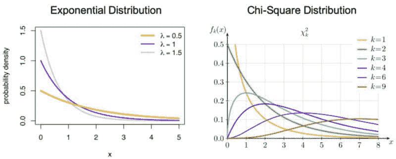

## 离散概率分布

**伯努利分布**：一个随机变量的分布，它涉及单次试验且只有 2 个可能结果，即 1（成功）概率为 p，0（失败）概率为（1-p）。

**二项分布**：在一系列*n*独立实验中的成功次数的分布，每次实验只有 2 个可能结果，即 1（成功）概率为 p，0（失败）概率为（1-p）。

**泊松分布**：表示在固定时间间隔内事件数为 k 的概率的分布，如果这些事件以已知的常数平均速率λ发生，并且与时间独立。

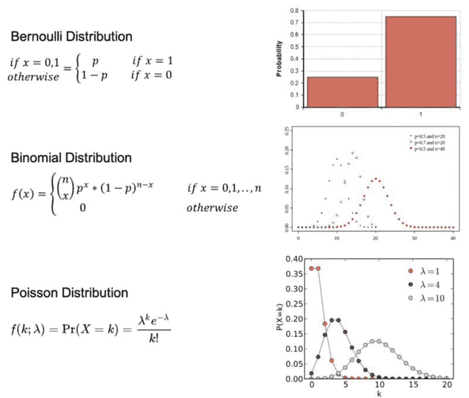

# 假设检验与统计显著性

# 零假设与备择假设

**零假设**：一个通用的陈述，表示两个测量现象之间没有关系或组之间没有关联。**备择假设**：与零假设相对立。

在统计假设检验中，**I 型错误**是拒绝真实的零假设，而**II 型错误**是未拒绝虚假的零假设。

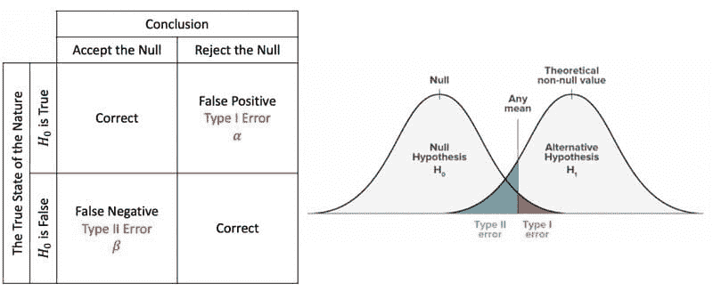

## 解释

**P 值**：在原假设为真的情况下，检验统计量至少与观察到的统计量一样极端的概率。当 p 值 > α 时，我们无法拒绝原假设，而当 p 值 ≤ α 时，我们拒绝原假设，可以得出我们有显著结果的结论。

**临界值**：是检验统计量尺度上的一个点，超过该点我们就会拒绝原假设，它由检验的显著性水平α推导而来。它依赖于检验统计量，这些统计量特定于检验类型，以及显著性水平α，这定义了检验的灵敏度。

**显著性水平和拒绝域**：拒绝域实际上取决于显著性水平。显著性水平用*α*表示，是在原假设为真的情况下拒绝原假设的概率。

## Z 检验

*Z* 检验是任何统计检验，其检验统计量在原假设下的分布可以用正态分布来近似，并且检验的是我们已经知道总体方差的分布的均值。因此，如果*样本量很大*或*总体方差已知*，许多统计检验可以方便地作为近似 *Z* 检验来进行。

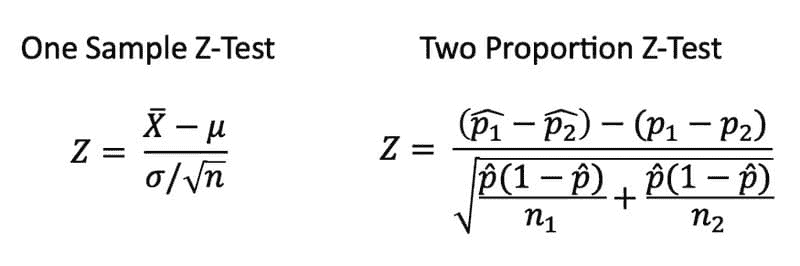

## t 检验

t 检验是当*总体方差未知*且*样本量不大*（n < 30）时使用的统计检验。

**配对样本** 意味着我们从同一组、个人、物品或事物中收集两次数据。**独立样本** 意味着两个样本必须来自两个完全不同的总体。

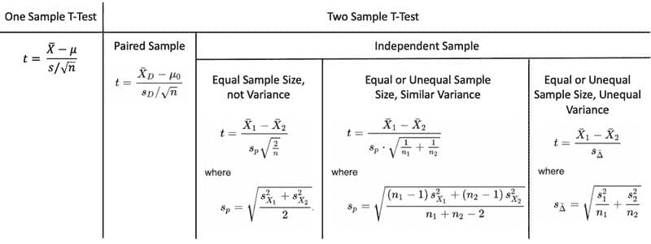

## 方差分析（ANOVA）

方差分析是用来确定实验结果是否显著的方法。**单因素方差分析** 比较两个独立组的均值，使用一个自变量。**双因素方差分析** 是单因素方差分析的扩展，使用两个自变量来计算主效应和交互效应。

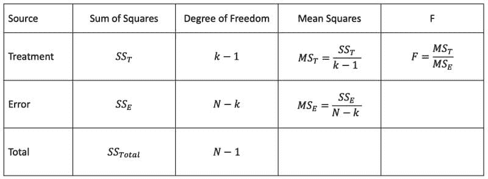

方差分析表。

## 卡方检验

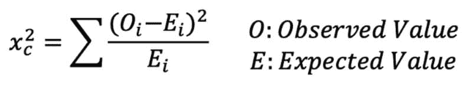

卡方检验公式。

卡方检验检查当我们拥有一组离散的数据点时，模型是否大致符合正态分布。**拟合优度检验** 确定样本是否与总体在一个分类变量上的分布匹配。**独立性卡方检验** 比较两组数据，查看是否存在关系。

# 回归

## 线性回归

**线性回归的假设**

+   线性关系

+   多变量正态性

+   无或很小的多重共线性

+   无或很小的自相关

+   同方差性

**线性回归** 是一种线性方法，用于建模一个因变量与一个自变量之间的关系。**自变量** 是在科学实验中控制的变量，用于测试对因变量的影响。**因变量** 是在科学实验中被测量的变量。

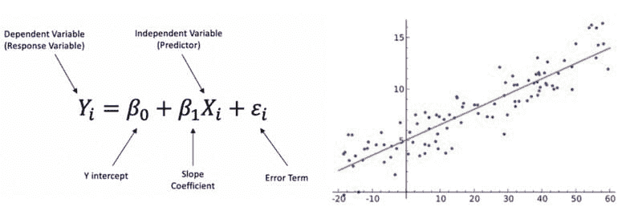

线性回归公式。

**多元线性回归** 是一种线性方法，用于建模一个因变量与两个或更多自变量之间的关系。

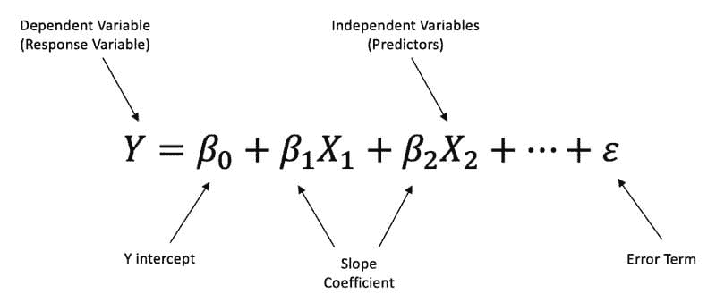

多元线性回归公式。

## 执行线性回归的步骤

**步骤 1**：理解模型描述、因果关系和方向性

**步骤 2**：检查数据、分类数据、缺失数据和异常值

+   **异常值** 是指显著不同于其他观察值的数据点。我们可以使用标准差方法和四分位距 (IQR) 方法。

+   **虚拟变量** 仅取值为 0 或 1，以指示分类变量的效应。

**步骤 3**：简单分析 — 检查因变量与自变量之间、自变量与自变量之间的影响比较

+   使用散点图检查相关性

+   **多重共线性** 发生在两个以上的自变量高度相关时。我们可以使用方差膨胀因子 (VIF) 来测量，如果 VIF > 5 表示高度相关，如果 VIF > 10，则变量之间肯定存在多重共线性。

+   **交互项** 意味着斜率从一个值变化到另一个值。

**步骤 4**：多元线性回归 — 检查模型和正确的变量

**步骤 5**：残差分析

+   检查残差的正态分布和正态性。

+   **同方差性** 描述了一个情况，即误差项在所有自变量值下保持相同，意味着残差在回归线上相等。

**步骤 6**：回归输出的解释

+   **R-平方** 是一种统计拟合度量，表示因变量的变异程度由自变量解释的比例。较高的 R-平方 值表示观察数据与拟合值之间的差异较小。

+   **P 值**

+   **回归方程**

**[Shirley Chen](https://www.linkedin.com/in/kuanyinchen-shirley/)** 是 Outdoorsy 的数据分析师。

[原文](https://medium.com/swlh/the-8-basic-statistics-concepts-for-data-science-7b865fca92b9)。经授权转载。

### 更多相关话题

+   [10 个基础统计概念的通俗解释](https://www.kdnuggets.com/10-basic-statistical-concepts-in-plain-english)

+   [数据科学中你应该知道的 7 个 SQL 概念](https://www.kdnuggets.com/2022/11/7-sql-concepts-needed-data-science.html)

+   [ChatGPT 作为学习数据科学概念的个性化辅导员](https://www.kdnuggets.com/2023/05/chatgpt-personalized-tutor-learning-data-science-concepts.html)

+   [基础回顾第 2 周：数据库、SQL、数据管理及……](https://www.kdnuggets.com/back-to-basics-week-2-database-sql-data-management-and-statistical-concepts)

+   [你应该了解的关于梯度下降和成本函数的 5 个概念](https://www.kdnuggets.com/2020/05/5-concepts-gradient-descent-cost-function.html)

+   [那些不太吸引人的 SQL 概念，让你脱颖而出](https://www.kdnuggets.com/2022/02/not-so-sexy-sql-concepts-stand-out.html)
