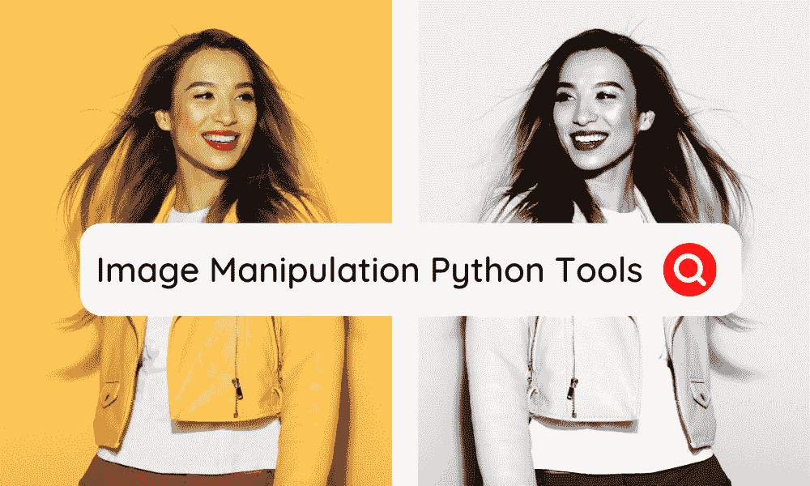
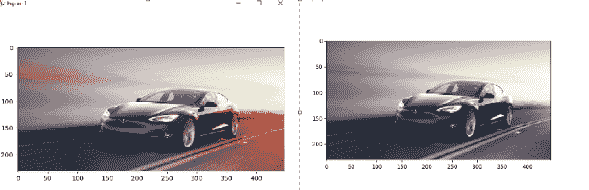
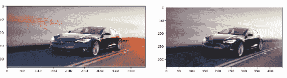
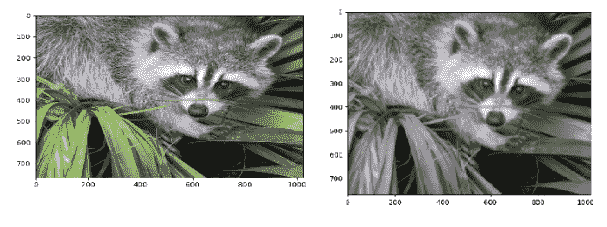
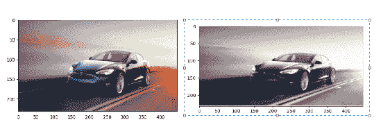
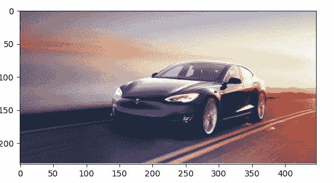
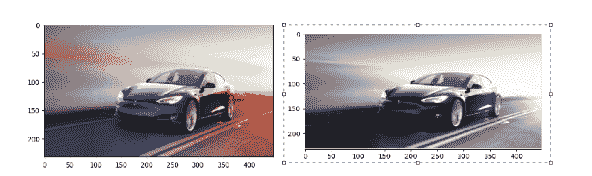

# 8 种最佳 Python 图像处理工具

> 原文：[`www.kdnuggets.com/2022/11/8-best-python-image-manipulation-tools.html`](https://www.kdnuggets.com/2022/11/8-best-python-image-manipulation-tools.html)



编辑器提供的图像

在当今世界，数据在每个行业领域中都扮演着至关重要的角色。图像可以是提取数据的来源之一。图像可以定义为像素矩阵，每个像素代表一种颜色，可以被视为数据值。

* * *

## 我们的前三名课程推荐

 1\. [谷歌网络安全证书](https://www.kdnuggets.com/google-cybersecurity) - 快速进入网络安全职业生涯。

 2\. [谷歌数据分析专业证书](https://www.kdnuggets.com/google-data-analytics) - 提升你的数据分析技能

 3\. [谷歌 IT 支持专业证书](https://www.kdnuggets.com/google-itsupport) - 支持您在 IT 方面的工作

* * *

图像处理对于揭示任何图像中的潜在数据非常有用。它帮助你从图像中提取、操作和过滤数据。图像处理的主要目标是从图像中揭示一些有价值的信息。

图像处理有各种应用，如图像锐化、图像修复、模式识别、视频处理等。大多数图像处理应用归属于数据分析和数据科学。

当谈到数据分析时，我们脑海中浮现出的唯一语言是 Python。由于其广泛的库，它也是图像处理的首选语言，这使得开发人员可以用简单的代码行执行复杂的操作。

让我们看看一些主要用于图像处理的 Python 库。

# 8 种最佳 Python 图像处理工具

这里列出了帮助你轻松处理图像的最佳 Python 库。它们都易于使用，并允许你提取图像中的基本数据。

## 1\. OpenCV

[OpenCV](https://www.google.com/search?client=safari&rls=en&q=OpenCV&ie=UTF-8&oe=UTF-8)（开源计算机视觉库）是一个受欢迎的 Python 数据可视化库。这是一个开源库，适用于多种编程语言，包括 C++、Java 以及汇编语言。

这个库是由 Intel 使用[C++编程语言](https://www.techgeekbuzz.com/tutorial/c++/cpp-tutorial/)开发的，旨在实时计算机视觉。它非常适合执行计算密集型的计算机视觉程序。

**安装**

由于 OpenCV 是一个第三方库，我们可以通过 Python 的 pip 包管理工具为我们的 Python 环境安装它。

```py
pip install opencv-python
```

**示例**

```py
# import opencv
import cv2

# Read the image
image = cv2.imread('tesla.png')
# grayscale the image
gray_image = cv2.cvtColor(image, cv2.COLOR_BGR2GRAY)

cv2.imshow('Original Image', image)

cv2.imshow('Grayscale Image', gray_image)
cv2.waitKey(0)

cv2.destroyAllWindows()
```

**输出**


## 2. Pillow (PIL)

[Pillow](https://pillow.readthedocs.io/en/stable/)是另一个流行的 Python 图像处理库。它是每个初学者可以入门的最基本的图像处理库。它也被称为 PIL，即 Python Imaging Library。

PIL 库附带不同的文件格式扩展，提供强大且复杂的功能以执行图像处理。如果我们将 PIL 与 OpenCV 进行比较，PIL 是一个轻量级的库，功能较少，使得它对于刚刚进入图像处理领域的新 Python 开发者来说，学习和操作都比较容易。

**安装**

PIL 也是一个第三方开源库，可以使用**pip install**命令安装。

```py
pip install pillow 
```

**示例**

使用 Pillow 在 Python 中将图像转换为灰度

```py
from PIL import Image

with Image.open("tesla.png") as im:
    #show the original image
    im.show("Original Image")

    #convert into grayscale
    grayscaleImg = im.convert("L")

    #show the grayscale image
    grayscaleImg.show()
```

**输出**


## 3. Scikit Image

[Scikit Images](https://scikit-image.org/)是一个以科学为导向的 Python 图像处理库。它设计用于使用 Numpy 和 Scipy 库处理图像。它包括各种科学算法，如分割、颜色空间操作、分析、形态学等。该库使用 Python 和 C 编程语言编写，适用于所有流行的操作系统，如 Linux、macOS 和 Windows。

**安装**

scikit-image 是一个开源库，我们可以使用 pip install 命令进行安装。

```py
pip install scikit-image
```

**示例**

使用 scikit-image 库将图像转换为灰度

```py
from skimage import io
from skimage.color import rgb2gray

# way to load car image from file
car = io.imread('tesla.png')[:,:,:3]

#convert into grayscale
grayscale = rgb2gray(car)

#show the original
io.imshow(car)
io.show()

#show the grayscale
io.imshow(grayscale)
io.show()
```

**输出**



## 4. NumPy

[NumPy](https://numpy.org/)是最基本的 Python 科学计算库。它因引入多维数组或矩阵而闻名。它是一个专门的科学计算库。此外，它还附带广泛的数学功能，如数组、线性代数、基本统计操作、随机模拟、逻辑排序、搜索、形状操作等。

**安装**

再次安装 NumPy 时，我们可以使用 pip install 命令。

```py
pip install numpy
```

**示例**

使用 numpy 将图像转换为灰度

```py
import numpy as np
import matplotlib.pyplot as plt
import matplotlib.image as mpimg

#load the original image
img_rgb = mpimg.imread('tesla.png')[...,:3]

#show the original image
plt.imshow(img_rgb)
plt.show()

#convert the image into grayscale
img_gray = np.dot(img_rgb,[0.299, 0.587, 0.144])

#show the grayscale image
plt.imshow(img_gray, cmap=plt.get_cmap('gray'))
plt.show()
```

**输出**



## 5. SciPy

类似于 Numpy，[SciPy](https://scipy.org/)也是一个科学计算库。由于它是作为 NumPy 库的扩展构建的，因此功能比 Numpy 更多。

Scipy 提供了高级和复杂的命令和类用于数据操作和数据可视化。它涵盖了广泛的数据处理工具。此外，它还支持并行编程、从网络获取数据、数据驱动的子程序及其他数学功能。

**安装**

要安装 SciPy 库，我们可以使用 Python 包管理工具 pip。

```py
pip install scipy
```

**示例**

使用 scipy 将图像转换为灰度图像

```py
from scipy import misc,ndimage
from matplotlib import pyplot as plt
import numpy as np
img=misc.face()

#show original image
plt.imshow(img)
plt.show()

#grayscale using gaussian blur filter
grayscale=ndimage.gaussian_filter(img,sigma=2)

#show grayscale image
plt.imshow(grayscale)
plt.show()
```

**输出**



## 6\. Mahotas

[Mahotas](https://mahotas.readthedocs.io/en/latest/) 是另一个 Python 计算机视觉库，可以执行各种图像处理操作。它使用 C++ 设计，包含许多算法以提高图像处理速度。它还使用 NumPy 数组中的矩阵表示图像。主要功能包括分水岭、凸点计算、击中与错过卷积以及 Sobel 边缘。

**安装**

Mahotas 是一个开源库，可以通过以下终端命令进行安装。

```py
pip install mahotas
```

**示例**

使用 Mahotas 将 RGB 图像转换为灰度图像

```py
import mahotas
from pylab import imshow, show

#read the image
img = mahotas.imread('tesla.png')

#show original image
imshow(img)
show()

img = img[:, :, 0]  
grayscale = mahotas.overlay(img)

#show grayscale image
imshow(grayscale)
show()
```

**输出**



## 7\. SimpleITK

[SimpleITK](https://simpleitk.org/) 是一个功能强大的图像配准和分割工具包。它作为 [ITK 工具包](https://itk.org/) 的扩展构建，提供了简化的接口。它支持多种编程语言，如 Python、R、C++、Java、C#、Ruby、TCL 和 Lua。

该库支持 2D、3D 和 4D 图像。与其他 Python 图像处理库和框架相比，该库的图像处理速度非常高。

**安装**

```py
pip install SimpleITK
```

**示例**

使用 SimpleITK 加载并显示图像

```py
import SimpleITK as sitk
import matplotlib.pyplot as plt

logo = sitk.ReadImage('tesla.png')

# GetArrayViewFromImage returns an immutable numpy array view to the data.
plt.imshow(sitk.GetArrayViewFromImage(logo))
plt.show()
```

**输出**



## 8\. Matplotlib

[Matplotlib](http://matplotlib/) 虽然是一个数据可视化库，但也可以用作图像处理库。它通常用于绘制 numpy 数组数据，但也可以读取由 NumPy 数组表示的图像数据。我们在上述库中已经使用了 Matplotlib 库来显示和绘制图像。

**安装**

可以通过以下简单命令安装 Matplotlib。

```py
pip install matplotlib
```

**示例**

```py
# importing libraries.
import matplotlib.pyplot as plt
from PIL import Image

# open image using pillow library
image = Image.open("tesla.png")
#show original image
plt.imshow(image)
plt.show()

# grayscale the image
plt.imshow(image.convert("L"), cmap='gray')
plt.show()
```

**输出**



# 结论

这里结束了我们关于最佳 Python 图像处理工具的列表。在这八个库或工具中，最常用的 Python 图像处理库是 Pillow 和 OpenCV（在某些特定情况下是 SimplICV）。

如果你正在考虑构建一个与图像处理相关的项目，比如对象识别或颜色处理，建议使用 [OpenCV 库](https://opencv.org/)，因为它是一个拥有众多先进功能的大型库。其他库也支持一些图像处理功能，但效率不如 OpenCV。

**[Vijay Singh Khatri](https://www.linkedin.com/in/vijay-singh-khatri/)** 计算机科学专业毕业，专注于编程和市场营销。我非常喜欢撰写技术文章和创建新产品。

### 更多相关主题

+   [数据操作所需的基本 Python 库](https://www.kdnuggets.com/essential-python-libraries-for-data-manipulation)

+   [10 个 Pandas 一行代码用于数据访问、操作和管理](https://www.kdnuggets.com/2023/01/pandas-one-liners-data-access-manipulation-management.html)

+   [最佳 Python 工具生成 AI 应用程序备忘单](https://www.kdnuggets.com/2023/08/best-python-tools-generative-ai-cheat-sheet.html)

+   [7 个最佳机器学习实验跟踪工具](https://www.kdnuggets.com/2023/02/7-best-tools-machine-learning-experiment-tracking.html)

+   [2023 年 7 个最佳数据建模工具列表](https://www.kdnuggets.com/2023/03/list-7-best-data-modeling-tools-2023.html)

+   [提升生产力的 5 大 AI 工具](https://www.kdnuggets.com/the-5-best-ai-tools-for-maximizing-productivity)
