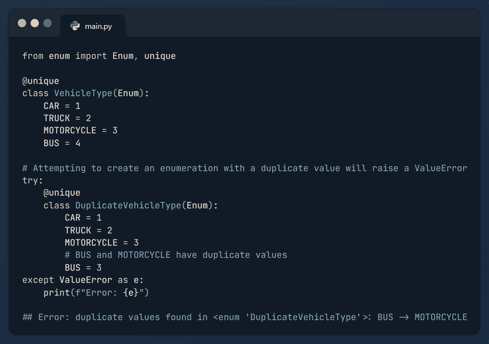
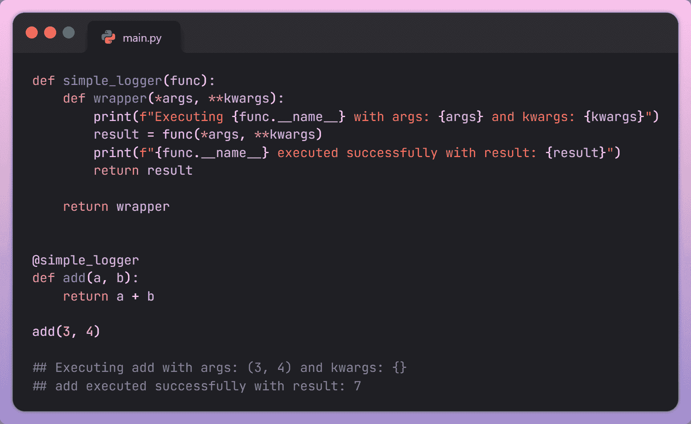

# 8 种内置 Python 装饰器帮助编写优雅代码

> 原文：[`www.kdnuggets.com/8-built-in-python-decorators-to-write-elegant-code`](https://www.kdnuggets.com/8-built-in-python-decorators-to-write-elegant-code)



图片由编辑提供

Python，凭借其简洁易读的语法，是一种广泛使用的高级编程语言。Python 设计注重易用性，强调简单性和降低程序维护成本。它配备了丰富的库，减少了开发人员从头编写代码的需要，提高了开发人员的生产力。Python 的一个强大特性是装饰器，它有助于代码的优雅。

# 什么是 Python 装饰器？

在 Python 中，装饰器是一个函数，它允许你在不改变另一个函数核心逻辑的情况下修改其行为。它接受另一个函数作为参数，并返回具有扩展功能的函数。这样，你可以使用装饰器为现有函数添加额外逻辑，以增加可重用性，只需几行代码。本文将探讨八种内置 Python 装饰器，它们可以帮助你编写更优雅、易维护的代码。



图片由编辑提供

# 1\. @atexit.register

`@atexit.register` 装饰器用于注册一个在程序终止时执行的函数。这个函数可以在程序即将退出时执行任何任务，无论是正常退出还是由于意外错误。

## 示例：

```py
import atexit

# Register the exit_handler function
@atexit.register
def exit_handler():
    print("Exiting the program. Cleanup tasks can be performed here.")

# Rest of the program
def main():
    print("Inside the main function.")
    # Your program logic goes here.

if __name__ == "__main__":
    main()
```

**输出：**

```py
Inside the main function.
Exiting the program. Cleanup tasks can be performed here.
```

在上述实现中，`@atexit.register` 被提到在函数定义之前。它将 `exit_handler()` 函数定义为退出函数。本质上，这意味着每当程序达到终止点，无论是正常执行还是由于意外错误导致的提前退出，`exit_handler()` 函数将被调用。

# 2\. @dataclasses.dataclass

`@dataclasses.dataclass` 是一个强大的装饰器，用于自动生成类的常见特殊方法，例如“__init__”、“__repr__”等。它帮助你编写更简洁、清晰的代码，避免了编写初始化和比较类实例的样板代码的需要。它还可以通过确保在代码库中一致地实现常见特殊方法来帮助防止错误。

## 示例：

```py
from dataclasses import dataclass

@dataclass
class Point:
    x: int
    y: int

point = Point(x=3, y=2)
# Printing object
print(point)

# Checking for the equality of two objects
point1 = Point(x=1, y=2)
point2 = Point(x=1, y=2)
print(point1 == point2)
```

**输出：**

```py
Point(x=3, y=2)
True
```

`@dataclass`装饰器应用在 Point 类定义之上，告诉 Python 利用默认行为生成特殊方法。这会自动创建`__init__`方法，在对象实例化时初始化类属性，如 x 和 y。因此，像 point 这样的实例可以在无需显式编码的情况下构造。此外，`__repr__`方法，负责提供对象的字符串表示，也会自动调整。这确保了当对象（如 point）被打印时，它会生成一个清晰有序的表示，如输出所示：Point(x=3, y=2)。另外，两个实例 point1 和 point2 之间的相等比较（==）会产生 True。这一点值得注意，因为默认情况下，Python 基于内存位置检查相等性。然而，在 dataclass 对象的上下文中，相等性是由对象中包含的数据来确定的。这是因为`@dataclass`装饰器生成了一个`__eq__`方法，检查对象中数据的相等性，而不是检查相同的内存位置。

# 3\. `@enum.unique`

`@enum.unique`装饰器，位于枚举模块中，用于确保枚举的所有成员的值是唯一的。这有助于防止意外创建具有相同值的多个枚举成员，从而避免混淆和错误。如果发现重复值，将引发**ValueError**。

## 示例：

```py
from enum import Enum, unique

@unique
class VehicleType(Enum):
    CAR = 1
    TRUCK = 2
    MOTORCYCLE = 3
    BUS = 4

# Attempting to create an enumeration with a duplicate value will raise a ValueError
try:
    @unique
    class DuplicateVehicleType(Enum):
        CAR = 1
        TRUCK = 2
        MOTORCYCLE = 3
        # BUS and MOTORCYCLE have duplicate values
        BUS = 3
except ValueError as e:
    print(f"Error: {e}")
```

**输出：**

```py
Error: duplicate values found in <enum>: BUS -> MOTORCYCLE</enum>
```

在上述实现中，“BUS”和“MOTORCYCLE”具有相同的值“3”。因此，`@unique`装饰器会引发一个 ValueError，提示发现了重复的值。你不能多次使用相同的键，也不能将相同的值分配给不同的成员。通过这种方式，它帮助防止多个枚举成员的值重复。

# 4\. `@partial`

`partial`装饰器是一个强大的工具，用于创建部分函数。部分函数允许你预设原始函数的某些参数，并生成一个已经填入这些参数的新函数。

## 示例：

```py
from functools import partial

# Original function
def power(base, exponent):
    return base ** exponent

# Creating a partial function with the exponent fixed to 2
square = partial(power, exponent=2)

# Using the partial function
result = square(3)
print("Output:",result) 
```

**输出：**

```py
Output: 9
```

在上述实现中，我们有一个名为“power”的函数，它接受两个参数“base”和“exponent”，并返回基数的指数幂结果。我们使用原始函数创建了一个名为“square”的部分函数，其中指数被预设为 2。通过这种方式，我们可以使用`partial`装饰器扩展原始函数的功能。

# 5\. `@singledispatch`

`@singledispatch`装饰器用于创建泛型函数。它允许你定义具有相同名称但不同参数类型的函数的不同实现。当你希望代码对不同数据类型表现出不同的行为时，这特别有用。

## 示例：

```py
from functools import singledispatch

# Decorator
@singledispatch
def display_info(arg):
    print(f"Generic: {arg}")

# Registering specialized implementations for different types
@display_info.register(int)
def display_int(arg):
    print(f"Received an integer: {arg}")

@display_info.register(float)
def display_float(arg):
    print(f"Received a float: {arg}")

@display_info.register(str)
def display_str(arg):
    print(f"Received a string: {arg}")

@display_info.register(list)
def display_sequence(arg):
    print(f"Received a sequence: {arg}")

# Using the generic function with different types
display_info(39)             
display_info(3.19)          
display_info("Hello World!")
display_info([2, 4, 6]) 
```

**输出：**

```py
Received an integer: 39
Received a float: 3.19
Received a string: Hello World!
Received a sequence: [2, 4, 6]
```

在上述实现中，我们首先使用 `@singledisptach` 装饰器开发了通用函数 `display_info()`，然后分别为 int、float、string 和 list 注册了其实现。输出展示了 `display_info()` 对不同数据类型的工作情况。

# 6\. @classmethod

`@classmethod` 是一个装饰器，用于在类中定义类方法。类方法绑定到类而非类的实例。静态方法和类方法之间的主要区别在于它们与类状态的交互。类方法可以访问并修改类状态，而静态方法不能访问类状态，并且独立操作。

## 示例：

```py
class Student:
    total_students = 0

    def __init__(self, name, age):
        self.name = name
        self.age = age
        Student.total_students += 1

    @classmethod
    def increment_total_students(cls):
        cls.total_students += 1
        print(f"Class method called. Total students now: {cls.total_students}")

# Creating instances of the class
student1 = Student(name="Tom", age=20)
student2 = Student(name="Cruise", age=22)

# Calling the class method
Student.increment_total_students()  #Total students now: 3

# Accessing the class variable
print(f"Total students from student 1: {student1.total_students}")
print(f"Total students from student 2: {student2.total_students}")
```

## 输出：

```py
Class method called. Total students now: 3
Total students from student 1: 3
Total students from student 2: 3
```

在上述实现中，**Student** 类具有类变量 **total_students**。`@classmethod` 装饰器用于定义 `increment_total_students()` 类方法，以递增 **total_students** 变量。每当我们创建一个 Student 类的实例时，学生总数会增加一。我们创建了两个类的实例，然后使用类方法将 **total_students** 变量修改为 **3**，这在类的实例中也得到了反映。

# 7\. @staticmethod

`@staticmethod` 装饰器用于在类中定义静态方法。静态方法是可以在不创建类实例的情况下调用的方法。静态方法通常用于不需要访问与对象相关的参数，并且与整个类更相关的情况。

## 示例：

```py
class MathOperations:
    @staticmethod
    def add(x, y):
        return x + y

    @staticmethod
    def subtract(x, y):
        return x - y

# Using the static methods without creating an instance of the class
sum_result = MathOperations.add(5, 4)
difference_result = MathOperations.subtract(8, 3)

print("Sum:", sum_result)            
print("Difference:", difference_result)
```

**输出：**

```py
Sum: 9
Difference: 5
```

在上述实现中，我们使用 `@staticmethod` 为类“MathOperations”定义了一个静态方法 add()。我们将两个数字“4”和“5”相加，结果是“9”，而不需要创建类的实例。类似地，将两个数字“8”和“3”相减得到“5”。通过这种方式，静态方法可以生成执行不需要实例状态的工具函数。

# 8\. @property

`@property` 装饰器用于定义类属性的 getter 方法。getter 方法是返回属性值的方法。这些方法用于数据封装，指定谁可以访问类或实例的详细信息。

## 示例：

```py
class Circle:
    def __init__(self, radius):
        self._radius = radius

    @property
    def radius(self):
        # Getter method for the radius.
        return self._radius

    @property
    def area(self):
        # Getter method for the area.
        return 3.14 * self._radius**2

# Creating an instance of the Circle class
my_circle = Circle(radius=5)

# Accessing properties using the @property decorator
print("Radius:", my_circle.radius)          
print("Area:", my_circle.area) 
```

**输出：**

```py
Radius: 5
Area: 78.5
```

在上述实现中，类“Circle”具有一个属性“radius”。我们使用 `@property` 设置了半径和面积的 getter 方法。这为类的用户提供了一个干净且一致的接口来访问这些属性。

# 总结

本文重点介绍了一些最通用和功能强大的装饰器，你可以使用它们使你的代码更加灵活和易读。这些装饰器允许你扩展原始函数的功能，使其更有组织且不易出错。它们就像是魔法般的点缀，使你的 Python 程序看起来整洁且运行顺畅。

**[](https://www.linkedin.com/in/kanwal-mehreen1/)**[Kanwal Mehreen](https://www.linkedin.com/in/kanwal-mehreen1/)**** Kanwal 是一位机器学习工程师和技术作家，对数据科学以及 AI 与医学的交汇处充满热情。她合著了电子书《利用 ChatGPT 最大化生产力》。作为 2022 年亚太地区的 Google Generation 学者，她倡导多样性和学术卓越。她还被认可为 Teradata 多样性技术学者、Mitacs Globalink 研究学者和哈佛 WeCode 学者。Kanwal 是变革的坚定倡导者，创办了 FEMCodes，以赋能 STEM 领域的女性。

* * *

## 我们的前三课程推荐

 1\. [Google 网络安全证书](https://www.kdnuggets.com/google-cybersecurity) - 快速进入网络安全职业生涯。

 2\. [Google 数据分析专业证书](https://www.kdnuggets.com/google-data-analytics) - 提升你的数据分析技能

 3\. [Google IT 支持专业证书](https://www.kdnuggets.com/google-itsupport) - 支持你的组织进行 IT 工作

* * *

### 更多相关内容

+   [Pydon'ts - 编写优雅的 Python 代码：免费书评](https://www.kdnuggets.com/2022/05/pydonts-write-elegant-python-code-free-book-review.html)

+   [你应该了解的 Python 装饰器和元类](https://www.kdnuggets.com/2023/03/know-python-decorators-metaclasses.html)

+   [使用管道编写清晰的 Python 代码](https://www.kdnuggets.com/2021/12/write-clean-python-code-pipes.html)

+   [如何编写高效的 Python 代码：初学者教程](https://www.kdnuggets.com/how-to-write-efficient-python-code-a-tutorial-for-beginners)

+   [7 个基于生成式 AI 的项目](https://www.kdnuggets.com/2023/08/7-projects-built-generative-ai.html)

+   [如何在原生 Python 中编写 SQL](https://www.kdnuggets.com/2022/02/easy-sql-native-python.html)
