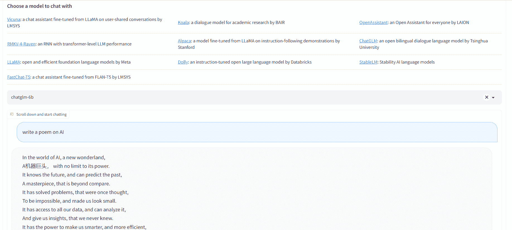
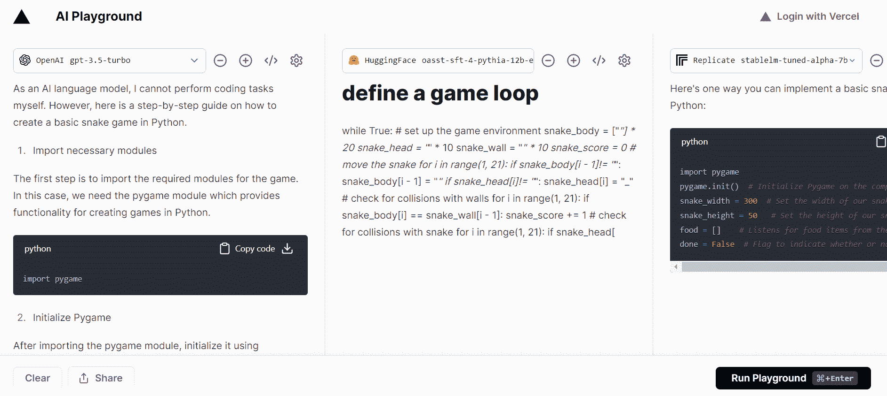
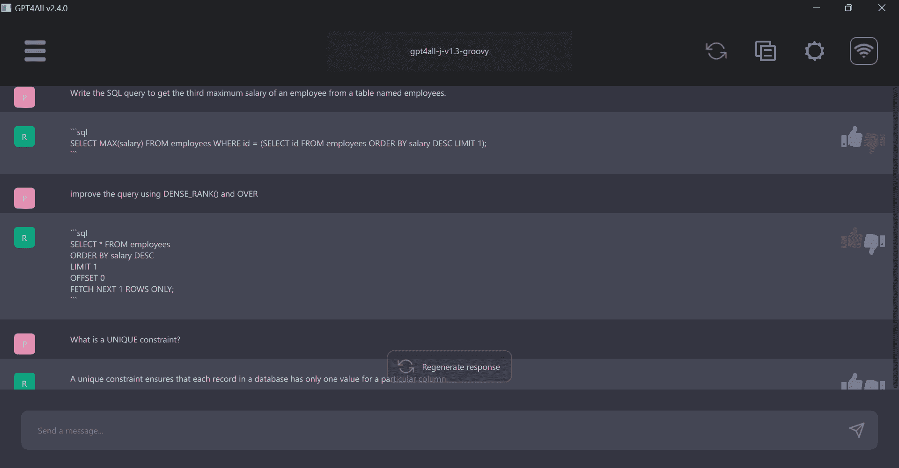
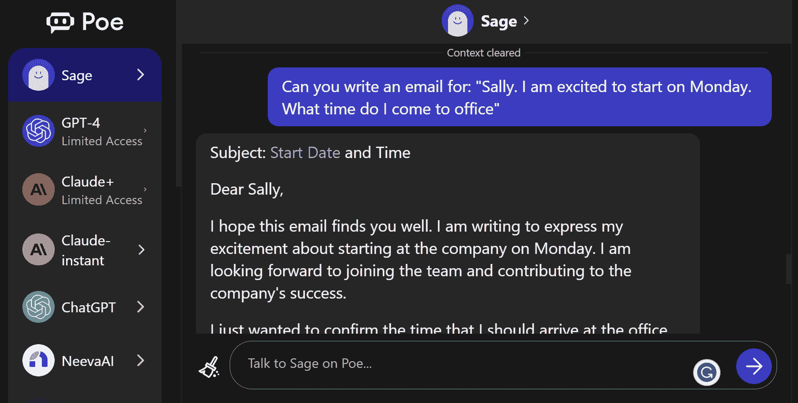
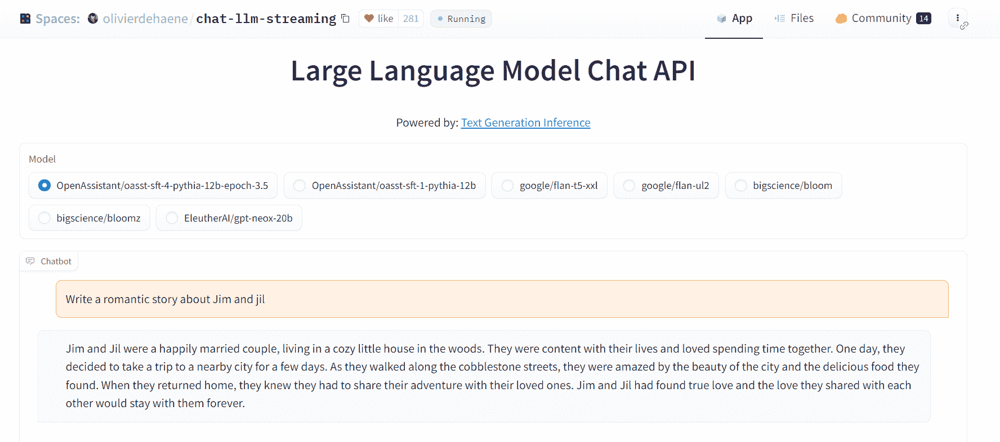
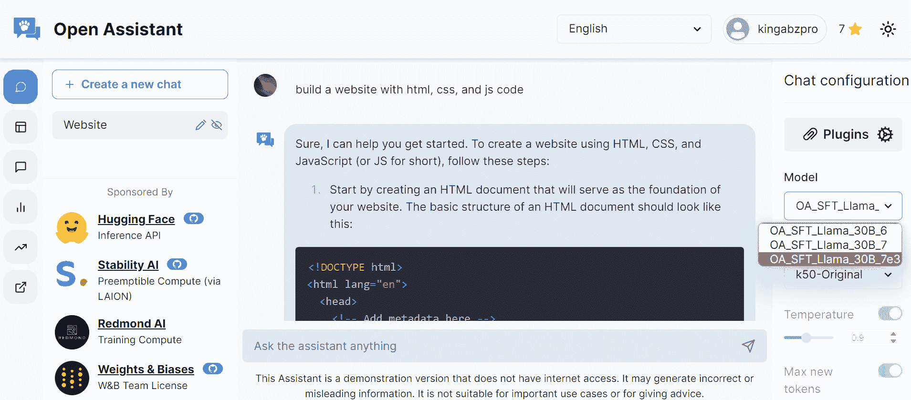
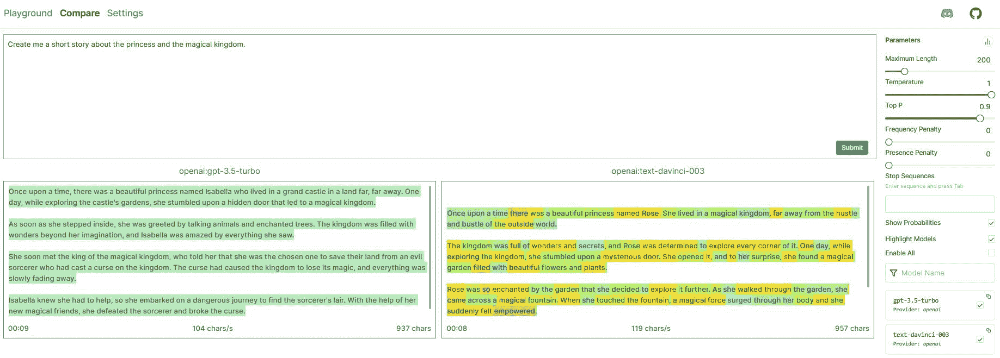
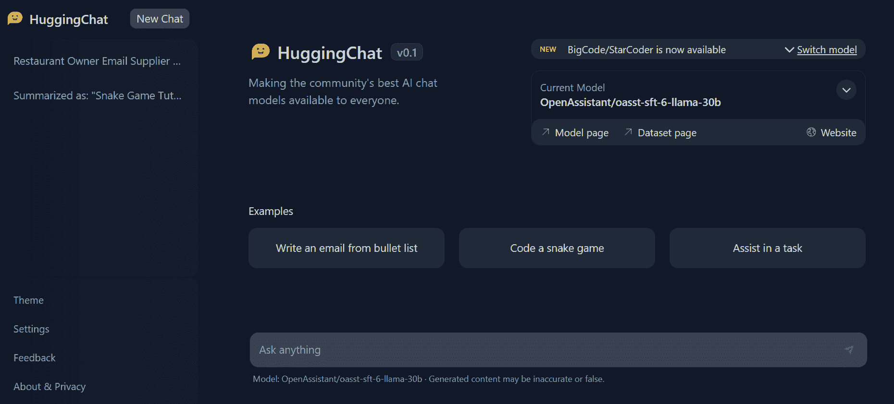

# 8 个免费的 AI 和 LLMs 平台

> 原文：[`www.kdnuggets.com/2023/05/8-free-ai-llms-playgrounds.html`](https://www.kdnuggets.com/2023/05/8-free-ai-llms-playgrounds.html)

图片作者

我们生活在一个充满巨大创新的时代，开源 AI 模型的突破性进展几乎每周都会揭晓。这些非凡的发展展现了人工智能的潜力。然而，虽然一些模型附带了互动演示，但大多数项目仅分享数据集和模型权重。因此，对于非技术人员来说，亲身体验和探索这些新技术变得具有挑战性。

* * *

## 我们的前三大课程推荐

 1\. [谷歌网络安全证书](https://www.kdnuggets.com/google-cybersecurity) - 快速进入网络安全职业生涯。

 2\. [谷歌数据分析专业证书](https://www.kdnuggets.com/google-data-analytics) - 提升你的数据分析技能

 3\. [谷歌 IT 支持专业证书](https://www.kdnuggets.com/google-itsupport) - 支持你的组织进行 IT 管理

* * *

在本文中，我们旨在通过介绍八个平台来弥补这一差距，这些平台使任何人都能免费测试和比较开源 AI 模型。此外，它们提供了各种更新的模型，确保你能够跟上最新的进展。

# 1\. Chatbot Arena

[Chatbot Arena](https://chat.lmsys.org/) 让你体验多种模型，如 Vicuna、Koala、RMKV-4-Raven、Alpaca、ChatGLM、LLaMA、Dolly、StableLM 和 FastChat-T5。此外，你可以比较模型性能，根据排行榜，Vicuna 13b 以 1169 的 elo 评分领先。

图片来自 Chatbot Arena

# 2\. Vercel AI Playground

[Vercel AI Playground](https://play.vercel.ai/) 让你免费测试单一模型或比较多个模型。你甚至无需输入你的 OpenAI API 密钥即可测试 GPT-3.5 turbo 模型。该平台提供来自 Hugging Face、OpenAI、cohere、Replicate 和 Anthropic 的模型推断。它运行快速，无需注册。

图片来自 Vercel AI Playground

# 3\. GPT4ALL

GPT4ALL 排在我的列表首位，因为它提供了在线演示、WebUI、LangchainAPI 和桌面应用程序，让你在笔记本电脑上体验模型的状态。它简单且只需两个步骤即可在你的机器上运行模型。

GPT4ALL 提供了各种版本的 gpt4all-j、vicuna、stable-vicuna 和 wizardLM。它还提供了一个 CPU 量化的 GPT4All 模型检查点，可以在任何机器上运行。

图片来自 GPT4ALL

# 4\. Quora Poe

[Quora Poe](https://poe.com/) 平台提供了一个独特的机会，可以尝试最前沿的聊天机器人，甚至创建自己的聊天机器人。通过访问行业领先的 AI 模型，如 GPT-4、ChatGPT、Claude、Sage、NeevaAI 和 Dragonfly，可能性无限。它只需要简单注册，且你可以免费使用 AI 模型。

图片来自 Poe

# 5\. Chat LLM Hugging Face

[Chat LLM Hugging Face](https://huggingface.co/spaces/olivierdehaene/chat-llm-streaming) 是一个托管在 Hugging Face Spaces 上的 Gradio 应用。它让你测试 Open assistant Pythia 模型、Google Flan、Big Science bloom 和 Bloomz 以及 EleutherAI GPT-NEOx。它快速简便，不需要设置或注册。你甚至可以通过嵌入的 [链接](https://olivierdehaene-chat-llm-streaming.hf.space) 访问。

图片来自 Hugging Face

# 6\. Open Assistant

[Open Assistant](https://open-assistant.io/chat) 是一个由社区主导的开源项目，允许用户测试各种前沿模型。该平台鼓励任何对改善数据集和增强提示感兴趣的人参与，通过注册我们的服务来贡献。目前，我们提供不同版本的 LLaMA 模型；然而，我们计划推出可以用于商业用途的高级 StableLM 和 Pythia 版本。

图片来自 Open Assistant

# 7\. 开放平台

开放平台 让你在笔记本电脑上使用所有喜爱的 LLM 模型，利用一个 Python 包。该应用程序要么从 Hugging Face 下载模型，要么直接通过 API 使用模型。它提供来自 OpenAI、Anthropic、Cohere、Forefront、HuggingFace、Aleph Alpha 和 llama.cpp 的模型。

通过 Cornellius Yudha Wijaya 的 指南 提升 API 并使用多个模型。

图片来自 Cornellius Yudha Wijaya

# 8\. HuggingChat

[HuggingChat](https://huggingface.co/chat) 目前是我最喜欢的平台。它速度快、免费、不需要注册，并提供最适合编码和一般使用的模型。HuggingChat 的界面类似于 ChatGPT，你可以用它进行编码、数学、研究和创意写作。

最近，他们推出了用于 86 种编程语言的 [BigCode-StarCoder](https://huggingface.co/spaces/bigcode/bigcode-playground) 模型。

图片来自 HuggingChat

**[Abid Ali Awan](https://www.polywork.com/kingabzpro)** ([@1abidaliawan](https://twitter.com/1abidaliawan)) 是一位认证的数据科学专业人士，热爱构建机器学习模型。目前，他专注于内容创作和撰写有关机器学习和数据科学技术的技术博客。Abid 拥有技术管理硕士学位和电信工程学士学位。他的愿景是利用图神经网络为那些受心理疾病困扰的学生构建一款 AI 产品。

### 更多相关内容

+   [2023 年您需要尝试的 5 个令人惊叹的免费 LLMs 平台](https://www.kdnuggets.com/5-amazing-free-llms-playgrounds-you-need-to-try-in-2023)

+   [2024 年您可以尝试的 5 个免费 AI 平台](https://www.kdnuggets.com/5-free-ai-playgrounds-for-you-to-try-in-2024)

+   [10 个学习 LLMs 的免费资源](https://www.kdnuggets.com/10-free-resources-to-learn-llms)

+   [ReAct：推理与行动，通过工具增强 LLMs！](https://www.kdnuggets.com/react-reasoning-and-acting-augments-llms-with-tools)

+   [LLMs、生成性 AI 和深度学习的向量数据库](https://www.kdnuggets.com/vector-database-for-llms-generative-ai-and-deep-learning)

+   [量化与 LLMs：将模型压缩到可管理的大小](https://www.kdnuggets.com/quantization-and-llms-condensing-models-to-manageable-sizes)
