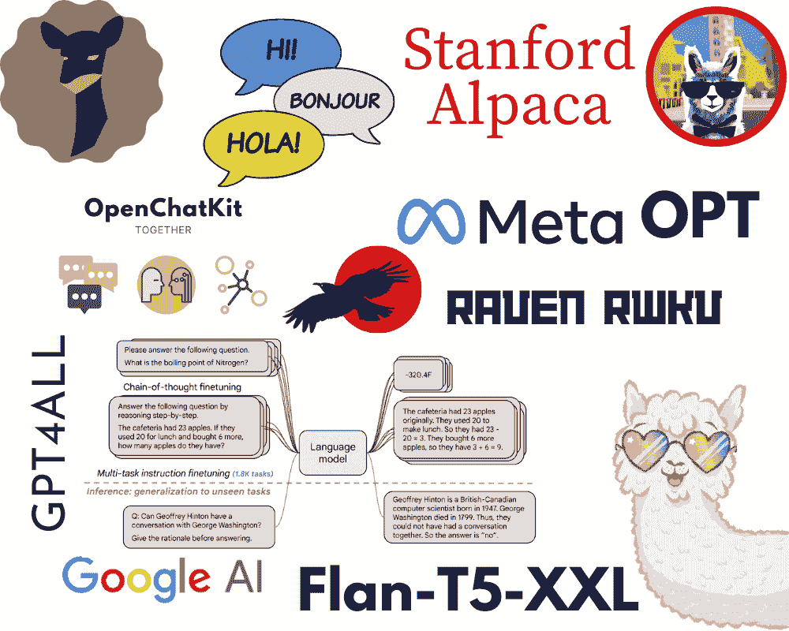
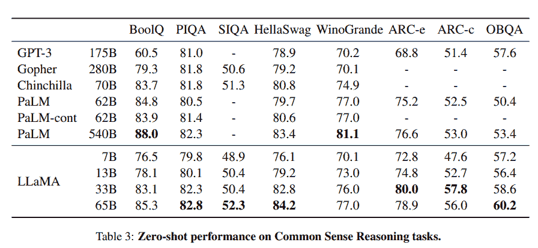
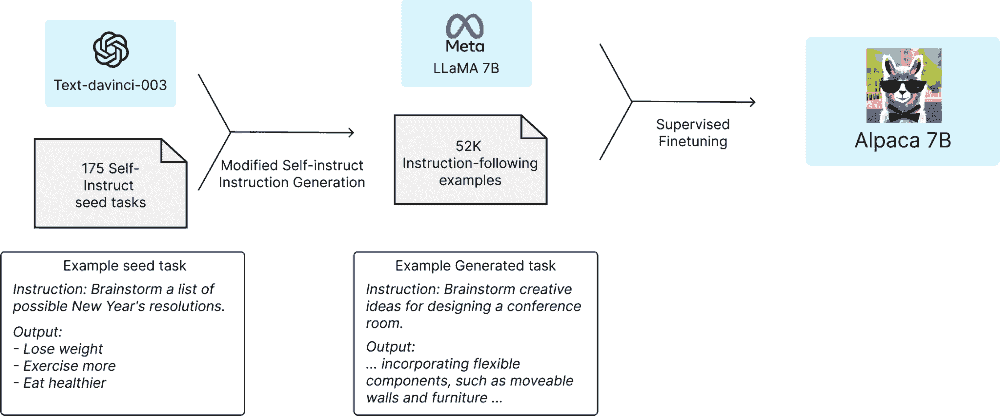
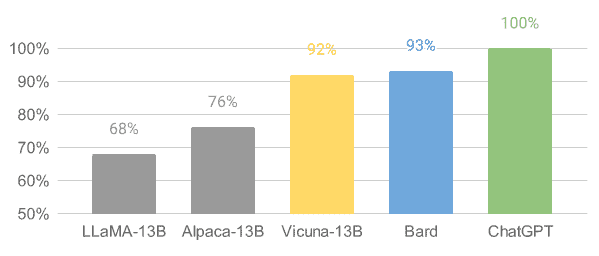
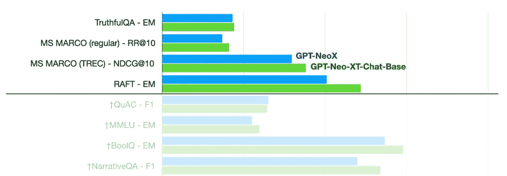
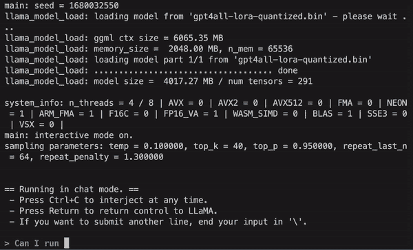
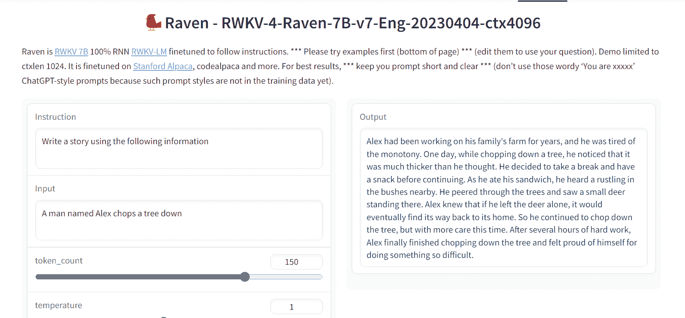
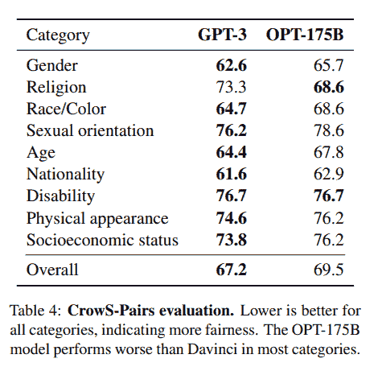
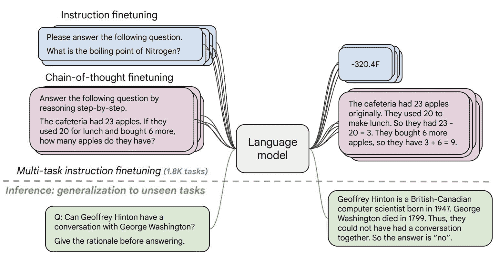

# 8 个开源替代 ChatGPT 和 Bard

> 原文：[`www.kdnuggets.com/2023/04/8-opensource-alternative-chatgpt-bard.html`](https://www.kdnuggets.com/2023/04/8-opensource-alternative-chatgpt-bard.html)

图片来源：作者

# 1\. LLaMA

* * *

## 我们的前三大课程推荐

 1\. [谷歌网络安全证书](https://www.kdnuggets.com/google-cybersecurity) - 快速进入网络安全职业。

 2\. [谷歌数据分析专业证书](https://www.kdnuggets.com/google-data-analytics) - 提升你的数据分析技能

 3\. [谷歌 IT 支持专业证书](https://www.kdnuggets.com/google-itsupport) - 支持你组织的 IT

* * *

[LLaMA](https://arxiv.org/abs/2302.13971) 项目包括一组基础语言模型，参数规模从 70 亿到 650 亿不等。这些模型在数百万个标记上进行了训练，且仅使用公开可用的数据集。因此，LLaMA-13B 超过了 GPT-3 (175B)，而 LLaMA-65B 的表现则与 Chinchilla-70B 和 PaLM-540B 等最佳模型相当。

图片来自 [LLaMA](https://arxiv.org/abs/2302.13971)

**资源：**

+   研究论文: [LLaMA: 开放且高效的基础语言模型 (arxiv.org)](https://arxiv.org/abs/2302.13971)

+   GitHub: [facebookresearch/llama](https://github.com/facebookresearch/llama)

+   演示: [Baize Lora 7B](https://huggingface.co/spaces/project-baize/baize-lora-7B)

# 2\. Alpaca

斯坦福 [Alpaca](https://crfm.stanford.edu/2023/03/13/alpaca.html) 声称它可以与 ChatGPT 竞争，任何人都可以用不到 600$ 复制。Alpaca 7B 是从 LLaMA 7B 模型在 52K 指令跟随演示上进行微调的。

训练配方 | 图片来自 [斯坦福 CRFM](https://crfm.stanford.edu/2023/03/13/alpaca.html)

**资源：**

+   博客: [斯坦福 CRFM](https://crfm.stanford.edu/2023/03/13/alpaca.html)

+   GitHub: [tatsu-lab/stanford_alpaca](https://github.com/tatsu-lab/stanford_alpaca)

+   演示: [Alpaca-LoRA](https://huggingface.co/spaces/tloen/alpaca-lora)（官方演示已下架，这是 Alpaca 模型的重建版）

# 3\. Vicuna

[Vicuna](https://vicuna.lmsys.org/) 是从 LLaMA 模型在 [ShareGPT](https://sharegpt.com/) 收集的用户共享对话上进行微调的。模型 Vicuna-13B 达到了超过 90%* 的 OpenAI ChatGPT 和 Google Bard 质量。它在 90% 的情况下也超越了 LLaMA 和斯坦福 Alpaca 模型。训练 Vicuna 的成本约为 300$。

图片来自 [Vicuna](https://vicuna.lmsys.org/)

**资源：  **

+   博客文章: [Vicuna: 一个开源聊天机器人以 90%* ChatGPT 质量令人印象深刻](https://vicuna.lmsys.org/)

+   GitHub: [lm-sys/FastChat](https://github.com/lm-sys/FastChat#fine-tuning)

+   演示: [FastChat (lmsys.org)](https://chat.lmsys.org/)

# 4\. OpenChatKit

OpenChatKit: 开源 ChatGPT 替代品 是一个完整的工具包，用于创建你的聊天机器人。它提供了训练自己定制化大语言模型的说明、模型微调、可扩展的检索系统用于更新机器人响应，以及用于过滤问题的机器人管理。

图片来自 [TOGETHER](https://www.together.xyz/blog/openchatkit)

正如我们所见，GPT-NeoXT-Chat-Base-20B 模型在问题回答、提取和分类任务上优于基础版 GPT-NeoX。

**资源：  **

+   博客文章: [宣布 OpenChatKit — TOGETHER](https://www.together.xyz/blog/openchatkit)

+   GitHub: [togethercomputer/OpenChatKit](https://github.com/togethercomputer/OpenChatKit)

+   演示: [OpenChatKit ](https://huggingface.co/spaces/togethercomputer/OpenChatKit)

+   模型卡片: [togethercomputer/GPT-NeoXT-Chat-Base-20B](https://huggingface.co/togethercomputer/GPT-NeoXT-Chat-Base-20B)

# 5\. GPT4ALL

[GPT4ALL](https://github.com/nomic-ai/gpt4all) 是一个社区驱动的项目，经过大量整理的助理交互数据进行训练，包括代码、故事、描写和多轮对话。团队提供了数据集、模型权重、数据整理过程和训练代码，以推动开源。此外，他们还发布了可以在笔记本电脑上运行的量化 4 位版本模型。你甚至可以使用 Python 客户端运行模型推理。

动图来自 [GPT4ALL](https://github.com/nomic-ai/gpt4all)

**资源：  **

+   技术报告: [GPT4All](https://s3.amazonaws.com/static.nomic.ai/gpt4all/2023_GPT4All_Technical_Report.pdf)

+   GitHub: [nomic-ai/gpt4al](https://github.com/nomic-ai/gpt4all)

+   演示: [GPT4All](https://huggingface.co/spaces/rishiraj/GPT4All)（非官方）

+   模型卡片: [nomic-ai/gpt4all-lora · Hugging Face](https://huggingface.co/nomic-ai/gpt4all-lora)

# 6\. Raven RWKV

[Raven RWKV 7B](https://huggingface.co/spaces/BlinkDL/Raven-RWKV-7B) 是一个开源聊天机器人，采用 [RWKV](https://github.com/BlinkDL/RWKV-LM) 语言模型，该模型的效果与 ChatGPT 类似。该模型使用的 RNN 能在质量和规模上与 transformers 匹敌，同时更快且节省 VRAM。Raven 在 Stanford Alpaca、code-alpaca 等数据集上进行了微调。

图像来源于 [Raven RWKV 7B](https://huggingface.co/spaces/BlinkDL/Raven-RWKV-7B)

**资源：  **

+   GitHub：[BlinkDL/ChatRWKV](https://github.com/BlinkDL/ChatRWKV)

+   演示：[Raven RWKV 7B](https://huggingface.co/spaces/BlinkDL/Raven-RWKV-7B)

+   模型卡：[BlinkDL/rwkv-4-raven](https://huggingface.co/BlinkDL/rwkv-4-raven)

# 7\. OPT

[OPT](https://arxiv.org/abs/2205.01068)：开放预训练变换器语言模型虽然不如 ChatGPT 优秀，但在零样本和少样本学习以及刻板偏见分析方面表现出色。你还可以将其与 Alpa、Colossal-AI、CTranslate2 和 FasterTransformer 集成，以获得更好的结果。

**注意：** 它在列表中是因为它的受欢迎程度，因为在文本生成类别中每月下载量达到 624,710 次。

图像来源于 [(arxiv.org)](https://arxiv.org/abs/2205.01068)

**资源：  **

+   研究论文：[OPT: 开放预训练变换器语言模型 (arxiv.org)](https://arxiv.org/abs/2205.01068)

+   GitHub：[facebookresearch/metaseq](https://github.com/facebookresearch/metaseq)

+   演示：[LLMs 的水印](https://huggingface.co/spaces/tomg-group-umd/lm-watermarking)

+   模型卡：[facebook/opt-1.3b](https://huggingface.co/facebook/opt-1.3b)

# 8\. Flan-T5-XXL

[Flan-T5-XXL](https://huggingface.co/google/flan-t5-xxl?text=Q%3A+%28+False+or+not+False+or+False+%29+is%3F+A%3A+Let%27s+think+step+by+step#usage) 是在一系列以指令形式呈现的数据集上微调的 T5 模型。指令微调显著提高了多种模型类别（如 PaLM、T5 和 U-PaLM）的性能。Flan-T5-XXL 模型在超过 1000 个额外任务上进行了微调，还覆盖了更多语言。

图像来源于 [Flan-T5-XXL](https://huggingface.co/google/flan-t5-xxl?text=Q%3A+%28+False+or+not+False+or+False+%29+is%3F+A%3A+Let%27s+think+step+by+step#usage)

**资源：  **

+   研究论文：[规模化指令微调语言模型](https://arxiv.org/pdf/2210.11416.pdf)

+   GitHub：[google-research/t5x](https://github.com/google-research/t5x)

+   演示：[Chat Llm 流媒体](https://huggingface.co/spaces/olivierdehaene/chat-llm-streaming)

+   模型卡：[google/flan-t5-xxl](https://huggingface.co/google/flan-t5-xxl?text=Q%3A+%28+False+or+not+False+or+False+%29+is%3F+A%3A+Let%27s+think+step+by+step)

# 结论

有许多开源选项可供选择，我提到了其中一些受欢迎的选项。开源聊天机器人和模型正在不断改进，未来几个月你会看到一个新的模型，它的性能可能会完全超越 ChatGPT。

在这篇博客中，我提供了一些模型/聊天机器人框架的列表，这些框架可以帮助你训练和构建类似于 ChatGPT 和 GPT-4 的聊天机器人。别忘了给它们点赞和评分。

如果你有更好的建议，请在评论区告诉我。我很乐意在未来添加它。

**[Abid Ali Awan](https://www.polywork.com/kingabzpro)** ([@1abidaliawan](https://twitter.com/1abidaliawan)) 是一位认证的数据科学专业人士，喜欢构建机器学习模型。目前，他专注于内容创作，并撰写关于机器学习和数据科学技术的技术博客。Abid 拥有技术管理硕士学位和电信工程学士学位。他的愿景是使用图神经网络为那些饱受心理疾病困扰的学生开发一个 AI 产品。

### 更多相关话题

+   [检测 ChatGPT、GPT-4、Bard 和 Claude 的十大工具](https://www.kdnuggets.com/2023/05/top-10-tools-detecting-chatgpt-gpt4-bard-llms.html)

+   [ChatGPT 与 Google Bard：技术差异比较](https://www.kdnuggets.com/2023/03/chatgpt-google-bard-comparison-technical-differences.html)

+   [ChatGPT 与 BARD](https://www.kdnuggets.com/chatgpt-vs-bard)

+   [OpenChatKit：开源 ChatGPT 替代品](https://www.kdnuggets.com/2023/03/openchatkit-opensource-chatgpt-alternative.html)

+   [ChatGLM-6B：一个轻量级的开源 ChatGPT 替代品](https://www.kdnuggets.com/2023/04/chatglm6b-lightweight-opensource-chatgpt-alternative.html)

+   [Dolly 2.0：ChatGPT 的开源替代品，适用于商业用途](https://www.kdnuggets.com/2023/04/dolly-20-chatgpt-open-source-alternative-commercial.html)
