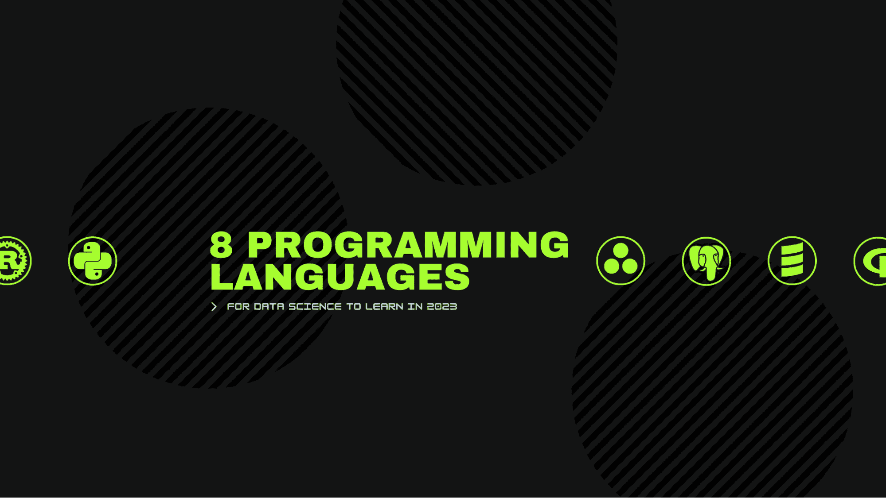

# 2023 年数据科学的 8 种编程语言

> 原文：[`www.kdnuggets.com/2023/07/8-programming-languages-data-science-learn-2023.html`](https://www.kdnuggets.com/2023/07/8-programming-languages-data-science-learn-2023.html)

作者提供的图片

# 1\. Python

* * *

## 我们的前 3 名课程推荐

 1\. [Google 网络安全证书](https://www.kdnuggets.com/google-cybersecurity) - 快速进入网络安全职业生涯。

 2\. [Google 数据分析专业证书](https://www.kdnuggets.com/google-data-analytics) - 提升你的数据分析能力

 3\. [Google IT 支持专业证书](https://www.kdnuggets.com/google-itsupport) - 支持你的组织在 IT 领域

* * *

Python 是数据分析、机器学习和自动化任务中最受欢迎的语言，因为它简单、拥有大量的数据科学工具库如 NumPy 和 Pandas、与 Jupyter Notebooks 的集成使得实验和可视化变得容易，并且它在广泛用途上的多样性，使其成为初学者学习数据科学时的理想语言。

如果你刚开始从事数据科学工作，我强烈建议你从 Python 及其最受欢迎的数据科学库如 NumPy、Pandas、Matplotlib 和 Scikit-Learn 入手。学习 Python 及这些库将为你提供一个坚实的基础，使你高效完成任务，并减少麻烦，为你在数据科学领域的成功奠定基础。

# 2\. SQL

学习 SQL 对任何从事数据工作的人来说都至关重要。你将使用它从 SQL 数据库中提取和分析信息，这是数据专业人士的基本技能。通过理解 SQL，你可以与关系数据库管理系统如 MySQL、SQL Server 和 PostgreSQL 互动，有效地检索、组织和修改数据。

SQL 的基础包括使用 SELECT 语句选择特定数据，使用 INSERT 语句插入新数据，使用 UPDATE 语句更新现有数据，以及使用 DELETE 语句删除过时或无效的数据。

# 3\. Bash

Bash/Shell 不是传统的编程语言，它们是处理数据的宝贵工具。Bash 脚本允许你将命令串联起来，以自动化执行重复或复杂的数据任务，这些任务手动执行会非常繁琐。

Bash 脚本可用于通过搜索、过滤和组织数据来操作文本文件。它们可以自动化 ETL 管道，以提取数据、转换数据并将其加载到数据库中。Bash 还允许你从命令行对数据文件进行计算、拆分、连接和其他操作，并使用 SQL 查询和命令与数据库互动。

# 4\. Rust

Rust 由于其强大的性能、内存安全性和并发特性，正成为数据科学中一个新兴的语言。然而，Rust 在数据应用方面仍相对较新，与 Python 相比有一些劣势。

作为一种较年轻的语言，Rust 在数据科学任务中拥有的库远少于 Python。Rust 的机器学习和数据分析库生态系统仍需成熟，这意味着大多数代码库必须从头开始编写。

然而，Rust 的优势，如性能、内存和线程安全，使其适合构建高效可靠的数据科学系统后端。Rust 非常适合需要低级代码优化和并行化的数据管道。

# 5\. Julia

Julia 是一种专门为科学和高性能数值计算创建的编程语言。其独特的特点之一是能够在编译过程中优化代码，使其性能能够与 C 语言相当，甚至更好。此外，Julia 的语法受到了 MATLAB、Python 和 R 等流行编程语言的启发，使得已经熟悉这些语言的数据科学家更容易学习。

Julia 是开源的，并且拥有一个不断发展的开发者和数据科学家社区，为其持续改进做出贡献。总体而言，Julia 提供了生产力、灵活性和性能的良好平衡——使其成为数据科学家，尤其是那些处理性能受限问题的科学家的宝贵工具。

# 6\. R

R 是一种流行的编程语言，广泛用于数据科学和统计计算。它非常适合数据科学，因为它拥有丰富的内置函数和库，用于数据操作、可视化和分析。这些函数和库使用户能够执行各种任务，如导入和清理数据、探索数据集和构建统计模型。

R 也因其强大的图形能力而闻名。该语言包括各种用于创建高质量图表和可视化的工具，这对数据探索和沟通至关重要。

# 7\. C++

C++是一种高性能的编程语言，广泛用于构建高性能复杂的机器学习应用程序。尽管在数据科学中的使用不如 Python 和 R 等其他语言普及，但 C++具有多个特性，使其在某些数据科学任务中成为绝佳选择。

C++的一个关键优势是其速度。C++是一种编译语言，这意味着代码在执行之前会被转换成机器码，这可能导致比像 Python 和 R 这样的解释型语言更快的执行时间。

C++的另一个优势是它处理大型数据集的能力。C++具有低级内存管理功能，这意味着它可以高效地处理非常大的数据集，而不会遇到其他语言可能遇到的内存问题。

# 8\. Scala

如果你在寻找一种比 Java 更简洁、更少冗余的编程语言，那么 Scala 可能是一个很好的选择。它是一种多用途和灵活的语言，结合了面向对象和函数式编程范式。

Scala 在数据科学中的主要优势之一是它可以无缝集成到像 Apache Spark 这样的“大数据”框架中。这是因为 Scala 运行在与这些框架相同的 JVM 上，使其成为分布式大数据项目和数据管道的绝佳选择。

如果你打算从事数据工程或数据库管理的职业，学习**Scala**将帮助你在职业生涯中脱颖而出。然而，作为数据科学家，掌握这门语言并非必要。

# 结论

总之，如果你对数据科学感兴趣，学习这些八种编程语言中的一种或多种可以帮助你启动或推进在这个领域的职业生涯。每种语言都有其独特的优点和缺点，具体取决于你要完成的数据科学任务。

在数据科学编程语言方面，Python 因其用户友好特性、灵活性和强大的社区支持而成为热门选择。其他语言如 R 和 Julia 也很不错，提供了卓越的统计计算、数据可视化和机器学习支持。C++和 Rust 推荐给那些需要高性能和内存管理能力的人。Bash 脚本在自动化和数据管道方面很有用。最后，学习 SQL 非常重要，因为它是任何技术工作的必备语言。

**[Abid Ali Awan](https://www.polywork.com/kingabzpro)** ([@1abidaliawan](https://twitter.com/1abidaliawan)) 是一名认证数据科学专家，喜欢构建机器学习模型。目前，他专注于内容创作和撰写关于机器学习和数据科学技术的技术博客。Abid 拥有技术管理硕士学位和电信工程学士学位。他的愿景是利用图神经网络为患有心理疾病的学生开发一个 AI 产品。

### 相关主题

+   [KDnuggets™ 新闻 22:n06，2 月 9 日：数据科学编程……](https://www.kdnuggets.com/2022/n06.html)

+   [数据科学编程语言及其使用时机](https://www.kdnuggets.com/2022/02/data-science-programming-languages.html)

+   [特定数据角色的编程语言](https://www.kdnuggets.com/2023/06/programming-languages-specific-data-roles.html)

+   [KDnuggets™ 新闻 22:n04，1 月 26 日：高薪兼职……](https://www.kdnuggets.com/2022/n04.html)

+   [顶级编程语言及其用途](https://www.kdnuggets.com/2021/05/top-programming-languages.html)

+   [今年需要学习的 5 种高薪编程语言](https://www.kdnuggets.com/2023/07/5-highestpaid-languages-learn-year.html)
