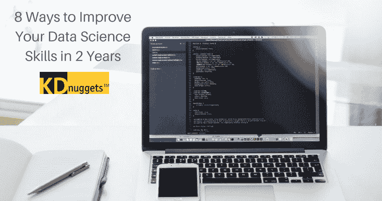

# 2 年内提升数据科学技能的 8 种方法

> 原文：[`www.kdnuggets.com/2017/11/8-ways-improve-data-science-skills-2-years.html`](https://www.kdnuggets.com/2017/11/8-ways-improve-data-science-skills-2-years.html)

数据科学是一个不断成长并始终受欢迎的领域。只需简单地搜索“顶级数据科学技能”，你就会找到数百甚至数千篇关于该主题的博客、文章和视频。

* * *

## 我们的前三个课程推荐

 1\. [Google 网络安全证书](https://www.kdnuggets.com/google-cybersecurity) - 快速进入网络安全职业的快车道

 2\. [Google 数据分析专业证书](https://www.kdnuggets.com/google-data-analytics) - 提升你的数据分析技能

 3\. [Google IT 支持专业证书](https://www.kdnuggets.com/google-itsupport) - 支持你的组织在 IT 领域

* * *

Ferris Jumah，LinkedIn 的全栈数据科学家，[几年前发布了一篇文章详细介绍了数据科学家最受欢迎的技能](http://dataconomy.com/2015/08/the-data-science-skills-network/)，这些技能基于他们的 LinkedIn 资料数据。现在已经过时了，所以可以肯定，现代科学家的技能和工具有很多不在列表中。

看着像 Jumah 的列表时，首先想到的问题是你实际上需要多少这些技能才能在行业中蓬勃发展。真的有谁能做到所有这些技能吗？

很可能是这样，但也可能不是。对你来说最重要的是你能掌握多少这些技能，并熟练运用。也许更重要的是，这些技能可以多快地掌握？

这不一定要像终身刑一样感觉。继续阅读以获取启动你的数据科学、机器学习或统计学家职业的技巧。

### 第一步：承认你有问题

这听起来像是康复计划的第一步——在某种程度上确实如此。无论你是谁，总会有一个雄心壮志，希望在你的领域中达到**绝对顶尖**。

数据科学尤其培养这种态度，因为即使你不是在不断学习新事物，你仍然需要保持对你经常使用的技能和流程的了解。这是一个始终在前进和发展的行业，这意味着你也需要保持同样的状态。

但这并不意味着你必须了解或参与所有内容。这就是问题所在。第一步是承认你不会专注于数据科学家可以使用的每项技能。是的，你需要核心技能——主要是分析和数据处理——但其他一切则是附带的。

那么？缩小你的重点。选择你最常用的技能以及对你的职业生涯最有益的技能。例如，如果你的计划是使用 Python 或基于 Hadoop 的系统，那么学习其他语言虽然能丰富你的知识储备，但并不会真正帮助你提升核心技能。

### 第二步：加速你的学习

两年。你应该将最多两年的时间专注于学习、教育和培训。是的，如果你对这个行业还很陌生，可以在此之前进入职场，但重点是你绝不希望在没有实际领域经验的情况下超过两年。

这正是为什么本指南专注于在两年内磨练最有益技能的原因。目标是每周投入大约十五到二十小时来发展你的知识和技能。有几种方法可以做到这一点：

1.  通过 Coursera、Treehouse、Lynda 和 CodeSchool 参加在线课程，专注于你想学习的技能。这些课程不一定要与数据科学相关。相关语言的编程课程，如 Python，也很有效。

1.  尽可能多地阅读关于数据科学的资料。这包括学术论文、教科书以及其他教育材料，甚至是当前的行业报告。

1.  加入一个数据科学或开发社区。有很多社区可以选择。关注社区分享的帖子和材料，参与最重要的讨论。你可以从同行那里学到很多东西。

1.  如果可以，找到一位在行业内工作或具有数据科学经验的导师。这包括程序员和开发人员、数据科学家、统计学家、工程师等。定期与他们见面，提出问题，听取他们的经验。

1.  定期访问 [UCI 机器学习库](http://archive.ics.uci.edu/ml/index.php) 并参与数据问题。R、Excel 及类似平台是你的好帮手。如果解决一个问题花费的时间超过了预期，不要灰心。坚持下去，你会随着时间的推移提高效率。

1.  遵循脚本、预处理数据和自动化任务，并依赖框架或数据库。这将最大限度地减少你需要自己创建算法和代码的时间，并增加实际进行数据科学和机器学习的时间。

1.  找一份涉及机器学习、数据科学、分析或基本统计的入门级工作。 [数据迁移是一个很好的机会](https://www.linktek.com/checklist-planning-lower-risk-embarrassment-free-data-migration/#) 适合入门级或初学者的数据科学家。你可以通过这些项目奠定知识基础，并在理解了基础后轻松自动化一些任务。

1.  参与一个[你感兴趣的开源数据科学或机器学习项目](https://www.kdnuggets.com/2016/03/top-10-data-science-github.html)。把它当作一个爱好或业余项目，在闲暇时间享受工作。

此外，当你有机会时，深入学习并开始使用[一些流行的数据科学工具](https://datafloq.com/read/10-tools-for-the-novice-data-scientist/2994)。到你进入职场时，你将已经对你雇主使用的平台有了基本的了解和经验。

### 第三步：永不停止成长

重要的是要理解，无论你多么努力工作，学习多少，你都不可能在两到三年内成为专家。这不是一个现实的目标。但这并不意味着你不应该努力继续成长和提升你的技能。恰恰相反！

即使你花了两年时间进行培训——相信与否，这段时间会很快过去——你仍然会想要在新领域中继续提升你的技能和经验。如果你没有学习新事物的愿望，那也没关系——只要确保你保持对当前技能和项目的掌握。

听起来有些重复，但要继续参与这些开发和机器学习社区，并密切关注新的课程和在线资源。

例如，从 2006 年到 2016 年，[流行的数据科学家职称](https://whatsthebigdata.com/2016/10/26/the-evolution-of-data-scientists-2006-2016/) 从仅仅“数据或商业分析师”发展到包括数据科学家、商业分析师、大数据专家、机器学习专家、数据可视化专家等。随着主要品牌和组织采用这项技术并实施新的机器学习和数据科学计划，这种增长现在比以往任何时候都要快。

简而言之，这将给行业中的专业人士施加更大的压力，要求他们不断成长，变得更加熟练和经验丰富，涵盖更广泛的主题和技能。

一切都意味着你必须保持对核心知识和技能基础的掌握。

无论如何，永远不要停止成长和学习。

否则，你可能会发现自己在行业中被远远甩在了后面。

**简介: [凯拉·马修斯](http://productivitybytes.com/subscribe-to-productivity-bytes/)** 在《The Week》、《数据中心期刊》和《VentureBeat》等出版物上讨论技术和大数据，并且已经写作超过五年。要阅读更多凯拉的文章，[**订阅她的博客 Productivity Bytes**](http://productivitybytes.com/subscribe-to-productivity-bytes/)。

**相关内容：**

+   每个数据科学家都应该随身携带的 6 本书

+   进入数据科学：你需要知道的

+   如何面试数据科学家

### 相关话题

+   [理解贝叶斯定理将如何提升你的数据科学](https://www.kdnuggets.com/2022/06/3-ways-understanding-bayes-theorem-improve-data-science.html)

+   [本周提升你搜索应用的 8 种方法](https://www.kdnuggets.com/2022/09/corise-8-ways-improve-search-application-week.html)

+   [提升机器学习模型的 7 种方法](https://www.kdnuggets.com/7-ways-to-improve-your-machine-learning-models)

+   [如何利用 ChatGPT 提升你的数据科学技能](https://www.kdnuggets.com/2023/03/chatgpt-improve-data-science-skills.html)

+   [谦虚自己将提升你的数据科学技能](https://www.kdnuggets.com/2022/01/humbling-improve-data-science-skills.html)

+   [30 年的数据科学：数据科学从业者的回顾](https://www.kdnuggets.com/30-years-of-data-science-a-review-from-a-data-science-practitioner)
