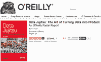
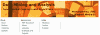
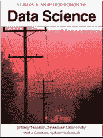

# 9 本免费书籍，供学习数据挖掘和数据分析之用

> 原文：[`www.kdnuggets.com/2014/04/9-free-books-learning-data-mining-data-analysis.html`](https://www.kdnuggets.com/2014/04/9-free-books-learning-data-mining-data-analysis.html)

 评论**作者 [Alex Ivanovs](http://codecondo.com/author/alex-ivanovs/)，CodeCondo，2014 年 4 月 29 日。**

数据挖掘、数据分析，这两个术语常常让人觉得很难理解——复杂——而且需要接受最高水平的教育才能理解。

我只能不同意，正如我们在这个美妙的生活中所经历的一切一样，我们只需要花费一定的时间学习某些东西，练习它，然后我们会意识到其实并没有那么难。

毫无疑问，这个世界上有很多聪明的人，他们在像谷歌、苹果、微软等大公司工作，还有许多其他公司（[包括安全机构](https://en.wikipedia.org/wiki/List_of_intelligence_agencies)），但如果我们继续仰望他们，我们将永远觉得这很难，因为我们从未给自己机会去看实际的例子和事实。

通过学习这些书籍，你将快速揭示[数据挖掘](https://en.wikipedia.org/wiki/Data_mining)和[数据分析](https://en.wikipedia.org/wiki/Data_analysis)的“秘密”，并希望能够更好地判断它们的作用，以及它们如何帮助你在当前和未来的工作项目中。

我只想说，为了学习这些复杂的主题，你需要保持完全开放的心态，接受每一个可能性，因为这通常是学习发生的地方，毫无疑问你的大脑会多次被点燃。

[**数据柔道：将数据转化为产品的艺术**]

](http://www.oreilly.com/data/free/data-jujitsu.csp) [DJ Patil](http://www.crunchbase.com/person/dj-patil) 向我们简要介绍了数据问题的复杂性，如何从更好的角度来看待它们，以及我们是否应该尝试解决那些看似不可能的问题。他提供了完全合理且易于理解的例子，这本书是你收藏中的一份不错的数据书籍，质量知识免费提供。

你可以通过填写右侧的字段来获取这本书的副本。（我认为即使不填写也可以）

[**R 语言中的数据挖掘算法**](https://en.wikibooks.org/wiki/Data_Mining_Algorithms_In_R)

本维基书旨在通过整合每种技术的三部分信息来填补这一空白：描述和原理、实施细节和使用案例。

每种技术的描述和理由提供了理解实现和将其应用于实际场景所需的背景。实现细节不仅揭示了算法设计，还解释了其参数，基于之前提供的理由。

最后，使用案例提供了在合成数据集和真实数据集上应用算法的体验。

[**程序员的数据挖掘指南**](http://guidetodatamining.com/)

这本书正是我在帖子开头提到的，包含了大量针对初学者的真实经验，帮助你更好地理解数据处理的整个过程以及算法的工作原理。

这显然是一个正在进行中的工作，但已经有很多章节可供阅读，不过最后一章似乎现在已经延迟了几个月。不过，前几章对于掌握基础知识至关重要，强烈推荐。

[**数据挖掘与分析：基本概念与算法**](http://codecondo.com/free-marketing-tools-small-business/)

这是一本非常高质量的书，包含了更多高级技术和方法，目前仍在编辑/撰写中，预计将在今年晚些时候发布。你可以通过[这个链接](http://www2.dcc.ufmg.br/livros/miningalgorithms/files/pdf/dmafca.pdf)查看官方草稿（PDF），你会惊讶于有多少信息可以浏览！

非常适合喜欢通过插图和大量真实例子学习的学习者。

[**互联网广告中的数据挖掘与分析**](http://arxiv.org/pdf/1206.1754v2.pdf)

我提到了像 Google 和 Apple 这样的大型公司，原因很简单：我们在各个领域都能看到数据挖掘和分析，而不仅仅是特定的科学和学科。

实际上，[像 Google Analytics 这样的平台](http://codecondo.com/free-marketing-tools-small-business/)严重依赖于基于高质量数据科学知识构建的算法，广告公司也是如此，这是本白皮书/电子书讨论的主要话题。

[**数据科学入门**](http://arxiv.org/pdf/1206.1754v2.pdf)

[Jeffrey M. Stanton](https://my.ischool.syr.edu/Profiles/Preview/jmstanto)向我们简要介绍了数据科学，以及它本质上不仅仅是一系列与数据挖掘相关的任务。用他的话说，它更像是一种艺术形式，与许多行业互动，比一些人认为的要多。

此外，数据科学远不仅仅是分析数据。许多人喜欢分析数据，可以整天研究直方图和平均值，但对于那些喜欢其他活动的人，数据科学提供了多种角色和所需的技能。让我们通过考虑一些购买谷物盒子时涉及的数据来深入了解这一观点。

**海量数据挖掘** 

简而言之，这本书非常适合那些希望了解更多关于网络数据挖掘的人，它讨论了在设计网络和处理网络数据时最常见的问题。

这本书在每一章节末尾都会提供大量的示例和任务，并且是一本相当适合初学者的书；它要求你有一定的数据算法经验，掌握一些数学和数据库经验也不会有坏处。

**数据学校手册**

数据学校是一个很棒的地方，他们提供了针对所有水平的各种课程，这本手册非常适合作为他们课程材料的补充。我真正喜欢这本手册的是，它提供了大量的后续链接，方便项目创建。

一个很好的例子是指向那些之前建立了数据集的网站链接，对于那些希望了解更多关于数据及其工作原理的人至关重要！

**高级文本挖掘的理论与应用** 

我们将用一本由九章组成的书来结束我们的免费数据挖掘和数据分析学习书籍列表，这本书的每一章几乎都是由不同的人编写的；但它们放在一起时显得非常有意义。

本书的主要重点是文本挖掘，以及网络技术的发展如何影响数据科学和整体分析。值得拥有的一本好书！

**从免费书籍中学习数据科学**

没有什么比从书籍中学习，然后将新获得的知识付诸实践更好的方法了，否则我们很容易忘记实际学到的内容。这是一本每个有志成为数据科学家的读者都应该注意并添加到学习资料清单中的美丽书单。

你读过哪些书以帮助你开始数据挖掘和分析的旅程？我相信社区会很乐意了解更多，我也很期待看看我可能错过了什么。

根据请求重新发布。原文：[codecondo.com/9-free-books-for-learning-data-mining-data-analysis/](http://codecondo.com/9-free-books-for-learning-data-mining-data-analysis/)。

* * *

## 我们的前 3 个课程推荐

 1\. [谷歌网络安全证书](https://www.kdnuggets.com/google-cybersecurity) - 快速进入网络安全职业轨道。

 2\. [谷歌数据分析专业证书](https://www.kdnuggets.com/google-data-analytics) - 提升你的数据分析技能

 3\. [谷歌 IT 支持专业证书](https://www.kdnuggets.com/google-itsupport) - 支持你的组织 IT 工作

* * *

### 更多相关内容

+   [KDnuggets 新闻，11 月 2 日：数据科学的现状…](https://www.kdnuggets.com/2022/n43.html)

+   [15 本免费机器学习和深度学习书籍](https://www.kdnuggets.com/2022/10/15-free-machine-learning-deep-learning-books.html)

+   [15 本免费机器学习和深度学习书籍](https://www.kdnuggets.com/2022/11/15-free-machine-learning-deep-learning-books.html)

+   [25 本免费书籍，掌握 SQL、Python、数据科学、机器学习和自然语言处理](https://www.kdnuggets.com/25-free-books-to-master-sql-python-data-science-machine-learning-and-natural-language-processing)

+   [24 本最佳（免费）书籍，助你理解机器学习](https://www.kdnuggets.com/2020/03/24-best-free-books-understand-machine-learning.html)

+   [5 本免费书籍，掌握机器学习](https://www.kdnuggets.com/5-free-books-to-master-machine-learning)
