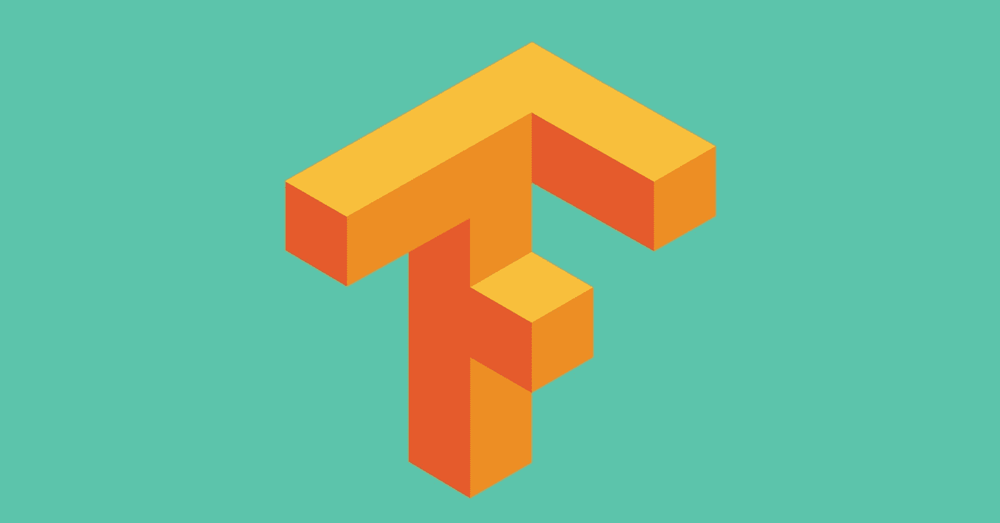
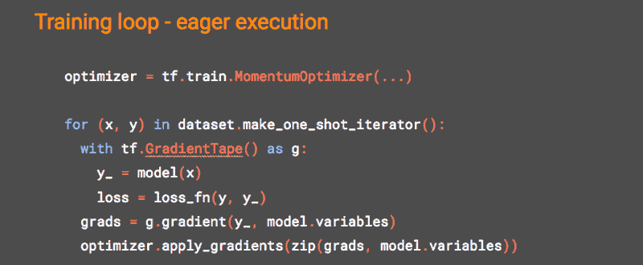
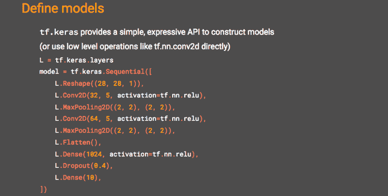
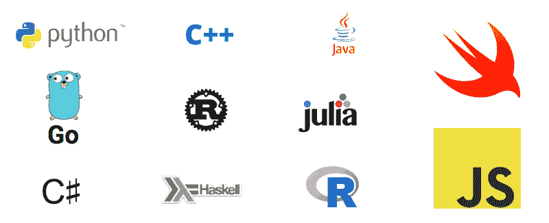
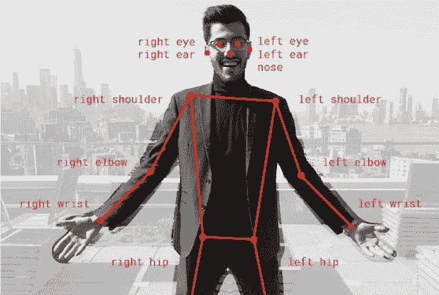
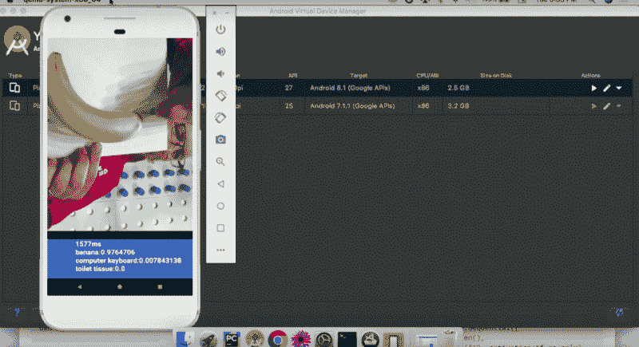
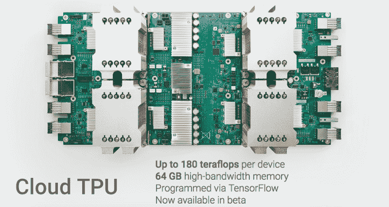
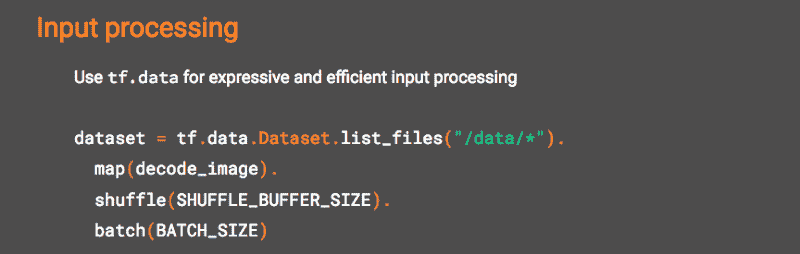
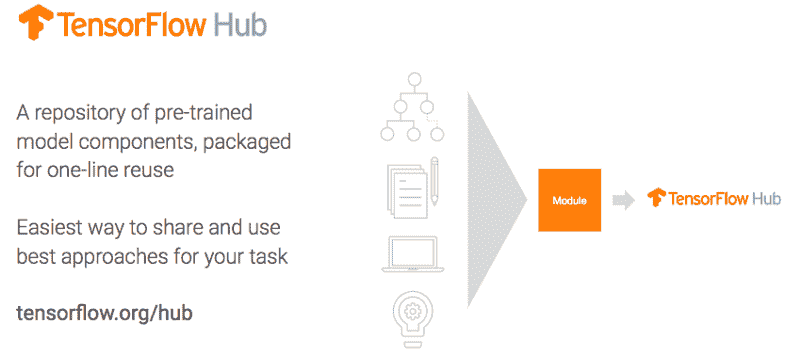

# 9 件您应该知道的关于 TensorFlow 的事

> 原文：[`www.kdnuggets.com/2018/08/9-things-tensorflow.html`](https://www.kdnuggets.com/2018/08/9-things-tensorflow.html)

 评论

今天早上，我总结了我在旧金山 Google Cloud Next 上享受的一场讲座中的一些最爱内容——[TensorFlow 有什么新变化？](https://www.youtube.com/watch?v=MR7w8ARAS2Y)

然后我考虑了一下，没发现不与您分享我这个超短总结的理由（除了您可能不会看这个视频——您绝对应该去看看，[演讲者](https://twitter.com/lmoroney)非常棒），所以就这样吧……

### #1 它是一个强大的机器学习框架

TensorFlow 是一个[机器学习](https://hackernoon.com/the-simplest-explanation-of-machine-learning-youll-ever-read-bebc0700047c)框架，如果您有大量数据和/或追求 AI 的最前沿技术，它可能是您的新好朋友：[深度学习](https://github.com/kozyrkov/deep-learning-walkthrough)。神经网络，大型的。它不是数据科学的瑞士军刀，而是[工业车床](http://www.industrytap.com/worlds-largest-lathe-sale/14280)… 这意味着如果您只是想在 20x2 的电子表格中绘制回归线，您可以停止阅读。

但如果您追求的是“大”，那就值得兴奋了。TensorFlow 已被用于[寻找新行星](https://www.nbcnews.com/mach/video/nasa-s-kepler-telescope-discovered-a-new-exoplanet-with-google-s-help-1121785923978)、通过帮助医生[筛查糖尿病视网膜病变](https://www.wired.com/2016/11/googles-ai-reads-retinas-prevent-blindness-diabetics/)，以及通过提醒当局[非法砍伐活动](https://www.blog.google/technology/ai/fight-against-illegal-deforestation-tensorflow/)来帮助保护森林。它是[AlphaGo](https://www.youtube.com/watch?v=vFr3K2DORc8)和[Google Cloud Vision](https://cloud.google.com/vision/)的基础，您可以使用它。TensorFlow 是开源的，您可以[免费下载](https://www.tensorflow.org/install/)并立即[开始使用](https://www.datacamp.com/community/tutorials/tensorflow-tutorial)。

通过 TensorFlow 的帮助发现，开普勒-90i 使开普勒-90 系统成为我们已知的唯一一个拥有八颗行星围绕一颗恒星运行的系统。尚未发现有超过八颗行星的系统，所以我想这意味着我们与开普勒-90 系统并列第一（暂时如此）。了解更多请点击[这里](https://www.nbcnews.com/mach/video/nasa-s-kepler-telescope-discovered-a-new-exoplanet-with-google-s-help-1121785923978)。

### #2 异常的方法是可选的

我对[TensorFlow Eager](https://www.tensorflow.org/guide/eager)情有独钟。

如果你曾经尝试过 TensorFlow 而因为它让你像学术/外星人一样编码而吓得逃跑了，那就回来吧！

TensorFlow 的即时执行让你像纯 Python 程序员一样与之互动：写代码和调试的即时性，代替了构建那些庞大图形时的屏息以待。我自己也是一名恢复中的学术者（可能还是外星人），但自从即时执行推出以来，我就爱上了它。如此渴望取悦！

### #3 你可以逐行构建神经网络

Keras + TensorFlow = 更简单的神经网络构建！

[Keras](https://keras.io/) 专注于用户友好性和简单原型制作，而这些是旧版 TensorFlow 非常渴望的。如果你喜欢面向对象的思维，并且喜欢逐层构建神经网络，你会喜欢 *tf.keras*。在下面的几行代码中，我们创建了一个具有标准功能（如 dropout）的顺序神经网络（稍后提醒我用我的隐喻来详细描述 dropout，它们涉及订书机和流感）。

哦，你喜欢谜题，对吗？耐心点。别对订书机想得太多。

### #4 不仅仅是 Python

好消息！你已经抱怨了 TensorFlow 对 Python 的单一痴迷一段时间了。好消息是！TensorFlow 不再只是 Python 爱好者的专属了。现在它可以在多种语言中运行，从 R 到 Swift，再到 JavaScript。

### #5 你可以在浏览器中完成一切

说到 JavaScript，你可以在浏览器中使用 [TensorFlow.js](https://medium.com/tensorflow/introducing-tensorflow-js-machine-learning-in-javascript-bf3eab376db) 训练和执行模型。去 [这些酷炫的演示](https://js.tensorflow.org/) 好好体验一下，当你回来时我还在这里等你。

实时 [人体姿态估计](https://medium.com/tensorflow/real-time-human-pose-estimation-in-the-browser-with-tensorflow-js-7dd0bc881cd5) 使用 TensorFlow.js 在浏览器中实现。可以通过 [这里](https://storage.googleapis.com/tfjs-models/demos/posenet/camera.html) 打开你的相机进行演示。或者不用离开你的椅子。 ¯\_(ツ)_/¯ 随你选择。

### #6 小型设备有一个 Lite 版本

有个来自博物馆的老旧桌面电脑？烤面包机？（一样的东西？）[TensorFlow Lite](https://www.tensorflow.org/mobile/tflite/) 将模型执行带到了各种设备，包括移动设备和物联网设备，使你在推理速度上获得超过原始 TensorFlow 的三倍提升。是的，现在你可以在你的 Raspberry Pi 或手机上进行机器学习了。在 [这场演讲](https://www.youtube.com/watch?v=MR7w8ARAS2Y)中，Laurence 勇敢地在成千上万观众面前实时演示了在 Android 模拟器上进行图像分类……并且成功了。

计算 1.6 秒？检查！香蕉的概率超过 97%？检查！卫生纸？嗯，我去过几个国家，像 Laurence 手中那张纸也算数。

### #7 专用硬件变得更好

如果你厌倦了等待 CPU 处理数据以训练神经网络，现在你可以使用专门为此设计的硬件——[Cloud TPUs](https://cloud.google.com/tpu/)。T 代表张量。就像 TensorFlow……巧合吗？我不这么认为！几周前，谷歌宣布了第 3 版 TPUs 的 Alpha 版。

### #8 新的数据管道有了很大改进

你在那边用[*numpy*](https://docs.scipy.org/doc/numpy/reference/) 做什么呢？如果你想在 TensorFlow 中完成这个任务但结果愤怒退出，[*tf.data*](https://www.tensorflow.org/guide/datasets)命名空间现在让你在 TensorFlow 中的输入处理更具表现力和效率。*tf.data*提供了[快速、灵活且易于使用](https://www.youtube.com/watch?v=uIcqeP7MFH0)的与训练同步的数据管道。

### #9 你不需要从头开始

你知道什么不是一个有趣的机器学习入门方式吗？在编辑器中一页空白的新文件，没有示例代码可用。有了 TensorFlow Hub，你可以以更高效的方式继承他人的代码并称之为自己的（也就是职业软件工程）。

[TensorFlow Hub](https://www.tensorflow.org/hub/) 是一个用于重用预训练机器学习模型组件的库，打包成一行代码即可重用。随意使用！

既然我们在谈论社区和不再孤军奋战，你可能会喜欢知道 TensorFlow 刚刚拥有了官方的[YouTube 频道](https://www.youtube.com/channel/UC0rqucBdTuFTjJiefW5t-IQ)和[博客](https://medium.com/tensorflow)。

这就是我的总结，所以接下来可以看完整的演讲视频来娱乐接下来的 42 分钟。

[原文](https://hackernoon.com/9-things-you-should-know-about-tensorflow-9cf0a05e4995)。经授权转载。

**相关：**

+   [5 分钟设置你的 AI 开发环境](https://www.kdnuggets.com/2018/08/ai-dev-environment.html)

+   [TensorFlow 中的自回归模型](https://www.kdnuggets.com/2018/08/autoregressive-models-tensorflow.html)

+   [使用 Tensorflow 对象检测和 OpenCV 分析足球（足球）比赛](https://www.kdnuggets.com/2018/07/analyze-soccer-game-using-tensorflow-object-detection-opencv.html)

* * *

## 我们的前三大课程推荐

 1\. [谷歌网络安全证书](https://www.kdnuggets.com/google-cybersecurity) - 快速进入网络安全职业的捷径。

 2\. [谷歌数据分析专业证书](https://www.kdnuggets.com/google-data-analytics) - 提升你的数据分析技能

 3\. [谷歌 IT 支持专业证书](https://www.kdnuggets.com/google-itsupport) - 支持你的组织的 IT 需求

* * *

### 更多相关话题

+   [当扩展你的网络数据驱动产品时你应该知道的事项](https://www.kdnuggets.com/2023/08/things-know-scaling-web-datadriven-product.html)

+   [7 件你不知道的低代码工具功能](https://www.kdnuggets.com/2022/09/7-things-didnt-know-could-low-code-tool.html)

+   [KDnuggets 新闻，4 月 13 日：数据科学家应该了解的 Python 库…](https://www.kdnuggets.com/2022/n15.html)

+   [关于数据管理你需要知道的 6 件事及其重要性…](https://www.kdnuggets.com/2022/05/6-things-need-know-data-management-matters-computer-vision.html)

+   [关于 SAS 数据科学学院你不知道的 3 件事](https://www.kdnuggets.com/2022/07/sas-3-things-didnt-know-sas-academy-data-science.html)

+   [构建 LLM 应用时你需要知道的 5 件事](https://www.kdnuggets.com/2023/08/5-things-need-know-building-llm-applications.html)
