# 神经网络的简史

> 原文：[`www.kdnuggets.com/a-brief-history-of-the-neural-networks`](https://www.kdnuggets.com/a-brief-history-of-the-neural-networks)

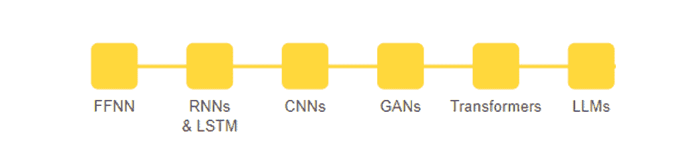

神经网络演变的全景图（图片作者）。

神经网络，人工智能的基本构建块，已经彻底改变了我们处理信息的方式，提供了对未来技术的展望。这些复杂的计算系统受人脑复杂性的启发，已成为从图像识别和自然语言理解到自动驾驶和医疗诊断等任务中的关键。随着我们探索神经网络的历史演变，我们将揭示它们如何演变并塑造现代 AI 的进程。

* * *

## 我们的三大课程推荐

 1\. [谷歌网络安全证书](https://www.kdnuggets.com/google-cybersecurity) - 快速通道进入网络安全职业生涯。

 2\. [谷歌数据分析专业证书](https://www.kdnuggets.com/google-data-analytics) - 提升你的数据分析技能

 3\. [谷歌 IT 支持专业证书](https://www.kdnuggets.com/google-itsupport) - 支持你的组织在 IT 领域

* * *

# 一切是如何开始的？

神经网络，深度学习的基础组件，其概念根源于人脑中复杂的生物神经网络。这个卓越的概念起初是通过一个基本的类比展开的，将生物神经元与计算网络进行对比。

这个类比围绕大脑展开，大脑由大约 1000 亿个神经元组成。每个神经元与其他神经元保持大约 7000 个突触连接，形成一个复杂的神经网络，这一网络是人类认知过程和决策制定的基础。

单独来看，生物神经元通过一系列简单的电化学过程来运作。它通过树突接收来自其他神经元的信号。当这些输入信号累计到一定水平（一个预定的阈值）时，神经元会激活并沿其轴突发送电化学信号。这会影响连接到其轴突末端的神经元。需要注意的是，神经元的反应就像一个二进制开关：要么发射（激活），要么保持安静，没有任何中间状态。

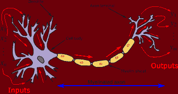

生物神经元是人工神经网络的灵感来源（图片来源：维基百科）。

尽管人工神经网络非常令人印象深刻，但它们仍然远未接近人脑的惊人复杂性和深刻复杂性。然而，它们在解决那些对传统计算机具有挑战性但对人类认知而言直观的问题上表现出了显著的能力。一些例子包括图像识别和基于历史数据的预测分析。

现在我们已经探讨了生物神经元的基本原理及其对人工神经网络的启发，让我们一起回顾那些塑造了人工智能领域的神经网络框架的演变历程。

# FFNN - 前馈神经网络

前馈神经网络，通常被称为多层感知器，是一种基本的神经网络类型，其操作深深根植于信息流动、互连层和参数优化的原则中。

在核心上，FFNNs 协调了信息的单向流动。一切从包含*n* 个神经元的输入层开始，数据在此被初步接收。该层作为网络的入口点，充当需要处理的输入特征的接收器。从这里开始，数据经过网络的隐藏层进行变换。

FFNNs 的一个重要方面是其连接结构，这意味着每一层中的每个神经元都与该层中的每个神经元紧密相连。这种互连性使得网络能够进行计算并捕捉数据中的关系。这就像一个通信网络，其中每个节点在处理信息中扮演着角色。

当数据通过隐藏层时，它会经过一系列计算。每个隐藏层的神经元从前一层的所有神经元接收输入，对这些输入应用加权和，添加一个偏置项，然后通过一个激活函数（通常是 ReLU、Sigmoid 或 tanH）传递结果。这些数学运算使得网络能够从输入中提取相关模式，并捕捉数据中的复杂非线性关系。正是在这一点上，前馈神经网络（FFNNs）相比于更浅的机器学习模型真正表现出色。

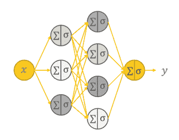

完全连接的前馈神经网络的架构（作者提供的图像）。

但这并不是终点。FFNNs 的真正力量在于它们的适应能力。在训练过程中，网络调整其权重以最小化其预测值与实际目标值之间的差异。这个迭代过程通常基于如梯度下降等优化算法，称为*反向传播*。反向传播使 FFNNs 能够真正从数据中学习，并提高预测或分类的准确性。

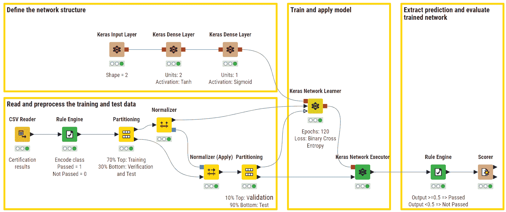

示例 [KNIME 工作流](https://hub.knime.com/-/spaces/-/latest/~MTi8mL9fZePO9A-S/) 用于二分类认证考试（通过与失败）。在上部分支中，我们可以看到网络架构，包括一个输入层，一个具有 tanH 激活函数的全连接隐藏层，以及一个使用 Sigmoid 激活函数的输出层（图像由作者提供）。

尽管强大而多才多艺，FFNN 显示出一些相关的局限性。例如，它们未能捕捉数据中的顺序性和时间/句法依赖性——这两个方面对于语言处理和时间序列分析任务至关重要。克服这些局限性的需求促成了新型神经网络架构的发展。这一过渡为递归神经网络（RNN）的出现铺平了道路，RNN 引入了反馈回路的概念，以更好地处理顺序数据。

# RNN 和 LSTM - 递归神经网络和长短期记忆

从根本上讲，RNN 与 FFNN 有一些相似之处。它们也由互联的节点层组成，处理数据以进行预测或分类。然而，它们的关键区别在于能够处理顺序数据并捕捉时间依赖性。

在 FFNN 中，信息沿着从输入层到输出层的单一单向路径流动。这适用于数据顺序不太重要的任务。然而，当处理如时间序列数据、语言或语音这样的序列时，保持上下文和理解数据的顺序至关重要。这正是 RNN 发挥作用的地方。

RNN 引入了反馈回路的概念。这些回路作为一种“记忆”，使得网络能够保持一个隐藏状态，以捕捉关于先前输入的信息，并影响当前的输入和输出。虽然传统神经网络假设输入和输出彼此独立，但递归神经网络的输出依赖于序列中的先前元素。这种递归连接机制使 RNN 特别适合通过“记住”过去的信息来处理序列。

递归网络的另一个区别特征是，它们在网络的每一层中共享相同的权重参数，这些权重通过时间反向传播（BPTT）算法进行调整，该算法与传统的反向传播略有不同，因为它专门针对序列数据。

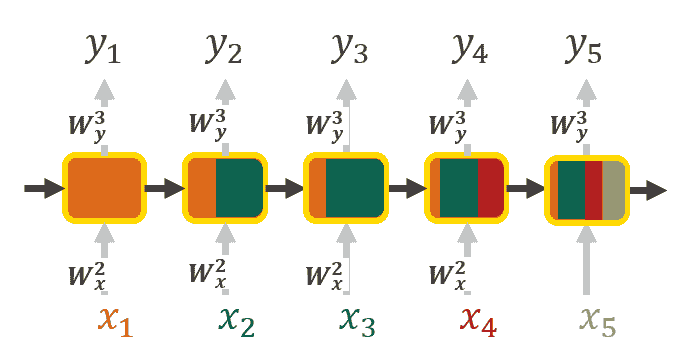

展开的 RNN 表示，其中每个输入都带有来自先前输入的上下文信息。颜色表示上下文信息的传播（图像由作者提供）。

然而，传统的 RNN 也有其局限性。虽然理论上它们应该能够捕捉长期依赖关系，但实际上它们往往难以有效做到这一点，甚至可能遭遇梯度消失问题，这阻碍了它们在多个时间步长上学习和记忆信息的能力。

这就是长短期记忆（LSTM）单元发挥作用的地方。它们通过在结构中引入三个门控：遗忘门、输入门和输出门，专门设计来处理这些问题。

+   **遗忘门**：该门控决定应丢弃或忘记时间步长中的哪些信息。通过检查单元状态和当前输入，它决定哪些信息在当前预测中是无关的。

+   **输入门**：该门控负责将信息引入单元状态。它考虑输入和先前的单元状态，以决定应添加哪些新信息来增强其状态。

+   **输出门**：该门控决定 LSTM 单元将生成什么输出。它考虑当前输入和更新后的单元状态，以产生可以用于预测或传递给时间步长的输出。

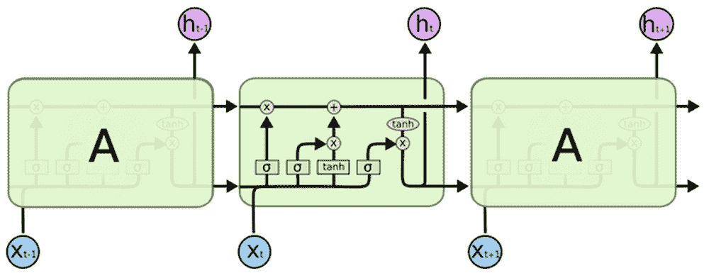

长短期记忆单元的可视化表示（[图片](https://colah.github.io/posts/2015-08-Understanding-LSTMs/) 由 Christopher Olah 提供）。

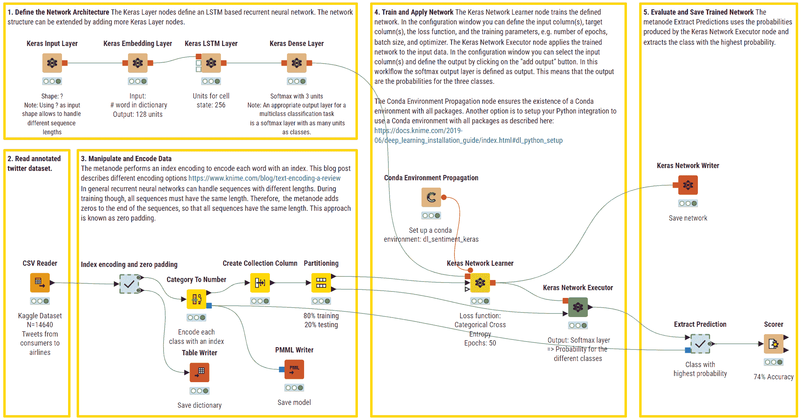

示例 [KNIME 工作流](https://hub.knime.com/-/spaces/-/latest/~uyVWG2YbtsOhdp5v/) 使用 LSTM 单元的 RNN 用于多类别情感预测（积极、消极、中立）。上支定义了网络架构，包括一个输入层来处理不同长度的字符串，一个嵌入层，一个包含多个单元的 LSTM 层，以及一个全连接输出层，配有 Softmax 激活函数以返回预测结果。

总之，RNN（递归神经网络），特别是 LSTM（长短期记忆）单元，专为序列数据设计，能够保持记忆并捕捉时间依赖关系，这对于自然语言处理、语音识别和时间序列预测等任务至关重要。

当我们从 RNN 捕捉序列依赖关系转变时，卷积神经网络（CNN）不断发展。与 RNN 不同，CNN 在从结构化网格状数据中提取空间特征方面表现优异，使其非常适合图像和模式识别任务。这种过渡反映了神经网络在不同数据类型和结构中的多样化应用。

# CNN - 卷积神经网络

CNN（卷积神经网络）是一种特殊类型的神经网络，特别适合处理图像数据，如二维图像甚至三维视频数据。它们的架构依赖于一个多层前馈神经网络，至少包含一个卷积层。

CNNs 的独特之处在于它们的网络连接性和特征提取方法，这使得它们能够自动识别数据中的相关模式。与传统的 FFNNs 不同，CNNs 不是将一层中的每个神经元与下一层中的每个神经元连接，而是采用称为*卷积核*或*滤波器*的滑动窗口。这个滑动窗口扫描输入数据，特别适用于空间关系重要的任务，如图像中的对象识别或视频中的运动跟踪。当卷积核在图像上移动时，会在卷积核与像素值之间执行卷积操作（从严格的数学角度看，这个操作是交叉相关），并应用非线性激活函数，通常是 ReLU。如果特征存在于图像补丁中，则产生较高的值，如果不存在，则产生较小的值。

与卷积核一起，超参数的添加和微调，如*步幅*（即我们滑动卷积核的像素数）和*扩张率*（即每个卷积核单元之间的间隔），使网络能够关注特定特征，在特定区域识别模式和细节，而无需一次考虑整个输入。

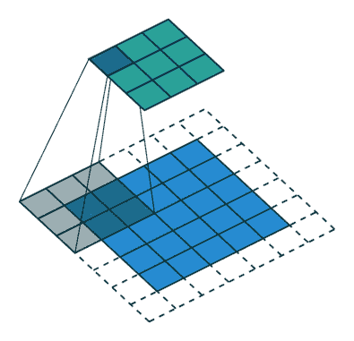

带有步幅长度 = 2 的卷积操作（[GIF](https://towardsdatascience.com/a-comprehensive-guide-to-convolutional-neural-networks-the-eli5-way-3bd2b1164a53)由 Sumit Saha 提供）。

一些卷积核可能专门用于检测边缘或角落，而其他的可能会被调整以识别图像中的更复杂对象，如猫、狗或街道标志。通过堆叠多个卷积层和池化层，CNNs 构建了输入的层次化表示，逐渐将特征从低级别抽象到高级别，就像我们的大脑处理视觉信息一样。

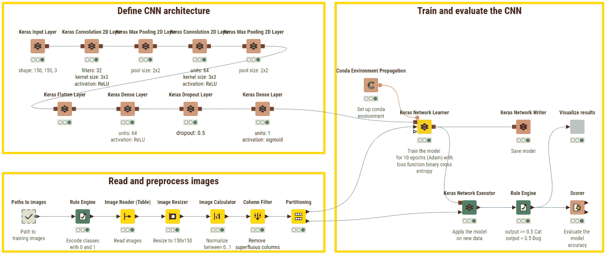

示例[KNIME 工作流程](https://hub.knime.com/-/spaces/-/latest/~RZjun0ed5Uu11SaE/)用于二进制图像分类（猫与狗）。上层分支通过一系列卷积层和最大池化层定义网络架构，以自动从图像中提取特征。然后，使用展平层将提取的特征准备为一维输入，供 FFNN 进行二进制分类。

虽然 CNNs 在特征提取方面表现出色，并且已经彻底改变了计算机视觉任务，但它们只是被动观察者，因为它们并不设计用来生成新的数据或内容。这并不是网络本身的固有限制，而是拥有强大引擎却没有燃料使得快速汽车变得无用。实际上，真实和有意义的图像和视频数据往往难以收集且成本高昂，并且往往面临版权和数据隐私的限制。这一限制促使了一个新颖范式的开发，它建立在 CNNs 的基础上，但从图像分类跃迁到创意合成：生成对抗网络（GANs）。

# GAN - 生成对抗网络

GANs 是神经网络中的一个特定家族，其主要但不是唯一的目的，是生成与给定真实数据集非常相似的合成数据。与大多数神经网络不同，GANs 的独特架构设计由两个核心模型组成：

+   **生成器**模型：这个神经网络二重奏的第一位成员是生成器模型。这个组件肩负着一个令人着迷的任务：给定随机噪声或输入向量，它努力创建与真实样本尽可能相似的人工样本。可以把它想象成一个艺术伪造者，试图创作出与名画无法区分的伪作。

+   **鉴别器**模型：扮演对立角色的是鉴别器模型。它的工作是区分生成器生成的样本和原始数据集中真实的样本。可以把它想象成一个艺术鉴赏家，试图在真正的艺术作品中识别伪作。

现在，魔法发生的地方是：GANs 进行持续的对抗性舞蹈。生成器旨在提升其艺术水平，不断微调其创作，使其更具说服力。同时，鉴别器则成为更敏锐的侦探，磨练其区分真实与虚假的能力。

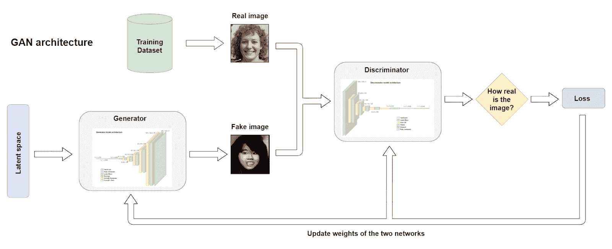

GAN 架构（图像作者提供）。

随着训练的进行，生成器和鉴别器之间的动态互动会产生令人着迷的结果。生成器努力生成足够逼真的样本，以至于连鉴别器都无法将它们与真实样本区分开来。这种竞争驱使两个组件不断提高各自的能力。

结果？生成器变得异常擅长生成看起来真实的数据，无论是图像、音乐还是文本。这种能力在各种领域中产生了显著的应用，包括图像合成、数据增强、图像到图像的翻译和图像编辑。

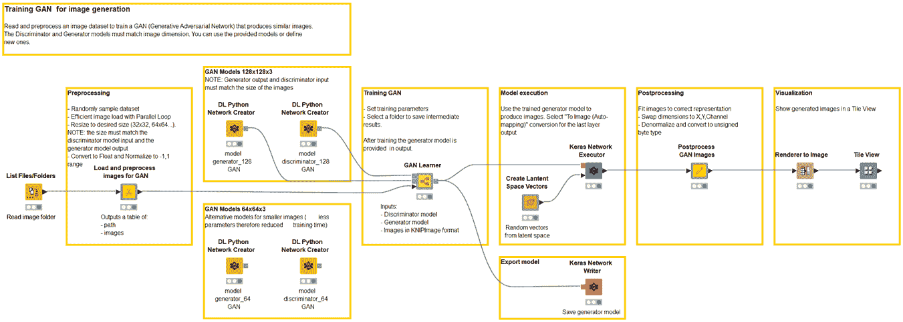

示例 [KNIME 工作流](https://hub.knime.com/-/spaces/-/latest/~L4rc__X_CMzL1ubO/) 用于生成合成图像（例如动物、人脸和辛普森角色）。

GANs 开创了现实图像和视频内容创作的先河，通过对抗生成器和判别器来实现。在图像到序列数据的创意和高级操作需求不断扩展的背景下，推出了更为复杂的自然语言理解、机器翻译和文本生成模型。这促成了 Transformers 的开发，这是一种显著的深度神经网络架构，它不仅通过有效捕捉长期语言依赖关系和语义上下文超越了以前的架构，还成为了最新 AI 驱动应用的无可争议的基础。

# Transformers

2017 年开发的 Transformers 拥有一个独特的特点，使其能够取代传统的递归层：一种自注意力机制，使它们能够建模文档中所有单词之间的复杂关系，而不管它们的位置。这使得 Transformers 在处理自然语言中的长期依赖问题时表现出色。Transformer 架构由两个主要构建块组成：

***   **编码器。** 在这里，输入序列被嵌入到向量中，然后暴露于自注意力机制中。后者计算每个令牌的注意力分数，确定其相对于其他令牌的重要性。这些分数用于创建加权和，输入到 FFNN 中生成每个令牌的上下文感知表示。多个编码器层重复这一过程，增强模型捕捉层次结构和上下文信息的能力。

+   **解码器。** 这个模块负责生成输出序列，其过程类似于编码器。它能够在每一步上正确关注和理解编码器的输出及其自身的过去令牌，通过考虑输入上下文和之前生成的输出，确保准确生成。

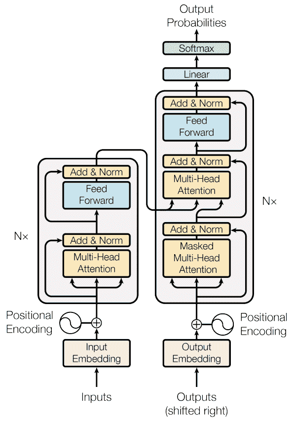

Transformer 模型架构（[图片](https://arxiv.org/abs/1706.03762)作者：Vaswani 等，2017 年）。

例如这句话：“我在过河后到达了银行”。单词“bank”可以有两种含义——金融机构或河岸。这里是 transformers 的优势所在。它们能够迅速关注单词“river”来消除“bank”的歧义，通过将“bank”与句子中的其他每个单词进行比较，并分配注意力分数。这些分数决定了每个单词对“bank”下一个表示的影响。在这种情况下，“river”获得了更高的分数，有效地澄清了意图。

要实现如此高效，Transformers 依赖于数百万个可训练参数，需要大量的文本语料库和复杂的训练策略。Transformers 使用的一个显著训练方法是 *掩码语言建模（MLM）*。在训练过程中，输入序列中的特定词元会被随机掩盖，模型的目标是准确预测这些掩盖的词元。这种策略鼓励模型掌握单词之间的上下文关系，因为它必须依赖周围的单词来做出准确的预测。这种方法由 BERT 模型推广，对于在各种 NLP 任务中取得最先进的结果起到了关键作用。

Transformers 的 MLM 替代方法是 *自回归建模*。在这种方法中，模型被训练为一次生成一个单词，同时考虑先前生成的单词。像 GPT（Generative Pre-trained Transformer）这样的自回归模型遵循这种方法，并在目标是单向预测下一个最合适的单词的任务中表现出色，例如自由文本生成、问答和文本补全。

此外，为了弥补对大量文本资源的需求，Transformers 在并行化方面表现出色，这意味着它们可以比传统的序列方法（如 RNN 或 LSTM 单元）更快地处理训练数据。这种高效的计算减少了训练时间，并导致了在自然语言处理、机器翻译等领域的突破性应用。

由 Google 于 2018 年开发的一个关键 Transformer 模型是 BERT（Bidirectional Encoder Representations from Transformers）。BERT 依赖于 MLM 训练，并引入了双向上下文的概念，意味着它在预测掩盖的词元时会考虑单词的左侧和右侧上下文。这种双向方法显著增强了模型对单词含义和上下文细微差别的理解，为自然语言理解和各种下游 NLP 任务建立了新的基准。

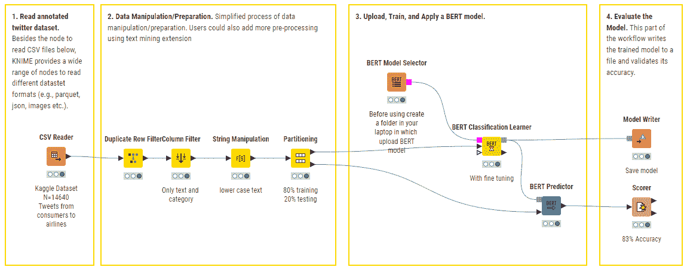

示例 [KNIME 工作流](https://hub.knime.com/-/spaces/-/latest/~3VGz0gdnmIy-DfT4/) 用于 BERT 的多类情感预测（积极、消极、中立）。进行了最小预处理，并利用了经过微调的预训练 BERT 模型。

在引入强大自注意力机制的 Transformers 之后，对应用的多样性和执行复杂自然语言任务（如文档摘要、文本编辑或代码生成）的日益增长的需求，促使了 *大型语言模型* 的发展。这些模型使用具有数十亿参数的深度神经网络，以在这些任务中表现出色，并满足数据分析行业不断变化的需求。

# LLM - 大型语言模型

大型语言模型（LLMs）是一类革命性的多用途和多模态（接受图像、音频和文本输入）深度神经网络，近年来获得了大量关注。形容词*大型*源于它们的巨大规模，因为它们包含了数十亿的可训练参数。一些最知名的例子包括 OpenAI 的 ChatGPT、谷歌的 Bard 或 Meta 的 LLaMa。

LLMs 的特点在于它们处理和生成类似人类文本的能力和灵活性。它们在自然语言理解和生成任务中表现出色，从文本完成和翻译到问答和内容总结。它们成功的关键在于对海量文本语料库的广泛训练，使它们能够捕捉语言的细微差别、上下文和语义。

这些模型采用了深度神经网络架构，拥有多个自注意力机制的层，使它们能够在给定的上下文中权衡不同词语和短语的重要性。这种动态适应性使它们在处理各种类型的输入、理解复杂语言结构以及生成基于人类定义的提示的输出方面表现得非常出色。

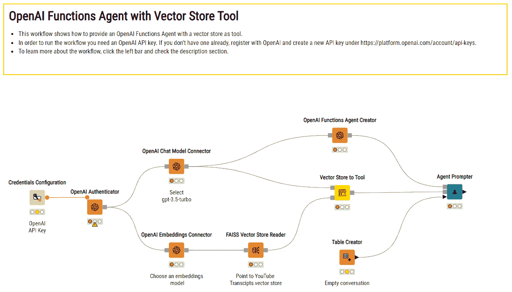

示例 [KNIME 工作流](https://hub.knime.com/-/spaces/-/latest/~s9uceqYIt_tUKJQc/) 用于创建一个依赖于 OpenAI 的 ChatGPT 和一个包含自定义文档的向量存储的 AI 助手，以回答特定领域的问题。

LLMs 为多个行业的应用铺平了道路，从医疗保健和金融到娱乐和客户服务。它们甚至激发了创意写作和讲故事的新领域。

然而，它们巨大的规模、资源密集型的训练过程以及生成内容可能存在的版权问题也引发了对伦理使用、环境影响和可访问性的担忧。最后，尽管不断增强，LLMs 可能仍存在一些严重缺陷，如“幻想”错误事实、存在偏见、易受影响或生成有害内容。

# 这是否会有终点？

神经网络的演变，从其卑微的起点到大型语言模型的兴起，引发了一个深刻的哲学问题：这段旅程会永远结束吗？

技术的发展轨迹始终以不断的进步为特征。每一个里程碑只是通向下一次创新的垫脚石。当我们努力创建能够复制人类认知和理解的机器时，我们不禁要思考是否存在一个*终极*目标，一个我们可以说“就是这样；我们已达巅峰”的点。

然而，人类的好奇心和自然世界的无限复杂性却另有启示。正如我们对宇宙的理解不断深化，开发更智能、更有能力、更具伦理的神经网络的追求可能是一个无尽的旅程。（神经网络进化过程概述，作者提供的图像）

神经网络，作为人工智能的基本构建块，已经彻底改变了我们处理信息的方式，为未来技术提供了一瞥。这些复杂的计算系统，受到人脑复杂性的启发，在从图像识别和自然语言理解到自动驾驶和医疗诊断等任务中发挥了关键作用。在探索神经网络的历史进化过程中，我们将揭示它们如何演变以塑造现代人工智能的景观。

# 一切是如何开始的？

神经网络，作为深度学习的基础组件，其概念根源于人脑中复杂的生物神经网络。这一了不起的概念始于一个基本的类比，将生物神经元与计算网络进行了类比。

这个类比围绕着大脑展开，大脑由大约 1000 亿个神经元组成。每个神经元与其他神经元保持约 7000 个突触连接，形成了一个复杂的神经网络，支撑着人类的认知过程和决策制定。

单个生物神经元通过一系列简单的电化学过程来运作。它通过树突接收来自其他神经元的信号。当这些传入信号累加到一定水平（预定阈值）时，神经元就会被激活，并沿着轴突发送电化学信号。这会影响连接到其轴突末梢的神经元。需要注意的是，神经元的反应像一个二进制开关：它要么激活，要么保持安静，没有中间状态。

生物神经元是人工神经网络的灵感来源（图像：维基百科）。

尽管人工神经网络令人印象深刻，但它们仍远未接近人脑的惊人复杂性和深奥复杂性。然而，它们在解决对传统计算机具有挑战性但对人类认知直观的问题上表现出了显著的能力。比如图像识别和基于历史数据的预测分析。

现在我们已经探讨了生物神经元功能的基础原理及其对人工神经网络的启发，接下来让我们回顾神经网络框架的进化历程，这些框架塑造了人工智能的领域。

# FFNN - 前馈神经网络

前馈神经网络，通常被称为多层感知机，是一种基础的神经网络类型，其操作深深植根于信息流动、互连层和参数优化的原则中。

在其核心，FFNNs orchestrate 信息的单向流动。所有一切都始于包含 *n* 个神经元的输入层，数据在此被初步接收。该层作为网络的入口点，充当需要处理的输入特征的接收器。从那里，数据开始经过网络的隐藏层进行转化的旅程。

FFNNs 的一个重要方面是它们的连接结构，这意味着每个层中的神经元都与该层中的每个神经元紧密相连。这种互连性使网络能够进行计算并捕捉数据中的关系。这就像一个通信网络，每个节点在信息处理过程中都扮演着角色。

当数据通过隐藏层时，它经历了一系列计算。隐藏层中的每个神经元接收来自前一层所有神经元的输入，对这些输入应用加权和，添加偏置项，然后通过激活函数（通常是 ReLU、Sigmoid 或 tanH）传递结果。这些数学操作使网络能够从输入中提取相关模式，并捕捉数据中的复杂、非线性关系。这是 FFNNs 相比于更浅层的 ML 模型真正出色的地方。

完全连接的前馈神经网络的架构（图片由作者提供）。

然而，这还不是全部。FFNNs 的真正力量在于它们的适应能力。在训练过程中，网络调整其权重，以最小化预测值与实际目标值之间的差异。这个迭代过程，通常基于像梯度下降这样的优化算法，被称为 *反向传播*。反向传播使 FFNNs 能够真正从数据中学习，并提高其预测或分类的准确性。

[KNIME 工作流示例](https://hub.knime.com/-/spaces/-/latest/~MTi8mL9fZePO9A-S/)展示了用于认证考试（二元分类：通过与失败）的 FFNN。在上部分支中，我们可以看到网络架构，它由一个输入层、一个带有 tanH 激活函数的全连接隐藏层和一个使用 Sigmoid 激活函数的输出层组成（图片由作者提供）。

尽管强大且多功能，FFNNs 显示出一些相关的限制。例如，它们无法捕捉数据中的顺序性和时间/句法依赖关系——这对语言处理和时间序列分析任务至关重要。克服这些限制的需求促使了一种新型神经网络架构的演变。这一过渡为递归神经网络（RNNs）铺平了道路，后者引入了反馈回路的概念，以更好地处理序列数据。

# RNN 和 LSTM - 循环神经网络和长短期记忆

从核心来看，RNN 与 FFNN 存在一些相似之处。它们也由互联节点的层组成，处理数据以进行预测或分类。然而，它们的关键区别在于其处理序列数据和捕获时间依赖性的能力。

在 FFNN 中，信息沿着从输入层到输出层的单一路径流动。这适用于数据顺序不太重要的任务。然而，在处理时间序列数据、语言或语音等序列时，保持上下文和理解数据的顺序至关重要。这是 RNN 发挥作用的地方。

RNN 引入了反馈循环的概念。这些循环作为一种“记忆”，允许网络保持一个隐藏状态，该状态捕获有关先前输入的信息，并影响当前输入和输出。虽然传统神经网络假设输入和输出彼此独立，但递归神经网络的输出依赖于序列中的前一个元素。这种递归连接机制使 RNN 特别适合处理序列，通过“记住”过去的信息。

循环网络的另一个区别特征是它们在每一层网络中共享相同的权重参数，并通过时间反向传播（BPTT）算法调整这些权重，这与传统的反向传播略有不同，因为它专门针对序列数据。

RNN 的展开表示，其中每个输入都结合了来自先前输入的上下文信息。颜色表示上下文信息的传播（图像作者提供）。

然而，传统的 RNN 存在其局限性。虽然理论上它们应该能够捕捉长期依赖关系，但在实际中，它们难以有效做到这一点，并且可能会受到梯度消失问题的影响，这妨碍了它们在许多时间步上学习和记忆信息的能力。

长短期记忆（LSTM）单元在这里发挥作用。它们专门设计用于处理这些问题，通过在其结构中引入三个门：遗忘门、输入门和输出门。

+   **遗忘门**：这个门决定了应该丢弃或遗忘时间步中的哪些信息。通过检查单元状态和当前输入，它确定哪些信息对当前的预测是无关的。

+   **输入门**：这个门负责将信息纳入单元状态。它考虑了输入和先前的单元状态，以决定应该添加哪些新信息以增强其状态。

+   **输出门**：这个门决定了 LSTM 单元将生成什么输出。它考虑了当前输入和更新后的单元状态，以生成可以用于预测或传递到时间步的输出。

长短期记忆单元的可视化表示（[图片](https://colah.github.io/posts/2015-08-Understanding-LSTMs/)由 Christopher Olah 提供）。

[KNIME 工作流](https://hub.knime.com/-/spaces/-/latest/~uyVWG2YbtsOhdp5v/)的示例，使用带有 LSTM 单元的 RNNs 进行多类情感预测（正面、负面、中立）。上支定义了网络架构，使用输入层处理不同长度的字符串，嵌入层，具有多个单元的 LSTM 层，以及具有 Softmax 激活函数的全连接输出层以返回预测结果。

总结来说，RNNs，尤其是 LSTM 单元，专门用于序列数据，使它们能够保持记忆并捕捉时间依赖关系，这对于自然语言处理、语音识别和时间序列预测等任务至关重要。

当我们从捕捉序列依赖关系的 RNNs 转变时，演变继续向卷积神经网络（CNNs）发展。与 RNNs 不同，CNNs 在从结构化网格数据中提取空间特征方面表现出色，使其成为图像和模式识别任务的理想选择。这种转变反映了神经网络在不同数据类型和结构中的多样应用。

# CNN - 卷积神经网络

CNNs 是一种特殊的神经网络，特别适合处理图像数据，如 2D 图像或甚至 3D 视频数据。它们的架构依赖于具有至少一个卷积层的多层前馈神经网络。

使 CNNs 脱颖而出的是其网络连接性和特征提取方法，这使得它们能够自动识别数据中的相关模式。与传统的 FFNNs 不同，后者将一层中的每个神经元与下一层中的每个神经元连接，CNNs 使用一种称为*内核*或*滤波器*的滑动窗口。这个滑动窗口扫描输入数据，对于空间关系重要的任务（如图像中的物体识别或视频中的运动跟踪）特别有效。当内核在图像上移动时，会在内核和像素值之间执行卷积操作（从严格的数学角度看，这个操作是交叉相关），并应用通常是 ReLU 的非线性激活函数。如果特征在图像块中，则会产生高值，否则产生小值。

与内核一起，*步幅*（即滑动内核的像素数）和*扩张率*（即每个内核单元之间的间隔）等超参数的添加和微调，使网络能够关注特定特征，识别特定区域的模式和细节，而不需要一次性考虑整个输入。

具有步幅长度=2 的卷积操作（[GIF](https://towardsdatascience.com/a-comprehensive-guide-to-convolutional-neural-networks-the-eli5-way-3bd2b1164a53)由 Sumit Saha 提供）。

有些卷积核可能专门用于检测边缘或角落，而其他卷积核则可能被调整用于识别图像中的更复杂对象，比如猫、狗或街道标志。通过将几个卷积层和池化层堆叠在一起，卷积神经网络（CNN）构建了输入数据的层次表示，逐渐从低层次特征抽象到高层次特征，就像我们的脑袋处理视觉信息一样。

示例 [KNIME 工作流](https://hub.knime.com/-/spaces/-/latest/~RZjun0ed5Uu11SaE/) 用于二分类图像分类（猫与狗）。上部分支通过一系列卷积层和最大池化层定义网络架构，用于从图像中自动提取特征。然后，使用一个展平层将提取的特征准备为 FFNN 的单维输入，以执行二分类任务。

尽管卷积神经网络（CNN）在特征提取方面表现出色，并且在计算机视觉任务中取得了突破，但它们作为被动观察者，因为它们并不被设计用来生成新的数据或内容。这并不是网络本身的固有限制，但拥有强大的引擎却没有燃料会使一辆快车变得无用。确实，真实而有意义的图像和视频数据通常很难且昂贵地收集，并且往往面临版权和数据隐私限制。这种限制促使了一种新范式的出现，它建立在 CNN 的基础上，但标志着从图像分类到创造性合成的飞跃：生成对抗网络（GANs）。

# GAN - 生成对抗网络

GANs 是一类特殊的神经网络，其主要但不是唯一的目的是生成与给定真实数据集非常相似的合成数据。与大多数神经网络不同，GANs 的巧妙架构设计包括两个核心模型：

+   **生成器**模型：在这个神经网络二重奏中，第一个角色是生成器模型。这个组件的任务是执行一个迷人的使命：给定随机噪声或输入向量，它努力创建尽可能接近真实样本的人工样本。可以把它想象成一个艺术伪造者，试图制作出与杰作无法区分的画作。

+   **判别器**模型：扮演对抗角色的是判别器模型。它的工作是区分由生成器生成的样本和来自原始数据集的真实样本。可以把它想象成一个艺术鉴赏家，试图从真实的艺术品中识别伪造品。

现在，魔法发生的地方在于：生成对抗网络（GAN）进行着持续的对抗性舞蹈。生成器旨在提升其艺术性，不断微调其创作，以变得更加可信。与此同时，判别器则变得更加敏锐，磨练其分辨真假样本的能力。

GAN 架构（作者提供的图像）。

随着训练的进行，生成器和判别器之间的这种动态互动会产生一个迷人的结果。生成器力求生成如此真实的样本，以至于连判别器也无法将其与真实样本区分开。这种竞争推动了两个组件不断完善自己的能力。

结果呢？生成器变得非常擅长生成看起来真实的数据，无论是图像、音乐还是文本。这一能力在图像合成、数据增强、图像到图像翻译和图像编辑等各个领域产生了显著的应用。

示例[KNIME 工作流](https://hub.knime.com/-/spaces/-/latest/~L4rc__X_CMzL1ubO/)用于生成合成图像（即动物、人脸和辛普森角色）的 GANs。

GANs 通过将生成器与判别器对抗，开创了逼真的图像和视频内容创作。随着对创造力和高级操作的需求从图像扩展到序列数据，出现了更复杂的自然语言理解、机器翻译和文本生成模型。这催生了 Transformers 的发展，这是一种卓越的深度神经网络架构，不仅通过有效捕捉长程语言依赖关系和语义上下文超越了之前的架构，而且成为了最新 AI 驱动应用的无可争议的基础。

# Transformers

Transformers 于 2017 年开发，拥有一个独特的特点，使其可以替代传统的递归层：自注意力机制，这使它们能够建模文档中所有单词之间的复杂关系，而不受它们位置的影响。这使得 Transformers 在处理自然语言中的长程依赖关系方面表现出色。Transformer 架构由两个主要构建模块组成：

***   **编码器。** 在这里，输入序列被嵌入到向量中，然后暴露给自注意力机制。后者为每个标记计算注意力分数，以确定其相对于其他标记的重要性。这些分数用于创建加权和，随后输入到前馈神经网络（FFNN）中，以生成每个标记的上下文感知表示。多个编码器层重复这一过程，从而增强模型捕捉层次和上下文信息的能力。

+   **解码器。** 这个模块负责生成输出序列，过程类似于编码器。它能够在每一步中适当关注并理解编码器的输出及其自身的历史标记，通过同时考虑输入上下文和先前生成的输出来确保准确生成。

Transformer 模型架构（[图片](https://arxiv.org/abs/1706.03762) 作者：Vaswani 等，2017 年）。

例如考虑这个句子：“我在过河后到达了银行”。单词“bank”可以有两个意思——金融机构或河岸。变换器在这里发挥了作用。它们可以迅速关注单词“river”，通过将“bank”与句子中的每个其他单词进行比较，并分配注意力得分，从而消除歧义。这些得分决定了每个单词对“bank”下一个表示的影响。在这种情况下，“river”获得了更高的得分，有效地澄清了意图的意义。

为了做到这一点，Transformers 依赖于数百万的可训练参数，需要大量的文本语料库和复杂的训练策略。与 Transformers 一起使用的一个显著训练方法是 *掩码语言建模 (MLM)*。在训练期间，输入序列中的特定标记会被随机掩盖，模型的目标是准确预测这些掩盖的标记。这种策略鼓励模型掌握单词之间的上下文关系，因为它必须依赖周围的单词来进行准确的预测。这种方法由 BERT 模型推广，在各种 NLP 任务中取得了最先进的结果。

对于 Transformers 的替代方法是 *自回归建模*。在这种方法中，模型被训练为一次生成一个单词，同时依据先前生成的单词进行条件化。像 GPT（生成式预训练变换器）这样的自回归模型遵循这种方法，在预测单向的下一个最合适的单词时表现出色，例如自由文本生成、问答和文本补全。

此外，为了弥补对大量文本资源的需求，Transformers 在并行化方面表现出色，这意味着它们可以比传统的序列化方法（如 RNNs 或 LSTM 单元）更快地处理数据，从而减少训练时间，并在自然语言处理、机器翻译等领域取得了突破性的应用。

由谷歌在 2018 年开发的一个具有重大影响的关键 Transformer 模型是 BERT（双向编码器表示来自 Transformers）。BERT 依赖于 MLM 训练，并引入了双向上下文的概念，这意味着在预测掩盖的标记时，它考虑单词的左右上下文。这种双向方法显著增强了模型对单词含义和上下文细微差别的理解，为自然语言理解和广泛的下游 NLP 任务建立了新的基准。

示例 [KNIME 工作流](https://hub.knime.com/-/spaces/-/latest/~3VGz0gdnmIy-DfT4/) 用于多类别情感预测（正面、负面、中性）。执行了最小的预处理，并利用了经过微调的预训练 BERT 模型。

在引入强大自注意力机制的 Transformers 之后，对应用的多样性和执行复杂自然语言任务（如文档总结、文本编辑或代码生成）的需求不断增长，这促使了*大型语言模型*的开发。这些模型使用具有数十亿参数的深度神经网络，在这些任务中表现出色，并满足数据分析行业不断变化的需求。

# LLM - 大型语言模型

大型语言模型（LLMs）是一类革命性的多用途和多模态（接受图像、音频和文本输入）深度神经网络，近年来获得了广泛关注。形容词*large*源于它们的庞大规模，因为它们包含数十亿个可训练参数。一些最著名的例子包括 OpenAI 的 ChatGTP、Google 的 Bard 或 Meta 的 LLaMa。

LLMs 的独特之处在于它们无与伦比的处理和生成类人文本的能力。它们在自然语言理解和生成任务中表现出色，范围涵盖从文本补全和翻译到问答和内容总结。它们成功的关键在于对大量文本语料的广泛训练，使它们能够捕捉语言细微差别、上下文和语义的丰富理解。

这些模型采用深度神经架构，具有多层自注意力机制，使它们能够权衡给定上下文中不同单词和短语的重要性。这种动态适应性使它们在处理各种类型的输入、理解复杂语言结构以及根据人类定义的提示生成输出方面表现得特别高效。

示例 [KNIME 工作流](https://hub.knime.com/-/spaces/-/latest/~s9uceqYIt_tUKJQc/) 通过依赖 OpenAI 的 ChatGPT 和包含自定义文档的向量存储来创建 AI 助手，以回答特定领域的问题。

LLMs 为各种行业带来了众多应用，从医疗保健和金融到娱乐和客户服务。它们甚至在创意写作和讲故事方面开辟了新的领域。

然而，它们巨大的规模、资源密集型的训练过程以及生成内容可能涉及的版权问题也引发了对伦理使用、环境影响和可访问性的担忧。最后，尽管不断增强，LLMs 可能仍存在一些严重缺陷，例如“幻觉”错误事实、偏见、易受影响或被迫生成有害内容。

# 是否有终点？

从神经网络的谦逊起点到大型语言模型的兴起，这一演变提出了一个深刻的哲学问题：这一旅程是否会有尽头？

技术的发展历程始终以不懈的进步为特征。每一个里程碑只是通向下一个创新的垫脚石。当我们努力创造能够复制人类认知和理解的机器时，很容易产生这样的疑问：是否存在一个*终极目标*，一个我们可以说“这就是它；我们已经达到了巅峰”的点。

然而，人类好奇心的本质和自然界的无限复杂性表明情况并非如此。正如我们对宇宙的理解不断加深，开发更智能、更有能力、更具伦理的神经网络的探索也许是一次无尽的旅程。

**[Anil](https://www.linkedin.com/in/anil-oezer/?locale=en_US)** 是 KNIME 的数据科学传播者。

### 更多相关话题

+   [LLMs 的历史与未来](https://www.kdnuggets.com/history-and-future-of-llms)

+   [在使用神经网络之前尝试的 10 个简单方法](https://www.kdnuggets.com/2021/12/10-simple-things-try-neural-networks.html)

+   [使用 PyTorch 解释神经网络](https://www.kdnuggets.com/2022/01/interpretable-neural-networks-pytorch.html)

+   [深度神经网络不会引导我们走向 AGI](https://www.kdnuggets.com/2021/12/deep-neural-networks-not-toward-agi.html)

+   [利用最先进的深度学习进行可解释的预测和现在预测](https://www.kdnuggets.com/2021/12/sota-explainable-forecasting-and-nowcasting.html)

+   [使用卷积神经网络（CNNs）进行图像分类](https://www.kdnuggets.com/2022/05/image-classification-convolutional-neural-networks-cnns.html)****
