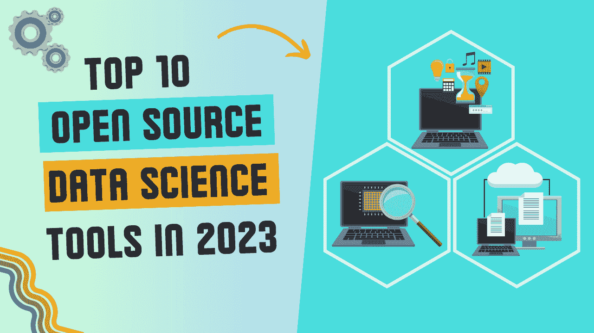

# 2023 年十大开源数据科学工具的比较概述

> 原文：[`www.kdnuggets.com/a-comparative-overview-of-the-top-10-open-source-data-science-tools-in-2023`](https://www.kdnuggets.com/a-comparative-overview-of-the-top-10-open-source-data-science-tools-in-2023)

图片由作者提供

数据科学是每个行业都在关注的流行话题。作为数据科学家，您的主要工作是从数据中提取有意义的见解。但问题在于，随着数据以指数级增长，挑战比以往任何时候都大。您会经常感到在数字大海捞针。这时，数据科学工具作为我们的救星出现。它们帮助您挖掘、清理、组织和可视化数据，以提取有意义的见解。现在，让我们解决真正的问题。在众多数据科学工具中，您如何找到合适的工具？这个问题的答案在于本文。通过个人经验、宝贵的社区反馈以及数据驱动世界的脉搏，我整理了一份强有力的清单。我只关注开源数据科学工具，因为它们的成本效益、灵活性和透明度。

* * *

## 我们的前三课程推荐

 1\. [Google 网络安全证书](https://www.kdnuggets.com/google-cybersecurity) - 快速进入网络安全职业轨道。

 2\. [Google 数据分析专业证书](https://www.kdnuggets.com/google-data-analytics) - 提升您的数据分析技能

 3\. [Google IT 支持专业证书](https://www.kdnuggets.com/google-itsupport) - 支持您的 IT 组织

* * *

不再耽搁，让我们探索今年您必须拥有的十大开源数据科学工具：

# 1\. KNIME：简约与强大的桥梁

[KNIME](https://www.knime.com/) 是一个免费且开源的工具，能为数据科学新手和经验丰富的专业人士提供便利的数据分析、可视化和部署。它是一个将数据转化为可操作见解的画布，几乎不需要编程。它是简单与强大的灯塔。您应该考虑使用 Knime，原因如下：

+   **基于 GUI 的数据预处理和管道化**使各种技术背景的用户能够轻松执行复杂任务

+   允许**无缝集成**到您当前的工作流程和系统中

+   KNIME 的模块化方法使用户能够**根据需求自定义工作流程**

# 2\. Weka：传统与现代的结合

[Weka](https://www.weka.io/)是一个经典的开源工具，允许数据科学家预处理数据、构建和测试机器学习模型，并使用 GUI 界面可视化数据。尽管它已经相当古老，但由于其适应模型挑战的能力，它在 2023 年仍然相关。它支持多种语言，包括 R、Python、Spark、scikit-learn 等。它非常方便和可靠。以下是一些 Weka 的突出特性：

+   它不仅适合数据科学从业者，而且是教授机器学习概念的极好平台，从而**提供教育价值**。

+   通过减少数据管道空闲时间，从而减少碳排放，帮助你**轻松实现可持续性**。

+   提供**令人惊叹的性能**，支持高 I/O、低延迟、小文件和混合工作负载，无需调优。

# 3\. Apache Spark：点燃数据处理

[Apache Spark](https://spark.apache.org/)是一个著名的数据科学工具，提供实时数据分析。它是最广泛使用的可扩展计算引擎。我提到它是因为它闪电般的数据处理能力。你可以轻松地连接到不同的数据源，而不必担心数据存放的位置。虽然它很出色，但并非没有缺点。由于其速度，它需要相当大的内存。以下是你应该选择 Spark 的原因：

+   它**易于使用**，提供了一个简单的编程模型，使你能够使用你已经熟悉的语言创建应用程序。

+   你可以获得一个**统一处理引擎**来处理你的工作负载。

+   它是**一站式服务**，用于批处理、实时更新和机器学习。

# 4\. RapidMiner：完整的数据科学生命周期

[RapidMiner](https://rapidminer.com/)因其全面性而脱颖而出。它是你在整个数据科学生命周期中的真正伙伴。从数据建模和分析到数据部署和监控，这个工具涵盖了所有内容。它提供了可视化工作流程设计，省去了复杂编码的需要。这个工具还可以用来从零开始构建自定义数据科学工作流程和算法。RapidMiner 的广泛数据准备功能使你能够提供最精炼的数据版本用于建模。以下是一些关键特性：

+   它通过提供一个**可视化和直观的界面**来简化数据科学过程。

+   RapidMiner 的连接器使**数据集成变得轻而易举**，无论数据的大小或格式。

# 5\. Neo4j Graph Data Science：揭示隐藏的连接

[Neo4j 图数据科学](https://neo4j.com/product/graph-data-science/) 是一种分析数据之间复杂关系以发现隐藏连接的解决方案。它超越了行和列，识别数据点如何相互作用。它包括预配置的图算法和自动化流程，专门为数据科学家设计，帮助他们快速展示图分析的价值。它在社交网络分析、推荐系统以及其他需要关注连接的场景中特别有用。以下是它提供的一些额外好处：

+   **改进的预测**，拥有超过 65 种图算法的丰富目录。

+   允许**无缝的数据生态系统集成**，使用 30+ 个连接器和扩展。

+   它强大的工具允许**快速部署**，使你能够迅速将工作流程发布到生产环境中。

# 6\. ggplot2: 打造视觉故事

[ggplot2](https://ggplot2.tidyverse.org/) 是一个令人惊叹的数据可视化 R 包。它将你的数据转化为视觉杰作。它建立在图形语法的基础上，提供了一个定制的游乐场。即使是默认的颜色和美学也更为出色。ggplot2 采用分层方法为你的视觉效果添加细节。虽然它可以将你的数据转化为一个等待讲述的美丽故事，但重要的是要认识到，处理复杂图形可能会导致繁琐的语法。以下是你应该考虑使用它的原因：

+   能够**将图形保存为对象**，允许你创建不同版本的图形，而无需重复大量代码。

+   与其在多个平台之间来回切换，ggplot2 提供了一个**统一的解决方案**。

+   大量有用的资源和**详尽的文档**，帮助你入门。

# 7\. D3.js: 互动数据杰作

[D3](https://d3js.org/) 是数据驱动文档（Data-Driven Documents）的简称。它是一个强大的开源 JavaScript 库，允许你通过 DOM 操作技术创建令人惊叹的视觉效果。它创建的交互式可视化会响应数据的变化。然而，对于那些初次接触 JavaScript 的人来说，它的学习曲线较陡。尽管其复杂性可能是一个挑战，但它所提供的回报是非常宝贵的。以下是一些列出的好处：

+   它提供**定制性**，通过丰富的模块和 API。

+   它是**轻量级的**，不会影响你的网页应用性能。

+   它与当前的网络标准兼容良好，并且可以**轻松集成**其他库。

# 8\. Metabase: 简化数据探索

[Metabase](https://www.metabase.com/) 是一个拖放式的数据探索工具，技术用户和非技术用户都可以使用。它简化了数据分析和可视化的过程。其直观的界面使您能够创建交互式仪表板、报告和可视化。它在企业中越来越受欢迎。它还提供了以下其他好处：

+   用**普通语言查询**替代复杂的 SQL 查询。

+   **支持协作**，允许用户与他人分享他们的见解和发现。

+   **支持超过 20 种数据源，** 使用户能够连接到数据库、电子表格和 API。

# 9\. Great Expectations: 确保数据质量

[Great Expectations](https://greatexpectations.io/) 是一个数据质量工具，使您能够对数据进行检查并有效捕捉任何违规行为。顾名思义，您为数据定义一些期望或规则，然后它会根据这些期望监控数据。这使得数据科学家对数据有更多的信心。它还提供数据剖析工具来加速数据发现。Great Expectations 的关键优势如下：

+   **生成详细的文档**，对技术用户和非技术用户都非常有用。

+   **与不同数据管道和工作流程的无缝集成**。

+   允许**自动化测试**，以便在过程中及早发现任何问题或偏差。

# 10\. PostHog: 提升产品分析

[PostHog](https://posthog.com/) 是一个开源的产品分析工具，使企业能够跟踪用户行为以提升产品体验。它使数据科学家和工程师能更快地获取数据，消除了编写 SQL 查询的需求。它是一个全面的产品分析套件，具有仪表板、趋势分析、漏斗、会话录制等功能。以下是 PostHog 的关键方面：

+   通过其**A/B 测试功能**，为数据科学家提供了一个实验平台。

+   允许**与数据仓库的无缝集成**，以便导入和导出数据。

+   提供对用户与产品交互的**深入理解**，通过捕获会话重播、控制台日志和网络监控。

# 总结

我想提到的一点是，随着我们在数据科学领域的进步，这些工具不仅仅是选择，它们已经成为指导您做出明智决策的催化剂。因此，请不要犹豫，深入了解这些工具并尽可能多地进行实验。最后，我很好奇，您有没有遇到或使用过任何您想添加到此列表中的工具？请随时在下面的评论中分享您的想法和建议。

**[Kanwal Mehreen](https://www.linkedin.com/in/kanwal-mehreen1)** 是一名有志的软件开发人员，对数据科学和人工智能在医学中的应用有浓厚的兴趣。Kanwal 被选为 2022 年亚太地区 Google Generation Scholar。Kanwal 喜欢通过撰写有关热门话题的文章来分享技术知识，并且热衷于提升女性在科技行业中的代表性。

### 更多相关内容

+   [闭源与开源图像注释](https://www.kdnuggets.com/closed-source-vs-open-source-image-annotation)

+   [开源工具在加速数据科学进展中的作用](https://www.kdnuggets.com/2023/05/role-open-source-tools-accelerating-data-science-progress.html)

+   [使用开源工具生成合成时间序列数据](https://www.kdnuggets.com/2022/06/generate-synthetic-timeseries-data-opensource-tools.html)

+   [5 款最佳端到端开源 MLOps 工具](https://www.kdnuggets.com/5-best-end-to-end-open-source-mlops-tools)

+   [OLAP 与 OLTP：数据处理系统的比较分析](https://www.kdnuggets.com/2023/08/olap-oltp-comparative-analysis-data-processing-systems.html)

+   [Pandas 与 Polars：Python 数据框架库的比较分析](https://www.kdnuggets.com/pandas-vs-polars-a-comparative-analysis-of-python-dataframe-libraries)
