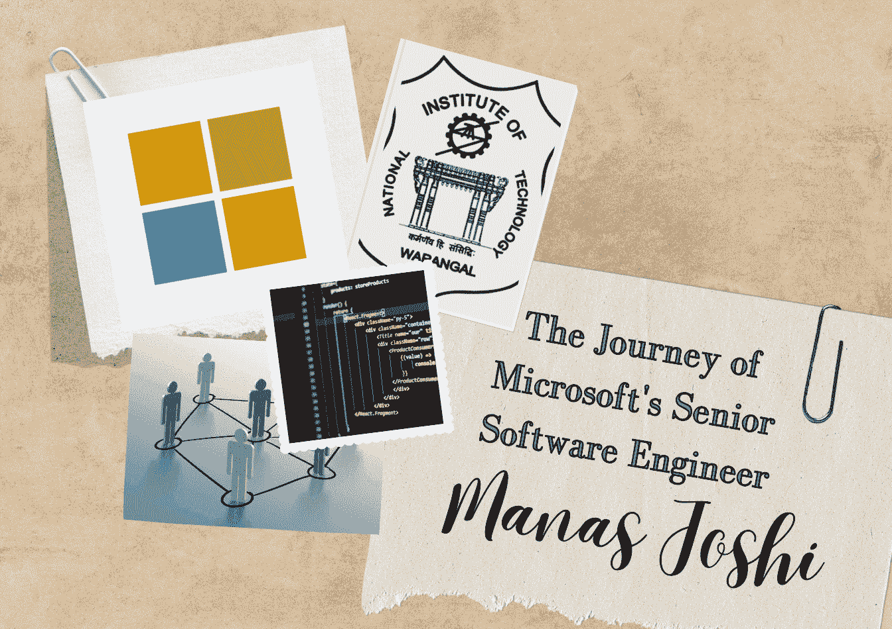

# 微软工程师的 AI 创新与领导力指南

> 原文：[`www.kdnuggets.com/a-microsoft-engineer-guide-to-ai-innovation-and-leadership`](https://www.kdnuggets.com/a-microsoft-engineer-guide-to-ai-innovation-and-leadership)

作者提供的图片

与高级数据专业人士进行一对一对话可能会很困难，特别是当你刚刚起步时。本文风格的采访旨在更好地理解高级数据专业人士的经历和建议，以便为您提供自我反思数据世界中旅程的资源。

* * *

## 我们的前三大课程推荐

 1\. [谷歌网络安全证书](https://www.kdnuggets.com/google-cybersecurity) - 快速进入网络安全职业轨道

 2\. [谷歌数据分析专业证书](https://www.kdnuggets.com/google-data-analytics) - 提升您的数据分析技能

 3\. [谷歌 IT 支持专业证书](https://www.kdnuggets.com/google-itsupport) - 支持您的组织进行 IT 管理

* * *

让我们开始吧……

# 你是如何成为微软的高级软件工程师的？

我对 AI 和软件工程的兴趣始于童年，那时我对编程有浓厚的兴趣。这种热情促使我在 [NIT Warangal](https://www.nitw.ac.in/) 追求计算机科学与工程的本科学位，并于 2015 年毕业。之后，我通过校园招聘加入了 [微软](http://www.microsoft.com)，并最终加入了搜索与 AI 组织中的 Bing Maps 团队。

在我与 Bing Maps 合作期间，我参与了多个旨在改善服务的项目。我最显著的贡献是领导开发了一种新的机器学习算法，以增强地图上的标签密度检测。我撰写了关于这一新技术的研究论文，该论文获得了多个奖项，并发表在《微软应用研究杂志》上。

在地图项目之后，我成为 Bing Shopping 部门的创始成员。在那里，我领导了多个功能的推出，并结合产品广告，为提升 Bing 的收入做出了重要贡献。我喜欢创新和解决日常问题。在我的职业生涯中，我赢得了许多黑客马拉松比赛，最近的一次是创建了一个旨在简化在线购物的 AI 聊天机器人。目前，我回到 Bing Maps，致力于改进和扩展我们的地图服务。

我职业成长的关键在于不断追求领导充满未知的项目和解决复杂问题的决心。

# 数据专业人士如何转型进入 AI？

我认为从数据科学或分析转向 AI 通常比人们意识到的要顺利。这两个领域都要求具备扎实的数学和编程基础。但是，如果你是一位希望转型的数据专业人士，你需要深入了解机器学习算法和神经网络。

# 需要什么样的教育背景？

职业人士通常会问的第一个问题是进入 AI 领域的教育要求是什么。你需要博士学位，还是学士或硕士学位就足够了？

答案取决于职位和公司。虽然博士学位对研究职位尤其有益，但并不是严格要求。计算机科学、数学或相关领域的学士或硕士学位通常也足够。

重要的是对 AI 和机器学习的原理有深入理解，这可以通过专业课程和自学获得。

# 认证有用吗？

认证可以帮助展示你对 AI 的兴趣和基础知识，尤其是在从其他领域转型时。但它们应该补充你的教育和经验，而不是替代它们。值得注意的是，认证不是通行证。

这些课程在补充实际经验和坚实的基础教育方面效果最佳。雇主通常寻找实际操作经验和解决问题的能力，这些有时可以在认证项目之外获得。

# 是否有推荐的路径或课程？

跳过基础知识是不明智的。请从线性代数、微积分和统计学的基础课程开始。

从这里开始，我建议深入学习机器学习，可以通过[Coursera 的 Andrew Ng 机器学习课程](https://www.coursera.org/collections/machine-learning)进行学习。[EdX](https://www.edx.org/)和[Udacity](https://www.udacity.com/)也提供了如人工智能 MicroMasters 和 AI 纳米学位等课程。

然后，探索与你兴趣相关的专业课程或项目，无论是自然语言处理、计算机视觉还是强化学习。

# 必学的技术和工具有哪些？

尽管 Python 仍然是这两个领域的首选语言，但对于 AI，你还需要接触像[TensorFlow](https://www.tensorflow.org/)和[PyTorch](https://pytorch.org/)这样的专业库。它们提供了设计、训练和验证模型的基础模块。[Jupyter Notebooks](https://jupyter.org/)对于原型设计和与同事共享模型也至关重要。

除了编程语言和库外，了解云端 AI 服务如 Azure AI 或 AWS SageMaker，可以让你在众人中脱颖而出。

# 如何获得实际经验？

理论知识很重要，但你也需要实际操作经验。

一种有效的方法是参与个人项目。将这些项目定制为解决你感兴趣的问题或填补当前技术的空白——这将使学习过程更愉快，结果更具影响力。

此外，参与开源项目不仅可以磨练你的技能，还能让你在社区中引起关注。另一个途径是参加像 Kaggle 这样的竞赛，这些竞赛挑战你将技能应用于新颖问题，并从全球社区中学习。

实习是宝贵的，提供了指导和在工业环境中的实践经验。即使是无薪的，获得的实践知识也可以成为重要的跳板。实践经验不仅仅是编码——还包括理解 AI 如何有效地部署以解决实际问题。

因此，通过项目工作、合作和竞赛，你可以建立一个展示你提供具有实际影响的 AI 解决方案能力的作品集。

# 网络建设的角色是什么？

网络建设至关重要。参加 AI 见面会、网络研讨会和会议。在社交媒体上关注该领域的思想领袖。参与讨论，寻求指导，不要害怕提问。关系网能打开那些可能会保持关闭的门。现实世界中的问题提供了最好的学习体验。

# 什么帮助了你？你会做出什么不同的决定？

推动我前进的是好奇心与探索未知的驱动力，这引导了我在微软的项目领导工作。

如果我能重温过去，我会更加重视网络建设。在行业内建立关系可以开启合作机会和获得在像 AI 这样的动态领域中非常宝贵的见解。

我还会分配更多时间进行个人项目，以便在没有限制的情况下自由创新，从而更全面地探索 AI 的可能性，并可能对该领域做出更多突破性的贡献。

# 总结

[Manas Joshi](https://www.linkedin.com/in/majos/) 是微软的高级软件工程师，曾在微软必应生态系统中领导多个项目，专长于 AI、自然语言处理和机器学习。本文希望你能了解 Manas 的经历，吸取他的建议，并更好地理解数据专业人士进入不断发展的 AI 领域所需的技能。

****[Nisha Arya](https://www.linkedin.com/in/nisha-arya-ahmed/)**** 是一名数据科学家、自由技术作家，以及 KDnuggets 的编辑和社区经理。她特别关注提供数据科学职业建议、教程和理论基础知识。Nisha 涵盖了广泛的主题，并希望探索人工智能如何有利于人类生命的延续。作为一个热衷于学习的人，Nisha 寻求扩展她的技术知识和写作技能，同时帮助指导他人。

### 了解更多相关内容

+   [模型很少被部署：机器学习领域的普遍失败…](https://www.kdnuggets.com/2022/01/models-rarely-deployed-industrywide-failure-machine-learning-leadership.html)

+   [庆祝科技行业中的女性领导角色](https://www.kdnuggets.com/2022/07/celebrating-women-leadership-roles-tech-industry.html)

+   [认识 Gorilla：加州大学伯克利分校和微软的 API 增强型 LLM…](https://www.kdnuggets.com/2023/06/meet-gorilla-uc-berkeley-microsoft-apiaugmented-llm-outperforms-gpt4-chatgpt-claude.html)

+   [学习数据科学和商业分析以推动创新和增长](https://www.kdnuggets.com/2023/08/learn-data-science-business-analytics-drive-innovation-growth.html)

+   [从工程师到机器学习工程师：使用声明式机器学习](https://www.kdnuggets.com/2023/05/predibase-go-engineer-ml-engineer-declarative-ml.html)

+   [使用 Python 自动化 Microsoft Excel 和 Word](https://www.kdnuggets.com/2021/08/automate-microsoft-excel-word-python.html)
