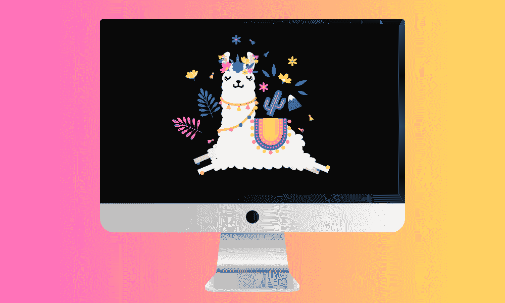
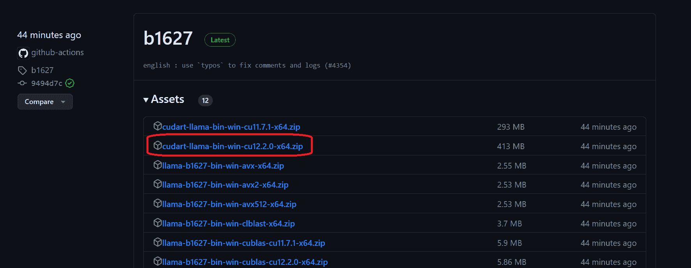
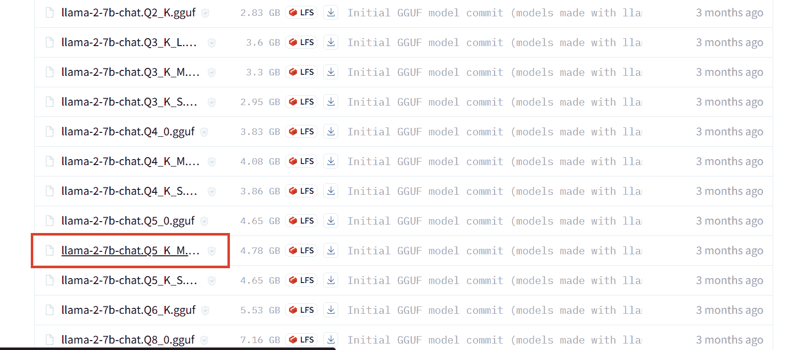
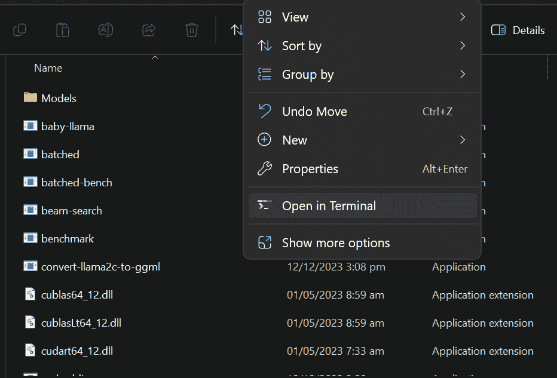
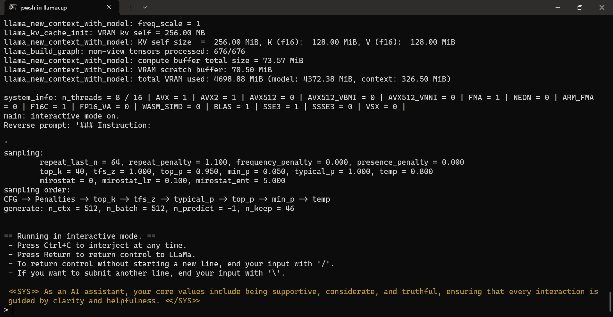
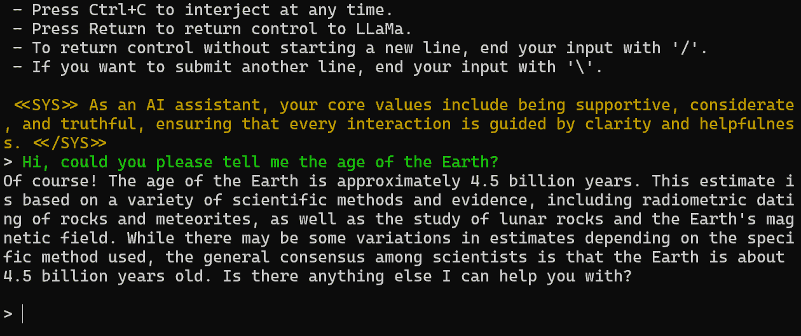
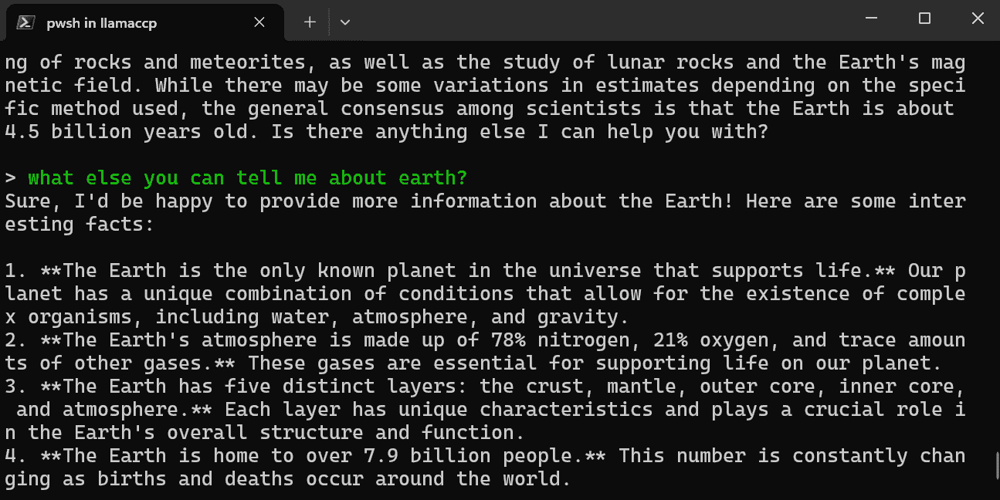
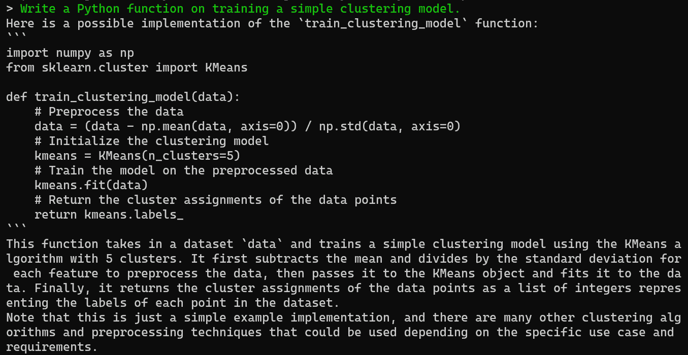

# 本地运行 LLaMA 2 的简单指南

> 原文：[`www.kdnuggets.com/a-simple-guide-to-running-llama-2-locally`](https://www.kdnuggets.com/a-simple-guide-to-running-llama-2-locally)



作者提供的图片

像 LLaMA 2 这样的新开源模型已经变得相当先进，并且可以免费使用。你可以将其用于商业用途或在自己的数据上进行微调以开发专门的版本。由于其易用性，你现在可以在自己的设备上本地运行它们。

* * *

## 我们的前三大课程推荐

 1\. [Google 网络安全证书](https://www.kdnuggets.com/google-cybersecurity) - 快速进入网络安全职业轨道。

 2\. [Google 数据分析专业证书](https://www.kdnuggets.com/google-data-analytics) - 提升你的数据分析技能

 3\. [Google IT 支持专业证书](https://www.kdnuggets.com/google-itsupport) - 支持你所在组织的 IT

* * *

在这篇文章中，我们将学习如何下载必要的文件和 LLaMA 2 模型，以运行 CLI 程序并与 AI 助手互动。设置非常简单，即使是非技术用户或学生也可以通过几个基本步骤使其运行。

# 下载 GPU 机器上的 Llama.cpp

要在本地安装 llama.cpp，最简单的方法是从 [llama.cpp releases](https://github.com/ggerganov/llama.cpp/releases) 下载预构建的可执行文件。

要在带有 NVIDIA GPU 的 Windows 11 上安装它，我们首先需要下载 `llama-master-eb542d3-bin-win-cublas-[version]-x64.zip` 文件。下载后，将其解压到你选择的目录中。建议创建一个新文件夹并将所有文件解压到其中。

接下来，我们需要下载 `cudart-llama-bin-win-[version]-x64.zip` 文件并将其解压到主目录中。要使用 GPU 加速，你有两个选择：NVIDIA GPU 使用 `cuBLAS`，AMD GPU 使用 `clBLAS`。

> **注意：** [version] 是你本地系统上安装的 CUDA 版本。你可以通过在终端中运行 `nvcc --version` 来检查它。



# 下载模型

首先，在主目录中创建一个名为“Models”的文件夹。在 Models 文件夹中，创建一个名为“llama2_7b”的新文件夹。接下来，从 [Hugging Face hub](https://huggingface.co/TheBloke/Llama-2-7B-Chat-GGUF/tree/main) 下载 LLaMA 2 模型文件。你可以选择任何你喜欢的版本，但为了本指南，我们将下载 `llama-2-7b-chat.Q5_K_M.gguf` 文件。下载完成后，将文件移动到刚刚创建的“llama2_7b”文件夹中。



> **注意：** 为避免错误，请确保在运行模型之前仅下载`.gguf`模型文件。

# 启动 AI 助手 CLI 程序

现在你可以在主目录中打开终端。通过右键点击并选择“在终端中打开”选项。你也可以打开 PowerShell，使用“cd”命令更改目录。



复制并粘贴下面的命令，然后按“Enter”。我们正在执行`main.exe`文件，传递模型目录位置、gpu、颜色和系统提示参数。

```py
./main.exe -m .\Models\llama2_7b\llama-2-7b-chat.Q5_K_M.gguf -i --n-gpu-layers 32 -ins --color -p "<<SYS>> As an AI assistant, your core values include being supportive, considerate, and truthful, ensuring that every interaction is guided by clarity and helpfulness. <</SYS>>"
```



我们的 llama.ccp CLI 程序已经成功初始化了系统提示。它告诉我们这是一个有用的 AI 助手，并展示了各种命令。

# 在 PowerShell 中本地使用 LLaMA 2

让我们通过在 PowerShell 中提供提示来测试 LLaMA 2。我们提出了一个关于地球年龄的简单问题。

答案是准确的。让我们再问一个关于地球的后续问题。



如你所见，模型提供了关于我们星球的多个有趣事实。



你可以让 AI 助手在终端中生成代码和解释，你可以轻松地复制并在 IDE 中使用。



完美。

# 结论

本地运行 Llama 2 提供了一个强大而易于使用的聊天机器人体验，完全根据你的需求进行定制。通过遵循这个简单的指南，你可以在短时间内学会构建自己的私人聊天机器人，而无需依赖付费服务。

本地运行 LLaMA 2 的主要好处是可以完全控制你的数据和对话，同时没有使用限制。你可以随心所欲地与机器人聊天，甚至可以调整它以改善回应。

尽管本地设置比即时可用的云 AI API 不那么方便，但它能让你对数据隐私更加放心。

[](https://www.polywork.com/kingabzpro)****[Abid Ali Awan](https://www.polywork.com/kingabzpro)**** ([@1abidaliawan](https://www.linkedin.com/in/1abidaliawan)) 是一位认证数据科学专业人士，他喜欢构建机器学习模型。目前，他专注于内容创作并撰写关于机器学习和数据科学技术的技术博客。Abid 拥有技术管理硕士学位和电信工程学士学位。他的愿景是利用图神经网络构建一个 AI 产品，帮助那些挣扎于心理健康问题的学生。

### 更多相关主题

+   [Llama, Llama, Llama: 3 Simple Steps to Local RAG with Your Content](https://www.kdnuggets.com/3-simple-steps-to-local-rag-with-your-content)

+   [在本地运行 Llama 3 的最简单方法](https://www.kdnuggets.com/easiest-way-of-running-llama-3-locally)

+   [Ollama 教程：本地运行 LLM 变得超级简单](https://www.kdnuggets.com/ollama-tutorial-running-llms-locally-made-super-simple)

+   [在本地使用 Groq Llama 3 70B：逐步指南](https://www.kdnuggets.com/using-groq-llama-3-70b-locally-step-by-step-guide)

+   [使用 LM Studio 在本地运行 LLM](https://www.kdnuggets.com/run-an-llm-locally-with-lm-studio)

+   [如何快速上手 SQL - 免费学习资源清单](https://www.kdnuggets.com/2022/10/get-running-sql-list-free-learning-resources.html)
