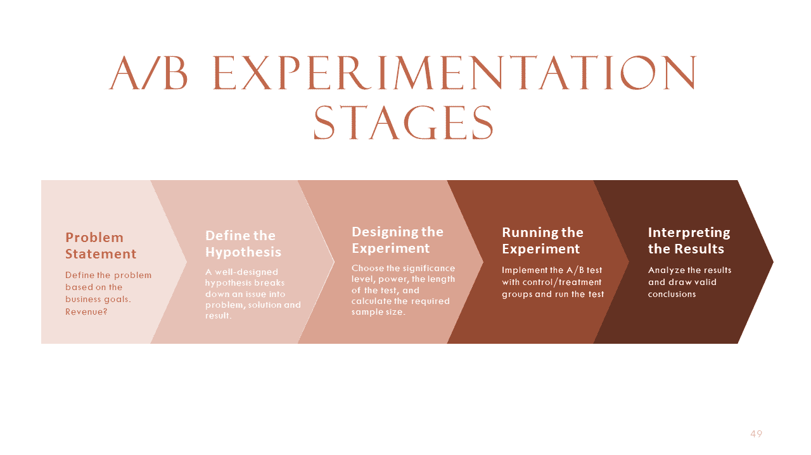
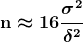

# A/B 测试：全面指南

> 原文：[`www.kdnuggets.com/ab-testing-a-comprehensive-guide`](https://www.kdnuggets.com/ab-testing-a-comprehensive-guide)

A/B 测试，也称为“拆分测试”或“随机对照试验”，是一种比较网页、应用程序或其他产品的两个版本以查看哪个表现更好的方法。A/B 测试的基本想法是将用户分成两组：A 组和 B 组。A 组（对照变体）看到你产品的原始版本，而 B 组（测试变体）看到一个有一个或多个更改的修改版本。这些更改可以是按钮的颜色、页面布局、标题的措辞、影响搜索结果的后台算法或促销优惠。然后你会测量每组的行为，例如用户在产品上停留的时间、访问的页面数、采取的行动数或产生的收入。通过比较每个变体的结果，你可以确定哪个更有效地实现了你的目标。如果有两个变体，它被称为 A/B 测试，当有两个以上变体时，它通常被称为 A/B/C 或 A/B/N 测试。

通过进行 A/B 测试，你可以做出基于数据的决策，从而改善你的产品和业务成果。一个有效的 A/B 测试是你能够根据结果自信地做出决策的测试。在本文中，我们将探讨 A/B 测试的基础知识，如何设计和运行有效的实验，以及如何分析和解读结果。

* * *

## 我们的前三大课程推荐

 1\. [谷歌网络安全证书](https://www.kdnuggets.com/google-cybersecurity) - 快速进入网络安全职业。

 2\. [谷歌数据分析专业证书](https://www.kdnuggets.com/google-data-analytics) - 提升你的数据分析技能

 3\. [谷歌 IT 支持专业证书](https://www.kdnuggets.com/google-itsupport) - 支持你的组织 IT

* * *

**A/B 测试可以帮助你回答以下问题：**

+   哪个标题吸引更多点击？

+   哪种布局增加参与度？

+   哪种优惠能提升销售额？

+   哪个功能减少用户流失？

# 何时进行 A/B 测试？

对于这个问题没有明确的答案，因为这取决于你的目标、资源和背景。如果你想了解新功能如何影响用户参与度以及关键业务指标，A/B 测试是一个完美的选择。然而，一些通用的指南包括：

+   当你拥有足够的流量和转化率以获得可靠的结果时，进行 A/B 测试。

+   当你有明确的假设和可测量的结果时，进行 A/B 测试。

+   当你有足够的时间来正确进行测试，以避免常见的陷阱如窥探、过早停止或一次性进行过多测试时，进行 A/B 测试。

+   当你准备根据结果采取行动时，进行 A/B 测试。

假设你作为 Contoso 公司的产品经理加入。你认为改变“购买”按钮的颜色将会改善参与度和提高销售数量。作为产品经理，你有一个直觉，认为将颜色改为蓝色会带来更高的销售。有时候你的直觉是正确的，有时候是错误的。你怎么知道这一点？这就是为什么你的目标是收集用户对按钮颜色如何影响用户体验和关键业务指标（如收入）的见解。

进行 A/B 实验的步骤可以分解为以下几个方面：

# 问题陈述

问题陈述是对需要通过 A/B 实验解决的问题的清晰而简洁的描述。它应包括当前情况、期望结果以及两者之间的差距。一个明确的问题陈述有助于聚焦实验设计，统一利益相关者的意见，并衡量实验的成功。在进行 A/B 实验之前，定义问题陈述很重要，以避免在不相关或无效的测试上浪费资源、时间和精力。根据行业的不同，问题陈述可能有所不同。

**根据行业的一些问题陈述示例如下：**

| **旅行公司如 Expedia、Booking.com** |
| --- |

+   增加预订数量。

+   增加客户评论的数量。

|

| **媒体公司如 Netflix、Hulu** |
| --- |

+   增加客户参与度。

+   增加订阅率。

|

| **电子商务公司如 Amazon、Walmart** |
| --- |

+   增加搜索和浏览的产品数量。

+   增加加入购物车的比例。

|

| **社交媒体公司如 Instagram、Facebook** |
| --- |

+   通过广告增加收入。

+   通过评论、点赞、分享增加参与度

|

## 定义假设

什么是假设？A/B 实验中的假设是一个可测试的陈述，它预测网站或应用程序的变化将如何影响某个指标或用户行为。

定义假设的三个步骤包括：

1.  我们知道我们有**[这个问题]**，基于**[证据]**。

1.  你认为我们应该实施**[这一改变]**以实现**[这一结果]**，因为这将改善[这个问题]。

1.  我们知道我们已经实现了**[这一结果]**，当我们看到**[这个指标]**发生变化时。

假设的例子包括：

1.  我们看到**[在电子商务网站上销售的单位数量减少]**，这是通过**[销售数据]**得出的，时间跨度为去年。

1.  我们相信，融入社会证明元素，例如展示在特定时间范围内购买某一产品的**[例如，“X”人在过去 24 小时内购买]**，可以产生紧迫感，并[影响访客购买]。这一心理触发点利用了错失恐惧，**[鼓励潜在买家转化]**。

1.  我们知道我们已经达到了**[更高的转化率]**，当我们看到**[收入增加/销售单位增加]**时。

**零假设** ()：基线和变体处理之间的每日每用户平均收入相同。

**备择假设** ()：基线和变体处理之间的每日每用户平均收入不同。

**显著性水平**：：显著性水平越低，表明对照组和变体组之间的差异不是偶然发生的统计显著性越高。

**统计功效**：：如果备择假设为真，检测效果的概率。

## 设计实验

要成功运行实验，你需要与不同团队合作并遵循一些步骤。首先，你需要定义你的关键指标，这是一种量化的度量，反映了你实现目标的程度。例如，如果你想测试更改网站上购买按钮的颜色是否会影响销售，你的关键指标将是每用户每月的收入。这个指标捕捉了颜色变化对用户行为和商业结果的影响。其次，你需要与用户体验（UX）团队合作，设计两种版本的购买按钮：一种是原始颜色，另一种是新颜色。这些被称为对照变体和测试变体。UX 团队可以帮助确保设计一致、吸引人且用户友好。第三，你需要与工程团队合作，在网站上实现并部署这两个变体。工程团队可以帮助确保代码无漏洞、安全且可扩展。第四，你需要与数据团队合作，设置一个监控系统，跟踪和收集两个变体的关键指标数据。数据团队可以帮助确保数据准确、可靠且可访问。第五，你需要决定如何将访问你网站的用户随机分配到对照组或测试组。随机化很重要，因为它确保这两个组在统计上是相似的，任何关键指标的差异都是由于颜色变化而不是其他因素造成的。你可以使用不同的随机化方法，如基于 cookie、用户 ID 或 IP。第六，你需要确定每组需要多少用户才能检测到关键指标的显著差异。这被称为样本大小，它取决于多个因素，如预期效果大小、关键指标的标准差、显著性水平和检验的统计功效。你可以使用公式或计算器根据这些因素估算样本大小。

# 运行实验

实验过程的下一步是将你的实验推出到部分用户中，并监测其表现。你应该从低曝光率开始，并在对实验充满信心后逐步增加曝光率。你还应该收集你在假设中定义的关键指标的数据，并跟踪它们随时间的变化。为了帮助你，你应该与开发团队合作，构建一个显示指标值及其统计显著性的仪表盘。你应该避免在实验结束前查看结果并得出过早的结论。你还应确保实验持续足够长的时间，以确保你有足够的数据来做出有效的决策。根据你的流量和转化率，这可能需要几天、几周或几个月。

# 解释结果

在基于实验结果推出任何变更之前，你需要执行一些合理性检查，以确保数据可靠有效。合理性检查是质量控制措施，帮助你发现数据收集或分析过程中的任何错误或异常。例如，你可以检查流量分配是否正确，实验组间的不变指标是否一致，是否有任何外部因素可能影响了结果。如果你发现数据有任何问题，你应该丢弃这些数据，并用正确的设置重新进行实验。

一旦你验证了数据的可靠性，你就可以继续实施变更。为此，你需要分析结果并根据你的假设和成功指标得出结论。你可以使用统计方法，如假设检验、置信区间和效应量，来比较各个变体的表现，看看是否有明确的胜者或平局。如果有胜者，你可以在你的网站或应用上实施获胜的变体，并结束实验。如果是平局，你可能需要进行另一个实验，使用不同的假设或更大的样本量，以获得更具决定性的结果。

****[Poornima Muthukumar](https://www.linkedin.com/in/poornimamuthukumar/)**** 是微软的一位高级技术产品经理，拥有超过 10 年的开发和交付创新解决方案的经验，涉及领域包括云计算、人工智能、分布式和大数据系统。我拥有华盛顿大学的数据科学硕士学位。在微软，我专注于 AI/ML 和大数据系统，拥有四项专利，并在 2016 年获得全球黑客马拉松人工智能类别的奖项。今年 2023 年，我有幸成为 Grace Hopper 大会软件工程类别的评审委员会成员。阅读和评估来自这些领域的才华横溢的女性提交的作品，为促进女性在技术领域的发展做出了贡献，这一经历让我受益匪浅，并从她们的研究和见解中获得了很多启发。我还是 2023 年 6 月微软机器学习 AI 和数据科学（MLADS）会议的委员会成员。除此之外，我还是全球数据科学女性社区和 Women Who Code 数据科学社区的大使。

### 更多相关主题

+   [假设检验与 A/B 测试](https://www.kdnuggets.com/hypothesis-testing-and-ab-testing)

+   [使用 DeepChecks 进行机器学习测试的初学者指南](https://www.kdnuggets.com/beginners-guide-to-machine-learning-testing-with-deepchecks)

+   [像专业人士一样测试：Python Mock 库的逐步指南](https://www.kdnuggets.com/testing-like-a-pro-a-step-by-step-guide-to-pythons-mock-library)

+   [正态分布全面指南](https://www.kdnuggets.com/2022/06/comprehensive-guide-normal-distribution.html)

+   [MLOps 全面指南](https://www.kdnuggets.com/2023/08/comprehensive-guide-mlops.html)

+   [NLP、NLU 和 NLG：有什么区别？全面指南](https://www.kdnuggets.com/2022/06/nlp-nlu-nlg-difference-comprehensive-guide.html)
