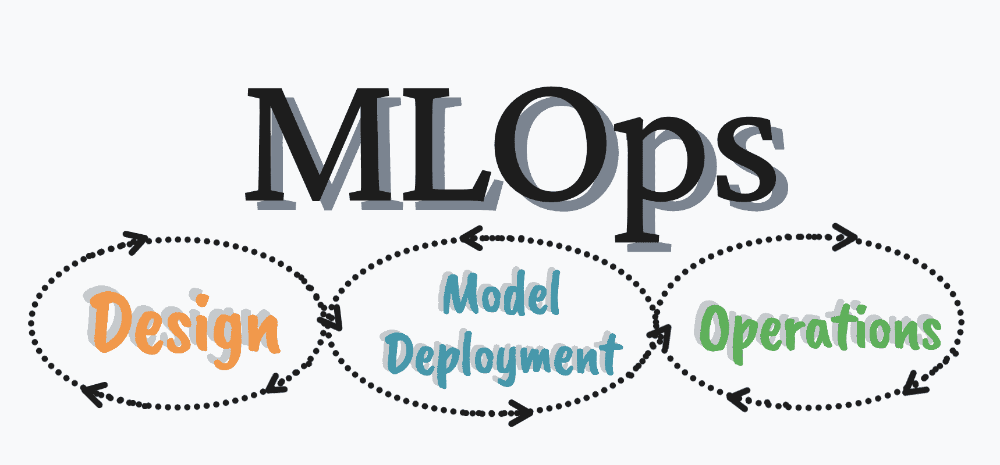

# MLOps 的绝对基础

> 原文：[`www.kdnuggets.com/2022/09/absolute-basics-mlops.html`](https://www.kdnuggets.com/2022/09/absolute-basics-mlops.html)

图片来源：作者

本文适合那些对 MLOps 一无所知或想刷新记忆的人。你可能在 LinkedIn 上浏览、阅读博客、参加 AI 会议等时听说过 MLOps。

* * *

## 我们的前三大课程推荐

 1\. [谷歌网络安全证书](https://www.kdnuggets.com/google-cybersecurity) - 快速入门网络安全职业。

 2\. [谷歌数据分析专业证书](https://www.kdnuggets.com/google-data-analytics) - 提升你的数据分析能力

 3\. [谷歌 IT 支持专业证书](https://www.kdnuggets.com/google-itsupport) - 支持你的组织在 IT 领域

* * *

让我们开始吧。

# 什么是 MLOps？

MLOps 代表机器学习操作，是机器学习、DevOps 和数据工程的结合。本文将对每一项进行定义。

**机器学习**使模型能够通过探索数据和识别模式，利用过去的经验进行学习和改进，几乎无需人工干预。

**DevOps**是开发和建立正确的操作的结合，以提高软件开发的效率、速度和安全性。

**数据工程**专注于设计和构建管道，将数据转换并传输成其他技术专家如数据科学家或最终用户能够访问的格式。

这三者结合起来，以可靠和高效的方式部署和维护机器学习系统。

# MLOps 的目标是什么？

在处理模型时，可能会变得很混乱。运行可能会耗时，尝试联系团队其他成员时可能会出现问题，并可能导致通信中的重大问题。

## 将数据科学家纳入视野

数据科学家有时不会与团队中的其他技术专家合作。他们的角色和责任不同，有时无需沟通。然而，随着模型的开发，数据科学家的合作变得至关重要，因为他们负责从数据集中提取、清理和收集洞察，这些洞察随后被用于构建 AI 模型。

## 合作

当你将所有技术专家聚集在团队中合作项目时，你会自然看到模型开发的增加。由于不同技能的结合，会有更快的部署时间，更好的模型管理和验证。

## 管理你的机器学习生命周期

通过建立正确的 MLOps 架构，你和团队中的其他专家能够跟踪、版本控制、重用和审计机器学习模型生命周期的每个方面或资产。这不仅提高了模型的可靠性，还提供了可以在未来应用的可转移知识。

# MLOps 阶段

MLOps 过程包括三个广泛的阶段：

1.  设计 ML 驱动的应用程序

1.  ML 实验与开发

1.  ML 操作

## 设计 ML 驱动的应用程序

这一阶段是每个项目的起点 - 了解当前的问题或待解决的内容。在这一阶段，你将对业务有更好的理解，然后继续了解数据，以确定如何设计 ML 驱动的应用程序。

MLOps 这一阶段的关键组件有：

+   收集数据

+   数据分析

+   数据准备

+   模型开发

+   模型训练

在模型设计阶段，你将查看可用的数据、其限制以及我们 ML 模型的功能。这些将作为构建块帮助设计 ML 应用程序的架构，并确保我们更接近解决问题。

## ML 实验与开发

现在我们进入下一个阶段，专注于验证我们的 ML 应用程序的有效性。在这个阶段，建议使用 ML 模型的概念验证方法。概念验证方法用于通过进一步检查可扩展性、技术能力、限制等来帮助验证过程。

MLOps 这一阶段的关键组件有：

+   模型验证

+   模型服务

+   模型监控

+   模型重新训练

这些组件将帮助我们识别最适合我们当前问题的机器学习算法，并确保它在生产过程中能够稳定顺利地运行。

## ML 操作

最后一阶段完全是关于将机器学习模型投入生产。为了做到这一点，需要建立一定的 DevOps 实践。

MLOps 这一阶段的关键组件有：

+   测试

+   版本控制

+   监控

# 实施 MLOps

实现 MLOps 有 3 个层级：

1.  手动过程

1.  ML 流水线自动化

1.  CI/CD 流水线自动化

## 手动过程

这个过程完全由数据科学家驱动，因此是一个手动过程。如果你的模型很少更改/训练，或者你刚刚开始实施 ML - 这个过程可能适合你。

由于其手动性质，这个过程非常实验性和迭代性 - 因此数据转换、验证、模型测试和训练等每个阶段都需要手动完成。手动过程中的最常用工具是 Jupyter Notebooks。

## ML 流水线自动化

这包括一个不需要手动执行的过程——你的模型需要自动训练。在这个过程中，当有新的数据可用时，流水线会感知到并触发模型重新训练的响应。这被称为持续训练。

这个过程可以被采用于不断变化的环境中，并持续需要这些指标来处理。

## CI/CD 流水线自动化

这一阶段提供了性能最佳、速度最快的可靠机器学习模型部署，你需要一个强大的自动化 CI/CD 系统。拥有这个 CI/CD 系统后，它允许你的数据科学家和其他技术专家深入挖掘，探索与特征工程、模型架构和超参数相关的新想法。

这个过程与之前的过程不同之处在于数据、机器学习模型及其所有训练流水线组件都被自动构建、测试和部署。

# 结论

本文旨在帮助你理解 MLOps 的基本知识：它是什么、为什么使用、关键概念以及如何实现。希望这能为你提供一个清晰易懂的概述！

**[尼莎·阿雅](https://www.linkedin.com/in/nisha-arya-ahmed/)** 是一名数据科学家和自由技术写作专家。她特别感兴趣于提供数据科学职业建议或教程以及数据科学的理论知识。她还希望探索人工智能如何或能如何有利于人类寿命的不同方式。她是一个热衷学习的人，寻求拓宽她的技术知识和写作技能，同时帮助指导他人。

### 更多相关主题

+   [通过这本免费电子书学习 MLOps 基础](https://www.kdnuggets.com/2023/08/learn-mlops-basics-free-ebook.html)

+   [回到基础，第二部分：梯度下降](https://www.kdnuggets.com/2023/03/back-basics-part-dos-gradient-descent.html)

+   [Python 基础：语法、数据类型和控制结构](https://www.kdnuggets.com/python-basics-syntax-data-types-and-control-structures)

+   [回到基础第 1 周：Python 编程与数据科学基础](https://www.kdnuggets.com/back-to-basics-week-1-python-programming-data-science-foundations)

+   [回到基础第 3 周：机器学习简介](https://www.kdnuggets.com/back-to-basics-week-3-introduction-to-machine-learning)

+   [回到基础第 4 周：高级主题和部署](https://www.kdnuggets.com/back-to-basics-week-4-advanced-topics-and-deployment)
