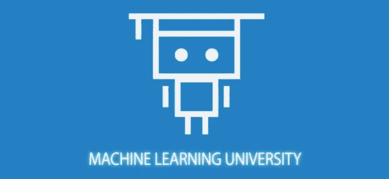
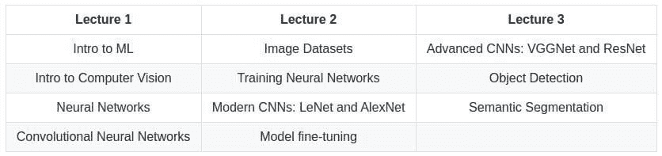

# 加速计算机视觉：亚马逊的免费课程

> 原文：[`www.kdnuggets.com/2020/08/accelerated-computer-vision-free-course-amazon.html`](https://www.kdnuggets.com/2020/08/accelerated-computer-vision-free-course-amazon.html)

评论

亚马逊的机器学习大学正在将其之前仅对亚马逊员工开放的在线课程 [免费提供给公众](https://www.amazon.science/latest-news/machine-learning-course-free-online-from-amazon-machine-learning-university)。

* * *

## 我们的前三个课程推荐

 1\. [谷歌网络安全证书](https://www.kdnuggets.com/google-cybersecurity) - 快速进入网络安全职业生涯。

 2\. [谷歌数据分析专业证书](https://www.kdnuggets.com/google-data-analytics) - 提升你的数据分析技能

 3\. [谷歌 IT 支持专业证书](https://www.kdnuggets.com/google-itsupport) - 支持你的组织的 IT

* * *

第一个公开提供的类似课程之一是 **[加速计算机视觉](https://www.youtube.com/playlist?list=PL8P_Z6C4GcuU4knhhCouJujFZ2tTqU-Ta)**，该课程自我描述如下：

> 该仓库包含机器学习大学（MLU）计算机视觉课程的幻灯片、笔记本和数据集。我们的使命是让机器学习对每个人都可用。我们提供涵盖许多机器学习主题的课程，并相信机器学习的知识可以是成功的关键促进因素。此课程旨在帮助你入门计算机视觉，了解广泛使用的机器学习技术，并将其应用于现实世界的问题。

这个简明课程由 [Rachel Hu](https://www.linkedin.com/in/rachelsonghu/)，AWS 深度引擎科学的应用科学家讲授，由一个 [视频讲座播放列表](https://www.youtube.com/playlist?list=PL8P_Z6C4GcuU4knhhCouJujFZ2tTqU-Ta) 和一个 [GitHub 仓库](https://github.com/aws-samples/aws-machine-learning-university-accelerated-cv) 组成，包含课程笔记、幻灯片和数据。这些简短的视频和相关的课程材料被整理成 3 个主要课程，结构如下：

课程的课件重点在于掌握实际计算机视觉实现的技能，并关注以下内容，为你提供对课程学习内容的预期：

+   神经网络

+   卷积神经网络

+   最终项目概述

+   AlexNet

+   AutoGluon 用于计算机视觉

+   ResNet

+   YOLO

课程还包括一个实际计算机视觉的最终项目实现，其 Jupyter notebook 开始部分如下，提供了对预期学习成果的额外提示：

这似乎是计算机视觉初学者的一个很好的入门课程。亚马逊通过将其机器学习大学课程公开，给社区提供了服务，结合加速计算机视觉课程和其他目前提供的课程，那些希望从世界级机器学习组织学习机器学习的人现在有了另一个选择。

**相关内容**：

+   加速自然语言处理：一门免费课程

+   超越表面：有实质内容的数据科学 MOOCs

+   令人惊叹的机器学习和人工智能课程

### 更多相关话题

+   [TensorFlow 在计算机视觉中的应用 - 轻松实现迁移学习](https://www.kdnuggets.com/2022/01/tensorflow-computer-vision-transfer-learning-made-easy.html)

+   [探索计算机视觉的世界：介绍 MLM 的最新…](https://www.kdnuggets.com/2024/01/mlm-discover-the-world-of-computer-vision-ebook)

+   [计算机视觉的 5 种应用](https://www.kdnuggets.com/2022/03/5-applications-computer-vision.html)

+   [关于数据管理的 6 件事及其重要性…](https://www.kdnuggets.com/2022/05/6-things-need-know-data-management-matters-computer-vision.html)

+   [KDnuggets 新闻 2022 年 3 月 9 日：在 5 分钟内构建一个机器学习网络应用…](https://www.kdnuggets.com/2022/n10.html)

+   [DINOv2：Meta AI 的自监督计算机视觉模型](https://www.kdnuggets.com/2023/05/dinov2-selfsupervised-computer-vision-models-meta-ai.html)
