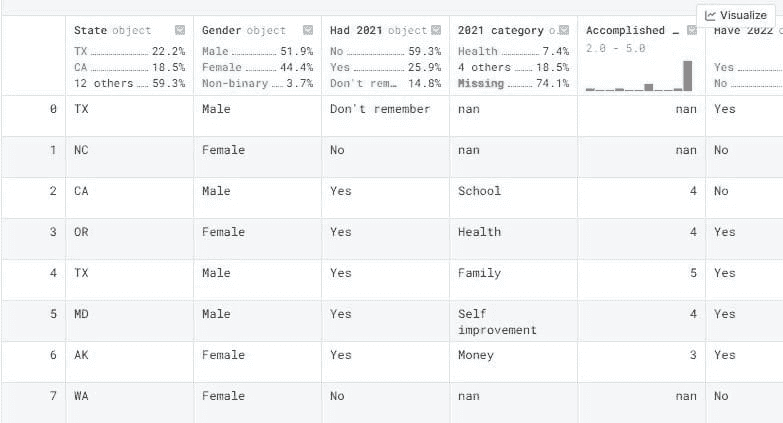
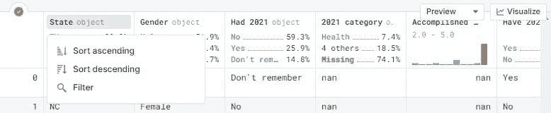
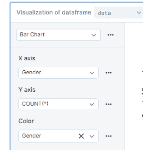
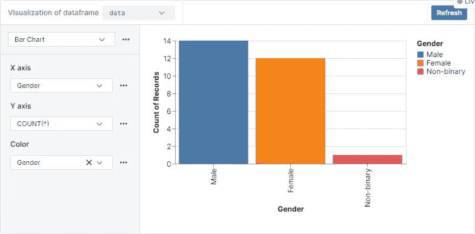
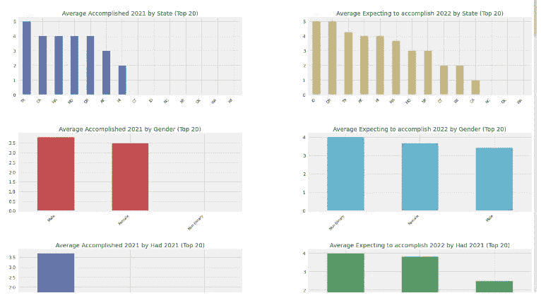
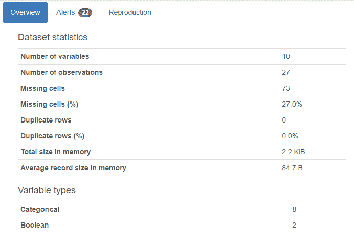
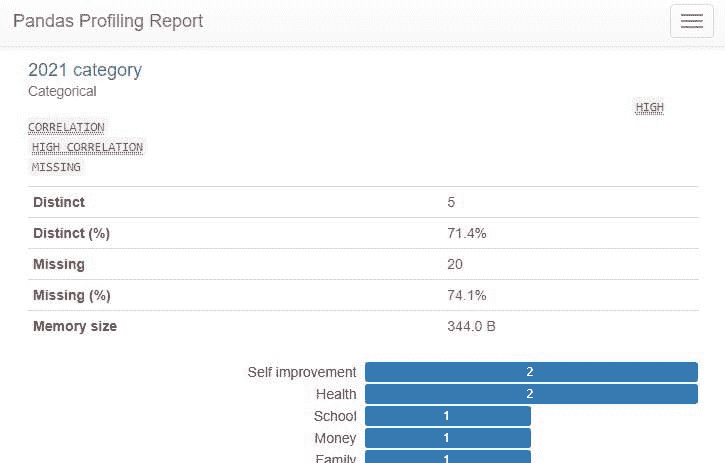
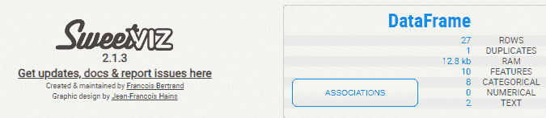
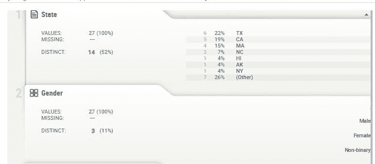

# 如何通过使用自动化 EDA 工具来通过数据科学评估测试

> 原文：[`www.kdnuggets.com/2022/04/ace-data-science-assessment-test-automatic-eda-tools.html`](https://www.kdnuggets.com/2022/04/ace-data-science-assessment-test-automatic-eda-tools.html)


图片来源 | Canva Pro

一般来说，评估测试分为五个部分：**统计学**、**商业分析**、**编码**、**SQL**和实际操作**数据分析**。你将获得一个数据集和 20 分钟的时间来回答三个到四个与业务相关的问题。即使你是数据分析专家，也不能在有限的时间内完成数据摄取、数据分析和报告。因此，你需要超级工具来自动化数据分析部分，以便你可以专注于回答业务案例研究中的问题。

* * *

## 我们的前三个课程推荐

 1\. [Google 网络安全证书](https://www.kdnuggets.com/google-cybersecurity) - 快速进入网络安全职业生涯。

 2\. [Google 数据分析专业证书](https://www.kdnuggets.com/google-data-analytics) - 提升你的数据分析能力

 3\. [Google IT 支持专业证书](https://www.kdnuggets.com/google-itsupport) - 支持你的组织 IT

* * *


图片来源

在这篇博客中，我们将学习关于自动 EDA 工具的内容，以帮助我们通过数据分析部分。我们将学习 Deepnote、Autoviz、Pandas profiling 和 Sweetviz。这些工具只需几行代码即可显示数据的关键信息。

# Deepnote

[Deepnote](https://deepnote.com/) 是一个免费的云数据科学笔记本，支持多种第三方集成和编程语言。最近，该平台推出了显示 Pandas DataFrame 的新方式。新年决议数据集可以在 [Kaggle](https://www.kaggle.com/bsoyka3/new-years-resolutions-in-2021-and-2022) 上找到，并遵循[CC BY-SA 4.0](https://creativecommons.org/licenses/by-sa/4.0/) 许可证。该数据通过调查收集，询问受访者 2022 年的新年决议。

正如我们所观察到的，数据框显示了分类特征和数值特征的分布。它展示了特定特征的最小值和最大值范围，以及缺失值的百分比。

```py
import pandas as pd
data = pd.read_csv("nyr_data.csv")
data
```



我们还可以使用**过滤器**选项来显示特定的类别或值。最后，**可视化**选项将帮助我们在不写一行代码的情况下创建简单的数据可视化。



图片来源

Visualize 选项将要求提供 Pandas DataFrame、图表类型、X 轴、Y 轴和颜色，以显示交互式可视化。



作者提供的图片

我们使用 Pandas DataFrame 的可视化来通过条形图显示调查中的性别分布。



Deepnote 一直是我应对时间紧迫项目和评估测试的第一选择。我可以轻松在 20 分钟内生成简单的数据报告。Deepnote 还帮助我通过了多个数据科学和机器学习评估测试。如果你对我的 Deepnote 项目感兴趣，可以查看我的 [profile](https://deepnote.com/@abid)。

# AutoViz

[Autoviz](https://pypi.org/project/autoviz/) 用于通过一行代码自动生成表格数据的可视化。它基于特征类型显示所有图表组合。如果特征是文本，它将显示词云；如果是类别，它将显示条形图的组合。Autoviz 提供四种选项：SVG、Bokeh、Server 和 HTML。

+   **SVG/PNG/JPG:** 生成 matplotlib 图表，这些图表可以存储在本地或在 Jupyter notebook 中显示。

+   **Bokeh:** 在 Jupyter notebooks 中生成交互式图表。

+   **Server:** 启动一个包含所有图表的基于浏览器的仪表盘。

+   **HTML:** 静默创建 bokeh 图表并将 HTML 文件保存在本地。

只需几行代码，我们就可以生成关于数据集的详细信息、成对散点图、分布图、箱形图、概率图、直方图、小提琴图、热图和每个类别的条形图。Autoviz 为我们节省了半小时的编码和报告结果时间。

```py
from autoviz.AutoViz_Class import AutoViz_Class
%matplotlib inline
AV = AutoViz_Class()
df = AV.AutoViz("nyr_data.csv")
```



# Pandas Profiling

[Pandas-profiling](https://pypi.org/project/pandas-profiling/) 使用 Pandas DataFrame 生成详细的数据报告。报告包括变量类型、数据形状、唯一值、直方图、统计分析、文本分析和缺失值。

下图显示了数据概况的摘要。数据摘要还包括警报，突出显示高度相关的变量和特定变量中缺失值的频率。



作者提供的图片

最终报告包含关于变量分布、相关矩阵、缺失值和样本的全面信息。这些信息足以帮助你回答 60% 的评估测试问题。

```py
from pandas_profiling import ProfileReport
profile = ProfileReport(data, title="Pandas Profiling Report")
profile
```



# SweetViz

[Sweetviz](https://pypi.org/project/sweetviz/) 是一个开源的 Python 库，创建高分辨率的可视化，以支持你的探索性数据分析。用户界面互动且易于导航。只需一行代码，你就能生成专业的数据分析报告。

报告包括数据集的形状、特征类型、相关性、缺失值和使用条形图的分布。它类似于**Pandas Profiling**，但更加简洁，易于浏览。



图片由作者提供

SweetViz 使用 Pandas DataFrame 生成美观的基于 HTML 的数据报告。我们可以将 HTML 报告保存在本地，也可以使用 my_report.show_notebook()在 Jupyter notebook 中直接运行。

```py
import sweetviz as sv

my_report = sv.analyze(data)
my_report.show_notebook() ## Or use show_html
```



# 结论

我们讨论的工具非常适合生成探索性数据分析报告。最终，还是取决于你对主题的理解和你在数据科学领域的经验。评估问题通常围绕一个商业案例研究，例如：一家数码相机公司的历史销售数据。这些工具可以帮助你理解数据集，但没有主题领域的专业知识，回答问题将会很困难。

在这篇博客中，我们了解了 Deepnote、AutoViz、Pandas Profiling 和 SweetViz。这些自动化的探索性数据分析工具可以帮助你通过几行代码更快地理解问题陈述。

**[Abid Ali Awan](https://www.polywork.com/kingabzpro)** ([@1abidaliawan](https://twitter.com/1abidaliawan)) 是一位认证的数据科学专业人士，热爱构建机器学习模型。目前，他专注于内容创作，并撰写有关机器学习和数据科学技术的技术博客。Abid 拥有技术管理硕士学位和电信工程学士学位。他的愿景是利用图神经网络开发一种 AI 产品，帮助那些在心理健康方面挣扎的学生。

### 更多相关内容

+   [我如何使用 Grounding DINO 进行自动图像标注](https://www.kdnuggets.com/2023/05/automatic-image-labeling-grounding-dino.html)

+   [在 Python 中执行 T 检验](https://www.kdnuggets.com/2023/01/performing-ttest-python.html)

+   [超越准确性：使用 NLP 测试库评估和改进模型](https://www.kdnuggets.com/2023/04/john-snow-beyond-accuracy-nlp-test-library.html)

+   [你需要的 10 份数据科学面试备忘单](https://www.kdnuggets.com/2022/10/10-cheat-sheets-need-ace-data-science-interview.html)

+   [7 份必备备忘单助你成功通过数据科学面试](https://www.kdnuggets.com/top-7-essential-cheat-sheets-to-ace-your-data-science-interview)

+   [10 个统计学问题助你成功通过数据科学面试](https://www.kdnuggets.com/10-statistics-questions-to-ace-your-data-science-interview)
