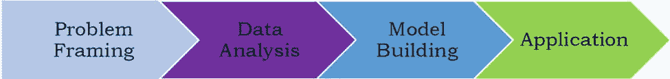
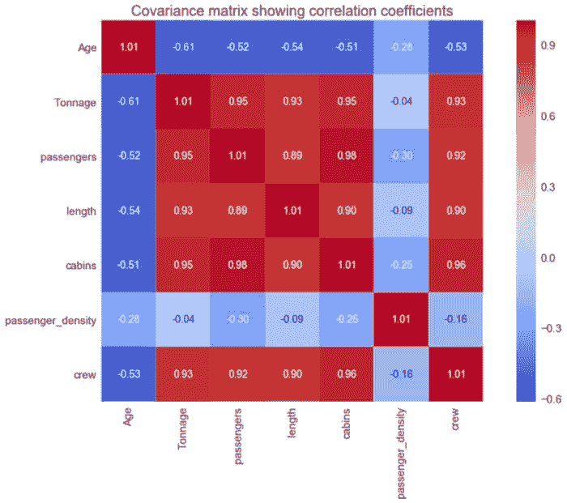
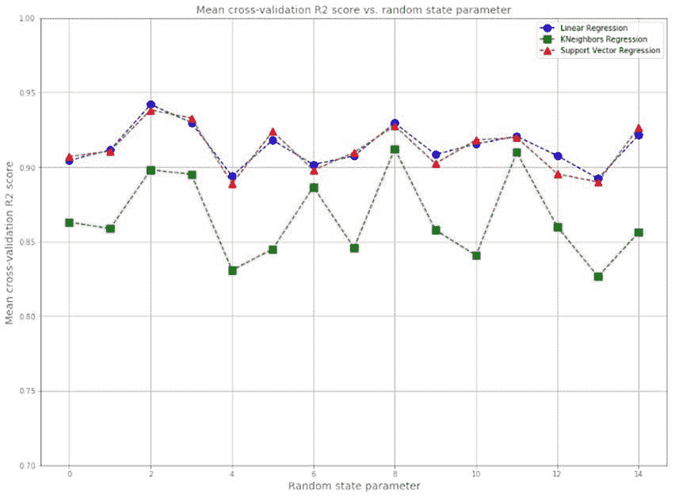

# 如何在数据科学编码挑战中表现出色

> 原文：[`www.kdnuggets.com/2020/10/ace-data-science-coding-challenge.html`](https://www.kdnuggets.com/2020/10/ace-data-science-coding-challenge.html)

评论


*图片来源：Pexels。*

### 家庭作业挑战问题（编码练习）

* * *

## 我们的前三大课程推荐

 1\. [Google 网络安全证书](https://www.kdnuggets.com/google-cybersecurity) - 快速进入网络安全职业生涯

 2\. [Google 数据分析专业证书](https://www.kdnuggets.com/google-data-analytics) - 提升你的数据分析能力

 3\. [Google IT 支持专业证书](https://www.kdnuggets.com/google-itsupport) - 支持你的组织的 IT 需求

* * *

所以，你已经成功通过了面试过程的初筛阶段。现在是面试过程中最重要的步骤，即 **家庭作业编码挑战**。这通常是一个数据科学问题，例如，机器学习模型、线性回归、分类问题、时间序列分析等。

数据科学编码项目的范围和复杂性各不相同。有时，项目可能只是生成汇总统计、图表和可视化。它也可能涉及建立回归模型、分类模型，或使用时间依赖数据集进行预测。项目也可能非常复杂和困难。在这种情况下，没有提供明确的模型类型指导。你需要提出一个最适合实现项目目标和任务的模型。

通常，面试团队会为你提供项目方向和数据集。如果你幸运的话，他们可能会提供一个小型数据集，该数据集是干净的并存储在逗号分隔值（CSV）文件格式中。这样，你就不必担心挖掘数据和将其转换为适合分析的形式。对于我经历的几次面试，我处理了两种类型的数据集：一种有 160 个观察值（行），另一种有 50,000 个观察值且有大量缺失值。家庭作业编码练习因公司而异，具体如下所述。

在这篇文章中，我将分享一些来自个人经验的有用提示，这些提示将帮助你在编码挑战项目中脱颖而出。在深入这些提示之前，让我们首先看看一些示例编码练习。

### 示例 1 编码练习：为推荐邮轮船员人数建立模型

> ***说明***
> 
> *这个编码练习应在 Python 中进行（这是团队使用的编程语言）。你可以自由使用互联网和任何其他库。请将你的工作保存在 Jupyter notebook 中，并通过电子邮件发送给我们进行审核。*
> 
> *数据文件：cruise_ship_info.csv（该文件将通过电子邮件发送给你）*
> 
> ***目标：*** *建立一个回归模型，为潜在的船买家推荐“船员”规模。请按照以下步骤操作（提示：使用 numpy、scipy、pandas、sklearn 和 matplotlib）*
> 
> 1.  *读取文件并显示列。*
> 1.  
> 1.  *计算数据的基本统计量（计数、均值、标准差等），检查数据并说明你的观察结果*。
> 1.  
> 1.  *选择可能对预测“船员”规模重要的列。*
> 1.  
> 1.  *如果你移除了列，解释一下为什么要移除这些列。*
> 1.  
> 1.  *对分类特征使用独热编码。*
> 1.  
> 1.  *创建训练集和测试集（使用 60% 的数据进行训练，其余用于测试）。*
> 1.  
> 1.  *建立一个机器学习模型来预测‘船员’规模。*
> 1.  
> 1.  *计算训练集和测试数据集的皮尔逊相关系数。*
> 1.  
> 1.  *描述模型中的超参数，以及如何更改它们以提高模型的性能。*
> 1.  
> 1.  *什么是正则化？你的模型中的正则化参数是什么？*
> 1.  
> *绘制正则化参数值与训练集和测试集的皮尔逊相关系数的关系图，查看你的模型是否存在偏差问题或方差问题。*

这是一个非常直接的问题的示例。数据集干净且小（160 行和 9 列），指令非常清楚。因此，只需按照指令生成代码即可。还要注意，指令明确要求使用 Python 作为构建模型的编程语言。完成此编码任务的时间为三天。只需提交最终的 Jupyter notebook，不需要正式的项目报告。

### 取得样本 1 编码练习的技巧

由于项目涉及建立机器学习模型，第一步是确保我们理解机器学习过程：

****

***图 1**. 说明机器学习过程。图像来源：本杰明·O·泰约*。

**1\. 问题定义**

*定义你的项目目标。你想找出什么？你是否有数据可以分析？*

**目标***：*本项目的目标是建立一个回归模型，通过使用[**cruise_ship_info.csv**](https://github.com/bot13956/ML_Model_for_Predicting_Ships_Crew_Size)的游轮数据集，为潜在的游轮买家推荐“船员”规模**。**

**2\. 数据分析**

*导入并清理数据集，分析特征以选择与目标变量相关的相关特征。*

**2.1 导入数据集并显示特征和目标变量**

```py
df = pd.read_csv("cruise_ship_info.csv")

df.head()

```


***表 1**：显示数据集的前 5 行。*

在这个例子中，数据集是干净和原始的，没有缺失值。因此，不需要清理。

**数据质量说明**: 数据集的一个主要缺陷是没有提供特征的单位。例如，乘客列没有说明该列是以百位还是千位为单位。未提供舱长、乘客密度和船员的单位。*passenger_density* 特征似乎是从其他特征中推导出来的，但没有解释其推导过程。这些问题可以通过联系面试团队以获取有关数据集的更多信息来解决。在使用数据构建现实世界模型之前，理解数据的细节是很重要的。请记住，糟糕的数据集会导致糟糕的预测模型。

**2.2 计算并可视化协方差矩阵**

协方差矩阵图可以用于特征选择和量化特征之间的相关性（多重共线性）。我们从图 2 中观察到特征之间存在强相关性。



***图 2**. 协方差矩阵图。*

**2.3 通过将特征转换为主成分分析 (PCA) 空间来执行特征工程**

由于协方差矩阵显示出多重共线性，因此在训练模型之前，将特征转换为 PCA 空间是很重要的。这是因为特征之间的多重共线性会导致模型变得复杂且难以解释。PCA 也可以用于变量选择和降维。在这种情况下，只有对总解释方差有显著贡献的成分可以保留并用于模型构建。

**3\. 模型构建**

*选择适合你的数据和期望结果的机器学习工具。使用可用数据训练模型。*

**3.1 模型构建与评估**

由于我们的目标是使用回归，可以实现不同的回归算法，例如**线性回归 (LR)**、**K 邻近回归 (KNR)**和**支持向量回归 (SVR)**。数据集必须被划分为训练集、验证集和测试集。必须使用超参数调优来微调模型，以防止过拟合。交叉验证对于确保模型在验证集上的表现良好是至关重要的。调整完模型参数后，模型必须应用于测试数据集。模型在测试数据集上的表现大致等于在使用未见数据进行预测时的期望值。

**3.2 不确定性量化**

这可以通过使用训练数据集的不同随机划分来训练模型，然后对每个随机状态参数的交叉验证分数进行平均来完成。



***图 3**. 各种回归模型的平均交叉验证结果。*

**4\. 应用**

*对最终模型进行评分以生成预测。使你的模型可以投入生产。根据需要重新训练模型。*

在此阶段，最终的机器学习模型被选定并投入生产。模型在生产环境中进行评估以评估其性能。将实验模型转化为实际生产线性能过程中遇到的任何错误都必须进行分析。这可以用于微调原始模型。

根据**图 3**中的均值交叉验证分数，我们观察到线性回归和支持向量回归的表现几乎相同，并且优于 K 邻近回归。因此，最终选择的模型可以是线性回归或支持向量回归。

**有关示例 1 编码练习的完整解决方案，请参见以下链接：**

[*示例 1 推荐解决方案*](https://github.com/bot13956/ML_Model_for_Predicting_Ships_Crew_Size)

[*机器学习过程教程*](https://medium.com/swlh/machine-learning-process-tutorial-222327f53efb)

**示例 1 编码练习备注**

有时编码练习会要求你只提交一个 Jupyter 笔记本，或者可能要求提供完整的项目报告。确保你的 Jupyter 笔记本组织良好，以反映机器学习过程的每个阶段。一个示例 Jupyter 笔记本可以在这里找到： [ML_Model_for_Predicting_Ships_Crew_Size](https://github.com/bot13956/ML_Model_for_Predicting_Ships_Crew_Size)。

### 示例 2 编码练习：贷款状态预测模型

> ***说明***
> 
> *在这个问题中，你将预测一个贷款组合的结果。每笔贷款计划在 3 年内偿还，结构如下：*
> 
> +   *首先，借款人获得资金。这一事件称为起始。*
> +   
> +   *然后，借款人会继续定期还款，直到发生以下情况之一：*
> +   
> *(i) 借款人通常因经济困难而停止还款，通常发生在 3 年期限结束之前。这种情况称为损失，贷款因此被认为已损失。*
> 
> *(ii) 借款人继续还款，直到起始日期后的 3 年。这时，债务已完全偿还。*
> 
> *在附带的 CSV 文件中，每一行对应一个贷款，列的定义如下：*
> 
> +   *带有“自起始日期以来的天数”标题的列表示从起始日期到数据收集日期之间经过的天数。*
> +   
> +   *对于在数据收集前已经损失的贷款，带有“从起始到损失的天数”标题的列表示从起始到损失之间经过的天数。对于所有其他贷款，此列为空。*
> +   
> ***目标****：我们希望你估计这些贷款在其所有 3 年期满时将有多少比例会被注销。请包括你如何得出答案的详细解释，并包括你使用的任何代码。你可以做出简化假设，但请明确说明这些假设。你可以以任何你喜欢的格式呈现你的答案；特别是，PDF 和 Jupyter Notebook 都是可以的。同时，我们预计这个项目不会花费你超过 3-6 小时的时间。*

这里的数据集很复杂（有 50,000 行和 2 列，以及大量缺失值），问题也不是很直接。你必须批判性地检查数据集，然后决定使用哪个模型。这个问题需要在一周内解决。还要求提交正式的项目报告和一个 R 脚本或 Jupyter 笔记本文件。

### 通过样本 2 编码练习的技巧

和样本 1 编码练习一样，在解决这个问题时你需要遵循机器学习步骤。这个粒子问题没有唯一解决方案。我尝试了基于蒙特卡罗模拟的概率建模解决方案。

要查看完整的样本 1 编码练习解决方案，请参见以下链接：

[*样本 2 推荐解决方案*](https://github.com/bot13956/Monte_Carlo_Simulation_Loan_Status)

[*数据科学编码练习 R 脚本*](https://medium.com/towards-artificial-intelligence/r-script-for-data-science-coding-exercise-633800dd63ec)

[*数据科学编码练习项目报告*](https://towardsdatascience.com/project-report-for-data-science-coding-exercise-9a9c76a09be8)

**样本 2 编码练习的备注**

上述解决方案仅为推荐解决方案。请记住，数据科学或机器学习项目的解决方案不是唯一的。我鼓励你在查看样本解决方案之前尝试解决这些问题。

### 总结

总之，我们讨论了一些对任何正在申请数据科学职位的数据科学 aspirant 有用的技巧。编码练习的范围和复杂性因你申请的公司而异。家庭编码练习为你展示你在数据科学项目中的能力提供了一个绝佳的机会。你需要利用这个机会展示你对数据科学和机器学习概念的深刻理解。不要错过这个宝贵的机会。如果项目中有某些方面你不理解，可以随时向数据科学面试团队寻求帮助。他们可能会提供一些提示或线索。

**相关：**

+   [如何像数据科学家一样思考](https://www.kdnuggets.com/2020/05/think-like-data-scientist-data-analyst.html)

+   [如何在你梦想的公司获得数据科学家职位](https://www.kdnuggets.com/2020/01/data-scientist-job-dream-company.html)

+   [破解数据科学家面试](https://www.kdnuggets.com/2019/01/cracking-data-scientist-interview.html)

### 了解更多主题

+   [停止学习数据科学以寻找目标，并寻找目标以……](https://www.kdnuggets.com/2021/12/stop-learning-data-science-find-purpose.html)

+   [学习数据科学统计学的顶级资源](https://www.kdnuggets.com/2021/12/springboard-top-resources-learn-data-science-statistics.html)

+   [成功数据科学家的 5 个特征](https://www.kdnuggets.com/2021/12/5-characteristics-successful-data-scientist.html)

+   [每个数据科学家都应该了解的三个 R 库（即使你使用 Python）](https://www.kdnuggets.com/2021/12/three-r-libraries-every-data-scientist-know-even-python.html)

+   [一个 90 亿美元的人工智能失败案例分析](https://www.kdnuggets.com/2021/12/9b-ai-failure-examined.html)

+   [是什么使得 Python 成为初创公司的理想编程语言](https://www.kdnuggets.com/2021/12/makes-python-ideal-programming-language-startups.html)
