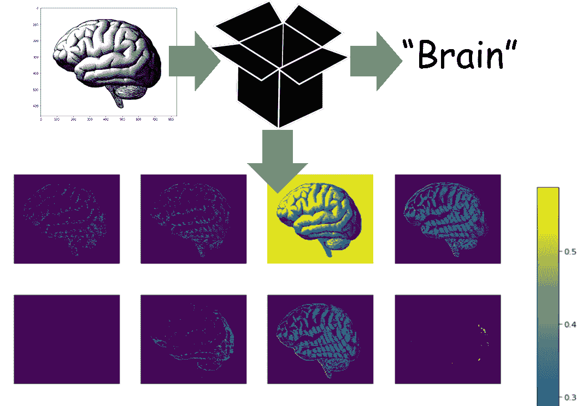
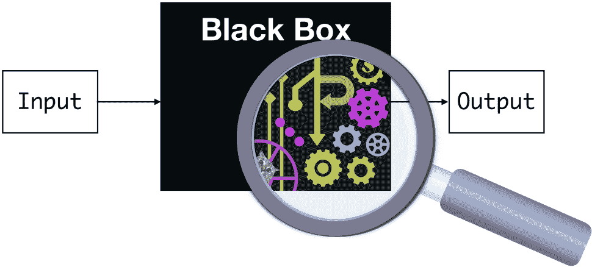
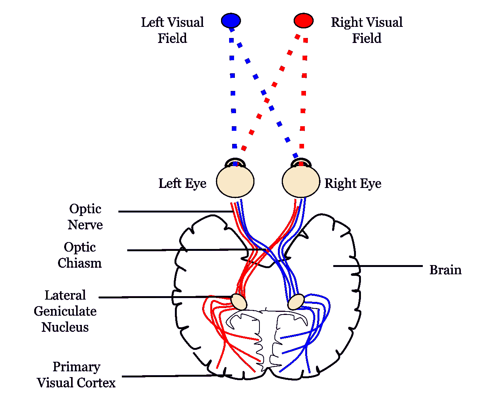
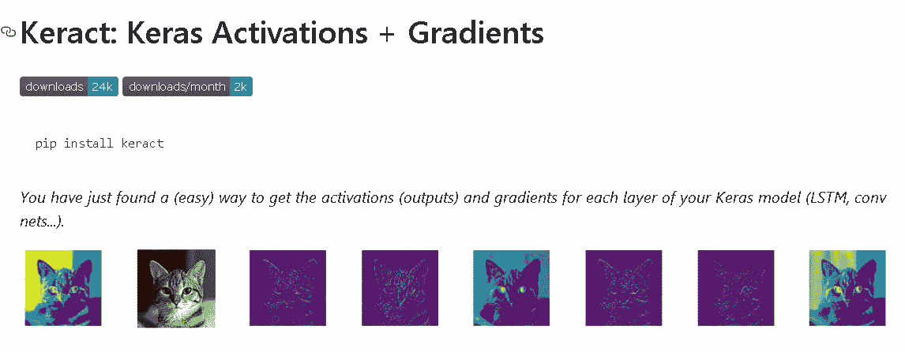
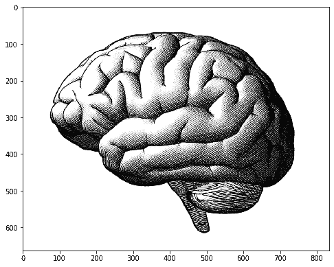
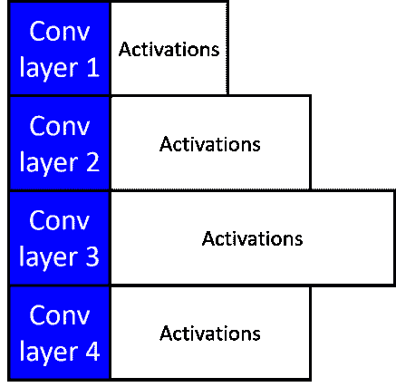
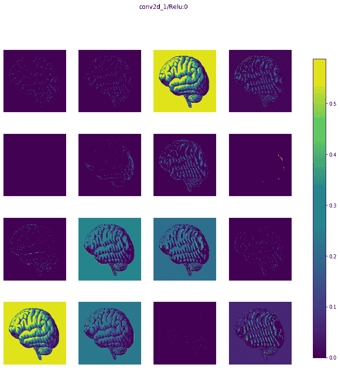
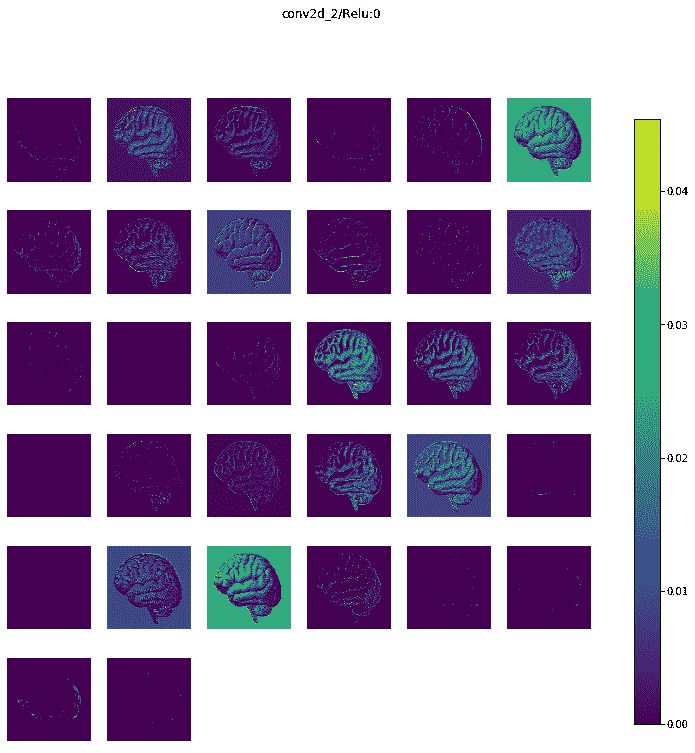
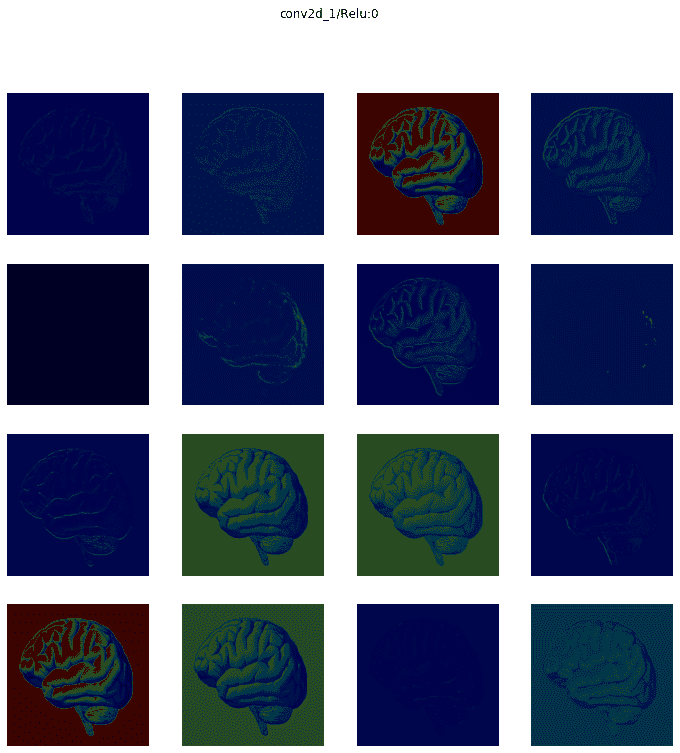
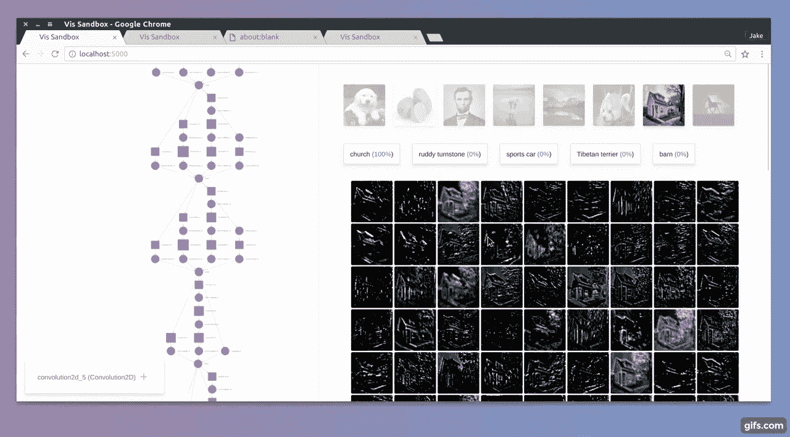

# 几行代码中的深度学习模型激活图

> 原文：[`www.kdnuggets.com/2019/10/activation-maps-deep-learning-models-lines-code.html`](https://www.kdnuggets.com/2019/10/activation-maps-deep-learning-models-lines-code.html)

评论

### 深度学习有个不好的名声：‘黑箱’

**深度** **学习** (DL) 模型正在[以令人惊叹的表现](https://tryolabs.com/blog/2018/12/19/major-advancements-deep-learning-2018/)在一个接一个的应用领域——图像分类、目标检测、目标跟踪、姿态识别、视频分析、合成图片生成——彻底革新商业和技术世界。

* * *

## 我们的三大课程推荐

 1\. [谷歌网络安全证书](https://www.kdnuggets.com/google-cybersecurity) - 快速进入网络安全职业生涯。

 2\. [谷歌数据分析专业证书](https://www.kdnuggets.com/google-data-analytics) - 提升你的数据分析技能

 3\. [谷歌 IT 支持专业证书](https://www.kdnuggets.com/google-itsupport) - 支持你的组织 IT

* * *

然而，它们与经典的**机器** **学习** (ML) 算法/技术截然不同。DL 模型使用数百万个参数，创建图像或数据集的极其复杂且高度非线性的内部表示。

因此，它们常被称为[**完美的黑箱 ML 技术**](https://www.wired.com/story/inside-black-box-of-neural-network/)。我们在用大数据集训练它们后可以获得高度准确的预测，但[**我们几乎无法理解模型用来将特定图像分类到某一类别的内部特征和表示**](https://www.technologyreview.com/s/604087/the-dark-secret-at-the-heart-of-ai/)。



**来源**：[CMU ML 博客](https://blog.ml.cmu.edu/2019/05/17/explaining-a-black-box-using-deep-variational-information-bottleneck-approach/)

> 深度学习的黑箱问题——预测能力强但缺乏直观易懂的解释。

这并不吉利，因为[我们，人类，是视觉生物](https://www.seyens.com/humans-are-visual-creatures/)。数百万年的进化赋予了我们一对[极其复杂的眼睛](https://www.relativelyinteresting.com/irreducible-complexity-intelligent-design-evolution-and-the-eye/)和更复杂的[视觉皮层](https://www.neuroscientificallychallenged.com/blog/know-your-brain-primary-visual-cortex)，我们用这些器官来理解世界。



**来源**：Wikimedia

科学过程从观察开始，这几乎总是与视觉同义。在商业中，只有我们能够观察和测量的东西，我们才能有效地控制和管理。

看到/观察是我们开始[构建世界现象的心理模型](https://medium.com/personal-growth/mental-models-898f70438075)、分类周围的物体、区分朋友和敌人、爱、工作和玩耍的方式。

> 可视化非常有帮助，尤其是对于深度学习。

因此，那些我们无法可视化内部工作原理的‘黑箱’深度学习模型，常常受到一些批评。

### 激活图

在各种深度学习架构中，也许最突出的就是所谓的**卷积神经网络**（CNN）。[它已经成为分析高维、非结构化数据的主力军](https://www.flatworldsolutions.com/data-science/articles/7-applications-of-convolutional-neural-networks.php)——图像、文本或音频——这些数据传统上对经典的机器学习（非深度学习）或手工制作（非机器学习）算法构成了严峻的挑战。

了解和可视化 CNN 的几种方法已在[文献](https://arxiv.org/pdf/1806.00069.pdf)中提出，部分是为了回应对 CNN 中学习到的内部特征不可解释的普遍批评。

**最直接的可视化技术是展示网络在前向传播过程中的激活**。

> 那么，激活究竟是什么呢？

在简单层面上，激活函数帮助决定一个神经元是否应该被激活。这有助于判断神经元接收到的信息是否对输入相关。激活函数是对输入信号进行的非线性变换，变换后的输出被发送到下一个神经元。

如果你想准确理解这些激活的含义，以及它们为何最初被放置在神经网络架构中，请查看这篇文章，

**[深度学习基础 - 激活函数及其使用时机？](https://www.analyticsvidhya.com/blog/2017/10/fundamentals-deep-learning-activation-functions-when-to-use-them/?source=post_page-----ed9ced1e8d21----------------------)**

介绍 互联网如今提供了大量的信息。我们所需的一切仅需通过 Google（搜索）即可获得…

以下是著名数据科学家[布兰登·罗赫](https://brohrer.github.io/blog.html)关于 CNN 基本机制的精彩视频，即给定输入（例如二维图像）如何逐层处理。在每一层，输出是通过激活函数传递变换后的输入生成的。

激活图只是这些激活数字在网络不同层中的可视化表示，作为图像通过各种线性代数操作处理的结果。

对于基于 ReLU 激活的网络，激活通常开始时看起来相对模糊且密集，但随着训练的进行，激活通常变得更稀疏和局部化。一个可以通过这种可视化轻松发现的设计陷阱是，一些激活图对于许多不同的输入可能全部为零，这可能表明*死亡*的滤波器，并可能是高学习率的症状。

> 激活图只是这些激活数在网络各层上的视觉表示。

听起来不错。**但可视化这些激活图是一个复杂的任务**，即使在你已经很好地训练了神经网络并进行预测之后。

> 如何通过几行代码轻松可视化和展示这些激活图，适用于一个相当复杂的 CNN？

### 通过几行代码生成激活图

整个[**Jupyter 笔记本在这里**](https://github.com/tirthajyoti/Deep-learning-with-Python/blob/master/Notebooks/Keract-activation.ipynb)。随意克隆和扩展（如果你喜欢，给仓库留个星）。

### 一个紧凑的函数和一个好用的小库

我在之前的文章中展示了如何编写一个紧凑的函数，通过利用 Keras 库提供的一些神奇的实用方法和类，自动从磁盘逐个读取图像文件来获得一个完全训练的 CNN 模型。

**请查看这篇文章，因为没有它，你不能以紧凑的方式训练任意模型与任意图像数据集，如本文所述**。

**[一个简化 Keras 图像分类的函数](https://towardsdatascience.com/a-single-function-to-streamline-image-classification-with-keras-bd04f5cfe6df?source=post_page-----ed9ced1e8d21----------------------)**

我们展示了如何构建一个通用的实用函数，从目录中自动提取图像，并…

接下来，我们使用这个函数和一个叫做**Keract**的小库，它使得激活图的可视化变得非常简单。它是 Keras 库的一个高级附加库，用于在神经网络的各种层上展示有用的热图和激活图。



因此，对于这段代码，我们需要使用我`utils.DL_utils`模块中的几个实用函数——`train_CNN_keras`和`preprocess_image`，使随机 RGB 图像适合生成激活图（这些函数在上文提到的文章中进行了描述）。

[**这是 Python 模块 —**](https://raw.githubusercontent.com/tirthajyoti/Deep-learning-with-Python/master/Notebooks/utils/DL_utils.py)`[**DL_utils.py**](https://raw.githubusercontent.com/tirthajyoti/Deep-learning-with-Python/master/Notebooks/utils/DL_utils.py)`。你可以将其存储在本地驱动器中，并像往常一样导入这些函数。

### 数据集

对于训练，我们使用了著名的 **Caltech-101 数据集**，来自 [`www.vision.caltech.edu/Image_Datasets/Caltech101/`](http://www.vision.caltech.edu/Image_Datasets/Caltech101/)。该数据集在某种程度上是 **[ImageNet 数据库](http://image-net.org/)** 的前身，后者是当前图像分类数据存储库的金标准。


这是一个包含 101 类对象的多样化图像数据集。每个类别大约有 40 到 800 张图像。大多数类别有大约 50 张图像。每张图像的大小大约为 300 x 200 像素。

但我们只训练了 5 种类别的图像——*螃蟹、杯子、大脑、相机* 和 *椅子*。

这只是为了演示而随机选择的，欢迎自由选择你自己的类别。

### 训练模型

训练仅需几行代码。

### 从互联网下载的人脑随机图像

为了生成激活图，我们从互联网上下载了一张人脑的随机图像。



### 生成激活（一个字典）

然后，再写几行代码来生成激活。

我们会得到一个字典，字典的键是层名称，值是对应于激活的 Numpy 数组。下面的插图展示了激活数组的长度因特定卷积层的滤波器图的大小而有所不同。



### 展示激活

再次，一行代码，

```py
display_activations(activations, save=False)
```

我们可以逐层查看激活图。这里是第一层卷积层（**16 张图像对应 16 个滤波器**）



这是第 2 层（**32 张图像对应 32 个滤波器**）



我们在这个模型中有 5 层卷积层（后跟最大池化层），因此，我们会得到 10 组图像。为简洁起见，我没有展示其余的图像，但你可以在我的 GitHub 仓库中查看所有图像。

### 热力图

你还可以将激活图展示为热力图。

```py
display_heatmaps(activations, x, save=False)
```



### 更新：Quiver

上周写完这篇文章后，我发现了另一个漂亮的激活可视化库，名为 [**Quiver**](https://github.com/keplr-io/quiver)。不过，这个库是基于 Python 微服务器框架 Flask 构建的，它会在浏览器端口上显示激活图，而不是在 Jupyter Notebook 内部。

它们还需要一个经过训练的 Keras 模型作为输入。所以，你可以轻松使用本文描述的紧凑函数（来自我的 [DL_uitls 模块](https://github.com/tirthajyoti/Deep-learning-with-Python/blob/master/Notebooks/utils/DL_utils.py)），并尝试这个库以进行激活图的交互式可视化。



### 总结

就这样，目前为止。

完整的[**Jupyter 笔记本在这里**](https://github.com/tirthajyoti/Deep-learning-with-Python/blob/master/Notebooks/Keract-activation.ipynb)。

我们展示了如何仅用几行代码（利用来自特殊模块的紧凑函数和 Keras 的小配件库）来训练 CNN，生成激活图，并逐层显示——从头开始。

这使你能够从任何图像数据集中训练 CNN 模型（从简单到复杂，只要你可以将其整理成简单的格式），并查看你想要的任何测试图像的内部。

欲获取更多此类动手教程，请[**查看我的深度学习与 Python GitHub 仓库**](https://github.com/tirthajyoti/Deep-learning-with-Python)。

如果你有任何问题或想法，请通过[**tirthajyoti[AT]gmail.com**](mailto:tirthajyoti@gmail.com)与作者联系。你还可以查看作者的[**GitHub**](https://github.com/tirthajyoti?tab=repositories)** 仓库**，获取其他有趣的 Python、R 代码片段和机器学习资源。如果你像我一样，对机器学习/数据科学充满热情，请随时[在 LinkedIn 上添加我](https://www.linkedin.com/in/tirthajyoti-sarkar-2127aa7/)或[在 Twitter 上关注我](https://twitter.com/tirthajyotiS)。

[原文](https://towardsdatascience.com/activation-maps-for-deep-learning-models-in-a-few-lines-of-code-ed9ced1e8d21)。转载许可。

**相关：**

+   克服深度学习中的障碍

+   演变的深度神经网络

+   神经网络架构搜索研究指南

### 更多相关主题

+   [停止学习数据科学以寻找目标，然后寻找目标……](https://www.kdnuggets.com/2021/12/stop-learning-data-science-find-purpose.html)

+   [数据科学学习统计的顶级资源](https://www.kdnuggets.com/2021/12/springboard-top-resources-learn-data-science-statistics.html)

+   [90 亿美元的 AI 失败，详解](https://www.kdnuggets.com/2021/12/9b-ai-failure-examined.html)

+   [成功数据科学家的 5 个特征](https://www.kdnuggets.com/2021/12/5-characteristics-successful-data-scientist.html)

+   [是什么使 Python 成为初创企业理想的编程语言](https://www.kdnuggets.com/2021/12/makes-python-ideal-programming-language-startups.html)

+   [每个数据科学家都应该了解的三个 R 库（即使你使用 Python）](https://www.kdnuggets.com/2021/12/three-r-libraries-every-data-scientist-know-even-python.html)
