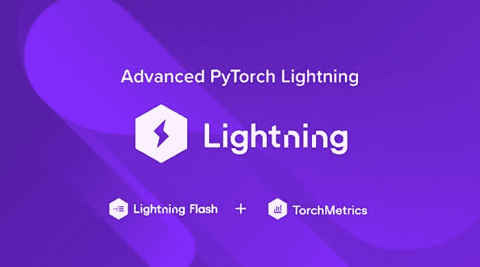

# 高级 PyTorch Lightning 使用 TorchMetrics 和 Lightning Flash

> 原文：[`www.kdnuggets.com/2021/11/advanced-pytorch-lightning-torchmetrics-lightning-flash.html`](https://www.kdnuggets.com/2021/11/advanced-pytorch-lightning-torchmetrics-lightning-flash.html)

评论



仅回顾一下我们上一个帖子中关于[PyTorch Lightning 入门](https://www.exxactcorp.com/blog/Deep-Learning/getting-started-with-pytorch-lightning)的内容，在本教程中，我们将深入探讨你应该使用的两个额外工具：TorchMetrics 和 Lightning Flash。

TorchMetrics 不出所料地提供了一个模块化的方法来定义和跟踪跨批次和设备的有用指标，而 Lightning Flash 提供了一套功能，促进更高效的迁移学习和数据处理，以及一份针对典型深度学习问题的最新方法的配方书。

我们将从向之前开始的 MNIST 示例中添加一些有用的分类指标开始。我们还将用 Flash Trainer 对象替换 PyTorch Lightning Trainer 对象，这将使我们更容易在新的分类问题上进行迁移学习。然后，我们将使用新的数据集[CIFAR10](https://en.wikipedia.org/wiki/CIFAR-10)来训练我们的分类器，我们将以此作为迁移学习示例的基础，转移到[CIFAR100](https://www.cs.toronto.edu/~kriz/cifar.html)。

### **TorchMetrics**

首先要做的是确保我们已经安装了所有需要的包。如果你已经按照“入门”教程中的安装说明操作，并现在通过 `pip freeze` 检查你的虚拟环境内容，你会发现你可能已经安装了 TorchMetrics。如果没有，请使用以下命令安装 TorchMetrics 和 Lightning Flash：

```py
pip install torchmetrics
pip install lightning-flash
pip install lightning-flash[image]
```

接下来，我们将修改我们的训练和验证循环，以记录[ F1 分数](https://en.wikipedia.org/wiki/F-score)和[接收者操作特征曲线下面积（AUROC）](https://en.wikipedia.org/wiki/Auroc)以及准确率。我们将从 `pytorch_lightning.metrics` 中移除（已弃用的）准确率，并从我们的模型中 `validation_epoch_end` 回调中移除类似的 sklearn 函数，但首先，让我们确保在顶部添加必要的导入。

```py
# ...
import pytorch_lightning as pl

# replace: from pytorch_lightning.metrics import functional as FM
# with the one below
import torchmetrics

# import lightning_flash, which we’ll use later
import flash
from flash.image import ImageClassifier, ImageClassificationData                
# ...
```

接下来，移除我们之前用来计算准确率的代码行：

```py
# ...
# in training_step
y_pred = output.argmax(-1).cpu().numpy()
y_tgt = y.cpu().numpy()

# remove the line below line:
# accuracy = sklearn.metrics.accuracy_score(y_tgt, y_pred)
self.log("train loss", loss)

# and this one: self.log("train accuracy", accuracy)
return loss
# ...
```

和：

```py
# ...
# in validation_epoch_end
y_preds = preds.cpu().numpy()
y_tgts = tgts.cpu().numpy()
# remove the lines below:
# fm_accuracy = FM.accuracy(outputs, tgts)
# accuracy = sklearn.metrics.accuracy_score(y_tgts, y_preds)
# self.log("val_accuracy", accuracy)
self.log("val_loss", loss)
# ...
```

现在，我们可以用等效的 TorchMetrics 函数实现来替换我们删除的部分，计算准确率，然后就这样结束：

```py
# ...
# in training_step

accuracy = torchmetrics.functional.accuracy(y_pred, y_tgt)
f1_score = torchmetrics.functional.f1(y_pred, y_tgt,
average="micro")
auroc = torchmetrics.functional.auroc(y_pred, y_tgt,
number_classes=10, average="micro")
self.log("train_loss", loss)
self.log("train_accuracy", accuracy)
self.log("train_f1", f1_score)
self.log("train_auroc", auroc)
return loss
# ...
```

和：

```py
# ...
accuracy = torchmetrics.functional.accuracy(outputs, tgts)
f1_score = torchmetrics.functional.f1(outputs, tgts,
average="micro")
auroc = torchmetrics.functional.auroc(outputs, tgts,
number_classes=10, average="micro")
self.log("val_accuracy", accuracy)
self.log("val_f1_score", f1_score)
self.log("val_auroc", auroc)
self.log("val_loss", loss)
# ...
```

不过，使用基于类的模块化版本的指标还有其他优势。

使用基于类的指标，我们可以在运行训练和验证时持续积累数据，并在最后计算结果。这在单一设备上很方便和高效，但在多个设备上，它真正变得有用，因为指标模块可以在多个设备之间自动同步。

我们将在 `__init__` 函数中初始化我们的指标，并在训练和验证步骤中添加每个指标的调用。

```py
class MyClassifier(pl.LightningModule):
    def __init__(self, dim=28, activation=nn.ReLU()):
        super(MyClassifier, self).__init__()
        self.image_dim = dim
        self.hid_dim = 128
        self.num_classes = 10
        self.act = activation
        # add metrics
        self.train_acc = torchmetrics.Accuracy()
        self.train_f1 = torchmetrics.F1(number_classes=10,
        average="micro")
        self.train_auroc = torchmetrics.AUROC(number_classes=10,
        average="micro")
        self.val_acc = torchmetrics.Accuracy()
        self.val_f1 = torchmetrics.F1(number_classes=10,
        average="micro")
        self.val_auroc = torchmetrics.AUROC(number_classes=10,
        average="micro")

        # __init__ function continues
        # ...
```

在 `__init__` 中定义的指标模块将在 `training_step` 和 `validation_step` 中被调用，我们将在每个训练和验证周期结束时计算这些指标。

在步骤函数中，我们将调用我们的指标对象以在训练和验证周期中累积指标数据。我们可以为每个指标对象调用“forward”方法以在返回当前批次的值的同时累积数据，或者调用“update”方法来静默累积指标数据。

```py
def training_step(self, batch, batch_index):
    x, y = batch
    output = self.forward(x)
    loss = F.nll_loss(F.log_softmax(output, dim = -1), y)
    y_pred = output.softmax(dim=-1)
    y_tgt = y
    # accumulate and return metrics for logging
    acc = self.train_acc(y_pred, y_tgt)
    f1 = self.train_f1(y_pred, y_tgt)
    # just accumulate
    self.train_auroc.update(y_pred, y_tgt)
    self.log("train_loss", loss)
    self.log("train_accuracy", acc)
    self.log("train_f1", f1)
    return loss
def validation_step(self, batch, batch_idx):
    x, y = batch
    output = self.forward(x)
    loss = F.cross_entropy(output, y)
    pred = output.softmax(dim=-1)
    self.val_acc.update(pred, y)
    self.val_f1.update(pred, y)
    self.val_auroc.update(pred, y)
    return loss
```

我们将重写 `validation_epoch_end` 并重载 `training_epoch_end` 以一次计算和报告整个周期的指标。

```py
def training_epoch_end(self, training_step_outputs):
    # compute metrics
    train_accuracy = self.train_acc.compute()
    train_f1 = self.train_f1.compute()
    train_auroc = self.train_auroc.compute()
    # log metrics
    self.log("epoch_train_accuracy", train_accuracy)
    self.log("epoch_train_f1", train_f1)
    # reset all metrics
    self.train_acc.reset()
    self.train_f1.reset()
    print(f"\ntraining accuracy: {train_accuracy:.4}, "\
    f"f1: {train_f1:.4}, auroc: {train_auroc:.4}")

def validation_epoch_end(self, validation_step_outputs):
    # compute metrics
    val_loss = torch.tensor(validation_step_outputs).mean()
    val_accuracy = self.val_acc.compute()
    val_f1 = self.val_f1.compute()
    val_auroc = self.val_auroc.compute()
    # log metrics
    self.log("val_accuracy", val_accuracy)
    self.log("val_loss", val_loss)
    self.log("val_f1", val_f1)
    self.log("val_auroc", val_auroc)
    # reset all metrics
    self.val_acc.reset()
    self.val_f1.reset()
    self.val_auroc.reset()
    print(f"\nvalidation accuracy: {val_accuracy:.4} "\
    f"f1: {val_f1:.4}, auroc: {val_auroc:.4}")
```

通过这些少量更改，我们可以利用 TorchMetrics 中实现的 25 种不同的指标，或子类化 `torchmetrics.Metrics` 类并实现我们自己的指标。不过，请记住，子类化 LightningModule 类比实现常见任务如图像分类的训练有更简单的方法。

### **Lightning Flash**

如同一套俄罗斯套娃的深度学习抽象库，Lightning Flash 在 PyTorch Lightning 上添加了更多抽象和简化。事实上，我们只需 7 行代码就能训练一个图像分类任务。我们将使用 CIFAR10 数据集以及基于 Lightning Flash 内置 ResNet18 主干的分类模型。接着，我们将展示如何将模型主干重新用于分类新数据集 CIFAR100。

尽管 Lightning Flash 仍在积极开发中，且有许多尖锐的边角，但你已经可以用很少的代码组装特定的工作流程，甚至有一个他们称之为 Flash Zero 的“无代码”功能。为了我们的目的，我们可以用不到 20 行代码组装一个迁移学习工作流程。

首先，我们将用 8 行代码在 CIFAR10 数据集上进行训练。我们利用 `ImageClassifier` 类及其内置的主干架构，以及 `ImageClassificationData` 类来替代训练和验证的数据加载器。

```py
metrics_10 = [torchmetrics.Accuracy(), \
    torchmetrics.F1(num_classes=10, average="micro")]
validation_interval = 1.0
train_dataset = CIFAR10(os.getcwd(), download=True, \
    train=True) #, transform=transforms.ToTensor())
val_dataset = CIFAR10(os.getcwd(), download=True, \
    train=False) #, transform=transforms.ToTensor())
datamodule = ImageClassificationData.from_datasets(
train_dataset=train_dataset,\
    val_dataset=val_dataset)
model = ImageClassifier(backbone="resnet18", \
    num_classes=10, metrics=metrics_10)
trainer = flash.Trainer(max_epochs=25, \
val_check_interval=validation_interval, gpus=1)
trainer.fit(model, datamodule=datamodule)
```

然后，我们可以通过重新使用我们之前训练的模型的特征提取主干并使用“freeze”方法进行迁移学习，来训练新的图像分类任务 CIFAR100 数据集，该数据集每个类别的示例较少。

这种策略只更新新的分类头上的参数，同时保持主干参数不变。

```py
train_dataset = CIFAR100(os.getcwd(), download=True, \
    train=True) #, transform=transforms.ToTensor())
val_dataset = CIFAR100(os.getcwd(), download=True, \
    train=False) #, transform=transforms.ToTensor())
metrics_100 = [torchmetrics.Accuracy(), \
    torchmetrics.F1(num_classes=100, average="micro")]
datamodule = ImageClassificationData.from_datasets(
train_dataset=train_dataset,\
    val_dataset=val_dataset)
model_2 = ImageClassifier(backbone=(model.backbone, 512),\
    num_classes=100, metrics=metrics_100)
trainer_2 = flash.Trainer(max_epochs=15, \
    val_check_interval=validation_interval, gpus=1)
trainer_2.finetune(model_2, datamodule=datamodule,\
    strategy="freeze")
```

这种将参数重新应用于新任务的方式是迁移学习的核心，节省了时间和计算以及相关成本。考虑到开发者的时间比计算时间更宝贵，Lightning Flash 的简洁编程风格可能非常值得学习几个新的 API 模式。

一些最实用的深度学习建议可以归结为“[不要做英雄](https://karpathy.github.io/2019/04/25/recipe/)”，*即*不要重新发明轮子，忽视像 Flash 这样的便捷工具，这些工具可以让你的生活更轻松。

说到简化，还有一种使用 Flash 训练模型的方法我们不得不提及。通过 **Flash Zero**，你可以直接从命令行调用 Lightning Flash，使用内置的 SOTA 模型来训练常见的深度学习任务。Flash Zero 也有很多棱角分明的地方，如果你想根据自己的需求进行调整，准备好为 PyTorch Lightning 项目贡献一些 pull request。

例如，下面是从[ Flash Zero](https://lightning-flash.readthedocs.io/en/latest/general/flash_zero.html) 文档中修改的一个示例。如果你查看[ 原版](https://lightning-flash.readthedocs.io/en/latest/general/flash_zero.html#using-your-own-data) （截至本写作时），你可能会立即注意到下载 hymenoptera 数据集的命令行参数中有一个错别字：下载输出文件名缺少扩展名。下面的修正版下载了 hymenoptera 数据集，并用 ResNet18 主干训练了一个分类器，训练了 10 个周期：

```py
curl https://pl-flash-data.s3.amazonaws.com/hymenoptera_data.zip \
    -o hymenoptera_data.zip
unzip hymenoptera_data.zip

flash image_classification --trainer.max_epochs 10 –model.backbone \
    resnet18 from_folders --train_folder \
    ./hymenoptera_data/train/
```

文档中的错别字是一个相当小的错误（也是你为项目打开第一个 pull request 的一个良机！），但这表明 PyTorch Lightning 和 Lightning Flash 项目正在快速变化。

随着项目的扩展，预计开发将以快速的速度继续进行。这意味着在新项目中设置依赖时，使用静态版本号可能是个好主意，以避免 Lightning 代码更新时出现破坏性更改。同时，这也为你提供了塑造项目未来的机会，以满足你特定的研发需求，无论是通过 pull request、贡献评论，还是在项目的 [GitHub 频道](https://github.com/PyTorchLightning) 上提出问题。

在这些 PyTorch Lightning 教程文章中，我们已经看到 PyTorch Lightning 如何用于简化在多个复杂度层级上的常见深度学习任务的训练。通过子类化 `LightningModule`，我们能够定义一个有效的图像分类器，该模型负责训练、验证、指标和日志记录，极大地简化了编写外部训练循环的需要。该模型还使用了 PyTorch Lightning Trainer 对象，使得将整个训练流程切换到 GPU 变得轻而易举。**从 Lightning Modules 构建模型是获得实用性而不牺牲控制的一种好方法。**

通过使用 Lightning Flash，我们在仅 15 行代码（不包括导入部分）中构建了一个迁移学习工作流。对于那些已知解决方案和成熟的最先进技术的问题，你可以通过利用 Flash 内置的架构和训练基础设施节省大量时间！

最后，我们对 Flash Zero 从命令行进行无代码训练有了初步了解。无代码是一种越来越受欢迎的机器学习方法，尽管工程师对此有所不满，但无代码具有很大的潜力。目前正在迅速发展，**Flash Zero 有望成为一种强大的方式，以开箱即用的最佳工程解决方案应用于机器学习和数据科学领域，让科学家可以专注于工作标题中的科学部分。**

**简介: [Kevin Vu](https://www.kdnuggets.com/author/kevin-vu)** 负责 Exxact Corp 博客，并与许多才华横溢的作者合作，这些作者撰写有关深度学习各个方面的内容。

[原文](https://www.exxactcorp.com/blog/Deep-Learning/advanced-pytorch-lightning-using-torchmetrics-and-lightning-flash)。已获许可转载。

**相关:**

+   PyTorch Lightning 入门

+   如何将 PyTorch Lightning 模型部署到生产环境

+   开始使用 PyTorch Lightning

* * *

## 我们的三大课程推荐

 1\. [Google 网络安全证书](https://www.kdnuggets.com/google-cybersecurity) - 快速进入网络安全职业生涯。

 2\. [Google 数据分析专业证书](https://www.kdnuggets.com/google-data-analytics) - 提升你的数据分析技能

 3\. [Google IT 支持专业证书](https://www.kdnuggets.com/google-itsupport) - 支持你组织的 IT 需求

* * *

### 更多相关主题

+   [深度学习库简介：PyTorch 和 Lightning AI](https://www.kdnuggets.com/introduction-to-deep-learning-libraries-pytorch-and-lightning-ai)

+   [开始使用 PyTorch Lightning](https://www.kdnuggets.com/2022/12/getting-started-pytorch-lightning.html)

+   [免费使用 Lightning AI Studio](https://www.kdnuggets.com/using-lightning-ai-studio-for-free)

+   [深度学习的完整免费 PyTorch 课程](https://www.kdnuggets.com/2022/10/complete-free-pytorch-course-deep-learning.html)

+   [调整 PyTorch 中 Adam 优化器的参数](https://www.kdnuggets.com/2022/12/tuning-adam-optimizer-parameters-pytorch.html)

+   [YOLOv5 PyTorch 教程](https://www.kdnuggets.com/2022/12/yolov5-pytorch-tutorial.html)
