# 数据科学中的高级统计概念

> 原文：[`www.kdnuggets.com/2021/09/advanced-statistical-concepts-data-science.html`](https://www.kdnuggets.com/2021/09/advanced-statistical-concepts-data-science.html)

评论

版权： [`www.congruentsoft.com/business-intelligence.aspx`](https://www.congruentsoft.com/business-intelligence.aspx)

在我之前的文章 [**数据科学中的统计学初学者指南**](https://www.theaidream.com/post/beginners-guide-to-statistics-in-data-science) 和 [**数据科学家应了解的推断统计学**](https://www.theaidream.com/post/the-inferential-statistics-data-scientists-should-know) 中，我们讨论了几乎所有基础的（**描述性和推断性**）统计学知识，这些知识在理解和处理任何数据科学案例研究中都很常用。在这篇文章中，我们将稍微深入，探讨一些不在热点中的高级概念。

* * *

## 我们的前三个课程推荐

 1\. [Google 网络安全证书](https://www.kdnuggets.com/google-cybersecurity) - 快速开启网络安全职业生涯。

 2\. [Google 数据分析专业证书](https://www.kdnuggets.com/google-data-analytics) - 提升你的数据分析能力

 3\. [Google IT 支持专业证书](https://www.kdnuggets.com/google-itsupport) - 支持你的组织的 IT

* * *

## Q-Q（分位数-分位数）图

在理解 QQ 图之前，首先了解什么是**分位数**？

分位数定义了数据集中的特定部分，即分位数确定了分布中有多少值高于或低于某个特定限度。特殊的分位数有四分位数（四分之一）、五分位数（五分之一）和百分位数（百分之一）。

**一个例子：**

如果我们将一个分布分成四个相等的部分，我们将称之为四分位数。第一个四分位数包括所有小于四分之一的所有值。在图形表示中，它对应于分布总面积的 25%。两个较低的四分位数涵盖了分布值的 50%。第一和第三四分位数之间的四分位距等于分布在均值周围的 50%值的范围。

在统计学中，**Q-Q（分位数-分位数）**图是通过将两组分位数相互绘制的散点图。如果这两组分位数来自同一分布，我们应当能看到点形成一条大致为直线的线（y=x）。

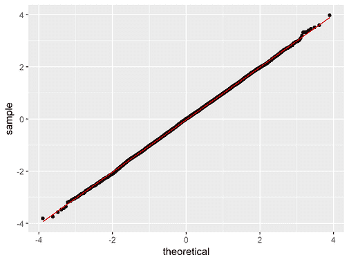

[Q-Q 图](https://statisticsglobe.com/r-qqplot-qqnorm-qqline-function)

例如，中位数是一个分位数，其中 50%的数据低于该点，50%的数据高于该点。Q-Q 图的目的是找出两组数据是否来自相同的分布。Q-Q 图上绘制了**45 度**角；如果两组数据来自相同的分布，则这些点会落在该参考线附近。

知道分布是否正态非常重要，这样才能对数据应用各种统计度量并以更易于人类理解的可视化方式进行解释，而 Q-Q 图正是关键。Q-Q 图回答的最基本问题是曲线是否符合正态分布。

正态分布，但为什么？

Q-Q 图用于找出随机变量的分布类型，无论是高斯分布、均匀分布、指数分布，还是帕累托分布等。

通过仅查看 Q-Q 图，你可以判断分布的类型。一般来说，我们仅讨论正态分布，因为我们有一个非常漂亮的 68-95-99.7 规则，这完全适用于正态分布，因此我们知道数据在均值的第一个、第二个和第三个标准差范围内的分布情况。因此，知道分布是否正态为我们实验打开了新的大门。

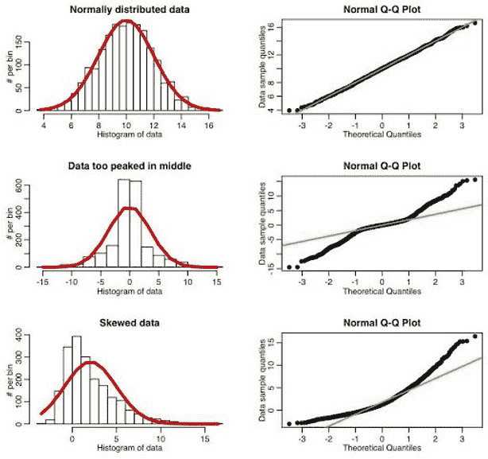

Q-Q 图的类型。[来源](http://sherrytowers.com/2013/08/29/aml-610-fall-2013-module-ii-review-of-probability-distributions/qqplot_examples/)

### 偏态 Q-Q 图

Q-Q 图可以找出分布的偏度（不对称的度量）。

如果 Q-Q 图的下端偏离直线但上端没有，则分布是**左偏（负偏态）**。

现在，如果 Q-Q 图的上端偏离直线而下端没有，则分布是**右偏（正偏态）**。

### 尾部 Q-Q 图

Q-Q 图可以找出分布的峰度（尾部厚度的度量）。

拥有胖尾的分布会使 Q-Q 图的两端偏离直线，而其中心部分跟随直线，而瘦尾分布的 Q-Q 图在两端的偏离非常少或可以忽略，从而使其完美符合正态分布。

### Python 中的 Q-Q 图([来源](https://www.statology.org/q-q-plot-python/))

假设我们有以下包含 100 个值的数据集：

```py
**import** **numpy** **as** **np

#create dataset** **with** **100** **values that follow a normal distribution
np****.****random****.****seed****(****0****)** **data** **=** **np****.****random****.****normal****(****0****,****1****,** **1000****)** **#view first** **10** **values
data****[****:****10****]** 
```

```py
array([ 1.76405235,  0.40015721,  0.97873798,  2.2408932 ,  1.86755799,
       -0.97727788,  0.95008842, -0.15135721, -0.10321885,  0.4105985 ])
```

要为这个数据集创建 Q-Q 图，我们可以使用[qqplot()函数](https://www.statsmodels.org/stable/generated/statsmodels.graphics.gofplots.qqplot.html)来自 statsmodels 库：

```py
**import** **statsmodels****.****api** **as** **sm** **import** **matplotlib****.****pyplot** **as** **plt

#create** **Q****-****Q** **plot** **with** **45****-****degree line added to plot
fig** **=** **sm****.****qqplot****(****data****,** **line****=****'45'****)** **plt****.****show****(****)**
```

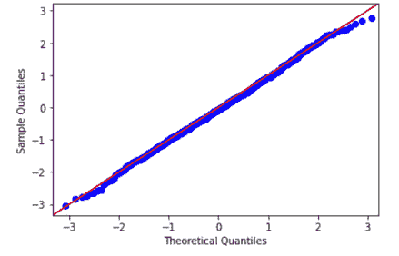

在 Q-Q 图中，x 轴显示**理论分位数**。这意味着它不显示你的实际数据，而是表示如果你的数据是正态分布的，它应该位于什么位置。

y 轴显示的是你的**实际数据**。这意味着如果数据值沿着一个大致的 45 度角直线分布，那么数据是正态分布的。

我们可以在上面的 Q-Q 图中看到，数据值趋向于紧密地沿 45 度线分布，这意味着数据很可能是正态分布的。这并不奇怪，因为我们生成了 100 个数据值，使用了[**numpy.random.normal() 函数**](https://numpy.org/doc/stable/reference/random/generated/numpy.random.normal.html)。

相反，假设我们生成了一个包含 100 个均匀分布值的数据集，并为该数据集创建了一个 Q-Q 图：

```py
**#create dataset** **of** **100** **uniformally distributed values** **data** **=** **np****.****random****.****uniform****(****0****,****1****,** **1000****)**

**#generate** **Q****-****Q** **plot** **for** **the dataset** **fig** **=** **sm****.****qqplot****(****data****,** **line****=****'45'****)** **plt****.****show****(****)**
```

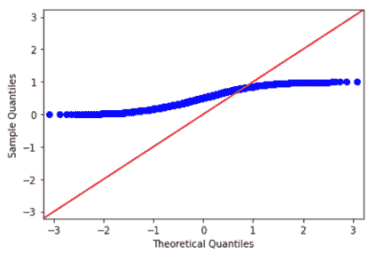

数据值明显不沿着红色 45 度线分布，这表明它们不符合正态分布。

## 切比雪夫不等式

在概率论中，**切比雪夫不等式**，也称为“**比纳耶夫-切比雪夫**”不等式，保证对于广泛的概率分布类，只有一定比例的值会落在距离分布均值的特定范围内。

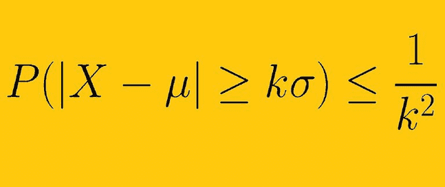

来源: [`www.thoughtco.com/chebyshevs-inequality-3126547`](https://www.thoughtco.com/chebyshevs-inequality-3126547)

切比雪夫不等式类似于**经验法则（68-95-99.7）**；然而，后者规则仅适用于正态分布。切比雪夫不等式更广泛；它适用于任何分布，只要该分布包含定义的方差和均值。

所以切比雪夫不等式表明，至少有**（1-1/k²）**的数据必须落在均值的**K**个标准差范围内（或者等价地，不超过**1/k²**的分布值可以偏离均值超过 k 个标准差）。

其中**K** --> 正实数

如果数据不是正态分布，则不同数量的数据可能会落在一个标准差内。切比雪夫不等式提供了一种方法，了解在任何数据分布中，有多少数据位于均值的**K**个标准差范围内。

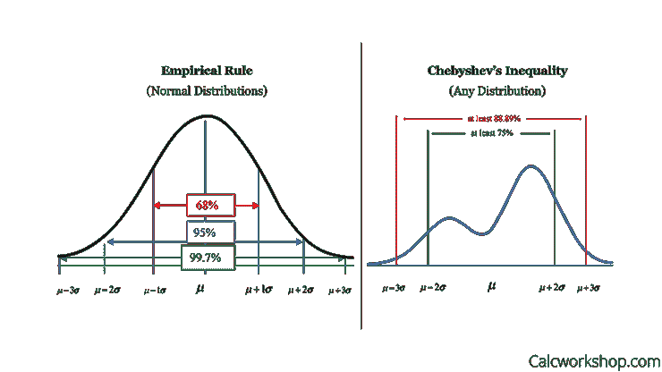

资料来源: [`calcworkshop.com/joint-probability-distribution/chebyshev-inequality/`](https://calcworkshop.com/joint-probability-distribution/chebyshev-inequality/)

切比雪夫不等式非常有价值，因为它可以应用于任何给定均值和方差的概率分布。

让我们考虑一个例子，假设有 1000 名应聘者来参加面试，但只有 70 个职位。为了在所有应聘者中挑选出最优秀的 70 人，招聘者会进行测试来评估他们的潜力。测试的平均分是 60，标准差是 6。如果某个应聘者的分数是 84，他们能否假设自己获得了工作？

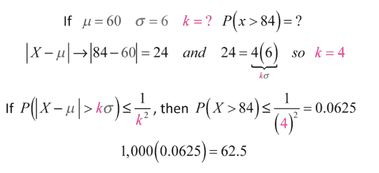

结果显示，大约有 63 人得分超过 60，因此在 70 个职位空缺的情况下，得分 84 的参赛者可以确保获得该职位。

### Python 中的切比雪夫不等式（[源](https://gist.github.com/chaipi-chaya/9eb72978dbbfd7fa4057b493cf6a32e7)）

创建一个 1,000,000 值的总体，我使用了形状=2、尺度=2 的伽玛分布（也适用于其他分布）。

```py
**import** numpy as np
**import** random
**import** matplotlib.pyplot as plt

**#create a population** **with** **a gamma distribution**
shape, scale = 2., 2\.  #mean=4, std=2*sqrt(2)
mu = shape*scale #mean and standard deviation
sigma = scale*np.sqrt(shape)

s = np.random.gamma(shape, scale, 1000000)
```

现在从总体中抽样 10,000 个值。

```py
**#sample** **10000** **values**
rs = random.choices(s, k=10000)
```

计算与期望值距离超过 k 个标准差的样本数量，并用该数量计算概率。我想描绘一个当 k 增加时概率的趋势，因此我使用了从 0.1 到 3 的 k 范围。

```py
**#****set** **k**
ks = [0.1,0.5,1.0,1.5,2.0,2.5,3.0]

**#probability list**
probs = [] **#****for** **each k**

for k in ks: 
    **#start count**
    c = 0
    for i in rs:
        **#** count if far from mean in k standard deviation
        if abs(i - mu) > k * sigma :
            c += 1
    probs.append(c/10000)
```

绘制结果：

```py
plot = plt.figure(figsize=(20,10))
**#plot each probability**
plt.xlabel('**K**')
plt.ylabel('**probability**')
plt.plot(ks,probs, marker='o')
plot.show()
**#print each probability**
print("Probability of a sample far from mean more than k standard deviation:")
for i, prob in enumerate(probs):
    print("k:" + str(ks[i]) + ", probability: " \
          + str(prob)[0:5] + \
          " | in theory, probability should less than: " \
          + str(1/ks[i]**2)[0:5])
```

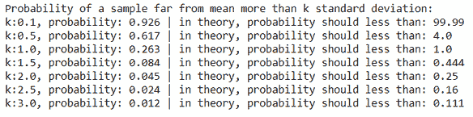

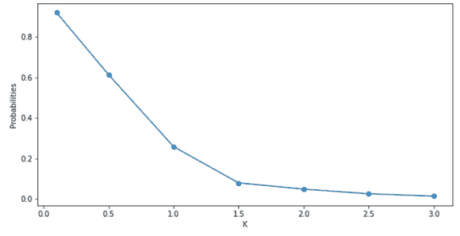

从上述图表和结果中，我们可以看到，随着 k 的增加，概率在减少，每个 k 的概率遵循不等式。此外，只有 k 大于 1 的情况是有用的。如果 k 小于 1，则不等式的右侧大于 1，这没有用，因为概率不能大于 1。

## 对数正态分布

在概率论中，**对数正态分布**，也称为**高尔顿分布**，是随机变量的连续概率分布，其对数服从正态分布。

因此，如果随机变量**X**服从对数正态分布，则**Y = ln(X)**服从正态分布。等效地，如果**Y**服从正态分布，则**Y**的指数函数，即**X = exp(Y)**，服从对数正态分布。

低均值、高方差且所有值均为正的偏斜分布符合这种分布类型。对数正态分布的随机变量只取正实值。

对数正态分布的概率密度函数的一般公式为：

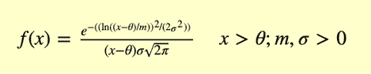

位置参数和尺度参数相当于随机变量对数的均值和标准差。

对数正态分布的形状由 3 个参数定义：

1.  ***σ*** 是形状参数（也是分布对数的标准差）

1.  **θ**或**μ**是位置参数（也是分布的均值）

1.  **m** 是尺度参数（也是分布的中位数）

位置参数和尺度参数相当于随机变量对数的均值和标准差，如上所述。

如果**x = θ**，则**f(x) = 0**。其中**θ = 0**和**m = 1**的情况称为**标准对数正态分布**。**θ**等于零的情况称为**2 参数对数正态分布**。

以下图表说明了**位置（μ）**和**形状（*σ*）**参数对对数正态分布的概率密度函数的影响：

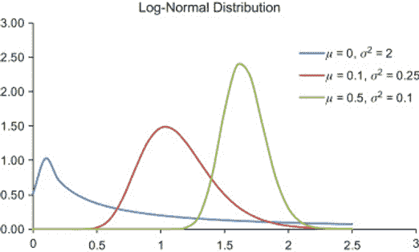

来源：[`www.sciencedirect.com/topics/mathematics/lognormal-distribution`](https://www.sciencedirect.com/topics/mathematics/lognormal-distribution)

### Python 中的对数正态分布 ([来源](https://stackoverflow.com/a/41968334/7175247))

让我们考虑一个例子，使用 scipy.stats.lognorm 函数生成 **μ=1** 和 **σ=0.5** 的对数正态分布的随机数。

```py
**import** numpy **as** np
**import** matplotlib.pyplot **as** plt
**from** scipy.stats **import** lognorm

np.random.seed(42)

data = lognorm.rvs(s=0.5, loc=1, scale=1000, size=1000)

plt.figure(figsize=(10,6))
ax = plt.subplot(111)
plt.title('**Generate wrandom numbers from a Log-normal distribution**')
ax.hist(data, bins=np.logspace(0,5,200), density=True)
ax.set_xscale("**log**")

shape,loc,scale = lognorm.fit(data)

x = np.logspace(0, 5, 200)
pdf = lognorm.pdf(x, shape, loc, scale)

ax.plot(x, pdf, 'y')
plt.show()
```

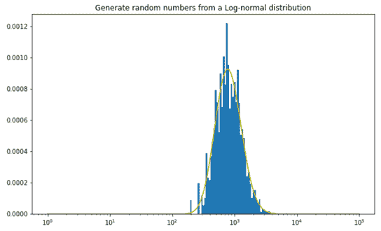

## 幂律分布

在统计学中，**幂律** 是两种量之间的函数关系，其中一种量的相对变化导致另一种量的相对变化成比例，不受这些量初始大小的影响：一种量作为另一种量的幂变化。

例如，考虑一个正方形的面积与其边长的关系，如果边长加倍，面积则乘以四。

幂律分布的形式为 **Y = k Xα**，

其中：

+   **X** 和 **Y** 是感兴趣的变量，

+   **α** 是法则的指数，

+   **k** 是一个常数。

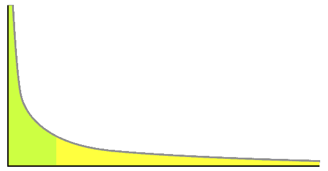

来源：[`en.wikipedia.org/wiki/Power_law`](https://en.wikipedia.org/wiki/Power_law)

幂律分布只是众多概率分布中的一种，但被认为是评估正态分布无法处理的不确定性问题的宝贵工具，当这些问题发生在一定概率时。

许多过程在广泛的值范围内被发现遵循幂律。从收入分布、小行星体的大小、地震震级、深度神经网络中的权重矩阵的谱密度、单词使用、各种网络中的邻居数量等。（注意：这里的幂律是一个连续分布。最后两个例子是离散的，但在大规模下可以建模为连续的）。

### Python 中的幂律分布 ([来源](https://towardsdatascience.com/generating-pareto-distribution-in-python-2c2f77f70dbf))

让我们绘制 [帕累托分布](https://en.wikipedia.org/wiki/Pareto_distribution)，这是一种幂律概率分布的形式。帕累托分布有时被称为帕累托原则或**‘80–20’** 规则，因为该规则指出，80% 的社会财富掌握在 20% 的人口手中。帕累托分布不是自然法则，而是一种观察结果。它在许多现实世界问题中很有用。这是一种偏斜的重尾分布。

```py
**import** numpy **as** np
**import** matplotlib.pyplot **as** plt
**from** scipy.stats **import** pareto

x_m = 1 #scale
alpha = [1, 2, 3] #list of values of shape parameters
plt.figure(figsize=(10,6))
samples = np.linspace(start=0, stop=5, num=1000)
for a in alpha:
    output = np.array([pareto.pdf(x=samples, b=a, loc=0, scale=x_m)])
    plt.plot(samples, output.T, label='alpha {0}' .format(a))

plt.xlabel('**samples**', fontsize=15)
plt.ylabel('**PDF**', fontsize=15)
plt.title('**Probability Density function**', fontsize=15)
plt.legend(loc='**best**')
plt.show()
```

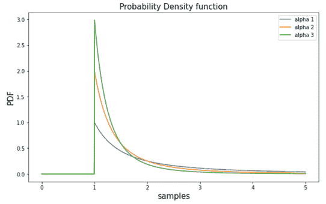

## Box-Cox 变换

**Box-Cox 变换** 将我们的数据转换为接近正态分布的形式。

一参数 Box-Cox 变换定义为在许多统计技术中，我们假设误差是正态分布的。这一假设允许我们构建置信区间并进行假设检验。通过转换目标变量，我们可以（希望）将误差归一化（如果它们尚未正态化）。

此外，变换我们的变量可以提高模型的预测能力，因为变换可以去除白噪声。

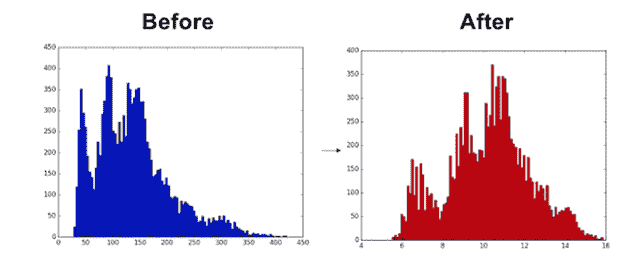

原始分布（左）和应用 Box-Cox 变换后的接近正态分布。[来源](https://medium.com/@patricklcavins/using-scipys-powertransformer-3e2b792fd712)

Box-Cox 变换的核心是一个指数**lambda (λ)**，其范围从-5 到 5。所有**λ**的值都被考虑，并为你的数据选择最佳值；“最佳值”是使数据最佳逼近正态分布曲线的值。

一参数 Box-Cox 变换定义为：

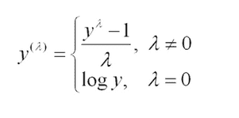

以及两个参数的 Box-Cox 变换为：

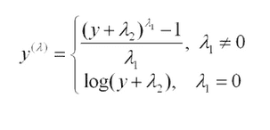

此外，一参数 Box-Cox 变换适用于**y > 0**，即仅适用于正值；而两个参数 Box-Cox 变换适用于**y > -λ**，即负值。

参数**λ**是使用[剖面似然](https://en.wikipedia.org/wiki/Profile_likelihood)函数和拟合优度测试来估计的。

如果我们谈论 Box-Cox 变换的一些缺点，那么如果你想进行解释的话，Box-Cox 是不推荐的。因为如果**λ**是某个非零数字，那么变换后的目标变量可能比简单地应用对数变换更难以解释。

第二个障碍是，Box-Cox 变换通常在我们将变换后的数据恢复到原始尺度时给出预测分布的中位数。有时，我们需要的是均值而不是中位数。

### Python 中的 Box-Cox 变换（[来源](https://www.geeksforgeeks.org/box-cox-transformation-using-python/)）

SciPy 的 stats 包提供了一个名为 boxcox 的函数，用于执行 Box-Cox 幂变换，该函数接受原始非正态数据作为输入，并返回拟合的数据以及用于将非正态分布拟合到正态分布的 lambda 值。

```py
#load necessary packages
**import** numpy **as** np 
**from** scipy.stats **import** boxcox 
**import** seaborn **as** sns 

#make this example reproducible
np.random.seed(0)

#**generate dataset**
data = np.random.exponential(size=1000)

fig, ax = plt.subplots(1, 2)
#**plot the distribution** **of** **data values**
sns.distplot(data, hist=False, kde=True, 
             kde_kws = {'shade': True, 'linewidth': 2}, 
            label = "Non-Normal", color ="red", ax = ax[0]) 

#**perform Box****-****Cox transformation on original data**
transformed_data, best_lambda = boxcox(data) 

sns.distplot(transformed_data, hist = False, kde = True,
            kde_kws = {'shade': True, 'linewidth': 2}, 
            label = "**Normal**", color ="**red**", ax = ax[1])

#**adding legends to the subplots**
plt.legend(loc = "**upper right**")

#**rescaling the subplots**
fig.set_figheight(5)
fig.set_figwidth(10)
#**display optimal lambda value**
print(f"**Lambda value used for Transformation: {best_lambda}**")
```

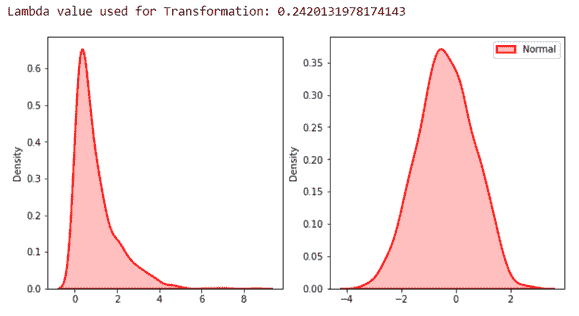

## 泊松分布

在概率论和统计学中，**泊松分布**是一种离散概率分布，它表示在固定时间间隔或空间中，给定事件发生的数量的概率，前提是这些事件以已知的常数平均速率发生，并且独立于上一个事件以来的时间。

简单来说，泊松分布可以用来估计某事发生“X”次的可能性。

一些泊松过程的例子包括客户拨打帮助中心电话、原子中的放射性衰变、网站访问者、到达空间望远镜的光子以及股票价格的波动。泊松过程通常与时间相关，但并不一定如此。

泊松分布的公式是：

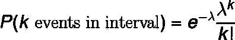

其中：

+   **e** 是欧拉数（*e* = 2.71828...）

+   **k** 是发生的次数

+   **k!** 是 **k** 的阶乘

+   **λ** 等于 **k** 的期望值，当且仅当它也等于其方差时。

Lambda(**λ**) 可以被认为是区间内事件的期望数量。随着我们改变速率参数 λ，我们也改变了在一个区间内观察到不同数量事件的概率。下面的图是泊松分布的概率质量函数，展示了在不同速率参数下事件发生的概率。

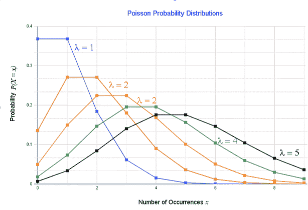

泊松分布的概率质量函数，速率参数变化的情况。[来源](https://www.analyzemath.com/probabilities/poisson-distribution-examples.html)

泊松分布也常用于建模财务计数数据，其中计数很小，且经常为零。例如，在金融领域，它可以用来建模一个典型投资者在某一天的交易次数，这个次数可以是 0（经常发生），也可以是 1、2 等。

作为另一个例子，这个模型可以用来预测在给定时间段内，比如十年中，市场将发生多少次“冲击”。

### Python 中的泊松分布

```py
**from** numpy **import** random
**import** matplotlib.pyplot as plt
**import** seaborn as sns

lam_list = [1, 4, 9] **#list** **of** **Lambda values** 

plt.figure(figsize=(10,6))
samples = np.linspace(start=0, stop=5, num=1000)

for lam in lam_list:
    sns.distplot(random.poisson(lam=lam, size=10), hist=False, label='**lambda {0}**'.format(lam))

plt.xlabel('**Poisson Distribution**', fontsize=15)
plt.ylabel('**Frequency**', fontsize=15)
plt.legend(loc='**best**')
plt.show()
```

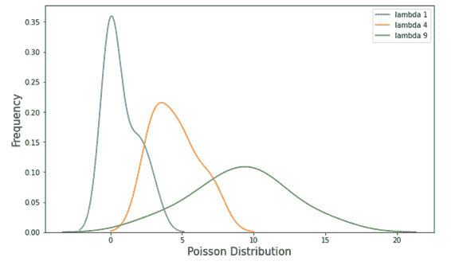

随着 **λ** 变大，图形看起来越来越像正态分布。

希望你喜欢阅读这篇文章。如果有任何问题或建议，请留下评论。

随时通过 [**LinkedIn**](https://www.linkedin.com/in/nagesh-singh-chauhan-6936bb13b/) 与我联系，有任何问题请随时提问。

**感谢阅读！！！**

**参考文献**

+   [`calcworkshop.com/joint-probability-distribution/chebyshev-inequality/`](https://calcworkshop.com/joint-probability-distribution/chebyshev-inequality/)

+   [`corporatefinanceinstitute.com/resources/knowledge/data-analysis/chebyshevs-inequality/`](https://corporatefinanceinstitute.com/resources/knowledge/data-analysis/chebyshevs-inequality/)

+   [`www.itl.nist.gov/div898/handbook/eda/section3/eda3669.htm`](https://www.itl.nist.gov/div898/handbook/eda/section3/eda3669.htm)

+   [`www.statology.org/q-q-plot-python/`](https://www.statology.org/q-q-plot-python/)

+   [`gist.github.com/chaipi-chaya/9eb72978dbbfd7fa4057b493cf6a32e7`](https://gist.github.com/chaipi-chaya/9eb72978dbbfd7fa4057b493cf6a32e7)

+   [`stackoverflow.com/a/41968334/7175247`](https://stackoverflow.com/a/41968334/7175247)

[原文](https://www.theaidream.com/post/advanced-statistical-concepts-in-data-science). 经许可转载。

**相关：**

+   数据科学家应该了解的推断统计学

+   数据科学家需要知道的重要统计学

+   零样本学习：你能在没有见过物体的情况下对其进行分类吗？

### 更多相关主题

+   [回到基础 第 2 周：数据库、SQL、数据管理及……](https://www.kdnuggets.com/back-to-basics-week-2-database-sql-data-management-and-statistical-concepts)

+   [10 个用简单英语解释的基本统计概念](https://www.kdnuggets.com/10-basic-statistical-concepts-in-plain-english)

+   [数据科学的 8 个基本统计概念](https://www.kdnuggets.com/2020/06/8-basic-statistics-concepts.html)

+   [你应该了解的 7 个 SQL 概念](https://www.kdnuggets.com/2022/11/7-sql-concepts-needed-data-science.html)

+   [ChatGPT 作为学习数据科学概念的个性化辅导员](https://www.kdnuggets.com/2023/05/chatgpt-personalized-tutor-learning-data-science-concepts.html)

+   [你应该了解的 5 个梯度下降和成本函数概念](https://www.kdnuggets.com/2020/05/5-concepts-gradient-descent-cost-function.html)
