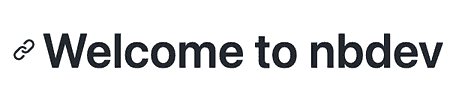
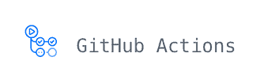
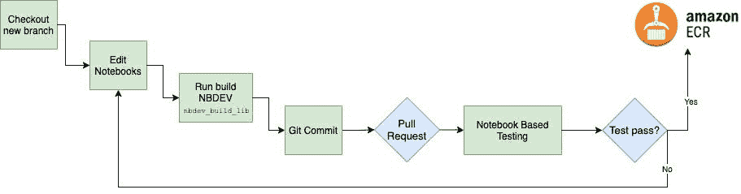
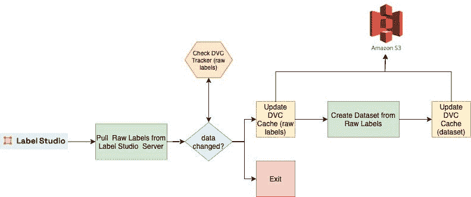
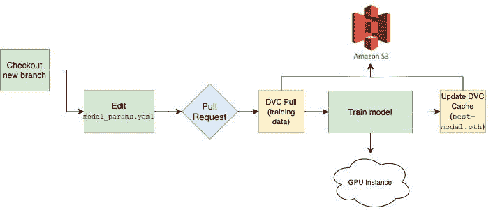
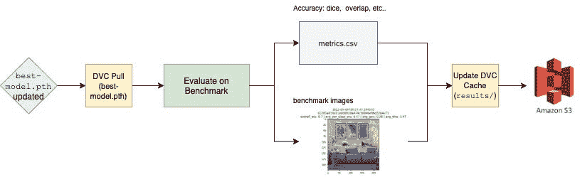

# 在 MLOps 中探索 Github Actions、Iterative.ai、Label Studio 和 NBDEV

> 原文：[`www.kdnuggets.com/2021/09/adventures-mlops-github-actions-iterative-ai-label-studio-and-nbdev.html`](https://www.kdnuggets.com/2021/09/adventures-mlops-github-actions-iterative-ai-label-studio-and-nbdev.html)

评论

**由 [Aaron Soellinger](https://www.linkedin.com/in/aaronsoellinger/) 和 [Will Kunz](https://www.linkedin.com/in/willkunz/)**

在为我们的项目设计 MLOps 堆栈时，我们需要一个解决方案，允许高度的定制和灵活性，以便随着实验的需要而演变。我们考虑了包含许多功能的大型平台，但在一些关键领域感到受限。最终，我们决定采用一种方法，分别实现专用工具用于标注、数据版本控制和持续集成。本文记录了我们构建这种自定义 MLOps 方法的经验。


图片由 [Finding Dan | Dan Grinwis](https://unsplash.com/@finding_dan?utm_source=unsplash&utm_medium=referral&utm_content=creditCopyText) 提供，来自 [Unsplash](https://unsplash.com/s/photos/unknown?utm_source=unsplash&utm_medium=referral&utm_content=creditCopyText)

## NBDEV



（摘自 [`github.com/fastai/nbdev`](https://github.com/fastai/nbdev)）

使用 Jupyter 进行开发的经典问题是，从原型到生产需要将代码从笔记本复制/粘贴到 python 模块中。NBDEV 自动化了笔记本和模块之间的过渡，从而使 Jupyter 笔记本成为生产管道的官方部分。NBDEV 允许开发者指定笔记本应创建哪个模块，哪些笔记本单元格应推送到模块中，以及哪些笔记本单元格是测试。NBDEV 的一个关键功能是其在笔记本内测试的方法，NBDEV 模板甚至提供了一个基础的 Github Action，用于在 CI/CD 框架中实现测试。生成的 Python 模块不需要开发者编辑，可以使用内置的 python 导入功能轻松集成到其他笔记本或项目中。

## Iterative.ai: DVC/CML


（摘自 [`iterative.ai/`](https://iterative.ai/)）

机器学习管道中使用的文件通常是大型二进制/压缩文件的归档，这些文件对现有的版本控制解决方案如 git 来说不可访问或成本过高。DVC 通过将大型数据集表示为文件内容的哈希来解决数据版本控制问题，这使得 DVC 能够跟踪变化。它的工作原理类似于 git（例如 `dvc add`，`dvc push`）。当你在数据集上运行 `dvc add` 时，它会被添加到 `.gitignore` 并由 `dvc` 跟踪变化。CML 是一个项目，提供了从 Github Actions 工作流发布模型工件到 Github Issues、拉取请求等评论中的功能。这很重要，因为它帮助我们开始填补拉取请求中对训练数据变化以及模型准确性和有效性的记录缺口。

## Github Actions



（摘自 [`github.com/features/actions`](https://github.com/features/actions)）

我们希望进行自动化代码测试，包括在自动化测试管道中构建模型。Github Actions 与 CircleCI、Travis、Jenkins 竞争，旨在自动化代码推送、提交、拉取请求等的测试。由于我们已经使用 Github 托管我们的代码库，因此通过使用 Actions 避免了使用其他第三方应用。在这个项目中，我们需要使用 Github 自托管的运行器在本地 GPU 集群上运行任务。

## Label Studio


（摘自 [`labelstud.io/`](https://labelstud.io/)）

我们深入研究了如何使用 Label Studio，详细信息见 [这里](https://towardsdatascience.com/development-of-a-benchmark-dataset-with-an-interface-to-the-fastai-dataloader-using-label-studio-d3aa3c26661f)。Label Studio 是一个数据标注解决方案。它运行良好，并且灵活，适用于各种环境。

## 为什么要将它们一起使用？

该设置旨在加快模型部署速度。这意味着更多的数据科学家可以和谐并行工作，代码库透明，并且新人员的入职时间更快。目标是标准化数据科学家在项目中需要执行的活动类型，并为他们提供明确的指示。

以下是我们希望通过此系统设计来简化的任务列表：

1.  自动化从 Label Studio 的数据摄取，并提供一个单一的点来将数据摄取到模型训练和评估活动中。

1.  对数据管道代码进行自动化测试，即单元测试和重新部署流程使用的容器。

1.  对模型代码进行自动化测试，即单元测试和重新部署流程使用的容器。

1.  启用自动化测试，包括模型的重新训练和评估标准。当模型代码发生变化时，用新代码训练一个模型，并将其与现有的现任模型进行比较。

1.  当训练数据发生变化时触发模型重新训练。

以下是每个任务的管道描述。

## 传统 CI/CD 管道

该管道实施了对每个拉取请求的自动化测试反馈，包括语法、单元、回归和集成测试的评估。这个过程的结果是一个功能上经过测试的 Docker 镜像被放入我们的私有存储库中。这个过程最大化了最新的最佳代码在存储库中作为完全测试的镜像用于下游任务的可能性。以下是新特性的开发生命周期在这种背景下的工作方式：



这里展示了编辑代码时工作流的功能。使用 NBDEV 使我们可以直接从 Jupyter notebooks 中工作，包括在 notebook 中直接编写测试。NBDEV 要求 notebooks 中的所有单元格都必须无例外地运行（除非单元格标记为不运行）。 (图片来源：作者)

## 数据管道

Label Studio 目前缺乏事件钩子来启用对存储的标签数据的更改更新。因此，我们采取了 `cron` 触发的方法，每小时更新一次数据集。此外，当标签数据集足够小时，这些更新也可以作为训练管道的一部分进行。我们可以通过 Github Actions 接口按需触发数据管道刷新。



数据管道从 Label Studio 读取数据，并将数据集的每个版本及相关输入持久化到存储在 AWS S3 中的 DVC 缓存。 (图片来源：作者)

## 模型管道

模型管道将模型训练集成到存储库的 CI/CD 管道中。这使得每个拉取请求不仅能评估代码库中配置的语法、单元、集成和回归测试，还能提供评估新生成模型的反馈。



在这种情况下，工作流运行配置文件（model_params.yaml）中指定的模型训练实验，并更新模型工件（best-model.pth）。 (图片来源：作者)

## 基准评估管道

基准评估管道形成了一个“官方提交”过程，以确保所有建模活动都按照项目的度量标准进行衡量。



新训练的模型在 best-model.pth 中与基准数据集进行评估，结果会用最新的提交哈希标记并持久化到 AWS S3 中。 (图片来源：作者)

## 工作流

这里是 DVC 使用的 DAG 定义文件。它捕获工作流步骤及其输入，并允许在不同用户和机器间进行可重现性。

```py
stages:
  labelstudio_export_trad:
    cmd: python pipelines/1_labelstudio_export.py --config_fp pipelines/traditional_pipeline.yaml
      --ls_token *** --proj_root "."
    params:
    - pipelines/traditional_pipeline.yaml:
      - src.host
      - src.out_fp
      - src.proj_id
  dataset_create_trad:
    cmd: python pipelines/2_labelstudio_todataset.py --config_fp pipelines/create_traditional.yaml
      --proj_root "."
    deps:
    - data/raw_labels/traditional.json
    params:
    - pipelines/create_traditional.yaml:
      - dataset.bmdata_fp
      - dataset.labels_map
      - dataset.out_fp
      - dataset.rawdata_dir
  train_model_trad:
    cmd: python pipelines/3_train_model.py --config_fp pipelines/model_params.yaml
      --proj_root "."
    deps:
    - data/traditional_labeling
    params:
    - pipelines/model_params.yaml:
      - dataloader.bs
      - dataloader.size
      - dataloader.train_fp
      - dataloader.valid_fp
      - learner.backbone
      - learner.data_dir
      - learner.in_checkpoint
      - learner.metrics
      - learner.n_out
      - learner.wandb_project_name
      - train.cycles
  labelstudio_export_bench:
    cmd: python pipelines/1_labelstudio_export.py --config_fp pipelines/benchmark_pipeline.yaml
      --ls_token *** --proj_root "."
    params:
    - pipelines/benchmark_pipeline.yaml:
      - src.host
      - src.out_fp
      - src.proj_id
  dataset_create_bench:
    cmd: python pipelines/2_labelstudio_todataset.py --config_fp pipelines/create_benchmark.yaml
      --proj_root "."
    deps:
    - data/raw_labels/benchmark.json
    params:
    - pipelines/create_benchmark.yaml:
      - dataset.bmdata_fp
      - dataset.labels_map
      - dataset.out_fp
      - dataset.rawdata_dir
  eval_model_trad:
    cmd: python pipelines/4_eval_model.py --config_fp pipelines/bench_eval.yaml --proj_root
      "."
    deps:
    - data/models/best-model.pth
    params:
    - pipelines/bench_eval.yaml:
      - eval.bench_fp
      - eval.label_config
      - eval.metrics_fp
      - eval.model_conf
      - eval.overlay_dir
```

## 发现

1.  Github Actions 工作流的 `cron` 触发器不够可靠。它不能保证定时性。

1.  DVC 在触发的 Github Action 工作流中表现不够清晰。它会更改源控制的跟踪器，当这些更改被提交时，会创建另一个 Github Action。

1.  Github Actions 作为运行模型的编排机制需要一个自托管的运行器来使用 GPU。这意味着要连接到云端或本地的 GPU 实例，这会带来访问控制的问题。例如，我们不能公开源代码库而不从代码库中移除自托管运行器的配置，否则随机的人可能会通过推送代码到项目中在我们的训练服务器上运行工作负载。

1.  NBDEV 内置的工作流是在错误的地方测试代码。它是在笔记本中进行测试，而不是在编译后的包中测试。一方面，能够说“测试可以直接写入笔记本”是很好的。另一方面，直接测试笔记本会留下一个可能性，即 NBDEV 创建的代码包可能会失败，即使笔记本运行正常。我们需要的是能够直接测试 NBDEV 编译后的包。

1.  NBDEV 与“传统” Python 开发不兼容，因为 NBDEV 是单向的。它仅允许在互动的 Jupyter 笔记本风格中开发项目。它使得直接开发 Python 模块变得不可能。如果项目在任何时候想要转换为“传统” Python 开发，测试需要通过其他方式完成。

1.  起初，我们使用 Weights & Biases 作为实验跟踪仪表盘，然而在将其部署到 Github Action 中时遇到了问题。我们可以说，实现 `wandb` 的用户体验在 Action Workflow 中遇到了第一次障碍。移除 Weights & Biases 立即解决了问题。在那之前，`wandb` 被认为是 MLOps 中最好的用户体验。

## **结论**

最终，完成这些工具的实现需要一周时间，这些工具用于使用 Github Actions、Iterative.ai 工具（DVC 和 CML）以及 NBDEV 来管理我们的代码。这为我们提供了以下能力：

1.  从 Jupyter 笔记本中工作，作为代码的记录系统。我们喜欢 Jupyter。它的主要用例是让我们能够直接在任何可以通过 SSH 访问的硬件上工作，通过在那里托管 Jupyter 服务器并将其转发到桌面上。需要明确的是，即使我们不使用 NBDev，我们也会这样做，因为替代方案是使用 Vim 或其他我们不那么喜欢的工具。过去用 VS Code 或 Pycharm 连接到远程服务器的实验失败了。所以我们选择 Jupyter。

1.  测试代码，并测试它创建的模型。现在作为 CI/CD 流水线的一部分，我们可以评估从代码库的更改中产生的模型是否变得更好、更差或保持不变。这些都可以在合并到 `main` 之前的拉取请求中完成。

1.  使用 Github Actions 服务器作为训练运行的编排器开始允许多个数据科学家以更清晰的方式同时工作。未来，我们将看到这种设置在编排协作数据科学过程中的局限性。

**[Aaron Soellinger](https://www.linkedin.com/in/aaronsoellinger/)** 曾作为数据科学家和软件工程师解决金融、预测维护和体育领域的问题。他目前作为 Hoplabs 的机器学习系统顾问，致力于多摄像头计算机视觉应用的开发。

**[Will Kunz](https://www.linkedin.com/in/willkunz/)** 是一名后端软件开发人员，面对挑战时总是展现出积极的态度和顽强的决心。不论是追踪难以捉摸的错误，还是快速适应新技术，Will 都希望找到解决方案。

[原文](https://towardsdatascience.com/machine-learning-lifecycle-with-mlops-github-actions-label-studio-iterative-ai-and-nbdev-30515f444a3e)。转载经许可。

**相关：**

+   MLOps 最佳实践

+   MLOps 是一种工程学科：初学者概述

+   MLOps 和机器学习路线图

* * *

## 我们的三大课程推荐

 1\. [谷歌网络安全证书](https://www.kdnuggets.com/google-cybersecurity) - 快速进入网络安全职业。

 2\. [谷歌数据分析专业证书](https://www.kdnuggets.com/google-data-analytics) - 提升你的数据分析技能

 3\. [谷歌 IT 支持专业证书](https://www.kdnuggets.com/google-itsupport) - 支持你的组织进行 IT 工作

* * *

### 更多相关话题

+   [使用 Jupysql 和 GitHub Actions 调度和运行 ETL](https://www.kdnuggets.com/2023/05/schedule-run-etls-jupysql-github-actions.html)

+   [机器学习初学者的 GitHub Actions](https://www.kdnuggets.com/github-actions-for-machine-learning-beginners)

+   [多标签 NLP：类别不平衡和损失函数分析…](https://www.kdnuggets.com/2023/03/multilabel-nlp-analysis-class-imbalance-loss-function-approaches.html)

+   [如何使用机器学习自动标注数据](https://www.kdnuggets.com/2022/02/machine-learning-automatically-label-data.html)

+   [在本地使用 LM Studio 运行 LLM](https://www.kdnuggets.com/run-an-llm-locally-with-lm-studio)

+   [免费使用 Lightning AI Studio](https://www.kdnuggets.com/using-lightning-ai-studio-for-free)
