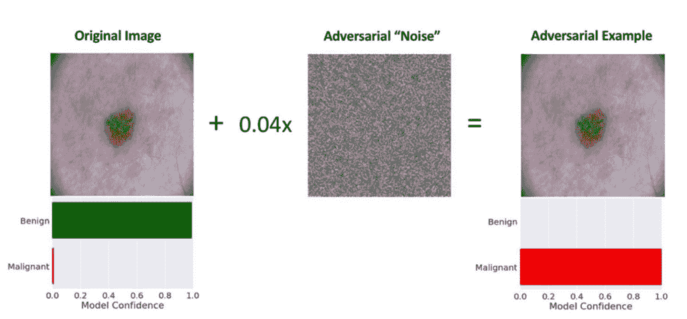
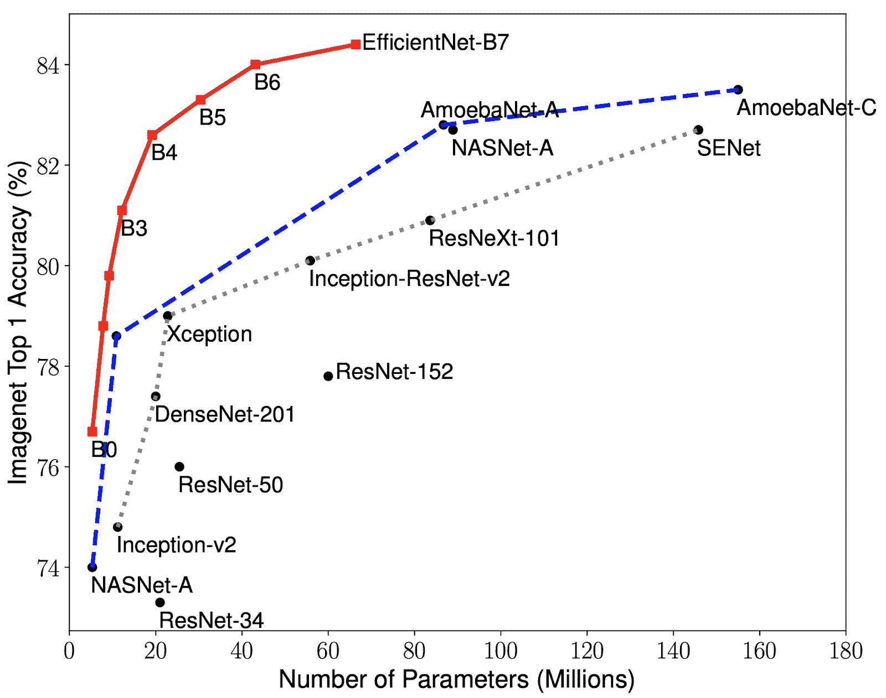
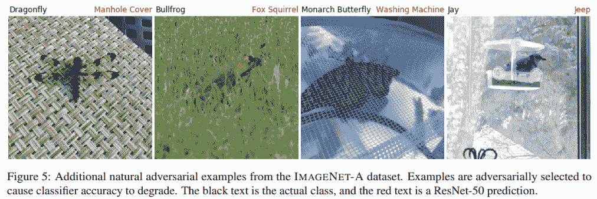
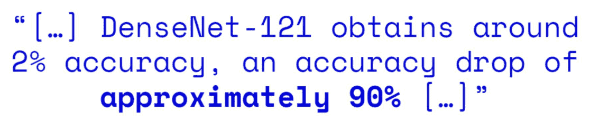
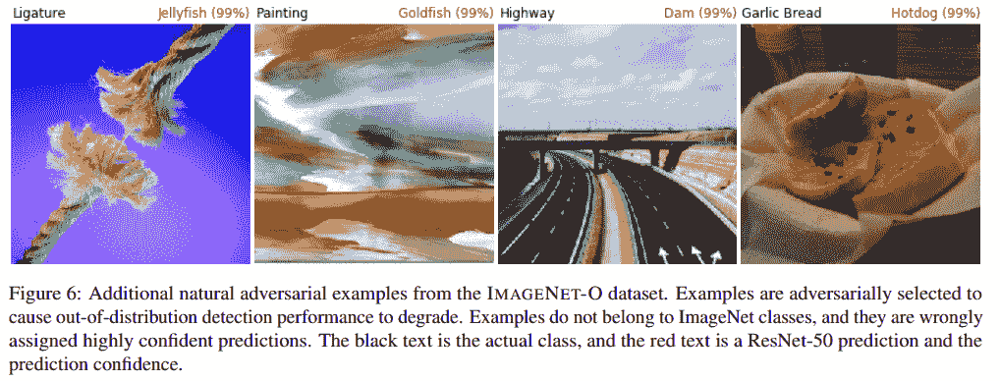
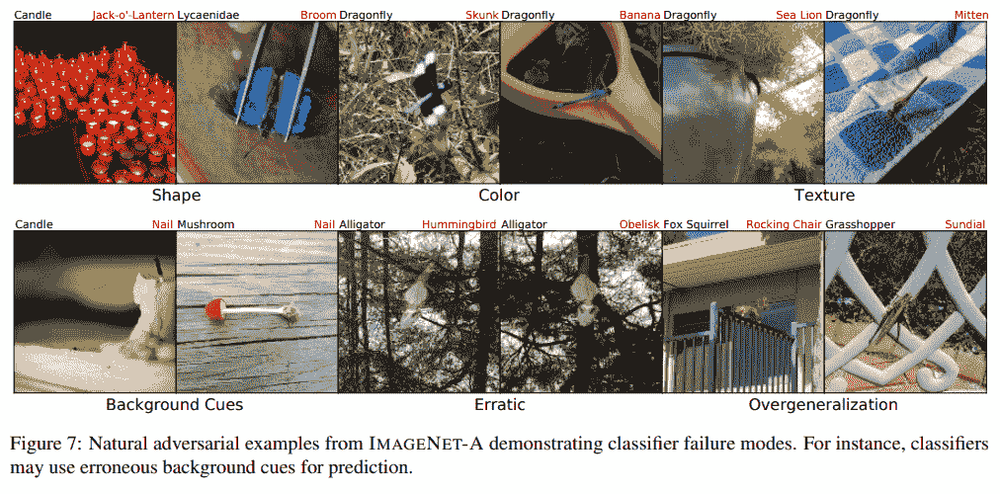
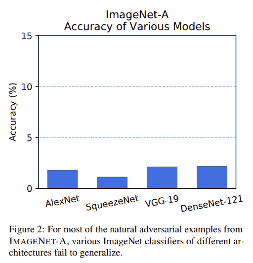
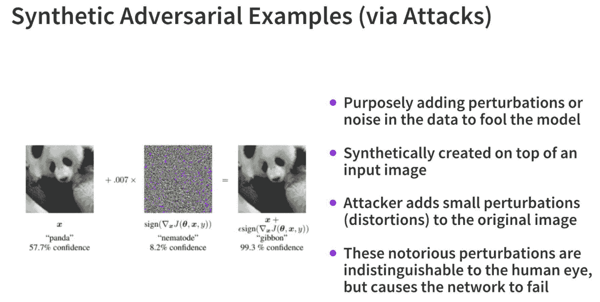
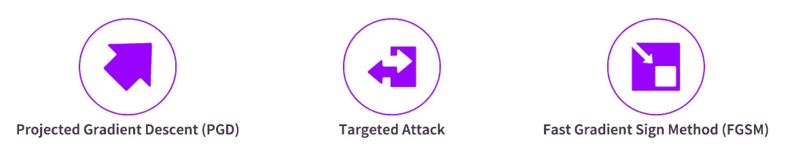

# 深度学习中的对抗样本——入门

> 原文：[`www.kdnuggets.com/2020/11/adversarial-examples-deep-learning-primer.html`](https://www.kdnuggets.com/2020/11/adversarial-examples-deep-learning-primer.html)

评论

### 介绍视觉深度学习模型中的对抗样本

### 介绍

* * *

## 我们的前三名课程推荐

 1\. [Google 网络安全证书](https://www.kdnuggets.com/google-cybersecurity) - 快速进入网络安全职业生涯。

 2\. [Google 数据分析专业证书](https://www.kdnuggets.com/google-data-analytics) - 提升您的数据分析技能

 3\. [Google IT 支持专业证书](https://www.kdnuggets.com/google-itsupport) - 支持您的组织进行 IT 工作

* * *

自从我们开始拥有更强大更先进的计算能力（如 GPU 和 TPU）、更多的数据（如 ImageNet 等）以及易于使用的开源软件和工具（如 TensorFlow 和 PyTorch）以来，我们已经见证了最先进（SOTA）计算机视觉深度学习模型的出现。每年（现在甚至每几个月！），我们都会看到下一个最先进的深度学习模型在基准数据集的 Top-k 准确性方面超越之前的模型。下图展示了一些最新的最先进深度学习视觉模型（但没有展示像 Google 的 BigTransfer 这样的模型！）。

最先进的深度学习视觉模型（来源: https://arxiv.org/abs/1905.11946）

然而，大多数这些最先进的深度学习模型在对特定类别的图像（称为对抗图像）进行预测时会受到严重影响。对抗样本的整体概念可以是自然样本或合成样本。我们将在本文中查看一些例子，以熟悉不同的对抗样本和攻击。

### 对抗样本

自然对抗样本是指自然生成的、对于模型难以理解的图像。合成对抗样本则是攻击者（恶意用户）故意向图像中注入一些噪声，使其在视觉上与原始图像非常相似，但模型最终做出截然不同（且错误）的预测。让我们更详细地查看一些这些例子！

### 自然对抗样本

这些示例，如论文*['**自然对抗示例，**Hendrycks 等'](https://arxiv.org/abs/1907.07174)*中定义的，是*现实世界中的、未经修改的、自然发生的示例，这些示例导致分类器的准确性显著下降*。他们引入了两个新的自然对抗示例数据集。第一个数据集包含 7500 个用于 ImageNet 分类器的自然对抗示例，并作为 ImageNet 分类器的困难测试集，称为 IMAGENET-A。下图展示了 ImageNet-A 数据集中的一些对抗示例。

ResNet-50 在 ImageNet-A 上的示例表现极差（来源: https://arxiv.org/abs/1907.07174）

你可以清楚地看到最先进的（SOTA）ResNet-50 模型在上述示例中的预测有多么错误（和可笑！）。事实上，DenseNet-121 预训练模型在 ImageNet-A 上的准确率仅为 2%！

作者们还策划了一个名为 IMAGENET-O 的对抗性分布外检测数据集，他们声称这是第一个为 ImageNet 模型创建的分布外检测数据集。下图展示了 ResNet-50 对 ImageNet-O 数据集中图像进行推断的一些有趣示例。

ResNet-50 在 ImageNet-O 上的示例表现极差（来源: https://arxiv.org/abs/1907.07174）

这些示例确实很有趣，并展示了 SOTA 预训练视觉模型在一些这些图像上的局限性，这些图像对于这些模型来说更为复杂。一些失败的原因可以归因于深度学习模型在对特定图像进行预测时试图关注的内容。让我们看一些更多的示例来尝试理解这一点。

ImageNet-A 中的自然对抗示例（来源: https://arxiv.org/abs/1907.07174）

基于上述图中展示的示例，很明显深度学习视觉模型在误解方面存在一些特定的模式。例如：

+   尽管模型更多关注于火焰及其照明，但蜡烛仍被预测为南瓜灯，因为缺少南瓜。

+   蜻蜓被预测为臭鼬或香蕉，因为模型更多地关注于颜色和纹理。

+   蘑菇被分类为钉子，因为模型学会将某些元素联系在一起，例如木材-钉子。

+   模型也会遭受过度泛化问题，例如阴影到日晷。

SOTA 深度学习视觉模型在这些示例中的整体表现非常差，如下图所示。

SOTA 深度学习视觉模型在 ImageNet-A 上的表现（来源: https://arxiv.org/abs/1907.07174）

悲哀的是，鲁棒的对抗训练方法几乎无法解决 Hendrycks 等人论文中提到的将自然对抗样本误解释为问题的困难。一些这些方法包括针对特定合成攻击进行训练，如投影梯度下降（PGD）和快速梯度符号方法（FGSM），我们将在后续文章中详细讨论。幸运的是，这些方法在处理恶意合成攻击时表现良好，这通常是更大的问题。

### 合成对抗样本

这些例子基本上涉及在输入图像中人为地引入一些噪声，使其在视觉上仍与原始图像非常相似，但注入的噪声最终会降低分类器的准确性。尽管合成对抗攻击种类繁多，但它们都基于以下图形中所示的一些核心原则。

对抗攻击的关键步骤（来源：https://github.com/dipanjanS/adversarial-learning-robustness）

重点始终是找出一种完美的噪声\扰动张量（数值矩阵）的方法，这些张量可以叠加在原始图像上，使得这些扰动对人眼不可见，但最终使深度学习模型在做出正确预测时失败。上面展示的例子展示了一种快速梯度符号方法（FGSM）攻击，其中我们向输入图像的梯度符号添加了一个小的乘数，并与一张熊猫的图像叠加，使得模型在预测时失败，以为图像是长臂猿。以下图形展示了一些更常见的对抗攻击类型。

常见对抗攻击（来源：https://github.com/dipanjanS/adversarial-learning-robustness）

### 接下来是什么？

在接下来的几篇文章中，我们将讨论上述每种对抗攻击方法，并展示如何通过实际代码示例欺骗最新最好的 SOTA 视觉模型。敬请关注！

本文内容来自我和[Sayak](https://in.linkedin.com/in/sayak-paul)在对抗学习方面的一些近期工作，详细示例可以在[这个 GitHub 仓库](https://github.com/dipanjanS/adversarial-learning-robustness)中找到。

[原文](https://blog.djsarkar.ai/adversarial-learning-attacks-1/)。经许可转载。

**相关：**

+   对抗验证概述

+   计算机视觉模型是否易受权重中毒攻击？

+   计算机视觉路线图

### 更多相关话题

+   [集成学习与示例](https://www.kdnuggets.com/2022/10/ensemble-learning-examples.html)

+   [挑选示例以理解机器学习模型](https://www.kdnuggets.com/2022/11/picking-examples-understand-machine-learning-model.html)

+   [SQL LIKE 操作符示例](https://www.kdnuggets.com/2022/09/sql-like-operator-examples.html)

+   [什么是对抗性机器学习？](https://www.kdnuggets.com/2022/03/adversarial-machine-learning.html)

+   [描述数据：Statology 初学者指南](https://www.kdnuggets.com/describing-data-statology-primer)

+   [统计学入门：Statology 初学者指南](https://www.kdnuggets.com/introduction-to-statistics-statology-primer)
