# 对抗性机器学习与生成对抗网络简介

> 原文：[`www.kdnuggets.com/2019/10/adversarial-machine-learning-generative-adversarial-networks.html`](https://www.kdnuggets.com/2019/10/adversarial-machine-learning-generative-adversarial-networks.html)

评论

**作者：[Andrew Martin](https://www.linkedin.com/in/andrewbmart/)，Looka（前身为 Logojoy）的数据主管**。

机器学习是一个不断发展的领域，因此很容易觉得自己跟不上这个周世界变化的最新动态。最近获得大量关注的新兴领域之一是 GANs——即生成对抗网络。

* * *

## 我们的前三大课程推荐

 1\. [谷歌网络安全证书](https://www.kdnuggets.com/google-cybersecurity) - 快速进入网络安全职业生涯。

 2\. [谷歌数据分析专业证书](https://www.kdnuggets.com/google-data-analytics) - 提升你的数据分析技能

 3\. [谷歌 IT 支持专业证书](https://www.kdnuggets.com/google-itsupport) - 支持你的组织的 IT 需求

* * *

为了让你保持在机器学习的循环中，我们准备了一个简短的 GANs 速成课程：

+   它们在生成模型的神圣殿堂中的位置

+   它们如何随着时间的变化而变化

+   它们的应用场景

+   GANs 面临的挑战

+   这个新兴的机器学习领域的未来发展

让我们开始吧。

### 生成模型

对于生成模型，目标是建模给定数据集的分布。对于我们今天讨论的生成模型，这个数据集通常是一组图像，但也可以是其他类型的数据，如音频样本或时间序列数据。

获得这种分布模型有两种方法：隐式或显式。

那么这两者之间有什么区别呢？

好吧，显式生成模型使你可以使用概率密度。我们可以直接对该分布中的所有变量进行建模。而对于隐式生成模型，你必须进行采样才能了解我们的模型分布。

当我们评估生成模型时，一种方法（在论文中看起来很不错）是使用图像。因此我们可以从我们的模型分布中进行采样，然后视觉检查样本，以查看它们与原始数据的匹配程度。我们的样本图像与训练图像越接近，我们的模型就越好。

### 生成模型的类型

在深度学习的背景下，当我们谈论生成模型时，我们通常指的是四种模型中的一种：

1.  自回归

1.  可逆

1.  变分自编码器

1.  生成对抗网络

**自回归模型：** 使用自回归模型，你通过生成每个像素，依据你已经生成的前一个像素来生成图像。也就是说，当你使用自回归模型生成图像时，你是逐像素生成图像的。这是一个[自回归模型](https://arxiv.org/pdf/1812.01608.pdf)的例子。

**可逆模型：** 可逆模型的概念是将 GAN 的生成器过程变为可逆的。这意味着我们可以通过可逆模型双向传递图像和噪声——从噪声到图像，再从图像到噪声。这是一个[可逆模型](https://arxiv.org/pdf/1807.03039.pdf)的例子。

**变分自编码器：** 自编码器由一对连接的网络组成：编码器和解码器。变分自编码器的特点是具有连续的潜在空间。这允许轻松的采样和插值，这在变分自编码器用于探索在指定方向上对现有数据的变化时特别有用。这是一个[变分自编码器](https://arxiv.org/pdf/1906.00446.pdf)的例子。

### 生成对抗网络

现在，在经历了其他生成模型之后，我们来到了 GAN——生成对抗网络。

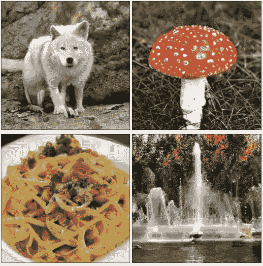

（图像来自[Brock 2018](https://arxiv.org/pdf/1809.11096.pdf)）

首先，让我们查看一些由 GAN 生成的图像，以了解过去五年取得了多大进展。上述图像是无条件生成的 ImageNet 样本，来自 2019 年 Andrew Brock 在 ICLR（国际学习表征会议）上展示的 BigGAN 模型。

这些图像样本的显著之处在于两个主要原因：清晰度和类别的多样性。你有动物、蘑菇、食物、风景——所有这些都一起生成，所有图像都有清晰的分辨率。

但情况并非一直如此。

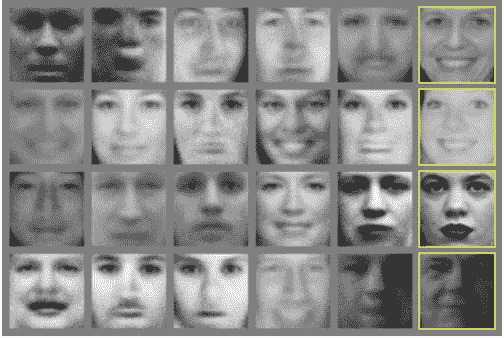

（图像示例来自[Goodfellow et al 2014](https://arxiv.org/pdf/1406.2661.pdf)）

这是 2014 年 Ian Goodfellow 等人发表的原始 GAN 论文中的图像。当这篇论文发布时，这是当时最先进的图像生成技术。但与 BigGAN 生成的样本相比，它们相距甚远。仅从这些来自 Toronto 面部数据集的样本中，你可以看到这些图像的分辨率非常低，特征没有完全解析。

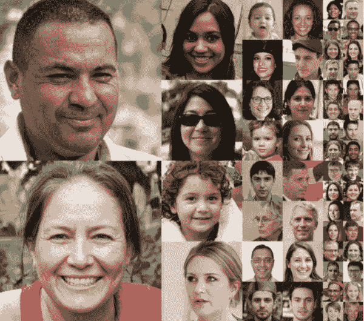

（图像示例来自[Karras et al. 2019](https://arxiv.org/pdf/1812.04948.pdf)）

现在快进四年到 Nvidia 的 StyleGAN 论文，这些生成的人物看起来非常逼真。从 2014 年的模糊起点开始，GAN 生成的面孔在短短 4 年内几乎无法与真实人物区分。

**GAN 概述**

和我们讨论的其他模型一样，GANs 是一种生成模型。然而，与我们讨论的其他模型不同，GAN 是一种隐式生成模型。为了刷新记忆，这意味着如果我们想查看模型对分布的好坏，我们必须对其进行采样。

那么，GANs 是如何工作的呢？

在 GAN 中，我们有两个网络：生成器（生成组件）和判别器（对抗组件）。

判别器的训练目标是识别生成的样本并将其与真实样本区分开来。我们通过将一组真实样本和一组生成样本输入判别器，来训练判别器，以尝试分类哪些样本是真实的。通过训练，我们希望判别器能够识别样本是否来自真实分布还是生成分布。

判别器的对手是生成器，它接收随机噪声并学习将这些随机噪声转化为看起来逼真的样本——足够逼真以最终欺骗判别器。

这会随着时间的推移发生，因为生成器在生成看起来像真实样本的样本方面变得越来越好，而判别器则会达到一个点，在这个点上它对样本是现实还是生成的做出随机猜测。我们可以将其视为一个双人博弈，这个判别器进行随机猜测的点是其纳什均衡。

**训练 GAN 生成器**

进一步探讨训练，生成器是如何学习将随机噪声转化为能够通过判别器的图像的？

生成器从样本中获取数据——通常来自高斯分布——并通过神经网络进行变换以创建样本。同样，目标是使这个样本看起来尽可能真实。

起初，这些变换确实是完全无意义的。所以你将随机噪声传递给生成器，你得到的另一端看起来很像随机噪声。

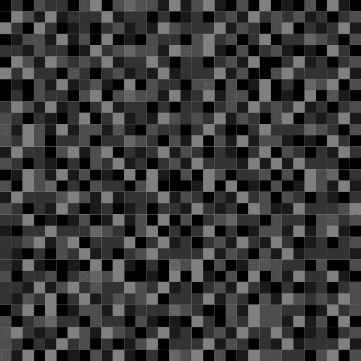

（噪声到图像变换过程的插图。噪声来自 Adobe Stock，面孔来自 [Karras et al. 2018](https://arxiv.org/pdf/1710.10196.pdf)）

现在，当你生成一个灰度点的图像，并将其传递给判别器时，大多数情况下，判别器会说这看起来不像真实样本。通过反向传播，你会得到一个信号传递到生成器，指示生成器中的层根据刚刚发送给判别器的样本的糟糕表现更新其权重。

在这些调整之后，更多的随机噪声通过生成器生成新的图像，发送给鉴别器。这次，鉴别器可能会被我们的样本欺骗，因为——这主要是由于训练早期的随机性——图像中有一些特征类似于真实数据集。生成器然后收到一个信号，表示最后的样本表现良好，随后会相应更新其权重。

通过许多次迭代以及大量的图像，生成器的权重会根据它们在欺骗鉴别器方面的表现不断更新。如果训练顺利，生成器可以将随机噪声转化为现实感很强的图像。

**生成器和鉴别器都可以完全无监督地使用这个过程进行训练，并生成优秀的样本——这要归功于损失函数所创造的动态。**

### GANs 中的损失函数

在 GANs 中，生成器和鉴别器各自拥有自己的损失函数。虽然这两个不同的损失函数允许我们看到 GANs 的无监督学习，但它们也在训练中带来了一些挑战。

鉴别器的成本在于它希望正确识别真实样本为真实，并希望正确识别生成的样本为生成（公式 1）。

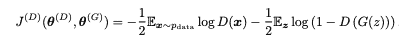

（公式 1）

你可以看到左边的第一个项表示识别真实样本为真实，右边的项表示识别生成的样本为生成。

这里有趣的是，生成器的成本只是该函数的负值（公式 2）。

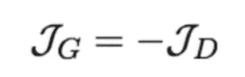

（公式 2）

你会看到，这里我们有一个常量，用于表示方程中鉴别器识别真实样本为真实的部分——因为生成器与这个过程的这一部分没有直接关系。但人们发现，如果使用顶部方程中的生成器损失函数，损失会饱和。所以我们所做的是稍微改变一下公式（公式 3）。

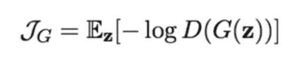

（公式 3）

使用这种版本的损失函数，生成器如果创建出鉴别器容易识别为生成的样本，就会收到很强的信号。通过使用这个第二方程，它不再完全是一个二人最小化博弈的公式，但训练效果如我们所希望的那样——并且训练比其他方法更稳定。

### GANs 的应用

现在我们已经掌握了训练 GANs 的基本知识，让我们深入探讨一些应用。

GANs 最早被识别的应用之一来自 Goodfellow 的原始论文，其中展示了 MNIST 中数字 1 和 5 之间的插值。这是一种表示学习，因为通过训练生成器和鉴别器，我们可以学习到原始数据集的潜在表示。

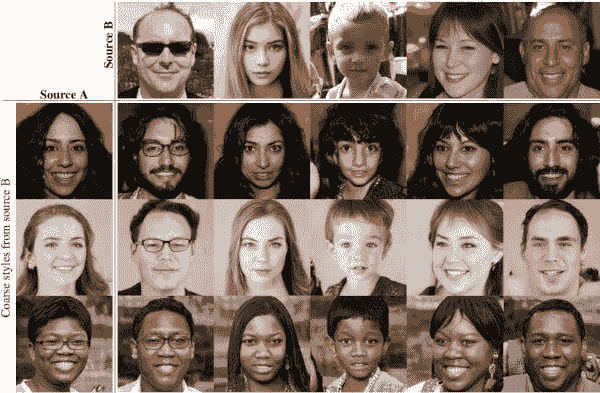

（图像来自 [Karras et al. 2019](https://arxiv.org/pdf/1812.04948.pdf)）

你可以在 StyleGAN 论文（上面）中的图像以及许多其他 GAN 论文中看到相同的应用。

我们在这个特定示例中看到的是，我们将源 A 的风格应用到源 B 的结构上。在左上角，我们将眼镜应用到不同的图像上，或者让左侧的人看起来像年轻的孩子。

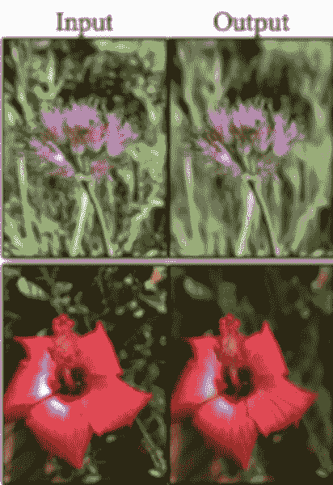

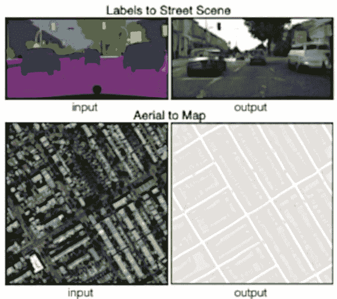

（图像示例来自 [Zhu et al. 2017](https://arxiv.org/pdf/1703.10593.pdf) 和 [Isola et al. 2016](https://arxiv.org/pdf/1611.07004.pdf)）

GAN 的另一个应用是图像转换——在某些情况下，这是一种更通用的风格迁移方法。

在左侧（Zhu），我们看到 CycleGAN 对图像进行了一些增强，而在右侧的 Pix2Pix 论文（Isola）中，我们将图像从一种风格转换为另一种风格。

所以左侧是街景的分割图，右侧是真实图像。然后从航空图到地图，我们有一张卫星图像和类似地图的图像。

当你用 Pix2Pix 模型训练这种类型的转换时，你可以从卫星图像转换到地图，反之亦然。因此，如果你希望在图像集合上进行风格迁移，这些模型效果最好。

### GAN 的挑战

但 GAN 的所有进展并没有没有遇到挑战。

理论上，GAN 作为一个有序的双玩家最小化游戏，慢慢达到纳什均衡。我们将噪声传递给生成器，生成器学会欺骗判别器，然后判别器停止有效地检测差异，并开始随机猜测，理论上如此。

有三个主要挑战阻碍 GAN 作为这种最小化游戏运行：

+   模式崩溃

+   挑剔的训练

+   GAN 的评估

**模式崩溃**

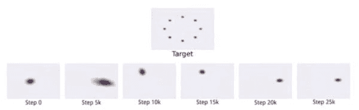

（模式崩溃的图像来自 [Goodfellow 2016](https://arxiv.org/pdf/1701.00160.pdf)）

在模式崩溃中，模型仅学习到多模态数据集中的一种或几种模式。我们训练 GAN 的数据通常具有非常多的模式，这使得模式崩溃成为一个问题。

**挑剔的训练**

然后就是挑剔的训练问题。之前我们提到了生成器和判别器的成本函数。由于这个模型中有两个不同的成本函数，因此在平衡它们方面会比其他情况更具挑战性。

**评估 GAN**

评估 GAN 时，有几个问题需要考虑。

首先，生成器生成的好样本不一定意味着你已经很好地学习了分布。

接下来，估计可能性（这是衡量你学习分布效果的指标）可能非常困难。这也导致了第三个问题：很难真正知道你学到了多少分布。

最后，评估 GAN（生成对抗网络）是一个活跃的研究领域，目前尚无通用的评估方法。许多论文提出了新的评估指标，但这些指标在未来的出版物中并未受到关注。

### GAN 的未来

GAN 接下来会走向何方？

我们在本概述中主要讨论了 GAN 生成图像，但这远非我们今天或明天看到的 GAN 应用的唯一方向。

GAN 还在音频生成（如语音模仿）、新药研发、建筑平面设计、结构组件生成、图形设计布局、表格数据生成等方面取得了突破。

随着这一类机器学习模型在不同产业和应用中不断发展壮大，且人们对 GAN 的概念越来越熟悉，他们将继续发现更多的应用领域。因此，从 2014 年到今天及未来，GAN 仍有很长的路要走，才能充分挖掘这一优雅对抗系统所带来的所有机会。

**简介：** [安德鲁·马丁](https://www.linkedin.com/in/andrewbmart/)是 Looka 的首席数据科学家，Looka 是一个[AI 驱动的 logo 生成器](https://looka.com/logo-maker/)，为企业主提供了快速且经济实惠的品牌创建方式。安德鲁曾创办 Eco Modelling，这是一家向林业和能源领域的客户提供数据解决方案的咨询公司。他拥有达尔豪斯大学工业工程硕士学位和麦吉尔大学数学学士学位。

**相关：**

+   [生成对抗网络 – 关键里程碑与最前沿技术](https://www.kdnuggets.com/2019/04/future-generative-adversarial-networks.html)

+   [生成对抗网络的崛起](https://www.kdnuggets.com/2019/04/rise-generative-adversarial-networks.html)

+   [为什么机器学习容易受到对抗攻击以及如何解决](https://www.kdnuggets.com/2019/06/machine-learning-adversarial-attacks.html)

### 更多相关话题

+   [什么是对抗性机器学习？](https://www.kdnuggets.com/2022/03/adversarial-machine-learning.html)

+   [哈佛大学最受欢迎的编程入门课程免费！](https://www.kdnuggets.com/2022/03/popular-intro-programming-course-harvard-free.html)

+   [KDnuggets 新闻 3 月 30 日：最受欢迎的编程入门课程…](https://www.kdnuggets.com/2022/n13.html)

+   [25 门免费课程掌握数据科学、数据工程、机器学习…](https://www.kdnuggets.com/25-free-courses-to-master-data-science-data-engineering-machine-learning-mlops-and-generative-ai)

+   [最先进的深度学习可解释预测和实时预测](https://www.kdnuggets.com/2021/12/sota-explainable-forecasting-and-nowcasting.html)

+   [神经网络与深度学习：教科书（第 2 版）](https://www.kdnuggets.com/2023/07/aggarwal-neural-networks-deep-learning-textbook-2nd-edition.html)
