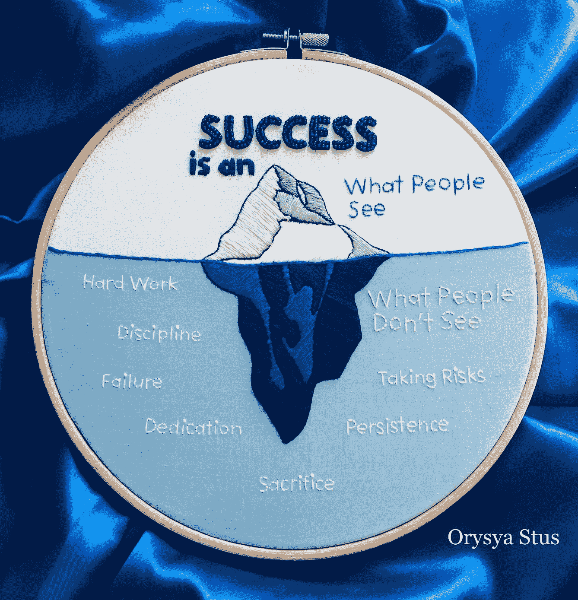
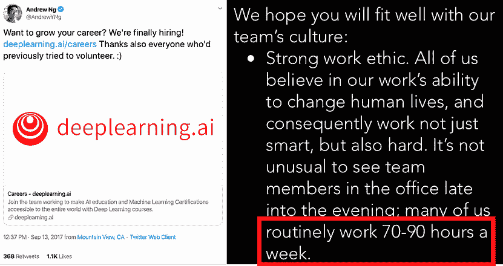
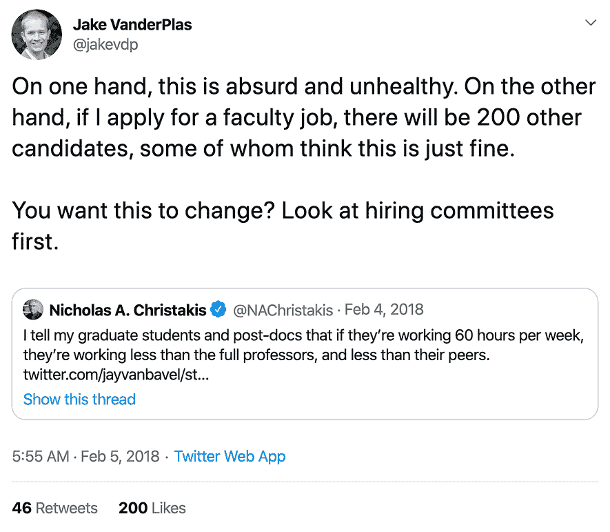
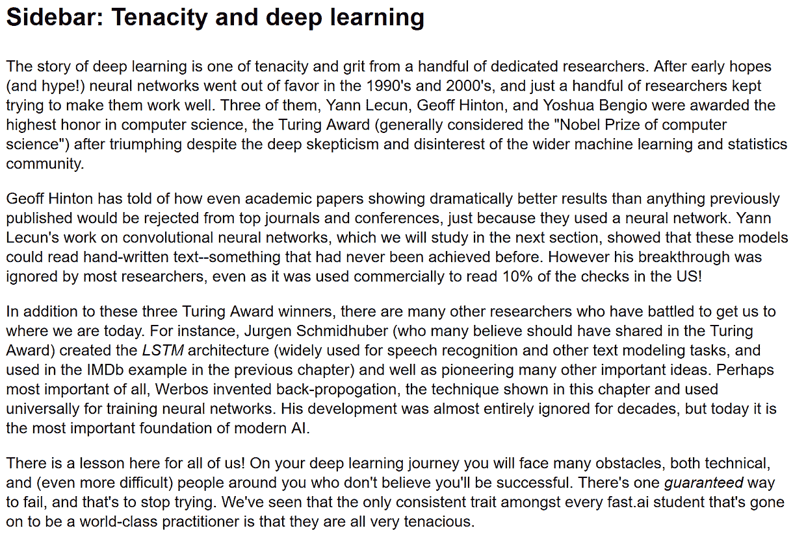
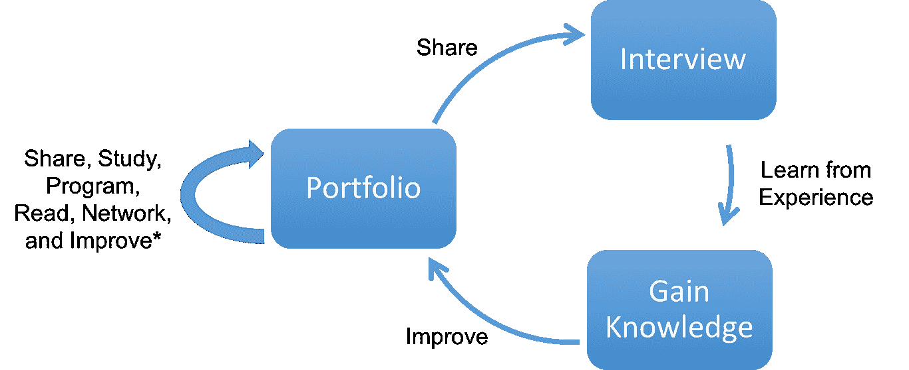
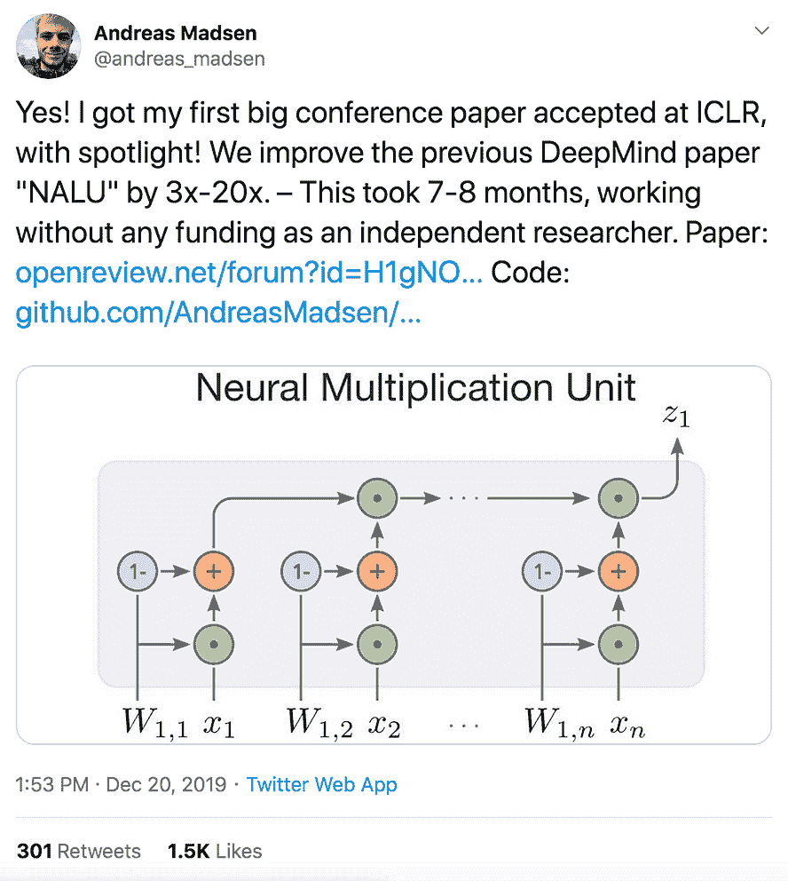
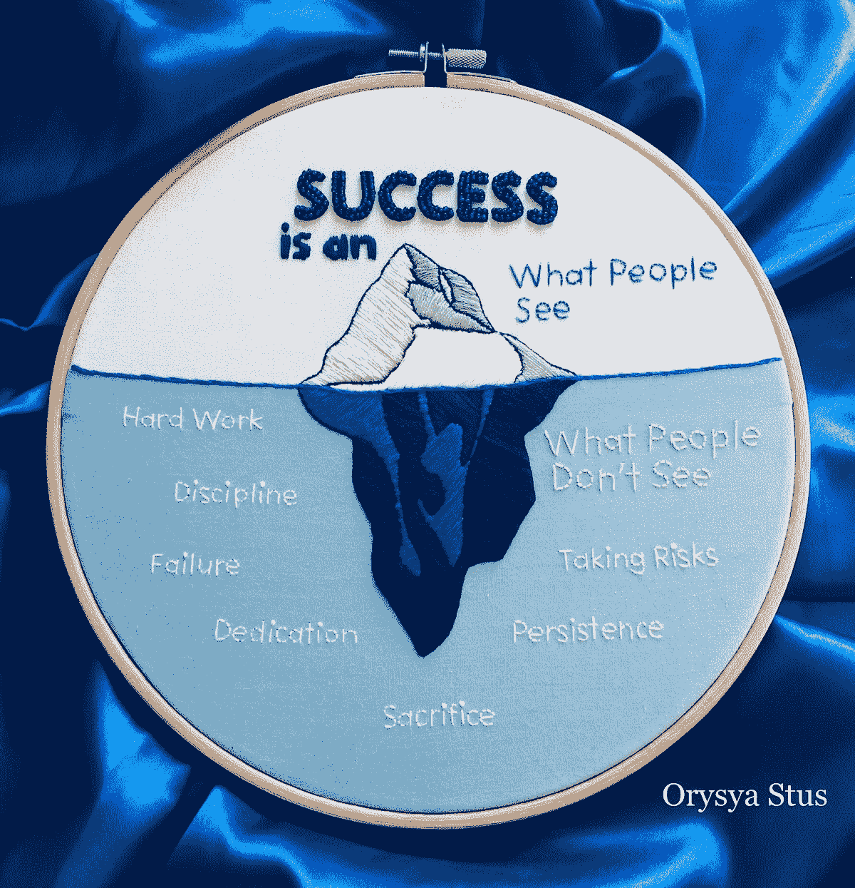

# 成功的数据科学职业建议

> 原文：[`www.kdnuggets.com/2020/03/advice-successful-data-science-career.html`](https://www.kdnuggets.com/2020/03/advice-successful-data-science-career.html)

评论

**由[Michael Galarnyk](https://www.linkedin.com/in/michaelgalarnyk/)，数据科学家**

[图片](https://www.instagram.com/p/B7q2On8FosG/?utm_source=ig_web_copy_link) 来自 [Orysya Stus](https://www.instagram.com/orysya.stus.art/)

* * *

## 我们的前三个课程推荐

 1\. [谷歌网络安全证书](https://www.kdnuggets.com/google-cybersecurity) - 快速进入网络安全职业轨道。

 2\. [谷歌数据分析专业证书](https://www.kdnuggets.com/google-data-analytics) - 提升你的数据分析技能

 3\. [谷歌 IT 支持专业证书](https://www.kdnuggets.com/google-itsupport) - 支持你的组织的 IT 工作

* * *

我之前写过 [如何建立数据科学作品集](https://towardsdatascience.com/how-to-build-a-data-science-portfolio-5f566517c79c) ，其中涵盖了 **向潜在雇主展示你的能力，而不仅仅是告诉他们你能做什么** 的重要性。 本博客利用 [成功是冰山图像](https://www.instagram.com/p/B7q2On8FosG/?utm_source=ig_web_copy_link) 由 [Orysya Stus](https://www.instagram.com/orysya.stus.art/) 作为框架，展示了人们在达到他们感知的数据科学成功的过程中，一些方面往往是隐藏的。 本博客旨在表明，大多数人必须付出相当大的努力才能达到他们的位置。他们必须努力工作，有时经历失败，展示纪律性，保持坚持，致力于他们的目标，有时还需要牺牲或冒险。 话不多说，让我们开始吧！

### 错误/失败

> 迄今为止我犯的一些数据科学错误 ???? [pic.twitter.com/EeiVmmAnuJ](https://t.co/EeiVmmAnuJ)
> 
> — Caitlin Hudon ????????‍???? (@beeonaposy) [2019 年 4 月 29 日](https://twitter.com/beeonaposy/status/1122964504910938121?ref_src=twsrc%5Etfw)

[推文](https://twitter.com/beeonaposy/status/1122964504910938121?s=20) 来自 [Caitlin Hudon](https://twitter.com/beeonaposy) 如上图 GIF 所示， [Caitlin Hudon](https://twitter.com/beeonaposy)（[OnlineMedEd](https://twitter.com/onlinemeded) 的首席数据科学家）为她的 [推文](https://twitter.com/beeonaposy/status/1122964504910938121) 创建了 GIF，展示了人们在日常模型构建中常犯的许多技术错误/失败。

> 我们大多数从事编码或数据科学的人员，通常只看到彼此工作的最终产品——而不是我们在过程中所做的草稿、错误和决策。对这些步骤进行一些透明化处理会大有裨益。

[Jake VanderPlas](https://twitter.com/jakevdp)似乎在一条[tweet](https://twitter.com/jakevdp/status/1006929129390788609)中表达了类似的观点，即在开源项目中，人们通常只看到最终产品，而忽视了过程。

> 在开源中，我们经常看到的是最终产品而不是过程……这可能会让刚入门的人感到气馁，他们看到周围的所有明显的完美。
> 
> 但我敢打赌，在任何成功的开源项目光鲜的外表背后，必然充满了痛苦、挣扎和自我怀疑。

除了技术失败，还有其他类型的失败，包括那些你可以穿戴的（期刊拒稿、邮件拒绝等）。[Caitlin K. Kirby](https://twitter.com/kirbycai)实际上穿着她的失败/拒绝信。华盛顿邮报([Washington Post](https://www.washingtonpost.com/lifestyle/2019/10/22/doctoral-student-wore-skirt-made-rejection-letters-defend-her-dissertation/))上有一篇文章详细描述了她的裙子是由她在过去五年中收到的 17 封拒绝信（期刊拒稿、邮件拒绝等）制成的。

> 今天成功答辩了我的博士论文！为了认可和正常化过程中出现的失败，我穿着由博士过程中拒绝信制成的裙子进行答辩。 [#AcademicTwitter](https://twitter.com/hashtag/AcademicTwitter?src=hash&ref_src=twsrc%5Etfw) [#AcademicChatter](https://twitter.com/hashtag/AcademicChatter?src=hash&ref_src=twsrc%5Etfw) [#PhDone](https://twitter.com/hashtag/PhDone?src=hash&ref_src=twsrc%5Etfw)
> 
> 感谢所有参与我旅程的人 [pic.twitter.com/FQbXYQ1Oov](https://t.co/FQbXYQ1Oov)
> 
> — Caitlin K. Kirby (@kirbycai) [2019 年 10 月 7 日](https://twitter.com/kirbycai/status/1181281371127463938?ref_src=twsrc%5Etfw)

[Tweet](https://twitter.com/kirbycai/status/1181281371127463938) 由 [Caitlin K. Kirby](https://twitter.com/kirbycai)发布。顺便说一下，如果你想了解更多与软件/数据科学相关的拒绝故事，有一个[完整的拒绝网站](https://rejected.us/)可以查看，可能会激励你。

### 努力工作/坚韧

[Tweet](https://twitter.com/AndrewYNg/status/908052152722976768) 由 [Andrew Ng](https://twitter.com/AndrewYNg)发布

大多数人都付出了艰苦的努力才达到现在的成就。我绝对不是说你必须常常工作 70–90 小时每周，因为那听起来不健康。[Rachel Thomas](https://twitter.com/math_rachel)的[帖子](https://medium.com/s/story/techs-long-hours-are-discriminatory-counter-productive-17dc61071ed5)提到这种态度可能会带有歧视性且适得其反。

> 我们需要尽可能摆脱浅薄的观念，即工作时间的数量才是重要的。科技行业对极长工作时间的痴迷不仅对许多残障人士不可及，对所有人的健康和人际关系都有害，而且正如 Olivia Goldhill 为 *Quartz at Work* 所指出的那样，关于生产力的研究表明，这只是低效的：
> 
> *正如无数研究所示，这根本不是事实。工作时间越长，生产力会显著下降，一旦每周工作超过 55 小时，生产力就会完全下降到平均水平，工作 70 小时的人所取得的成就甚至不如工作少 15 小时的同事。*

疯狂的长时间工作在学术界也很常见，正如 [Jake VanderPlas](https://twitter.com/jakevdp) 在他的 [tweet](https://twitter.com/jakevdp/status/960512085896523777) 中提到的那样。

虽然这条推文并不是对 Andrew Ng 早期推文的评论，但我认为它表明成功有许多不同的途径，而不是仅仅靠持续的工作。《[Python Data Science Handbook](https://jakevdp.github.io/PythonDataScienceHandbook/)》的作者似乎表现良好。([Tweet](https://twitter.com/jakevdp/status/960512085896523777) 来自 [Jake VanderPlas](https://twitter.com/jakevdp))

与其谈论辛勤工作，不如谈论坚韧或毅力，就像 [Jeremy Howard](https://twitter.com/jeremyphoward) 和 [Sylvain Gugger](https://twitter.com/guggersylvain) 的 [new book](https://www.amazon.com/Deep-Learning-Coders-fastai-PyTorch/dp/1492045527) 中有一段关于坚韧的精彩描述。

来自 [tweet](https://twitter.com/jeremyphoward/status/1230121675988992005) 的内容摘自 [Jeremy Howard](https://twitter.com/jeremyphoward) 和 [Sylvain Gugger](https://twitter.com/guggersylvain) 的新 [书](https://www.amazon.com/Deep-Learning-Coders-fastai-PyTorch/dp/1492045527)。

简而言之，我认为从中获得的最佳经验是：

> 你会面临许多障碍，包括技术上的，以及（更困难的是）周围那些不相信你会成功的人。有一种方法可以确保失败，那就是停止尝试。

### 坚韧

图片来自我的 [博客文章](https://towardsdatascience.com/how-to-build-a-data-science-portfolio-5f566517c79c)

生活中的许多成功来自于坚持不懈。像 [Kelly Peng](https://towardsdatascience.com/@kellypeng17) 这样的成功人士有很多故事，她是 Airbnb 的数据科学家，她真正地坚持不懈，不断努力和进步。在 [她的其中一篇博客文章](https://towardsdatascience.com/how-to-land-a-data-scientist-job-at-your-dream-company-my-journey-to-airbnb-f6a1e99892e8) 中，她详细讲述了她申请和面试了多少地方。

> 应用程序：475
> 
> 电话面试：50
> 
> 完成的数据科学家庭挑战：9
> 
> 现场面试：8
> 
> 提供的机会：2
> 
> 花费时间：6 个月

她显然申请了很多工作并且坚持不懈。在她的文章中，她甚至提到你需要从面试经历中不断学习。

> 记下你被问到的所有面试问题，特别是那些你未能回答的问题。你可以再次失败，但不要在同一个地方失败。你应该始终在学习和进步。

### 纪律/奉献

[Tweet](https://twitter.com/andreas_madsen/status/1208143504540614657?s=20) 由 [Andreas Madsen](https://twitter.com/andreas_madsen)

这篇文章的一个主要主题是每个人都有经历过一些失败。重要的是，有些人会不惜一切代价去实现他们的目标。在 [Andreas Madsen](https://twitter.com/andreas_madsen) 发表的 [一篇博客文章](https://medium.com/@andreas_madsen/becoming-an-independent-researcher-and-getting-published-in-iclr-with-spotlight-c93ef0b39b8b) 中，他描述了进入顶尖 AI（通常是计算机科学系）博士项目的困难。基本上，与所有他交谈的教授都告诉他，他需要“1-2 篇顶级机器学习期刊的文章”才能进入顶尖博士项目。他花了 7 个月的时间专注于一个没有资金和导师的研究项目，以产生可以发表的工作。

### 牺牲/冒险

图片由 [Michael Galarnyk](https://twitter.com/GalarnykMichael)

牺牲和风险可以有很多不同的形式。其中一个风险可能是忽视上级的指令。当 [Greg Linden](https://www.linkedin.com/in/glinden/) 在亚马逊工作时，他虽然应该在做其他事情，但还是参与了一些有趣的项目。在 [他的一个博客文章](https://glinden.blogspot.com/2006/04/early-amazon-shopping-cart.html) 中，他描述了一个项目：

> 基于你在亚马逊购物车中的物品做推荐。添加几个东西，看看会有什么出现。再添加几个，看看会有什么变化……我制作了一个原型。在一个测试网站上，我修改了亚马逊购物车页面，推荐你可能喜欢添加到购物车中的其他物品。对我来说看起来相当不错。我开始展示它。

出现了一个问题。

> 虽然反应是积极的，但还是有一些担忧。特别是，一位市场营销高级副总裁坚决反对……在这一点上，我被告知禁止继续在这个项目上工作。我被告知亚马逊还没有准备好推出这个功能。应该到此为止。
> 
> 相反，我为在线测试准备了这个功能。我相信购物车推荐。我想要衡量销售影响。
> 
> 我听说 SVP 在发现我推出一个测试时非常生气。但是，即使对于高层管理人员，阻止一个测试也是很困难的。测量是有益的。唯一反对测试的有力理由是负面影响可能如此严重，以至于亚马逊无法承受，这一主张难以成立。测试还是推出了。
> 
> 结果很明显。它不仅赢了，而且这一特性赢得的幅度如此之大，以至于没有上线的成本对亚马逊来说是显著的。随着新的紧迫性，购物车推荐功能上线了……
> 
> 当时，亚马逊确实很混乱，但我怀疑我通过忽视上级的命令而冒了风险。尽管亚马逊很优秀，但它还没有完全拥抱测量和辩论的文化。

虽然我不主张忽视上级的建议，但在某些情况下，冒险可能对公司和自己都有好处。

### 结论

[图片](https://www.instagram.com/p/B7q2On8FosG/?utm_source=ig_web_copy_link) 由 [Orysya Stus](https://www.instagram.com/orysya.stus.art/) 提供

希望你能在数据科学旅程中发现这篇博客中的一些建议和例子对你有帮助。请记住，许多成功人士的建议受到幸存者偏差的影响。始终对建议或分享的经验持保留态度。如果你有任何问题、对文章的看法或想分享你自己的经历，请随时在下面的评论中联系我，或通过 [Twitter](https://twitter.com/GalarnykMichael) 联系我。

**个人简介：[Michael Galarnyk](https://www.linkedin.com/in/michaelgalarnyk/)** 是一名数据科学家和企业培训师。他目前在 Scripps Translational Research Institute 工作。你可以在 Twitter (https://twitter.com/GalarnykMichael)、Medium (https://medium.com/@GalarnykMichael) 和 GitHub (https://github.com/mGalarnyk) 上找到他。

[原文](https://towardsdatascience.com/advice-for-a-successful-data-science-career-7f07b3586171)。经许可转载。

**相关内容：**

+   开始使用 Python：在 Windows 上安装 Anaconda

+   理解 Python 中的分类决策树

+   Python 元组和元组方法

### 了解更多信息

+   [如何在 2022 年成为成功的数据科学自由职业者](https://www.kdnuggets.com/2022/02/become-successful-data-science-freelancer-2022.html)

+   [成功的数据科学家需要具备的 5 个特征](https://www.kdnuggets.com/2021/12/5-characteristics-successful-data-scientist.html)

+   [数据质量在成功的机器学习模型中的重要性](https://www.kdnuggets.com/2022/03/significance-data-quality-making-successful-machine-learning-model.html)

+   [为什么数据科学家对 Google Bard 的建议充满期待](https://www.kdnuggets.com/2023/02/data-scientists-expect-flawed-advice-google-bard.html)

+   [如何获得机器学习职位：来自 Meta、Google Brain 和 SAP 工程师的建议](https://www.kdnuggets.com/2022/08/corise-land-ml-job-advice-engineers-meta-google-brain-sap.html)

+   [掌握数据宇宙：成功数据科学职业的关键步骤](https://www.kdnuggets.com/mastering-the-data-universe-key-steps-to-a-thriving-data-science-career)
