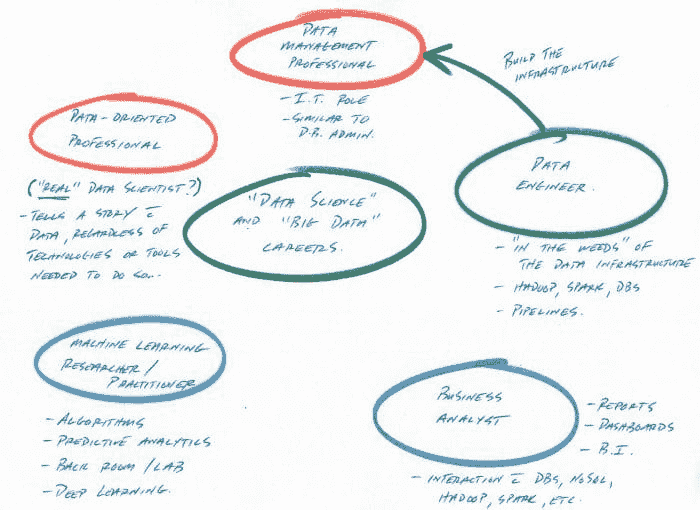

# 你会给年轻的数据科学家自己什么建议？

> 原文：[`www.kdnuggets.com/2017/07/advice-younger-data-scientist-self.html`](https://www.kdnuggets.com/2017/07/advice-younger-data-scientist-self.html)

 评论

我在 LinkedIn 上经常被询问数据科学职业建议。虽然我希望用有限的知识回答人们的具体问题，但这确实变得太耗时。我过去创建过帖子，试图照亮更广泛人群感兴趣的话题，[例如这个](https://www.kdnuggets.com/2017/02/5-career-paths-data-science-big-data-explained.html)，但个性化的请求不幸的是通常不是我能参与的。

我犹豫是否写上面这段话，因为我觉得这可能会把我描绘成一个有点自大的家伙，说实话。我没有超出有限经验的任何特殊见解；然而，我与 KDnuggets 的关联和在 LinkedIn 上的活动，可能让人们认为那个人可能值得联系。我真的是最远离自大的那种人，如果时间允许，我会很乐意与大家分享我所知道的。

* * *

## 我们的前三个课程推荐

 1\. [Google 网络安全证书](https://www.kdnuggets.com/google-cybersecurity) - 快速进入网络安全职业的快车道。

 2\. [Google 数据分析专业证书](https://www.kdnuggets.com/google-data-analytics) - 提升您的数据分析技能

 3\. [Google IT 支持专业证书](https://www.kdnuggets.com/google-itsupport) - 支持您组织的 IT 工作

* * *

不管怎样，继续... 最近我通过 LinkedIn 消息被问了这个问题：

> 你会给年轻的数据科学家自己什么建议？

虽然当时我没有多想这个问题，但最近几天它越来越频繁地浮现在我的脑海里。我认为原因是我真心觉得可以给人们的一个建议，就是：

> 忘记“数据科学”。

没错，**你应该忘记数据科学**。让我解释一下。

我是一个“数据科学家”，我还是一个“数据科学”网站的编辑，我故意追求“数据科学”职业，我对所有“数据科学”的事物都感兴趣。

但 我真的不喜欢“数据科学”这个词。

从 5 种大数据和数据科学职业路径，解释。

我不喜欢“数据科学”这个词的原因是因为它过于广泛和不具体。

数据科学既毫无意义，又有着所有意义。

所以，总结起来，我建议你忘记数据科学的森林，找一棵让你感兴趣的树。数据科学的哪个方面吸引了你的注意？是机器学习？是描述性统计？是数据可视化？是分布式计算？你喜欢算法设计吗？你有商业背景，但有足够的知识与客户讨论预测分析，并且愿意与“后台”接触吗？

这类似于从噪声中分离信号并提升信号。找到个人的信号应该是你在追求“数据科学”时的首要任务。

了解你天生带来的“数据科学”价值也是重要的。你是从计算机科学的角度接触数据科学吗？还是从数学背景？作为一名网页开发者？作为商业分析师？还是粒子物理学家？

现实的期望也是必须的。你有博士学位吗？硕士学位？本科文凭？你是自学的，通过 MOOC、教科书等？不要让任何人告诉你，“数据科学”领域对于自学者来说是遥不可及的……同时，也不要期望你在几门 MOOC 之后就能在 DeepMind 做研究。了解你可能适合什么。

数据科学家 Maurice Ewing 在[他对“数据科学是否太容易？”的问题的 Quora 回答](https://www.quora.com/Is-data-science-too-easy/answer/Maurice-Ewing)中说：

> 就 R 和 Hadoop 而言，它们只是数据科学工具包的一部分。它们并不构成“数据科学”，就像手术刀并不构成“手术”一样。就像物理学依赖数学一样，数据科学依赖于统计工具来处理大数据和小数据、结构化和非结构化数据等。但物理学的数学不能替代科学思维、分析、方法，Hadoop 和 R 也不能替代对数据行为的理解。

当然，他是完全正确的。然而，他的观点也可以从相反的方向来看：正如单一技能（在这种情况下是技能对）并不能成就数据科学家一样，数据科学家也并不具备单一统一的技能体系，每个人都带来了自己的一套能力。

把“数据科学”称为一个职业也让我感到奇怪。这似乎像是将所有医生、护士、物理治疗师、个人支持工作者以及其他所有健康专业人员可能承担的角色和任务都归为“健康科学家”（是的，我知道**健康科学**确实存在）。

引自《数据科学难题，再探》。

不过，我要扯远了，再次重申：**忘记数据科学**。专注于你最感兴趣的数据科学拼图的一部分，一切会自然合成。

我喜欢把数据科学家比作综合格斗运动员：就像 MMA 选手可能以巴西柔术或泰拳为基础，并根据需要逐渐增加其他格斗学科和技术（拳击、摔跤等），真正的数据科学家也可能以机器学习为核心，随着职业发展逐步提高其可视化、分布式计算、讲故事和统计技能。

回到数据科学的主题...

**相关内容**：

+   大数据和数据科学中的 5 条职业路径，解释说明

+   数据科学家—美国最佳职业，再次登顶

+   探索大数据中的 12 个有趣职业

### 更多相关主题

+   [每个数据科学家都应该了解的三个 R 语言库（即使你使用 Python）](https://www.kdnuggets.com/2021/12/three-r-libraries-every-data-scientist-know-even-python.html)

+   [成为优秀数据科学家所需的 5 项关键技能](https://www.kdnuggets.com/2021/12/5-key-skills-needed-become-great-data-scientist.html)

+   [每个初学者数据科学家应该掌握的 6 种预测模型](https://www.kdnuggets.com/2021/12/6-predictive-models-every-beginner-data-scientist-master.html)

+   [成功数据科学家的 5 个特征](https://www.kdnuggets.com/2021/12/5-characteristics-successful-data-scientist.html)

+   [停止学习数据科学以寻找目标，并以寻找目标来...] (https://www.kdnuggets.com/2021/12/stop-learning-data-science-find-purpose.html)

+   [建立一个强大的数据团队](https://www.kdnuggets.com/2021/12/build-solid-data-team.html)
