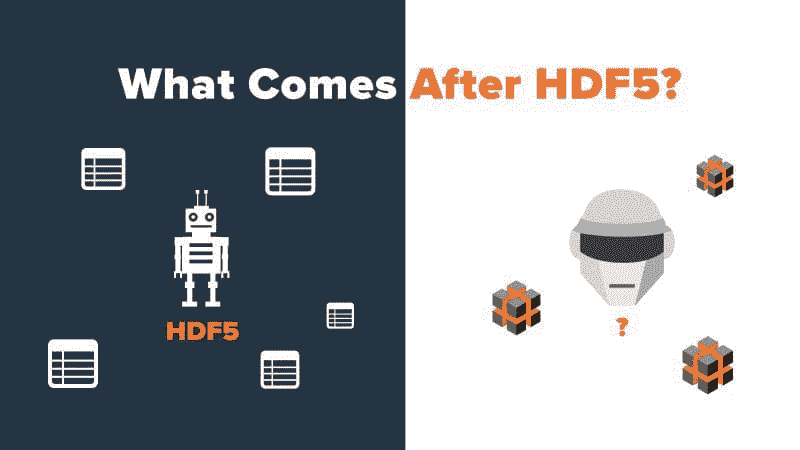

# HDF5 之后是什么？寻找适合深度学习的数据存储格式

> 原文：[`www.kdnuggets.com/2021/11/after-hdf5-data-storage-format-deep-learning.html`](https://www.kdnuggets.com/2021/11/after-hdf5-data-storage-format-deep-learning.html)

评论

**作者 [Davit Buniatyan](https://www.linkedin.com/in/davidbuniatyan/)， [Activeloop](https://www.activeloop.ai/) CEO**

## HDF5 用于非结构化数据

[HDF5](https://www.hdfgroup.org/solutions/hdf5/) 是一种最受欢迎和可靠的非表格化数值数据格式之一。¹ 让我举个例子。NASA 的地球观测系统卫星每天收集大约 16 TB 的数据，格式为 HDF5。

像命名数据集、分层组织的组、自定义元数据和属性、压缩滤镜、延迟加载² 和跨不同轴的类似数组切片等特性使其适合许多数据处理任务。

尽管它是在二十多年前创建的，HDF 仍然因通过维护良好的开源库如 [h5py](https://docs.h5py.org/en/stable/quick.html) 而在 PyData 社区中保持流行。

## HDF5 没有针对深度学习进行优化

在 HDF5 中，大型数据集通常以“块”的形式存储；即数组的规则分区。这一设计决定使 HDF 能够存储像图像和视频这样的千兆级别、非结构化的数值数据，但它是在云对象存储或深度学习出现之前创建的。因此，在深度学习工作负载方面存在一些不足之处：

1.  HDF 文件的布局使其在云存储系统（如 Amazon 的 S3³）上高效查询变得困难，ML 数据集越来越多地存储在这些系统中。⁴ 你不能直接从存储为 S3 对象的 HDF5 文件中读取 HDF5 库。实际上，整个文件（通常可以达到几 GB）应该被复制到本地存储，然后才能读取第一个字节。

1.  在并行方式下应用数据转换是困难的。无论是计算机视觉的数据增强还是 NLP 的分词，转换都是任何深度学习实验的核心。

1.  HDF5（Python 实现）基本上是单线程的。这意味着在任何给定时间，只有一个核心可以读取或写入数据集。它不适合并发读取，这限制了 HDF5 数据支持多个工作线程的能力。⁵

1.  它没有与现代框架如 Keras 和 PyTorch 集成，这意味着研究人员通常需要编写自定义 DataLoader。由于 DataLoader 承担了更多职责，如数据集分片以进行并行训练，它们变得更加难以定义。

1.  由于 HDF 元数据分散在整个文件中，访问随机数据块变得困难。实际上，需要进行许多小读取，以收集提取数据块所需的元数据。

由于这些挑战，大多数用户在运行单个训练周期之前会将数据转换为其他格式（例如 csv 或 TFRecords）。

## 机器学习社区需要一种新的数据存储格式。

与其为云环境重写或改造 HDF，我们认为应该有一个为分布式深度学习设计的现代数据存储格式。虽然有一些 [软件包](https://github.com/HDFGroup/h5pyd) 和 [托管服务](https://www.hdfgroup.org/solutions/highly-scalable-data-service-hsds/) 允许用户直接从云中读取 HDF 数据⁶，但它们并不适合大规模的非结构化数据集合。

随着云基础设施的 petascale 数据集训练成为学术界和工业界的常态，深度学习格式意味着一种格式：

+   **云原生**。它应当能够与云对象存储系统（如 S3 和 GCS）良好配合，而不会牺牲 GPU 利用率。⁷

+   **可并行化**。由于大多数机器学习数据集是写入一次、读取多次，它应支持多个工作者的并发读取。

+   **随机访问**。由于研究人员很少需要一次性获取整个数据集，因此以这种格式存储的数据应当能够进行随机访问。

+   **转换**。它应能够在运行时对数据应用任意转换，并且代码开销最小。这是因为下载 TB 级的数据通常不切实际：大多数用户没有访问大型数据集群的权限，无法在下载后根据需要切片和处理数据。

+   **集成**。它应与流行的深度学习框架如 Keras 和 PyTorch 以及其他 PyData 库如 Numpy 和 Pandas 集成。理想情况下，研究人员应能够使用他们为本地存储的小数据集开发的相同脚本来访问这些巨大的云端数据集。

尽管设计和推广一种新的数据格式不是一件简单的任务（已有几个“云中的 HDF”库的失败例子），但我们认为一种 [为机器学习目的设计的新格式](https://github.com/activeloopai/Hub) 和像图像、视频、音频等非结构化数据可以帮助研究人员和工程师用更少的资源做更多的事。

**注意事项**

1.  我最近使用 HDF5 存储了 1024 维的嵌入向量，大约涵盖了一百万张图像。

1.  请记住，实际数据存储在磁盘上；当对 HDF5 数据集应用切片时，会找到适当的数据并加载到内存中。这种切片方式利用了 HDF5 的底层子集功能，因此非常快速。

1.  亚马逊有一种叫做 HDF5 虚拟文件层的东西。

1.  这是因为 HDF5 需要读取其索引表，然后对每个块发出范围请求。这种延迟是显著的，因为 HDF 库进行许多小的 4kB 读取。当数据在本地时，这些小的读取是合理的，但现在我们每次都需要发送网络请求。这意味着用户可能要花费几分钟才能打开一个文件。

1.  我经常看到对单个 HDF5 文件的并发写入。这是不推荐的，因为可能会有多个进程同时尝试写入。

1.  即使是 Pandas 也可以 [直接从 S3 读取 HDF5 文件](https://pandas.pydata.org/pandas-docs/stable/reference/api/pandas.read_hdf.html)。

1.  当然，云对象存储最大的缺点是出口费用。

**简介：[Davit Buniatyan](https://www.linkedin.com/in/davidbuniatyan/)** (**[@DBuniatyan](https://twitter.com/dbuniatyan)**) 在 20 岁时开始了他在普林斯顿大学的博士研究。他的研究涉及在 Sebastian Seung 的指导下重建小鼠大脑的连接组。为了解决他在神经科学实验室分析大型数据集时遇到的困难，David 成为 Activeloop 的创始 CEO，这是一个 Y-Combinator 孵化的初创公司。他还是戈登·吴奖学金和 AWS 机器学习研究奖的获得者。Davit 是开源包 Hub 的创造者，[AI 数据集格式](https://github.com/activeloopai/Hub)。

**相关：**

+   CSV 文件用于存储？不，谢谢。还有更好的选择

+   如何查询你的 Pandas 数据框

+   Pandas 不够？这里有一些处理更大、更快数据的 Python 替代方案

* * *

## 我们的三大课程推荐

 1\. [Google 网络安全证书](https://www.kdnuggets.com/google-cybersecurity) - 快速进入网络安全职业生涯

 2\. [Google 数据分析专业证书](https://www.kdnuggets.com/google-data-analytics) - 提升你的数据分析水平

 3\. [Google IT 支持专业证书](https://www.kdnuggets.com/google-itsupport) - 支持你所在组织的 IT

* * *

### 更多相关内容

+   [本周 AI 动态，8 月 7 日：生成式 AI 来到 Jupyter 和 Stack…](https://www.kdnuggets.com/2023/mm/this-week-ai-2023-08-07.html)

+   [我是如何在 2 个月内获得 4 个数据科学职位并将收入翻倍的](https://www.kdnuggets.com/2021/01/data-science-offers-doubled-income-2-months.html)

+   [优化数据存储：探索 SQL 中的数据类型和规范化](https://www.kdnuggets.com/optimizing-data-storage-exploring-data-types-and-normalization-in-sql)

+   [从 Oracle 到 AI 数据库：数据存储的演变](https://www.kdnuggets.com/2022/02/oracle-databases-ai-evolution-data-storage.html)

+   [如何使用 Docker 卷进行持久数据存储](https://www.kdnuggets.com/how-to-use-docker-volumes-for-persistent-data-storage)

+   [云存储的采用是企业当务之急](https://www.kdnuggets.com/2022/02/cloud-storage-adoption-need-hour-business.html)
