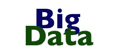
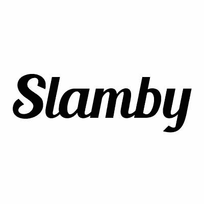

# Agilience 顶级人工智能、机器学习权威

> 原文：[`www.kdnuggets.com/2016/11/agilence-top-artificial-intelligence-machine-learning-authorities.html/2`](https://www.kdnuggets.com/2016/11/agilence-top-artificial-intelligence-machine-learning-authorities.html/2)

**[Agilience 前十机器学习权威](https://agilience.com/en/topic/Machine%20Learning)**

1.  ### KDnuggets

    涵盖 #Analytics, #BigData, #DataMining, #DataScience, #MachineLearning, #DeepLearning。由 Gregory Piatetsky-Shapiro 创立。

    * * *

    ## 我们的前三课程推荐

     1\. [谷歌网络安全证书](https://www.kdnuggets.com/google-cybersecurity) - 快速进入网络安全职业的快车道。

     2\. [谷歌数据分析专业证书](https://www.kdnuggets.com/google-data-analytics) - 提升你的数据分析技能

     3\. [谷歌 IT 支持专业证书](https://www.kdnuggets.com/google-itsupport) - 支持你的组织的 IT

    * * *

    [@kdnuggets](https://twitter.com/kdnuggets) 33.2K 条推文，67.3K 关注者

1.  ### 柯克·D·伯恩

    @BoozAllen 的首席数据科学家，博士天体物理学家，♡ 数据科学，顶级大数据影响者。前教授 [`t.co/f4gsbNc00C`](https://t.co/f4gsbNc00C)

    [@KirkDBorne](https://twitter.com/KirkDBorne) 62.9K 条推文，106K 关注者

1.  ### Vineet Vashishta

    世界上最值得信赖的 #MachineLearning 品牌。受疯狂的想法驱动，认为 #DataScience 必须简单且盈利。将数据转化为金子。

    [@v_vashishta](https://twitter.com/v_vashishta) 14.5K 条推文，22.4K 关注者

1.  ### Kaggle

    世界上最大的数据科学家社区。加入我们，竞赛、合作、学习并分享你的工作。

    [@kaggle](https://twitter.com/kaggle) 2.6K 条推文，60.5K 关注者

1.  ### 詹姆斯·科比厄斯

    

    IBM 数据科学布道者。推文是我个人的，不代表我雇主的观点。

    [@jameskobielus](https://twitter.com/jameskobielus) 60.1K 条推文，19.9K 关注者

1.  ### 本·洛里卡

    

    OReillyMedia 首席数据科学家，@strataconf 和 @OReillyAI 的项目主管。O’Reilly 数据节目播客的主持人。每周日为黑客日。

    [@bigdata](https://twitter.com/bigdata) 5.7K 条推文，35.6K 关注者

1.  ### 文森特·格兰维尔

    企业家和开创性的数据科学、大数据、机器学习、深度学习、物联网、人工智能和预测建模专家。

    [@analyticbridge](https://twitter.com/analyticbridge) 82.1K 条推文，147K 关注者

1.  ### Slamby

    数据管理研究公司，提供专注于#TextClassification 的#MachineLearning 解决方案，致力于#eCommerce #Classifieds #JobPortal

    [@slambynews](https://twitter.com/slambynews) 1.5K 推文，2.6K 关注者

1.  ### Marcus Borba

    对#BigData, #Analytics, #DataScience, #MachineLearning, #AI, #IoT, #BI, #DataMining 和#DigitalTransformation 充满热情。Spark 首席技术官。#BBBT 会员。

    [@marcusborba](https://twitter.com/marcusborba) 19.7K 推文，20.8K 关注者

1.  ### Michael Cavaretta

    

    福特汽车公司分析基础设施总监。观点仅代表我个人。兴趣：#BigData, #Datascience, #machinelearning, #dataviz, #IoT, #mdm, #analytics

    [@odsc](https://twitter.com/odsc) 11.7K 推文，11.7K 关注者

**相关：**

+   Agilience 顶级数据挖掘与数据科学权威

+   LinkedIn 上 16 位活跃的大数据和数据科学领袖

+   2016 年大数据：顶级影响者和品牌

### 更多相关主题

+   [从人工智能到机器学习的演变](https://www.kdnuggets.com/2022/08/evolution-artificial-intelligence-machine-learning-data-science.html)

+   [来自顶级大学的 5 门免费人工智能课程](https://www.kdnuggets.com/5-free-artificial-intelligence-courses-from-top-universities)

+   [免费人工智能与深度学习速成课程](https://www.kdnuggets.com/2022/07/free-artificial-intelligence-deep-learning-crash-course.html)

+   [人工智能系统中的不确定性量化](https://www.kdnuggets.com/2022/04/uncertainty-quantification-artificial-intelligencebased-systems.html)

+   [人工智能如何转变数据集成](https://www.kdnuggets.com/2022/04/artificial-intelligence-transform-data-integration.html)

+   [2022 年最受欢迎的人工智能技能](https://www.kdnuggets.com/2022/08/indemand-artificial-intelligence-skills-learn-2022.html)
