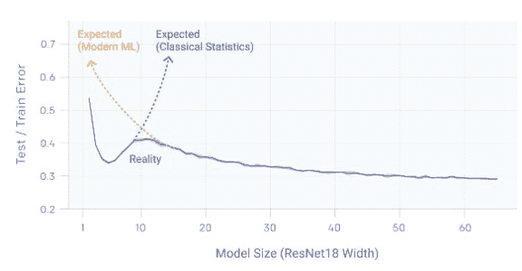
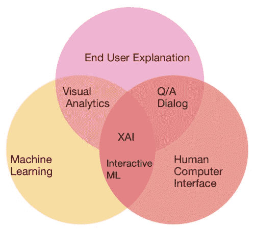
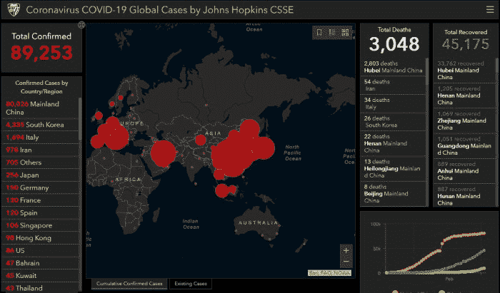
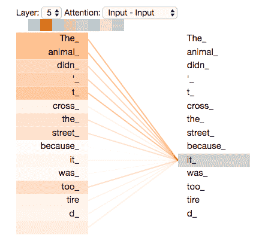

# 2020 年你需要了解的 20 个人工智能、数据科学、机器学习术语（第二部分）

> 原文：[`www.kdnuggets.com/2020/03/ai-data-science-machine-learning-key-terms-part2.html`](https://www.kdnuggets.com/2020/03/ai-data-science-machine-learning-key-terms-part2.html)

评论

这是我们列出的 2020 年需要了解的 20 个人工智能、数据科学、机器学习术语的第二部分。这里是[**2020 年你需要了解的 20 个人工智能、数据科学、机器学习术语（第一部分）**](https://www.kdnuggets.com/2020/02/ai-data-science-machine-learning-key-terms-2020.html)。

这些定义由 KDnuggets 编辑 Matthew Dearing、Matthew Mayo、Asel Mendis 和 Gregory Piatetsky 编纂。

* * *

## 我们的前三个课程推荐

 1\. [Google 网络安全证书](https://www.kdnuggets.com/google-cybersecurity) - 快速进入网络安全职业道路。

 2\. [Google 数据分析专业证书](https://www.kdnuggets.com/google-data-analytics) - 提升你的数据分析能力

 3\. [Google IT 支持专业证书](https://www.kdnuggets.com/google-itsupport) - 支持你的组织进行 IT 工作

* * *

在这一部分，我们解释了

+   双重下降

+   人工智能中的伦理

+   可解释性（可解释的 AI）

+   全栈数据科学

+   地理空间

+   GPT-2

+   NLG（自然语言生成）

+   PyTorch

+   强化学习

+   Transformer 架构

### 双重下降

这是一个非常有趣的概念，[Pedro Domingos](https://en.wikipedia.org/wiki/Pedro_Domingos)——一位领先的人工智能研究员，称其为 2019 年机器学习理论中最重要的进展之一。现象如图 1 所示。

**图 1： 测试/训练误差与模型规模（来源：OpenAI** [**博客**](https://openai.com/blog/deep-double-descent/)**)**

随着模型变大，误差首先下降，然后在模型开始过拟合时误差增加，但随后随着模型规模、数据量或训练时间的增加，误差再次下降。

经典统计理论认为，更大的模型因过拟合而表现更差。然而，现代机器学习实践表明，非常大的深度学习模型通常比小模型更好。

OpenAI [博客](https://openai.com/blog/deep-double-descent/) 说明这在 CNN、ResNets 和 transformers 中都会发生。OpenAI 的研究人员观察到，当模型不够大以适应训练集时，更大的模型测试误差更高。然而，经过这一阈值后，随着数据的增加，更大的模型开始表现更好。

阅读原始的 OpenAI 博客以及 Rui Aguiar 提供的更长[解释](https://towardsdatascience.com/deep-double-descent-when-more-data-and-bigger-models-are-a-bad-thing-3a3f108d5538)。

*作者：Gregory Piatetsky*

### 人工智能中的伦理

人工智能伦理关注于实际人工智能技术的伦理问题。

人工智能伦理是一个非常广泛的领域，涵盖了各种看似截然不同的伦理问题。对于人工智能以及更广泛的所有技术的使用的担忧，自这些技术首次构思之时就已存在。然而，鉴于人工智能、机器学习和相关技术的近期爆炸式增长及其日益快速地被社会广泛接受和整合，这些伦理问题已成为人工智能社区内外许多人关注的焦点。

尽管像未来有感知的机器人可能拥有的权利这样的深奥且目前尚未具象的伦理问题也可以纳入人工智能伦理的范畴，但像人工智能系统的透明度、这些系统的潜在偏见以及所有社会参与者的代表性纳入等更紧迫的当代问题，显然对大多数人更为重要且直接。人工智能系统中的决策是如何做出的？这些系统对世界和其中的人有什么假设？这些系统是由社会中占主导地位的单一多数阶层、性别和种族群体创建的吗？

美国南方大学应用数据伦理中心主任 Rachel Thomas，[已声明](https://www.fast.ai/2018/09/24/ai-ethics-resources/)了关于什么构成从事人工智能伦理工作的观点，这不仅涉及直接和仅仅与人工智能系统的低层次创建相关的问题，还考虑了所谓的更大图景：

> **以伦理方式创办科技公司和建设产品；
> 
> -   倡导和致力于制定更公正的法律和政策；
> 
> -   尝试追究恶意行为者的责任；
> 
> -   以及在该领域进行研究、写作和教学。**

自动驾驶汽车的出现带来了与人工智能伦理相关的额外特定挑战，包括人工智能系统的潜在武器化以及日益增长的国际人工智能军备竞赛。与一些人试图让我们相信的相反，这些问题并非注定会成为反乌托邦的未来，但它们确实需要一些关键思考、适当准备和广泛合作。即使我们认为已经充分考虑，人工智能系统仍可能证明是独特且根深蒂固的问题，而人工智能系统的意外后果，作为人工智能伦理的另一个方面，也需要被考虑。*作者：Matthew Mayo*

### 可解释性 (可解释的人工智能)

随着 AI 和机器学习在我们的生活中扮演越来越重要的角色，例如智能手机、医疗诊断、自动驾驶汽车、智能搜索、自动化信用决策等，AI 做出的决策成为一个重要方面——可解释性。人类通常可以解释他们基于知识的决策（这些解释是否准确是另一个问题），这有助于其他人对这些决策产生信任。AI 和 ML 算法能否解释它们的决策？这点很重要。

+   改善对决策的理解和信任

+   决定在出现问题时的问责或责任。

+   避免在决策中出现歧视和社会偏见

我们注意到 [GDPR](https://www.kdnuggets.com/2018/03/gdpr-machine-learning-illegal.html) 要求某种形式的可解释性。

可解释 AI (XAI) 正在成为一个重要领域，DARPA 于 2018 年推出了 [XAI 项目](https://www.darpa.mil/program/explainable-artificial-intelligence)。

**图 2: 可解释 AI 韦恩图。** ([来源](https://www.kdnuggets.com/2019/01/explainable-ai.html))。

可解释性是一个多方面的话题。它涵盖了个体模型及其所包含的更大系统。它不仅指模型输出的决策是否可以解释，还涉及模型的整个过程和意图是否能够被妥善说明。目标是在准确性和可解释性之间实现有效的权衡，并提供一个出色的人机界面，这可以帮助将模型转化为最终用户易于理解的表示。

一些更受欢迎的可解释 AI 方法包括 LIME 和 [SHAP](https://www.kdnuggets.com/2020/01/explaining-black-box-models-ensemble-deep-learning-lime-shap.html)。

目前，Google 提供了 [可解释 AI 服务](https://www.kdnuggets.com/2019/12/googles-new-explainable-ai-service.html)、[IBM AIX 360](https://github.com/IBM/AIX360) 和其他供应商也提供相关工具。

另见 Preet Gandhi 关于 [可解释 AI](https://www.kdnuggets.com/2019/01/explainable-ai.html) 的 KDnuggets 博客，以及 [可解释人工智能 (XAI)：概念、分类、机会和面向负责任 AI 的挑战](https://arxiv.org/abs/1910.10045)（arxiv 1910.10045）。*由 Gregory Piatetsky 撰写*。

### 全栈数据科学

全栈数据科学家是数据科学独角兽的缩影。他们既具备能够模拟现实场景的统计学家的技能，又具备可以管理数据库和将模型部署到网络的计算机科学家的能力，还具备将洞察和模型转化为可操作的见解的商业头脑，最终用户通常是对后端工作不太关心的高级管理人员。

以下是两场精彩的讲座，它们可以让你对端到端数据科学产品的不同细节有所了解。

1\. 全栈数据科学的实践：利用技术准备，由 Emily Gorcenski 主讲

2\. [视频：#42 全栈数据科学（与 Vicki Boykis） - DataCamp](https://www.youtube.com/watch?v=EICvvS6MUt8)。

阅读 [#42 全栈数据科学（与 Vicki Boykis） - 报告](https://www.r-bloggers.com/full-stack-data-science-transcript/)。

*作者 Asel Mendis*。

### 地理空间

地理空间是指具有空间/位置/地理成分的任何数据。由于技术的出现，这些技术跟踪用户移动并作为副产品创建地理空间数据，地理空间分析正在获得越来越高的关注。最著名的用于空间分析的技术（地理信息系统 – GIS）包括 [ArcGIS](https://www.arcgis.com/index.html)、[QGIS](https://www.qgis.org/en/site/)、[CARTO](https://carto.com/) 和 [MapInfo](https://www.pitneybowes.com/us/location-intelligence/geographic-information-systems/mapinfo-pro.html)。

当前的冠状病毒疫情由 [ARCGIS 仪表板](https://www.arcgis.com/apps/opsdashboard/index.html#/bda7594740fd40299423467b48e9ecf6) 跟踪，该仪表板由约翰斯·霍普金斯大学系统科学与工程中心开发。

**图 3：根据 Johns Hopkins CSSE 仪表板的 2020 年 3 月 2 日冠状病毒统计数据。**

地理空间数据可以用于从销售预测建模到评估政府资助计划的各种应用。由于数据涉及特定位置，我们可以获得许多见解。不同国家对其空间数据的记录和测量方式各不相同，且程度不一。国家的地理边界是不同的，必须被视为每个国家独特的。 *作者 Asel Mendis*。

### GPT-2

[GPT-2](https://openai.com/blog/better-language-models/) 是由 OpenAI 创建的基于变换器的语言模型。GPT-2 是一种生成语言模型，意味着它通过预测每个词的顺序来生成文本，基于模型之前所学到的内容。实际上，用户提供的提示会呈现给模型，随后生成的词会依次出现。GPT-2 经过大量（40 GB）互联网文本的训练，用于预测下一个词，且完全使用变换器解码器块（与使用编码器块的 BERT 相对）。有关变换器的更多信息，请参见下文。

GPT-2 并不是一个特别新颖的项目；然而，使其与类似模型区分开来的，是其可训练参数的数量，以及这些训练参数所需的存储大小。尽管 OpenAI 最初发布了缩小版本的训练模型——出于担心可能会被恶意使用——但完整模型包含 15 亿个参数。这个 15 亿个可训练参数的模型需要 6.5 GB 的训练参数（等同于“训练模型”）存储。

发布时，GPT-2 引起了大量的关注和轰动，这在很大程度上归功于随附的精选示例，其中最著名的一个——记录发现安第斯山脉中会说英语的独角兽的新闻报告——[可以在这里阅读](https://pbs.twimg.com/media/DzYpsJOU0AA1PO9.png:large)。GPT-2 模型的一个独特应用形式是 AI Dungeon，这是一款在线文本冒险游戏，它将用户提供的文本作为输入模型的提示，而生成的输出用于推动游戏进程和用户体验。你可以[在这里尝试 AI Dungeon](https://aidungeon.io/)。

尽管通过下一个词预测生成文本是 GPT-2 和解码器块变压器的基本功能（和吸引力），但它们在其他相关领域，如语言翻译、文本摘要、音乐生成等方面也显示了潜力。有关 GPT-2 模型的技术细节和更多信息，请参见 Jay Alammar 的精彩[Illustrated GPT-2](https://jalammar.github.io/illustrated-gpt2)。*由 Matthew Mayo 撰写*。

### NLG (自然语言生成)

在自然语言理解方面已经取得了显著进展——让计算机解读人类输入并提供有意义的回应。许多人每天都通过个人设备，如 Amazon Alexa 和 Google Home 来享受这项技术。出乎意料的是，孩子们非常喜欢问笑话。

这里的技术是，机器学习后台在各种输入上进行训练，例如“请讲个笑话”，它可以从预定的响应列表中选择一个。如果 Alexa 或 Google Home 能讲一个*原创*笑话，即基于大量人类编写的笑话进行实时生成的笑话，那就是[自然语言 *生成*](https://www.kdnuggets.com/2020/01/guide-natural-language-generation.html)。

原创笑话仅仅是开始（经过训练的[机器学习模型甚至能搞笑吗](http://joking.abdn.ac.uk/webversion/welcome.php)？），因为强大的自然语言生成（NLG）应用正在开发中，用于生成可被人类理解的数据集总结。计算机的创造性一面也可以通过 NLG 技术来探索，这些技术可以输出[原创电影剧本](https://www.youtube.com/watch?v=LY7x2Ihqjmc)，甚至是以[大卫·哈塞尔霍夫](https://www.youtube.com/watch?v=5qPgG98_CQ8)为主演的剧本，以及基于文本的故事，类似于[你可以跟随的教程](https://www.kdnuggets.com/2019/07/training-neural-network-write-like-lovecraft.html)，它利用了长短期记忆（LSTM），一种具有反馈的递归神经网络架构，这也是当前的一个热门研究课题。

虽然计算机生成语言的商业分析和娱乐应用可能很有吸引力并且能改变文化，但伦理问题已经引发了广泛关注。NLG 能够生成“假新闻”的能力，尤其是自动生成和传播的新闻，已经引起了担忧，即使其初衷并未被编程为恶意。例如，OpenAI 已经[小心地发布](https://www.kdnuggets.com/2019/03/openai-gpt-2-model-hype-controversy.html)了他们的 GPT-2 语言模型，研究显示其生成的文本对人类具有说服力，难以检测为合成内容，并且可以被调优用于误用。现在，他们正在利用这些研究来开发可能对人类带来麻烦的 AI，以更好地理解如何控制这些令人担忧的偏见和文本生成器的恶意使用潜力。 *由 Matthew Dearing 撰写*。

### PyTorch

[Torch 包](https://github.com/torch/torch7)于 2002 年首次发布，并用 C 语言实现，是一个包含多种算法以支持深度学习的张量库。[Facebook 的 AI 研究](https://research.fb.com/)实验室对 Torch 产生了兴趣，并在 2015 年初将其开源，同时也纳入了许多机器学习工具。次年，他们发布了一个名为 PyTorch 的 Python 实现，经过优化以支持 GPU 加速。

随着强大的 Torch 工具现在可以被 Python 开发者使用，许多主要玩家将 PyTorch 集成到他们的开发堆栈中。今天，这个曾经只在 Facebook 内部使用的机器学习框架，现在已成为[最常用的深度学习库之一](https://www.kdnuggets.com/2020/01/openai-pytorch-adoption.html)，OpenAI 成为了最新一个加入的公司和研究者。谷歌于 2017 年发布的竞争包 TensorFlow，自诞生以来一直主导深度学习社区，并且现在明显呈现出在 2020 年后被 PyTorch 超越的趋势。

如果你正在寻找第一个机器学习包来学习，或者你是经验丰富的 TensorFlow 用户，你可以[开始了解](https://www.kdnuggets.com/2019/09/gentle-introduction-pytorch-12.html) PyTorch，亲自发现哪个框架最适合你的开发需求。*由 Matthew Dearing 撰写*。

### 强化学习

除了监督学习和无监督学习，[强化学习](https://www.kdnuggets.com/2017/12/interview-rich-sutton-reinforcement-learning.html) (RL) 是机器学习中的基本方法。其基本思想是一个训练算法向试错决策“代理”提供奖励反馈，该代理尝试执行某些计算任务。换句话说，如果你把一根棍子扔到院子里让 Rover 捡回来，而你的小狗决定把它带回给你以获得奖励，那么它下次会更快、更有效地做出相同的决定。这种方法的令人兴奋的特点是无需标记数据——模型可以在指导下通过编码奖励探索已知和未知的数据，寻找最佳解决方案。

强化学习是棋类、视频游戏中令人惊叹、创纪录和战胜人类的比赛的基础，以及[AlphaGo 的重创一击](https://www.kdnuggets.com/2017/10/alphago-zero-biggest-ai-advance.html)，它在没有任何硬编码指令的情况下学会了围棋。然而，虽然这些 AI 超人能力的发展是显著的，但它们仅在定义明确的计算机表示中表现良好，例如具有不变规则的游戏。强化学习[无法直接推广到现实世界的复杂性](https://www.kdnuggets.com/2020/01/modern-ai-from-neurips-2019.html)，正如[OpenAI 的魔方模型](https://openai.com/blog/solving-rubiks-cube/)所示，该模型在模拟中能够解决难题，但在通过机器人手臂转化时需要多年才取得相对较差的结果。

因此，强化学习领域还有大量需要开发和改进的内容，2019 年见证了[潜在的复兴正在进行中](https://www.kdnuggets.com/2019/12/review-what-happened-ai.html)。将强化学习扩展到现实世界应用将是 2020 年的热门话题，[重要的实施](https://www.kdnuggets.com/2020/01/created-lazy-ai.html)已经在进行中。*由 [Matthew Dearing](https://www.kdnuggets.com/author/matthew-dearing) 撰写*。

### 变换器

Transformer 是一种新颖的神经网络架构，基于自注意力机制，特别适合自然语言处理和自然语言理解。它在 2017 年由谷歌 AI 研究人员提出的[Attention Is All You Need](https://goo.gl/dwSBxB)论文中提出。Transformer 是一种通过编码器和解码器将一个序列“转换”成另一个序列的架构，但它不使用递归网络或 LSTM。它使用注意力机制，使其能够查看输入序列中的其他位置，从而改善编码。

这里有一个例子，由 Jay Alammar 详细解释。假设我们想翻译

“动物没有过马路，因为它太累了”

“it”指的是什么？人类知道“it”指的是动物，而不是街道，但这个问题对计算机来说很难。当编码单词“it”时，自注意力机制集中在“The Animal”上，并将这些词与“it”关联起来。

**图 4：当 Transformer 正在编码单词“it”时，注意力机制的一部分集中在“The Animal”上，并将其表示与“it”的编码连接起来。** ([来源](https://jalammar.github.io/illustrated-transformer/).)

谷歌报告称，Transformer 在翻译任务上明显优于其他方法。Transformer 架构被用于许多自然语言处理框架中，例如 BERT（**B**idirectional **E**ncoder **R**epresentations from **T**ransformers）及其后续版本。

想要更好的视觉展示，请参阅[图解 Transformer](https://jalammar.github.io/illustrated-transformer/)，作者是 Jay Alammar。*由 Gregory Piatetsky 撰写*。

**相关内容：**

+   [2020 年你需要了解的 20 个 AI、数据科学和机器学习术语（第一部分）](https://www.kdnuggets.com/2020/02/ai-data-science-machine-learning-key-terms-2020.html)

+   [277 个数据科学关键术语解释](https://www.kdnuggets.com/2017/09/data-science-key-terms-explained.html)

+   [什么是数据科学？](https://www.kdnuggets.com/2019/11/what-is-data-science.html)

### 更多相关主题

+   [建立一个稳固的数据团队](https://www.kdnuggets.com/2021/12/build-solid-data-team.html)

+   [使用管道编写清晰的 Python 代码](https://www.kdnuggets.com/2021/12/write-clean-python-code-pipes.html)

+   [每个数据科学家都应了解的三个 R 库（即使你使用 Python）](https://www.kdnuggets.com/2021/12/three-r-libraries-every-data-scientist-know-even-python.html)

+   [停止学习数据科学以寻找目标，并寻找目标去…](https://www.kdnuggets.com/2021/12/stop-learning-data-science-find-purpose.html)

+   [学习数据科学统计的顶级资源](https://www.kdnuggets.com/2021/12/springboard-top-resources-learn-data-science-statistics.html)

+   [成功数据科学家的 5 个特征](https://www.kdnuggets.com/2021/12/5-characteristics-successful-data-scientist.html)
