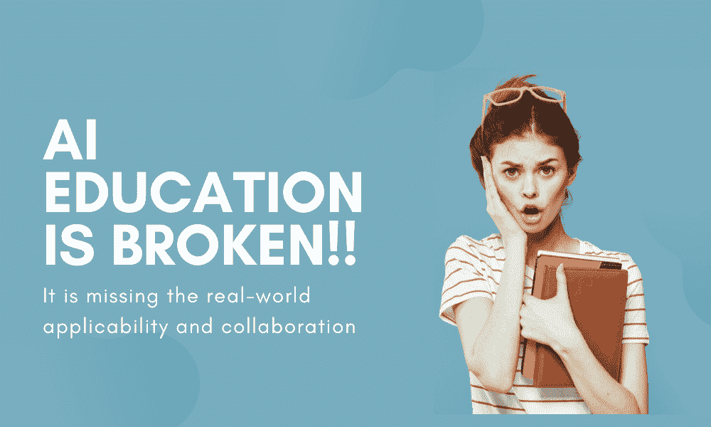

# AI 教育差距及其弥合方法

> 原文：[`www.kdnuggets.com/2022/11/ai-education-gap-close.html`](https://www.kdnuggets.com/2022/11/ai-education-gap-close.html)

图片来源于编辑

现在是参与分析和 AI 的激动人心的时刻。就像 90 年代初的软件热潮一样，许多组织正在迎来新一代技术能力，赋能团队，并以仅在过去幻想的方式推动数字化转型。

* * *

## 我们的三大课程推荐

 1\. [谷歌网络安全证书](https://www.kdnuggets.com/google-cybersecurity) - 快速进入网络安全职业生涯。

 2\. [谷歌数据分析专业证书](https://www.kdnuggets.com/google-data-analytics) - 提升你的数据分析技能

 3\. [谷歌 IT 支持专业证书](https://www.kdnuggets.com/google-itsupport) - 支持你的组织的 IT 需求

* * *

尽管市场上有少数成熟的 AI 专注公司，但大多数组织似乎仍滞后于前沿。好消息是，正因为这个差距，带来了大量在线教育机会，帮助学习必要的技术技能来构建 AI 解决方案。选择范围从 YouTube 等视频平台上的免费教育内容到如 Udemy 或 Coursera 这样的需要月费的大规模开放在线课程（MOOCs）。甚至还有长期的在线训练营，旨在帮助个人换工作并提升数据和分析职业生涯。

尽管这些选项可能提升数据中心角色的个人的技术技能，但大多数在教授成功启用和扩展 AI 至更广泛组织所需的技能方面未能达到目标。

# 针对当前 AI 教育和 MOOCs 的案例

AI 教育体系存在问题。你可能会觉得这一说法很**大胆**，特别是考虑到在线上有成百上千种免费的数据、分析和 AI 教育资源。但仔细观察就会发现，提供的培训确实存在一些令人担忧的局限性。

+   **许多 AI 教育工具在学习者参与度方面遇到困难。** 研究表明，MOOCs 提供的在线分析和 AI 教育的平均完成率仅为 3%。为什么这些课程如此枯燥？它们有一种单维度的风格。一人，一门课程，获取一个证书。有些人可以通过整天盯着屏幕和浏览各个部分来很好地学习，但其他人可能会觉得这很乏味或难以应用。

    更重要的是，如果没有完成课程并在特定时间内做出改变的动机，坐下来学习的优先级就会降低。当领导者期望他们的学生在工作之外找到时间时，培训最终会被降级，团队也不会看到他们对培训的投资产生影响。

+   **人工智能教育过于关注战术技能。** 大多数培训由工具或语言供应商提供，因此侧重于特定的软件工具或技术方法。技术技能，如编写代码或设置自动化，确实不应被忽视。但它们只是成功部署人工智能的一部分。

+   **大多数人工智能教育课程都是完全现成的。** 在许多情况下，成千上万的学生注册一个课程，并由一个讲师授课。有时讲师只是一个协调者，而不是课程创作者，其他时候讲师完全缺席。虽然这种模式适合规模化，但这种师生关系的缺失使得学生必须将所学技能与工作联系起来。学生的反馈突显了这个问题。他们报告说，在工作中应用所学概念是独立发展新技能时最困难的方面之一。

这些限制如何影响希望实施和扩展人工智能的团队？个人最终在孤立的环境中学习特定的工具或策略。他们缺乏与实际应用和合作的接触，而这些对于按照组织战略构建有影响力的人工智能解决方案至关重要。

# 解决方案

+   **寻找包含技术团队和业务团队的培训。** 数据分析和人工智能本质上是跨职能的，因此业务和技术人员步调一致对任何组织的一致性和规模至关重要。

+   **理解学生有繁重的工作负荷和复杂的责任。** 寻找那些设计为一系列短模块的课程，以便在工作日中快速访问。关注适量的信息，以帮助学习者在工作中实现具体、可操作的结果。

+   **利用按需和实时的体验学习练习。** 学习风格因人而异，并非一刀切。预录制的视频是当今常见的方法，但并不适用于所有人。员工学习者应当理解一个概念及其重要性，在安全的环境中与团队成员一起实际应用，然后反思哪些方法适合他们特定的团队和环境。这种多样化的学习模式有助于保持内容的新鲜感、吸引力、合作性，最重要的是，适用性。

在今天众多的数据分析和人工智能培训选项中，不要忽视特定工具和代码行之外的必要技能。技术技能固然重要，但要在整个组织中成功启用和扩展人工智能，还需要更多的支持。

**[Rehgan Avon](https://www.linkedin.com/in/rehganavon/)** 是**[AlignAI](http://www.getalignai.com/)**的联合创始人兼首席执行官，这是一家通过面向过程的教育帮助组织更快成熟其 AI 能力的 AI 采纳平台。Rehgan 拥有集成系统工程背景，并强烈关注于构建支持分析和机器学习的技术，曾参与设计解决方案和产品，致力于在大企业中大规模运作机器学习模型。

### 更多相关话题

+   [我们离通用人工智能有多近？](https://www.kdnuggets.com/how-close-are-we-to-agi)

+   [深度学习与人类认知能力之间的差距](https://www.kdnuggets.com/2022/10/gap-deep-learning-human-cognitive-abilities.html)

+   [弥合人类理解与机器学习之间的差距：……](https://www.kdnuggets.com/2023/06/closing-gap-human-understanding-machine-learning-explainable-ai-solution.html)

+   [是否有办法弥合 MLOps 工具的差距？](https://www.kdnuggets.com/2022/08/way-bridge-mlops-tools-gap.html)

+   [2023 年 AI 对 STEM 教育的五种影响](https://www.kdnuggets.com/2023/04/5-ways-ai-impacting-stem-education-2023.html)

+   [ChatGPT 在教育中的作用：朋友还是敌人？](https://www.kdnuggets.com/2023/05/chatgpt-education-friend-foe.html)
