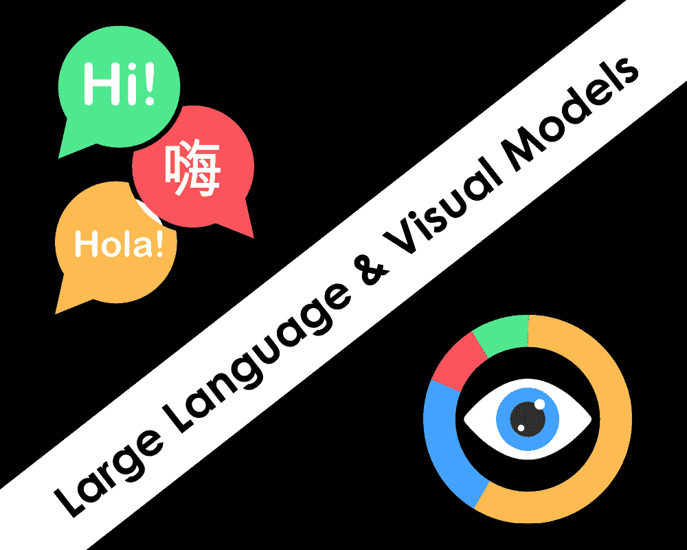

# AI：大型语言和视觉模型

> 原文：[`www.kdnuggets.com/2023/06/ai-large-language-visual-models.html`](https://www.kdnuggets.com/2023/06/ai-large-language-visual-models.html)

编辑提供的图片

大型模型，无论是语言模型还是视觉模型，都被设计用来处理海量数据，使用深度学习技术。这些模型在庞大的数据集上进行训练，能够以令人难以置信的准确度识别模式并做出预测。大型语言模型，如 OpenAI 的 GPT-3 和谷歌的 BERT，能够生成自然语言文本、回答问题，甚至进行语言翻译。大型视觉模型，如 OpenAI 的 CLIP 和谷歌的 Vision Transformer，可以以惊人的精度识别图像和视频中的物体和场景。通过结合这些语言和视觉模型，研究人员希望创建更先进的 AI 系统，以更像人类的方式理解世界。然而，这些模型也引发了数据偏见、计算资源和潜在误用的担忧，研究人员正积极解决这些问题。总体而言，大型模型处于 AI 领域的前沿，对发展更先进的智能机器充满希望。

* * *

## 我们的三大课程推荐

 1\. [谷歌网络安全证书](https://www.kdnuggets.com/google-cybersecurity) - 快速进入网络安全职业生涯。

 2\. [谷歌数据分析专业证书](https://www.kdnuggets.com/google-data-analytics) - 提升你的数据分析技能

 3\. [谷歌 IT 支持专业证书](https://www.kdnuggets.com/google-itsupport) - 支持你的组织的 IT 需求

* * *

# 数字时代

21 世纪的特点是数据生成和收集的量、速度和种类显著增加。随着数字技术和互联网的兴起，数据开始以空前的规模和速度生成，来源包括社交媒体、传感器和事务系统。让我们提醒你其中的一些：

+   互联网的增长：1990 年代，互联网迅速增长，产生了大量可用于分析洞察的数据。

+   数字设备的普及：智能手机、平板电脑及其他连接设备的广泛使用，产生了大量来自传感器、位置追踪和用户互动的数据。

+   社交媒体的增长：社交媒体平台如 Facebook 和 Twitter 通过用户生成的内容（如帖子、评论和点赞）产生了大量的数据。

+   电子商务的兴起：在线购物和电子商务平台生成了大量有关消费者行为、偏好和交易的数据。

这些趋势和其他因素导致了生成和收集的数据量显著增加，并创造了对新技术和方法的需求，以管理和分析这些数据。这促成了大数据技术的发展，如 Hadoop、Spark 和 NoSQL 数据库，以及数据处理和分析的新技术，包括*机器学习*和*深度学习*。实际上，大数据的兴起是深度学习技术发展的一个关键驱动因素，因为传统的机器学习方法常常无法有效分析和提取大型复杂数据集中的洞察。

深度学习算法通过使用具有多个层的人工神经网络，能够克服这些限制，通过学习大量数据并识别数据中的复杂模式和关系。这使得开发出能够处理各种数据类型的强大模型成为可能，包括文本、图像和音频。随着这些模型变得越来越复杂并能够处理更大、更复杂的数据集，它们催生了人工智能和机器学习的新纪元，在自然语言处理、计算机视觉和机器人技术等领域有了广泛应用。总体而言，深度学习的发展是人工智能领域的一次重大突破，它为数据分析、自动化和决策提供了新的可能性，涵盖了广泛的行业和应用。

# 大数据、深度学习、大规模的协同效应

大型语言和视觉模型，如 GPT3/GTP4 和 CLIP，非常特别，因为它们能够处理和理解大量复杂数据，包括文本、图像和其他形式的信息。这些模型使用深度学习技术来分析和学习大量数据，使它们能够识别模式、做出预测和生成高质量的输出。**大型语言模型**的一个主要优势是它们能够生成接近人类写作的自然语言文本。这些模型可以生成连贯且令人信服的书面内容，涵盖广泛的话题，使其在语言翻译、内容创作和聊天机器人等应用中非常有用。同样，**大型视觉模型**能够以惊人的准确度识别和分类图像。它们可以识别图像中的物体、场景，甚至情感，并生成详细的描述。这些模型的独特能力在自然语言处理、计算机视觉和人工智能等领域有许多实际应用，并且它们有潜力彻底改变我们与技术的互动方式和信息处理方式。

大型语言模型和大型视觉模型的结合可以提供多种协同效应，这些协同效应可以在各种应用中发挥作用。这些协同效应包括：

+   改进的多模态理解：大型语言模型擅长处理文本数据，而大型视觉模型擅长处理图像和视频数据。当这些模型结合时，它们可以创建对数据呈现背景的更全面的理解。这可以导致更准确的预测和更好的决策。

+   改进的推荐系统：通过结合大型语言和视觉模型，可以创建更准确和个性化的推荐系统。例如，在电子商务中，模型可以使用图像识别来了解客户基于他们之前的购买或产品浏览的偏好，然后使用语言处理来推荐最符合客户偏好的产品。

+   增强的聊天机器人和虚拟助手：结合大型语言和视觉模型可以提高聊天机器人和虚拟助手的准确性和自然性。例如，虚拟助手可以使用图像识别来理解用户请求的上下文，然后使用语言处理提供更准确和相关的回应。

+   改进的搜索功能：通过结合大型语言和视觉模型，可以创建更准确和全面的搜索功能。例如，搜索引擎可以使用图像识别来理解图像的内容，然后使用语言处理来提供基于图像内容的更相关的搜索结果。

+   增强的内容创作：结合大型语言和视觉模型也可以增强内容创作，如视频编辑或广告。例如，视频编辑工具可以使用图像识别来识别视频中的对象，然后使用语言处理来生成字幕或其他文本覆盖物。

+   更高效的训练：大型语言模型和视觉模型可以分别训练然后结合，这可能比从头开始训练一个大型模型更高效。这是因为从头开始训练一个大型模型可能计算资源消耗大且耗时，而训练较小的模型然后将其结合起来则可能更快、更高效。

总体而言，结合大型语言和视觉模型可以带来更准确、高效和全面的数据处理与分析，并且可以在广泛的应用中发挥作用，从自然语言处理到计算机视觉和机器人技术。

# GAI 或非 GAI

难以预测大模型的发展是否最终会导致通用人工智能（GAI）的创造，因为 GAI 是一个高度复杂和理论性的概念，目前在人工智能领域仍然是许多争论和猜测的主题。虽然大模型在自然语言处理、图像识别和机器人技术等领域取得了显著进展，但它们仍受限于训练数据和编程，尚不能实现真正的泛化或自主学习。此外，创建 GAI 还需要在多个 AI 研究领域取得突破，包括无监督学习、推理和决策。虽然大模型朝着更先进的人工智能形式迈出了重要的一步，但它们距离实现 GAI 所需的智能和适应能力还远远不够。总之，尽管大模型的发展是朝着更高级人工智能形式迈进的重要一步，但仍不确定它们是否最终会导致通用人工智能的创造。

# 挑战

**数据偏差**是大模型中的一个重要问题，因为这些模型是在可能包含偏见或歧视数据的大型数据集上进行训练的。当用于训练模型的数据未能代表现实世界人群的多样性时，就会发生数据偏差，导致模型生成偏见或歧视性的输出。例如，如果一个大型语言模型在对某一特定性别或民族存在偏见的文本数据上进行训练，该模型在生成文本或进行预测时可能会产生偏见或歧视性的语言。同样，如果一个大型视觉模型在对某些群体存在偏见的图像数据上进行训练，该模型在执行诸如物体识别或图像描述等任务时可能会产生偏见或歧视性的输出。数据偏差可能产生严重后果，因为它可能延续甚至放大现有的社会和经济不平等。因此，识别和减轻大模型中的数据偏差在训练和部署过程中都至关重要。

缓解数据偏差的一种方法是确保用于训练大模型的数据集多样且代表现实世界人群。这可以通过仔细的数据集策划和增强，以及在模型训练和评估过程中使用公平性指标和技术来实现。此外，定期监控和审计大模型中的偏差，并在必要时采取纠正措施也很重要。这可能包括在更多多样化的数据上重新训练模型或使用后处理技术来纠正偏见输出。总体而言，数据偏差是大模型中的一个重要问题，采取主动措施识别和减轻偏差至关重要，以确保这些模型公平且公正。

# 伦理方面

OpenAI 决定将其大型语言模型 GPT-3 的独占商业权利授予微软，这在 AI 社区内引发了一些争论。一方面，可以认为与微软这样的科技巨头合作可以提供进一步推动 AI 研究和发展的资源和资金。此外，微软承诺以负责任和道德的方式使用 GPT-3，并承诺投资于与 OpenAI 使命一致的 AI 发展。另一方面，有人担心微软可能会垄断 GPT-3 和其他先进 AI 技术的访问，这可能会限制创新并在科技行业内造成权力不平衡。此外，有人认为 OpenAI 将独占商业权利授予微软的决定违背了其推动 AI 以安全和有益方式发展的公开使命，因为这可能会优先考虑商业利益而非社会福利。最终，OpenAI 将独占商业权利授予微软的决定是否“合适”，取决于个人的观点和价值观。虽然关于这种合作关系的潜在风险和缺点有合理的担忧，但也存在来自与微软这样的科技巨头合作的潜在好处和机会。AI 社区和社会整体需要密切关注这种合作关系的影响，并确保 AI 的发展和部署是安全、有效且公平的。

# 市场份额

这些模型各有其优缺点，并可用于各种自然语言处理任务，例如语言翻译、文本生成、问答等。作为一个 AI 语言模型，ChatGPT 被认为是目前最先进和有效的语言模型之一。然而，还有其他模型在某些任务上可以超越 ChatGPT，具体取决于用于评估性能的指标。例如，一些模型在基准自然语言处理任务如 GLUE（通用语言理解评估）或 SuperGLUE 上取得了更高的分数，这些任务评估了模型理解和推理自然语言文本的能力。这些模型包括：

+   GShard-GPT3，一个由谷歌开发的大规模语言模型，在多个 NLP 基准测试中取得了最先进的性能

+   T5（文本到文本转换变换器），同样由谷歌开发，在广泛的 NLP 任务上表现强劲

+   GPT-Neo，一个由社区驱动的项目，旨在开发与 GPT-3 类似的大规模语言模型，但更具可访问性，并且可以在更广泛的硬件上进行训练

值得注意的是，尽管这些基准测试的表现只是语言模型整体能力的一个方面，但 ChatGPT 和其他模型可能在其他任务或实际应用中超越这些模型。此外，人工智能领域不断发展，新模型的不断出现可能会推动可能性的边界。

## 有用的链接

1.  [ChatGPT 在做什么……以及为什么它有效？](https://writings.stephenwolfram.com/2023/02/what-is-chatgpt-doing-and-why-does-it-work/)

1.  OpenAI 的 GPT-3: [`openai.com/blog/gpt-3-unleashed/`](https://openai.com/blog/gpt-3-unleashed/)

1.  谷歌的 BERT: [`ai.googleblog.com/2018/11/open-sourcing-bert-state-of-art-pre.html`](https://ai.googleblog.com/2018/11/open-sourcing-bert-state-of-art-pre.html)

1.  Facebook 的 RoBERTa: [`ai.facebook.com/blog/roberta-an-optimized-method-for-pretraining-self-supervised-nlp-systems/`](https://ai.facebook.com/blog/roberta-an-optimized-method-for-pretraining-self-supervised-nlp-systems/)

1.  谷歌的 T5: [`ai.googleblog.com/2020/02/exploring-transfer-learning-with-t5.html`](https://ai.googleblog.com/2020/02/exploring-transfer-learning-with-t5.html)

1.  OpenAI 的 CLIP（对比语言-图像预训练）: [`openai.com/blog/clip/`](https://openai.com/blog/clip/)

1.  微软的 Turing-NLG: [`www.microsoft.com/en-us/research/blog/microsoft-announces-turing-nlg-state-of-the-art-model-for-natural-language-generation/`](https://www.microsoft.com/en-us/research/blog/microsoft-announces-turing-nlg-state-of-the-art-model-for-natural-language-generation/)

1.  Hugging Face 的 Transformer 库: [`huggingface.co/transformers/`](https://huggingface.co/transformers/)

**[Ihar Rubanau](https://www.linkedin.com/in/irubanau)** 是 Sigma Software Group 的高级数据科学家

### 更多相关话题

+   [顶级开源大型语言模型](https://www.kdnuggets.com/2022/09/john-snow-top-open-source-large-language-models.html)

+   [了解大型语言模型](https://www.kdnuggets.com/2023/03/learn-large-language-models.html)

+   [介绍 John Snow Labs 的医疗保健特定大型语言模型](https://www.kdnuggets.com/2023/04/john-snow-introducing-healthcare-specific-large-language-models-john-snow-labs.html)

+   [大型语言模型是什么？它们如何工作？](https://www.kdnuggets.com/2023/05/large-language-models-work.html)

+   [更多免费的语言模型课程](https://www.kdnuggets.com/2023/06/free-courses-large-language-models.html)

+   [介绍 TPU v4：谷歌前沿超级计算机用于大型…](https://www.kdnuggets.com/2023/04/introducing-tpu-v4-googles-cutting-edge-supercomputer-large-language-models.html)
