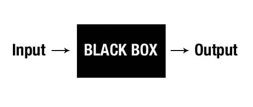

# AI 和机器学习黑箱：对透明度和问责制的需求

> 原文：[`www.kdnuggets.com/2017/04/ai-machine-learning-black-boxes-transparency-accountability.html`](https://www.kdnuggets.com/2017/04/ai-machine-learning-black-boxes-transparency-accountability.html)

 评论

**由 Colin Lewis（Robotenomics）和 Dagmar Monett（柏林经济与法律学院）撰写。**

航空中的黑箱，也称为飞行数据记录器，是一种极其安全的设备，旨在向研究人员或调查员提供关于任何可能导致飞行事件或事故的异常情况的高度真实的信息。

人工智能（AI）或机器学习程序中的黑箱¹已经变成了相反的意义。最新的机器学习方法，即已取得“重要实证成功”的深度学习²，但关于透明度的重大问题仍然存在。

开发人员承认，这些“自学习机器”的内部工作增加了关于机器行为的复杂性和不透明性。一旦机器学习算法训练完成，理解³为何它对一组数据输入给出特定响应可能变得困难。这，如下所述，当这些算法用于任务关键时，可能是一种劣势。

此外，机器学习算法可以以其设计者未曾预见的方式行动，这引发了关于 AI 的“自治”、“决策”和“责任”能力的问题。当出现问题时，正如必然会发生的那样，发现导致事件的行为可能是一项艰巨的任务，因为这些行为被锁定在几乎无法发现的黑箱中。

**随着机器学习算法变得更加智能，它们也变得更加不可理解。**

机器学习算法本质上是从收集的数据中学习行为模式以支持预测和知情决策的系统。这些机器学习系统通常在两个明确的领域中处理数据，如数据科学社会公益奖学金主任 Rayid Ghani 所描述，他指出⁴：“数据科学的力量通常在以下两个极端的范围内发挥作用：

1.  帮助人类发现可以用于决策的信息，新知识，

1.  通过自动化预测模型，这些模型被插入到操作系统中并自主运行。”

为了反映知识获取和自动决策的这两个极端，机器学习系统通常分为两种类型：

+   A 类应用——其中模型预测用于支持可能对人们生活产生深远影响的决策，例如医学诊断、贷款申请、自动驾驶汽车、执法和刑罚；以及

+   B 类应用——在较低后果和大规模的环境中使用模型预测，例如选择观看哪个流媒体视频、新闻提要顶部显示的新闻以及搜索查询。

然而，已经有充分的文献记录表明，这些机器学习黑箱的设计和构建可能会通过程序员和数据选择导致偏见、不公平和歧视。“讽刺的是，我们越是设计成功模拟人类的人工智能技术，人工智能就越是以我们拥有的所有偏见和局限性进行学习。”⁶

虽然还有其他问题，如数据质量及其处理的担忧，或算法结果的质量及其伦理影响等，但经理们应该意识到机器学习系统中经常出现潜在问题的两个核心要素，我们认为高管们应该关注并采取行动加以解决：1）*透明性*，2）*领导力和治理*。

**1. 透明性**

为了让人们在决策中使用分析模型的预测，他们必须信任该模型。要信任一个模型，他们必须了解它如何做出预测，即模型应该是可解释的。目前大多数基于深度神经网络原理的机器学习系统并不容易解释。

这对依赖人工智能系统的组织可能造成很大的损害。研究人员 Taylor 等人（2016）已经表明，“系统行为与设计者的预期行为之间存在许多可能难以察觉的差异，而这些差异中至少有一些是不 desirable 的。”

如果没有精心设计，监控机器学习系统的行为可能会很困难。高管们应当努力确保他们的机器学习系统更具透明性，以帮助知情监督者评估系统在做出决策时的内部原因。正如 Pedro Domingos 教授所写的⁸：“当一种新技术如机器学习如此普及且改变游戏规则时，让它保持黑箱状态并不明智。隐蔽性为错误和滥用打开了大门。”

**2. 领导力和治理**

领导者应当寻求对机器学习算法实施严格的治理，确保这些新型机器智能系统具有“价值对齐”和“良好行为”，特别是当它们经常被用来在业务目标方面做出有效决策时。

系统的治理应包括系统化的方式来形式化隐藏的假设（在黑箱内部），并确保机器学习系统内部工作的问责制、可审计性和透明度。此外，对开源机器学习算法和训练数据的选择及其鲁棒性引入更严格的检查应成为开发者和管理者的首要任务。

任何一个为了优化目标而自行调整的决策机器学习系统，如果其目标与组织的利益不一致，可能会产生显著且永久的影响。认识到机器学习和 AI 算法的局限性是更好地管理它们的第一步。

最终，我们需要确保我们不会把不具备足够智能的机器置于决策之中。

**脚注**

1.  作者在本文中将机器学习系统、程序和算法这些术语交替使用。

1.  Bengio, Yoshua (2013 年)。表征的深度学习：展望未来。见 A. Dediu, C. Martín-Vide, R. Mitkov, 和 B. Truthe (编)，*统计语言与语音处理：第一次国际会议*（第 1-137 页），柏林海德堡：施普林格。

1.  Mittelstadt, Brent Daniel; Allo, Patrick; Taddeo, Mariarosaria; Wachter, Sandra; 和 Floridi, Luciano (2016 年，待出版)。算法伦理：辩论的映射。*大数据与社会*。

1.  Shan, Carl (2015 年)。*数据科学如何用于社会公益*。来源：[`www.carlshan.com/2015/01/08/data-science-social-good.html`](http://www.carlshan.com/2015/01/08/data-science-social-good.html)。

1.  Peña Gangadharan, Seeta; Eubanks, Virginia; 和 Barocas, Solon (2014 年)。*数据与歧视：论文集*。新美国：开放技术研究所。来源：[`na-production.s3.amazonaws.com/documents/data-and-discrimination.pdf`](https://na-production.s3.amazonaws.com/documents/data-and-discrimination.pdf)。

1.  *编程与偏见：犹他大学计算机科学家发现如何在算法中识别偏见* (2015 年 8 月)。UNews, 犹他大学。来源：[`unews.utah.edu/programming-and-prejudice/`](https://unews.utah.edu/programming-and-prejudice/)。

1.  Taylor, Jessica; Yudkowsky, Eliezer; LaVictoire, Patrick; 和 Critch, Andrew (2016 年)。*高级机器学习系统的对齐*。来源：[`intelligence.org/files/AlignmentMachineLearning.pdf`](https://intelligence.org/files/AlignmentMachineLearning.pdf)。

1.  Domingos, Pedro (2016 年 5 月)。*为什么你需要理解机器学习*。世界经济论坛。来源：[`www.weforum.org/agenda/2016/05/why-you-need-to-understand-machine-learning/`](https://www.weforum.org/agenda/2016/05/why-you-need-to-understand-machine-learning/)。

1.  卢卡，迈克尔；克莱因伯格，乔恩；穆拉纳坦，森迪尔（2016 年 1 月-2 月）。*算法也需要管理者*。哈佛商业评论。取自 [`hbr.org/2016/01/algorithms-need-managers-too`](https://hbr.org/2016/01/algorithms-need-managers-too)。

**[科林·刘易斯](http://robotenomics.com/)** 是一位行为经济学家和数据科学家，提供自动化、机器人技术和人工智能的研究和咨询服务 ([www.robotenomics.com](http://robotenomics.com/))。他的机器人和自动化工作曾被《金融时报》，彭博社，哈佛商业评论等媒体报道。

**[达格玛·莫内特](http://www.monettdiaz.com)** 是德国柏林经济与法律学院的计算机科学教授。她于 2005 年获得柏林洪堡大学计算机科学的*Dr. rer nat.*学位。她的主要研究和教学兴趣包括人工智能和软件工程的不同领域 ([www.monettdiaz.com](http://www.monettdiaz.com))。

**相关：**

+   大数据迫切需要透明度

+   人工智能简史

+   什么是人工智能？智能的组成部分

* * *

## 我们的前三大课程推荐

 1\. [谷歌网络安全证书](https://www.kdnuggets.com/google-cybersecurity) - 快速进入网络安全职业。

 2\. [谷歌数据分析专业证书](https://www.kdnuggets.com/google-data-analytics) - 提升你的数据分析技能

 3\. [谷歌 IT 支持专业证书](https://www.kdnuggets.com/google-itsupport) - 支持你的组织进行 IT 管理

* * *

### 更多相关主题

+   [元数据如何提高安全性、质量和透明度](https://www.kdnuggets.com/2022/04/metadata-improves-security-quality-transparency.html)

+   [黑色星期五优惠 - 用 DataCamp 以更低价格掌握机器学习](https://www.kdnuggets.com/2022/11/datacamp-black-friday-deal-master-machine-learning-less-datacamp.html)

+   [对模型信心的探索：你能相信一个黑箱吗？](https://www.kdnuggets.com/the-quest-for-model-confidence-can-you-trust-a-black-box)

+   [我们不需要数据科学家，我们需要数据工程师](https://www.kdnuggets.com/2021/02/dont-need-data-scientists-need-data-engineers.html)

+   [2022 年你需要阅读的机器学习书籍](https://www.kdnuggets.com/2022/04/machine-learning-books-need-read-2022.html)

+   [KDnuggets 新闻，4 月 27 日：关于带代码的论文简要介绍；…](https://www.kdnuggets.com/2022/n17.html)
