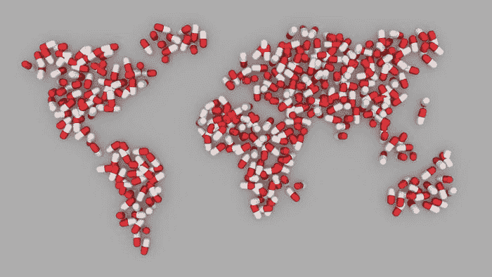
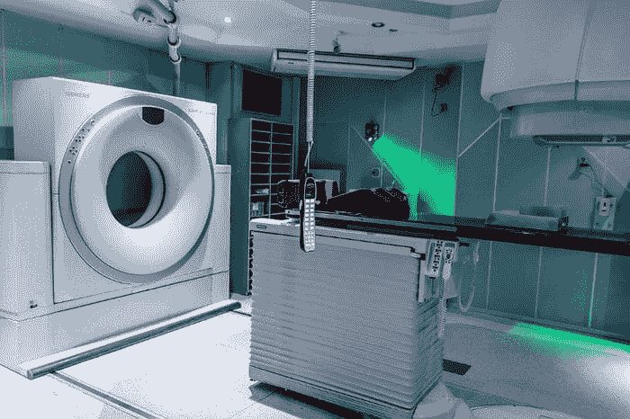
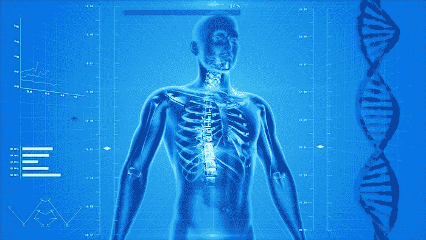
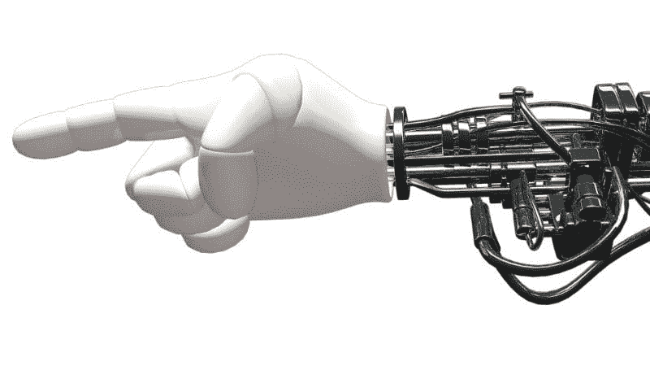
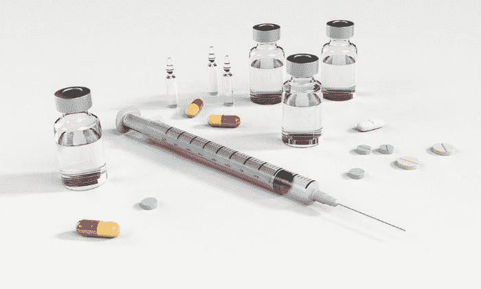
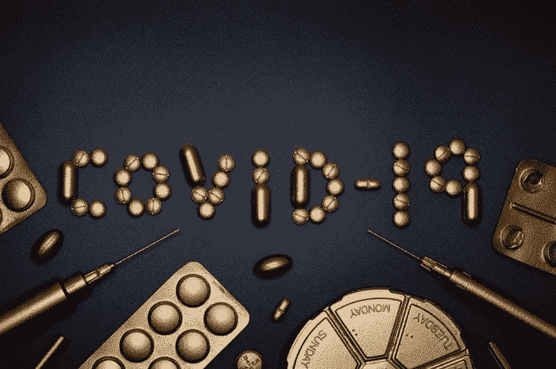

# AI 和机器学习在医疗保健领域

> 原文：[`www.kdnuggets.com/2020/05/ai-machine-learning-healthcare.html`](https://www.kdnuggets.com/2020/05/ai-machine-learning-healthcare.html)

评论

图片来源：[Pixabay（商业用途免费）](https://pixabay.com/illustrations/world-map-pill-earth-healthcare-1185076/)

### 介绍

* * *

## 我们的前三名课程推荐

 1. [Google 网络安全证书](https://www.kdnuggets.com/google-cybersecurity) - 快速进入网络安全职业。

 2. [Google 数据分析专业证书](https://www.kdnuggets.com/google-data-analytics) - 提升你的数据分析能力

 3. [Google IT 支持专业证书](https://www.kdnuggets.com/google-itsupport) - 支持你的组织在 IT 方面

* * *

21 世纪只有 20 年，而这个世纪最大的变革技术之一，毫无疑问是人工智能（AI）。人工智能及其相关服务和平台预计将改变全球生产力、工作模式和生活方式，并创造巨大的财富，这是一个公认的观点。

例如，麦肯锡预计到 2030 年全球经济活动将达到约[$13 万亿](https://www.mckinsey.com/featured-insights/artificial-intelligence/notes-from-the-ai-frontier-modeling-the-impact-of-ai-on-the-world-economy)。短期内，研究公司 Gartner 预计全球[基于 AI 的经济活动](https://www.pwc.com/gx/en/issues/data-and-analytics/publications/artificial-intelligence-study.html)将从 2018 年的约 1.2 万亿美元增加到约[$3.9 万亿到 2022 年](https://www.forbes.com/sites/alexknapp/2018/04/25/gartner-estimates-ai-business-value-to-reach-nearly-4-trillion-by-2022/#3eb979af33f9)。

[**普华永道全球人工智能研究：奖赏的规模**](https://www.pwc.com/gx/en/issues/data-and-analytics/publications/artificial-intelligence-study.html)

这场变革显然在很大程度上受到强大机器学习（ML）工具和技术的推动，如深度卷积网络、生成对抗网络（GAN）、梯度提升树模型（GBM）、深度强化学习（DRL）等。

然而，传统的商业和技术领域并不是唯一受人工智能影响的领域。[医疗保健被认为是非常适合应用人工智能工具和技术的领域](https://www.webmd.com/a-to-z-guides/features/artificial-intelligence-helps-health-care#1)。

像[电子病历 (EMR)](https://www.usfhealthonline.com/resources/key-concepts/what-are-electronic-medical-records-emr/)这样的强制性做法已经为医疗系统应用大数据工具进行下一代数据分析奠定了基础。AI/ML 工具注定会为这一流程增加更多价值。预计它们将提升初级/三级患者护理和公共医疗系统中自动化和智能决策的质量。这可能是 AI 工具的最大影响，因为它有可能改变全球数十亿人的生活质量。

### 机器学习在医疗中的关键应用示例

### AI 辅助的放射学和病理学

图片来源：[Pixabay（商业使用免费）](https://pixabay.com/photos/mri-magnetic-resonance-imaging-2815637/)

如今，电子存储的医学影像数据丰富，而深度学习算法可以利用这类数据集来检测和发现模式及异常。机器和算法可以像训练有素的放射科医生一样解释影像数据——识别皮肤上的可疑点、病变、肿瘤和脑出血。因此，AI/ML 工具/平台用于辅助放射科医生的使用前景广阔。

这种方法解决了医疗领域的一个关键问题，因为在全球范围内，训练有素的放射科医生越来越难以找到。在大多数情况下，这些技术工人由于大量的数字医学数据而承受巨大的压力。根据[这篇文章](https://www.ncbi.nlm.nih.gov/pmc/articles/PMC6268174/)，一名普通的放射科医生需要每 3-4 秒就对一张图像进行解读，以满足需求。

[**放射学中的人工智能**](https://www.ncbi.nlm.nih.gov/pmc/articles/PMC6268174/)

**识别罕见或难以诊断的疾病**通常依赖于检测所谓的“边缘案例”。由于这类机器学习系统是建立在包含这些疾病的原始图像（及各种转换）的大型数据集之上的，它们在这种检测中通常比人类更可靠。

> 预计它们将提升初级/三级患者护理和公共医疗系统中自动化和智能决策的质量。这可能是 AI 工具的最大影响，因为它有可能改变全球数十亿人的生活质量。

一个很好的案例是[微软的 Project InnerEye](https://www.microsoft.com/en-us/research/project/medical-image-analysis/)，它利用机器学习方法对 3D 放射图像进行肿瘤分割和识别。这有助于精确的手术规划、导航和高效的肿瘤轮廓描绘，以便放疗规划。

MRI 和其他用于早期癌症检测的先进影像系统，正配备机器学习算法。以下文章提供了这方面的全面概述。

[**深度学习、人工智能提高乳腺癌检测的准确性**](https://healthitanalytics.com/news/deep-learning-ai-improve-accuracy-of-breast-cancer-detection)

以下《自然》文章描述了机器学习技术如何应用于进行高级图像分析，如前列腺分割和多个影像数据源的融合（例如超声检查、CT 和 MRI）。

[**新时代：人工智能和机器学习在前列腺癌中的应用**](https://www.nature.com/articles/s41585-019-0193-3)

机器学习工具通过**增强外科医生的显示**，提供如癌症定位等信息，在机器人手术和其他图像引导干预中增添了重要价值。

> 因此，AI/ML 工具/平台在辅助放射科医生方面的使用，预计将呈指数级增长。

### 机器学习和数据科学用于可操作的洞察

图片来源：[Pixabay（商业用途免费）](https://pixabay.com/illustrations/human-skeleton-human-body-anatomy-163715/)

在当今世界，[**医疗数据的规模达到 exabytes 正在各大医疗机构进行数字化**](https://emerj.com/ai-sector-overviews/where-healthcares-big-data-actually-comes-from/)（公立医院、养老院、医生诊所、病理实验室等）。不幸的是，这些数据通常是**混乱和无结构的**。与标准事务型商业数据不同，**患者数据不特别适合简单的统计建模和分析。**

强大而灵活的 AI 驱动平台，能够**连接到大量患者数据库**并分析复杂的数据类型（例如血液病理、基因组学、放射影像、医疗历史）是当务之急。此外，这些系统应能够深入筛查分析，发现隐藏的模式。

此外，机器人应该能够将其发现翻译和可视化为**人类可理解的形式**，以便医生和其他医疗专业人员能够以高度的信心和完全的透明度处理其输出。

[可解释的 AI](https://towardsdatascience.com/interpretable-ai-or-how-i-learned-to-stop-worrying-and-trust-ai-e61f9e8ee2c2) 和分布式机器学习系统 — 非常符合这些要求，并有望在不久的将来满足这种系统的需求。

### 外科手术辅助的物理机器人

图片来源：[Pixabay（商业用途免费）](https://pixabay.com/illustrations/hand-robot-machine-697264/)

外科手术机器人可以为人类外科医生提供独特的帮助，

+   增强在手术过程中的观察和导航能力，

+   创造精确且微创的切口。

+   通过优化缝合几何和伤口减少疼痛

对于这种数字手术机器人，AI/ML 的应用确实充满了令人兴奋的可能性。

+   **软件中心的机器人协作**与大规模**分布式处理**的援助

+   基于手术历史（由机器和人类执行）及其结果（无论好坏）的数据驱动**洞察和指导**

+   AI 生成的**虚拟现实空间**用于实时指导和指引

+   相对简单程序的**远程医疗和远程手术**的可能性

以下文章简明扼要地总结了潜在应用。

[**机器人和 AI 如何创造 21 世纪的外科医生**](https://www.roboticsbusinessreview.com/health-medical/how-robots-and-ai-are-creating-the-21st-century-surgeon/)

### AI 用于医疗操作管理和患者体验

在美国，普通大众获得适当医疗护理的成本和难度一直是长时间且尖锐的争论话题。

AI 和相关的数据驱动技术独特地准备好解决一些被识别为根本原因的问题——长时间排队、对不合理账单的恐惧、漫长且过于复杂的预约过程、无法接触到合适的医疗专业人士。

同样的问题困扰了传统业务数十年，而 AI/ML 技术已经是解决方案的一部分。这是因为，巨大的数据库和智能搜索算法，正是 AI 系统的强项，擅长模式匹配或优化问题。因此，高级的 AI/ML 工具和技术必须被医院和公共卫生组织在日常操作中利用。

[**11 个医疗保健 AI 的操作应用 - Olive**](https://oliveai.com/blog/11-operational-applications-for-healthcare-ai/)

好消息是，**数据隐私问题，这对医疗系统来说是复杂且困难的问题，**对这种类型的 AI 应用并不构成重大挑战。通常，操作问题并不涉及机密的患者数据，如疾病、诊断或药物，而是像其他现代商业企业一样，涉及财务、资本、市场营销或人力资源问题的数据。

图片来源: [Pixabay（商业用途免费）](https://pixabay.com/illustrations/security-secure-technology-safety-2168234/)

这些系统的核心目标应是使 AI 辅助平台旨在**提高大多数普通人医疗服务的体验**。已部署的传统业务系统的总体目标是最大化利润。用于医疗操作管理的强大 AI 工具必须**通过将同理心与利润生成目标结合起来，区分于那些传统系统**。

### 利用 AI/ML 技术进行药物发现

图片来源: [Pixabay（商业用途免费）](https://pixabay.com/illustrations/syringe-pill-capsule-morphine-1884784/)

制药行业的知名企业越来越多地选择 AI 和 ML 技术来解决成功药物发现的极其困难的问题。一些突出的例子——涉及赛诺菲、基因泰克、辉瑞——可以从 [这篇文章](https://www.nature.com/articles/d41586-018-05267-x)中找到。这些案例研究涵盖了各种治疗领域——代谢疾病、癌症治疗、免疫肿瘤药物。

[**人工智能如何改变药物发现**](https://www.nature.com/articles/d41586-018-05267-x)

超越传统的长期过程，AI 技术正越来越多地应用于加速**早期候选药物筛选**和**机制发现**的基本过程。

例如，生物技术公司 Berg [利用其 AI 平台](https://fortune.com/2018/10/22/artificial-intelligence-ai-healthcare/) 分析来自患者的大量生物和结果数据（脂质、代谢物、酶和蛋白质谱），以突出病态细胞和健康细胞之间的关键差异，并识别新型癌症机制。

[**Berg 的人工智能：仅仅是另一家生物技术公司还是行业变革者？**](https://digital.hbs.edu/platform-rctom/submission/artificial-intelligence-at-berg-just-another-biotech-or-industry-changing-company/)

另一个显著的例子是 DeepMind 发布的与 COVID-19 病毒（[SARS-CoV-2](https://en.wikipedia.org/wiki/Severe_acute_respiratory_syndrome_coronavirus_2)）相关的可能蛋白质结构，使用了他们的[**AlphaFold**](https://deepmind.com/blog/article/AlphaFold-Using-AI-for-scientific-discovery)系统。

[**与 COVID-19 相关的蛋白质结构的计算预测**](https://deepmind.com/research/open-source/computational-predictions-of-protein-structures-associated-with-COVID-19)

许多初创公司也在致力于使用 AI 系统分析多渠道数据（研究论文、专利、临床试验和患者记录），通过利用最新技术如**贝叶斯推断、马尔可夫链模型、强化学习和自然语言处理（NLP）。**寻找模式并构建高维表示，这些表示将存储在云端并用于药物发现过程，是关键目标。

这里有一篇综述文章展示了深度学习在药物发现中的应用。

[**综述：药物发现中的深度学习**](https://towardsdatascience.com/review-deep-learning-in-drug-discovery-f4c89e3321e1)

> 强大的 AI 工具在医疗保健运营管理中必须**通过将同理心与盈利目标相结合，区别于传统系统。**

### 面向未来——精准医疗和预防保健

根据美国国家医学图书馆，[**精准医学**](https://ghr.nlm.nih.gov/primer/precisionmedicine/definition) 是 “*一种新兴的疾病治疗和预防方法，考虑到每个人在基因、环境和生活方式上的个体差异。*”

展望未来，这可能是人工智能/机器学习在医疗保健领域应用中的最具影响力的好处之一。

目标极其复杂且要求极高——根据个体的个人病史、生活方式选择、遗传数据以及不断变化的病理测试来寻找精准的治疗方案。自然，我们需要引入最强大的人工智能技术——深度神经网络、人工智能驱动的搜索算法/高级强化学习、概率图模型、半监督学习——来应对这一挑战。

除了对疾病和治疗的预测与建模外，这样的人工智能系统还可能根据早期筛查或常规年度体检数据预测未来患者患特定疾病的概率。此外，人工智能工具可能能够建模为什么以及在什么情况下疾病更可能发生，从而有助于指导和准备医生在个体出现症状之前就进行干预（以个性化的方式）。

> 目标极其复杂且要求极高——根据个体的个人病史、生活方式选择、遗传数据以及不断变化的病理测试来寻找精准的治疗方案。

[**人工智能如何推动精准医学发展**](https://www.forbes.com/sites/nicolemartin1/2019/10/18/how-artifical-intelligence-is-advancing-precision-medicine/#13cc5c15a4d5)

### 公共卫生系统中的人工智能

不用说，这些强大的技术不仅可以应用于大规模的公共卫生系统，还可以应用于个体患者护理。实际上， [**数字化疫情监控**](https://theconversation.com/digital-surveillance-can-help-bring-the-coronavirus-pandemic-under-control-but-also-threatens-privacy-135151) 和人工智能辅助的健康数据分析正待扩展。

[**数字化监控可以帮助控制冠状病毒大流行——但也威胁到……**](https://theconversation.com/digital-surveillance-can-help-bring-the-coronavirus-pandemic-under-control-but-also-threatens-privacy-135151)

世界卫生组织（WHO）也表示了类似的观点……

[**大数据和人工智能**](https://www.who.int/ethics/topics/big-data-artificial-intelligence/en/)

图片来源： [Pixabay（商业用途免费）](https://pixabay.com/photos/chemistry-crown-coronavirus-cure-4932607/)

[持续的 COVID-19 危机](https://www.cdc.gov/coronavirus/2019-ncov/cases-updates/summary.html) 显示了进行数百次平行试验以进行 [疫苗开发](https://www.the-scientist.com/news-opinion/covid-19-vaccine-frontrunners-67382) 和 [治疗研究项目](https://health.ebsco.com/blog/article/potential-therapeutic-options-in-covid-19-clinical-trials) 的重要性。从所有这些不同来源获取数据并识别模式——这些结果通常具有很高的不确定性——几乎无法通过标准统计建模技术来实现，这些技术针对的是小规模试验。必须应用 AI 技术来解决这样一个全球规模的问题。

[**COVID-19 临床试验中的潜在治疗选择**](https://health.ebsco.com/blog/article/potential-therapeutic-options-in-covid-19-clinical-trials)

### 总结

讨论了 AI/ML 技术和平台在医疗保健领域的各种令人兴奋的前景应用。回顾了从放射科助手到智能健康运营管理，从个性化医学到公共健康数字监控的各个话题。

数据隐私和法律框架带来的已知挑战将继续阻碍这些系统的全面实施。弄清楚第三方提供商（例如 AI 和 ML 工具、物理设备或平台的所有者）可以合法查看和使用的数据类型是极其复杂的。因此，需要大规模的法律和政策制定理顺工作，以平行解决这些挑战。

作为技术专家和 AI/ML 从业者，我们应当为一个光明的未来而努力，使 AI 算法的力量惠及数十亿普通人，改善他们的基本健康和福祉。

此外，你可以查看作者的 [**GitHub**](https://github.com/tirthajyoti?tab=repositories) **库**，获取机器学习和数据科学的代码、想法和资源。如果你和我一样，对 AI/机器学习/数据科学充满热情，请随时 [在 LinkedIn 上添加我](https://www.linkedin.com/in/tirthajyoti-sarkar-2127aa7/) 或 [在 Twitter 上关注我](https://twitter.com/tirthajyotiS)。

[原文](https://towardsdatascience.com/ai-and-machine-learning-for-healthcare-7a70fb3acb67)。转载已获许可。

**相关内容：**

+   谷歌新的可解释 AI 服务

+   利用 AI 对抗冠状病毒：通过深度学习和计算机视觉改进检测

+   AI 如何帮助管理传染病

### 更多相关话题

+   [成为优秀数据科学家需要的 5 项关键技能](https://www.kdnuggets.com/2021/12/5-key-skills-needed-become-great-data-scientist.html)

+   [每个初学者数据科学家都应该掌握的 6 种预测模型](https://www.kdnuggets.com/2021/12/6-predictive-models-every-beginner-data-scientist-master.html)

+   [2021 年最佳 ETL 工具](https://www.kdnuggets.com/2021/12/mozart-best-etl-tools-2021.html)

+   [停止学习数据科学以寻找目标，并通过寻找目标来……](https://www.kdnuggets.com/2021/12/stop-learning-data-science-find-purpose.html)

+   [学习数据科学统计的最佳资源](https://www.kdnuggets.com/2021/12/springboard-top-resources-learn-data-science-statistics.html)

+   [成功数据科学家的 5 个特征](https://www.kdnuggets.com/2021/12/5-characteristics-successful-data-scientist.html)
