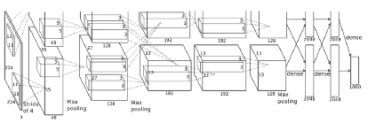

# 2020 年的 AI 论文阅读推荐

> 原文：[`www.kdnuggets.com/2020/09/ai-papers-read-2020.html`](https://www.kdnuggets.com/2020/09/ai-papers-read-2020.html)

评论

**由 [Ygor Rebouças Serpa](https://www.linkedin.com/in/ygorreboucas/) 提供，他正在为医疗保健行业开发可解释的人工智能工具**

图片由 [Alfons Morales](https://unsplash.com/@alfonsmc10?utm_source=medium&utm_medium=referral) 提供，来源于 [Unsplash](https://unsplash.com/?utm_source=medium&utm_medium=referral)

* * *

## 我们的三大课程推荐

 1\. [谷歌网络安全证书](https://www.kdnuggets.com/google-cybersecurity) - 快速进入网络安全职业的快车道。

 2\. [谷歌数据分析专业证书](https://www.kdnuggets.com/google-data-analytics) - 提升你的数据分析能力

 3\. [谷歌 IT 支持专业证书](https://www.kdnuggets.com/google-itsupport) - 支持你组织的 IT

* * *

人工智能是科学领域中增长最快的领域之一，并且是过去几年中最受追捧的技能之一，通常被标记为数据科学。这个领域有着广泛的应用，通常按输入类型划分：文本、音频、图像、视频或图表；或按问题表述方式划分：监督学习、无监督学习和强化学习。跟上所有这些进展是一项巨大的工作，通常会变成令人沮丧的尝试。基于这一点，我提供了一些阅读建议，以便让你了解人工智能和数据科学领域最新和经典的突破。

尽管我列出的多数论文都涉及图像和文本，但它们的许多概念相当不依赖于输入类型，并且提供了超越视觉和语言任务的深入见解。在每个建议旁边，我列出了一些我认为你应该阅读（或重新阅读）论文的理由，并添加了一些进一步阅读的材料，以便你能更深入地研究相关主题。

在我们开始之前，我要向音频和强化学习社区道歉，因为我由于对这两个领域的经验有限，没有将这些主题添加到列表中。

下面我们开始吧。

### #1 AlexNet (2012)

> Krizhevsky, Alex, Ilya Sutskever, 和 Geoffrey E. Hinton. [“用深度卷积神经网络进行图像分类。”](http://papers.nips.cc/paper/4824-imagenet-classification-with-deep-convolutional-neural-networ) *神经信息处理系统的进展*。2012 年。

在 2012 年，作者提出了使用 GPU 训练大型卷积神经网络（CNN）来应对 ImageNet 挑战。这是一个大胆的举措，因为 CNN 被认为过于庞大，无法在如此大规模的问题上进行训练。令所有人惊讶的是，他们赢得了第一名，Top-5 错误率约为 15%，相比之下第二名使用了最先进的图像处理技术，错误率约为 26%。

**理由 #1：** 虽然我们大多数人知道 AlexNet 的历史重要性，但并非所有人都知道我们今天使用的技术中哪些在繁荣之前已经存在。你可能会惊讶于论文中介绍的许多概念，如 dropout 和 ReLU，是多么熟悉。

**理由 #2：** 提出的网络有 6000 万参数，对于 2012 年的标准来说完全是疯狂的。现在，我们看到的模型参数超过了十亿。阅读 AlexNet 论文为我们提供了大量关于自那时以来事情如何发展的见解。

**进一步阅读：** 你可以参考图像 Net 冠军的历史，阅读[ZF Net](https://link.springer.com/chapter/10.1007/978-3-319-10590-1_53)、[VGG](https://arxiv.org/abs/1409.1556)、[Inception-v1](https://www.cv-foundation.org/openaccess/content_cvpr_2015/html/Szegedy_Going_Deeper_With_2015_CVPR_paper.html)和[ResNet](http://openaccess.thecvf.com/content_cvpr_2016/html/He_Deep_Residual_Learning_CVPR_2016_paper.html)论文。最后一篇取得了超越人类的表现，解决了挑战。之后，其他竞赛转移了研究者们的注意力。现在，ImageNet 主要用于迁移学习和验证低参数模型，例如：

AlexNet 结构的原始描述。顶部和底部部分分别由 GPU 1 和 2 处理。这是一种早期的模型并行形式。来源：[Alexnet 论文](http://papers.nips.cc/paper/4824-imagenet-classification-with-deep-convolutional-neural-networ)

### #2 MobileNet (2017)

> Howard, Andrew G., 等人。[“Mobilenets: Efficient convolutional neural networks for mobile vision applications.”](https://arxiv.org/abs/1704.04861) *arXiv 预印本 arXiv:1704.04861* (2017)。

MobileNet 是最著名的“低参数”网络之一。这些模型非常适合低资源设备和加速实时应用，如手机上的对象识别。MobileNet 和其他低参数模型的核心思想是将昂贵的操作分解为一组较小（且更快）的操作。这种复合操作通常快几个数量级，并使用了显著更少的参数。

**理由 #1：** 我们大多数人没有大科技公司拥有的资源。理解低参数网络对于使自己的模型更经济地训练和使用至关重要。在我的经验中，使用 depth-wise 卷积可以节省你数百美元的云推理费用，几乎不会损失精度。

**理由 #2：** 常识认为更大的模型更强大。像 MobileNet 这样的论文表明，模型的强大不仅仅是增加更多的滤波器。优雅很重要。

**进一步阅读:** 目前，MobileNet [v2](https://arxiv.org/abs/1801.04381) 和 [v3](https://arxiv.org/abs/1905.02244) 已经发布，提供了新的准确性和尺寸增强。同时，其他作者也提出了许多技术来进一步缩小模型尺寸，例如 [SqueezeNet](https://arxiv.org/abs/1602.07360)，以及 [以最小的准确性损失缩小常规模型](https://arxiv.org/abs/1608.08710)。 [这篇论文](https://ieeexplore.ieee.org/abstract/document/8050276) 对多个模型的尺寸与准确性进行了全面总结。

### #3 注意力机制是你所需要的（2017）

> Vaswani, Ashish, 等. [“注意力机制是你所需要的。”](http://papers.nips.cc/paper/7181-attention-is-all-you-need) *神经信息处理系统的进展*。2017 年。

介绍变压器模型的论文。在此之前，语言模型主要依赖递归神经网络（RNN）来执行序列到序列的任务。然而，RNN 的速度非常慢，因为它们在多 GPU 并行化时表现很差。相比之下，变压器模型完全基于注意力层，这些层是捕捉序列中任意元素彼此相关性的卷积神经网络（CNN）。提出的公式达到了显著更好的最先进结果，并且训练速度明显快于之前的 RNN 模型。

**理由 #1:** 目前，大多数自然语言处理（NLP）文献中的新颖架构都源自变压器。像 [GPT-2](https://www.ceid.upatras.gr/webpages/faculty/zaro/teaching/alg-ds/PRESENTATIONS/PAPERS/2019-Radford-et-al_Language-Models-Are-Unsupervised-Multitask-%20Learners.pdf) 和 [BERT](https://arxiv.org/abs/1810.04805) 这样的模型处于创新的前沿。理解变压器是理解大多数后续 NLP 模型的关键。

**理由 #2:** 大多数变压器模型的参数量都在数十亿级别。虽然关于 MobileNets 的文献讨论了更高效的模型，但 NLP 领域的研究则集中在更高效的训练上。两者结合提供了高效训练和推理的终极技术集。

**理由 #3:** 尽管变压器模型主要被限制在 NLP 领域，但提出的注意力机制具有广泛的应用。像 [自注意力 GAN](https://arxiv.org/abs/1805.08318) 这样的模型展示了全局级别推理在多种任务中的有效性。每个月都有新的关于注意力应用的论文出现。

**进一步阅读:** 我强烈推荐阅读 [BERT](https://arxiv.org/abs/1810.04805) 和 [SAGAN](https://arxiv.org/abs/1805.08318) 论文。前者是变压器模型的延续，后者则是在 GAN 设置中将注意力机制应用于图像的研究。

### #4 不要再用你的脑袋思考 / Reformer (~2020)

> Merity, Stephen. “[单头注意力 RNN: 不要再用你的脑袋思考](https://arxiv.org/abs/1911.11423).” *arXiv 预印本 arXiv:1911.11423* (2019)。
> 
> Kitaev, Nikita, Łukasz Kaiser, and Anselm Levskaya. “[Reformer: 高效的 Transformer。](https://arxiv.org/abs/2001.04451)” *arXiv 预印本 arXiv:2001.04451*（2020 年）。

Transformer / Attention 模型吸引了大量关注。然而，这些模型往往资源消耗大，不适合普通消费者硬件。上述论文都批评了这种架构，提供了计算上更高效的替代方案。至于 MobileNet 的讨论，优雅性很重要。

**理由 #1：** “[停止用脑袋思考](https://arxiv.org/abs/1911.11423)” 是篇非常有趣的论文。这本身就是一个理由。

**理由 #2：** 大公司可以快速扩展他们的研究到数百个 GPU。而我们普通人不能。模型规模的扩大并不是唯一的改进途径。我无法过分强调这一点。了解效率是确保你有效利用当前资源的最佳方式。

**进一步阅读：**由于这些论文是 2019 年底和 2020 年的，链接不多。考虑阅读[MobileNet 论文](https://arxiv.org/abs/1704.04861)（如果你还没有读的话），了解其他关于效率的看法。

### #5 姿态估计的人类基线（2017 年）

> Xiao, Bin, Haiping Wu, and Yichen Wei. [“人类姿态估计与跟踪的简单基线。”](http://openaccess.thecvf.com/content_iccv_2017/html/Martinez_A_Simple_yet_ICCV_2017_paper.html)*欧洲计算机视觉会议论文集（ECCV）*。2018 年。

到目前为止，大多数论文提出了新技术以改善最先进技术。相反，本文主张使用当前最佳实践的简单模型可能会出奇地有效。总之，他们提出了一种仅基于骨干网络并经过三次反卷积操作的人体姿态估计网络。当时，他们的方法在处理 COCO 基准测试方面是最有效的，尽管其简单性。

**理由 #1：** 有时候简单是最有效的方法。虽然我们都想尝试炫酷和复杂的创新架构，但基线模型可能编码速度更快，同时取得类似的结果。本文提醒我们，并不是所有好的模型都需要复杂。

**理由 #2：** 科学是循序渐进的。每篇新论文都将最先进技术推向前沿。然而，这不必是单向道路。有时值得稍微倒退一下，转个不同的方向。“停止用脑袋思考”和“Reformer”就是这方面的两个好例子。

**理由 #3：** 适当的数据增强、训练计划和良好的问题表述比大多数人意识到的要重要。

**进一步阅读：**如果你对姿态估计话题感兴趣，可以考虑阅读[这篇全面的最先进综述。](https://nanonets.com/blog/human-pose-estimation-2d-guide/)

### #6 图像分类的技巧包（2019 年）

> He, Tong 等. [“用于卷积神经网络的图像分类技巧包。”](https://arxiv.org/abs/1812.01187) *IEEE 计算机视觉与模式识别会议论文集*. 2019.

很多时候，你需要的不是一个华丽的新模型，而是几个新的技巧。在大多数论文中，引入了一两种新技巧以获得一到两个百分点的改进。然而，这些往往在重大贡献中被遗忘。本文汇集了一组在文献中使用的技巧，并为我们的阅读乐趣进行了总结。

**理由 #1:** 大多数技巧易于应用

**理由 #2:** 你可能对大多数方法并不了解。这些建议不是典型的“使用 [ELU](https://www.tensorflow.org/api_docs/python/tf/nn/elu)”类型的。

**进一步阅读:** 还有许多其他技巧，有些是特定问题的，有些则不是。我认为值得更多关注的主题是类别和样本权重。考虑阅读 [这篇关于不平衡数据集的类别权重的论文](http://openaccess.thecvf.com/content_CVPR_2019/papers/Cui_Class-Balanced_Loss_Based_on_Effective_Number_of_Samples_CVPR_2019_paper.pdf)。

### #7 SELU 激活函数（2017）

> Klambauer, Günter 等. [“自归一化神经网络。”](https://arxiv.org/abs/1706.02515) *神经信息处理系统进展*. 2017.

我们中的大多数人使用批归一化层和 ReLU 或 ELU 激活函数。在 SELU 论文中，作者提出了一种统一的方法：一种自归一化其输出的激活函数。在实践中，这使得批归一化层变得多余。因此，使用 SELU 激活函数的模型更简单，所需操作更少。

**理由 #1:** 论文中，作者主要处理标准机器学习问题（表格数据）。大多数数据科学家主要处理图像。阅读一篇纯粹关于密集网络的论文，确实是一种清新的体验。

**理由 #2:** 如果你需要处理表格数据，这是神经网络文献中最先进的方法之一。

**理由 #3:** 这篇论文数学内容繁重，并使用了计算推导证明。这本身就是一种稀有但美妙的现象。

**进一步阅读:** 如果你想深入了解最流行的激活函数的历史和使用，我在 Medium 上写了一份 [激活函数指南](https://towardsdatascience.com/a-comprehensive-guide-on-activation-functions-b45ed37a4fa5)。快去看看 :)

### #8 本地特征包（2019）

> Brendel, Wieland, 和 Matthias Bethge. [“用本地特征包模型近似 CNN 在 ImageNet 上效果出奇的好。”](https://arxiv.org/abs/1904.00760) *arXiv 预印本 arXiv:1904.00760* (2019).

如果你将一张图像分成拼图状的块，打乱它们，然后展示给一个孩子，它将无法识别原始对象；而 CNN 可能会。在这篇论文中，作者发现对图像的所有 33x33 区块进行分类，然后平均它们的类别预测，可以在 ImageNet 上获得接近最先进的结果。此外，他们进一步探索了这个想法，使用了 VGG 和 ResNet-50 模型，显示出 CNN 过度依赖局部信息，而全球推理则极其有限。

**原因 #1：** 尽管许多人认为 CNN “看见”了，但这篇论文提供了证据表明它们可能比我们敢于下注的要愚蠢得多。

**原因 #2：** 我们偶尔会看到一篇对 CNN 的局限性及其可解释性提出新见解的论文。

**进一步阅读：** 相关的对抗攻击文献也显示了 CNN 的其他明显限制。考虑阅读以下文章（及其参考部分）：

[**通过对抗攻击破解神经网络**](https://towardsdatascience.com/breaking-neural-networks-with-adversarial-attacks-f4290a9a45aa)

我们使用的机器学习模型本质上是否存在缺陷？

### #9 彩票假设（2019）

> Frankle, Jonathan, 和 Michael Carbin. [“彩票假设：寻找稀疏的可训练神经网络。”](https://arxiv.org/abs/1803.03635) *arXiv 预印本 arXiv:1803.03635*（2018）。

继续讨论理论论文，Frankle *等人* 发现如果你训练一个大网络，剪枝所有低价值的权重，回滚剪枝后的网络，再次训练，你将得到一个表现更好的网络。彩票类比是将每个权重视为一个“彩票票”。有十亿张票，赢得奖品是确定的。然而，大多数票不会中奖，只有少数几张。如果你可以回到过去，只买中奖票，你将最大化你的利润。“十亿张票”是一个大的初始网络。“训练”是进行抽奖，看看哪些权重是高价值的。“回到过去”是回滚到初始的未训练网络，并重新进行抽奖。最终，你会得到一个表现更好的网络。

**原因 #1：** 这个想法非常酷。

**原因 #2：** 关于 Bag-of-Features 论文，这揭示了我们目前对 CNN 理解的局限性。阅读这篇论文后，我意识到我们数百万个参数的利用率是多么低。一个未解之谜是有多少。作者设法将网络的规模缩减到原始大小的十分之一，未来还可能减少多少？

**原因 #3：** 这些想法还给我们提供了更多关于庞大网络低效性的视角。考虑之前提到的 Reformer 论文。它通过改进算法大幅减少了 Transformer 的规模。使用彩票技术还可以减少多少？

**进一步阅读：**权重初始化是一个常被忽视的话题。在我的经验中，大多数人坚持使用默认值，[这可能并非总是最佳选择。](https://towardsdatascience.com/why-default-cnn-are-broken-in-keras-and-how-to-fix-them-ce295e5e5f2) [“你只需要一个好的初始化”](https://arxiv.org/abs/1511.06422) 是这方面的开创性论文。至于彩票票据假说，以下是一个易读的综述：

[**解构彩票票据假说**](https://towardsdatascience.com/breaking-down-the-lottery-ticket-hypothesis-ca1c053b3e58)

从 MIT CSAIL 的有趣论文中提炼出的观点：“彩票票据假说：寻找稀疏的、可训练的……”

### #10 Pix2Pix 和 CycleGAN（2017 年）

> Isola, Phillip 等人。“[基于条件对抗网络的图像到图像翻译](https://phillipi.github.io/pix2pix/)。” *IEEE 计算机视觉与模式识别会议论文集*。2017 年。
> 
> Zhu, Jun-Yan 等人。[“使用循环一致对抗网络进行非配对图像到图像翻译。”](http://openaccess.thecvf.com/content_iccv_2017/html/Zhu_Unpaired_Image-To-Image_Translation_ICCV_2017_paper.html) *IEEE 国际计算机视觉会议论文集*。2017 年。

这个列表如果没有一些 GAN 论文就不完整了。

Pix2Pix 和 CycleGAN 是条件生成模型的两个开创性工作。两者都执行将图像从领域 A 转换到领域 B 的任务，但通过利用配对和非配对数据集有所不同。前者执行诸如将线条图转换为完全渲染的图像等任务，后者则擅长于替换实体，例如将马变成斑马或将苹果变成橙子。通过“条件化”，这些模型使用户可以通过调整输入来对生成的内容进行一定程度的控制。

**理由 #1：**GAN 论文通常集中于生成结果的质量，并且不强调艺术控制。这些条件模型为 GAN 在实际应用中提供了一个实际的途径。[例如，作为艺术家的虚拟助手。](https://www.sbgames.org/sbgames2019/files/papers/ComputacaoFull/197880.pdf)

**理由 #2：**对抗性方法是多网络模型的最佳示例。虽然生成可能不是你的强项，但阅读关于多网络设置的内容可能会对许多问题产生启发。

**理由 #3：**《CycleGAN》论文尤其展示了一个有效的损失函数如何在解决一些困难问题时发挥奇效。一个类似的观点在 Focal loss 论文中也有提出，该论文通过用更好的损失函数替代传统的损失函数，显著改善了目标检测器的表现。

**进一步阅读：**虽然 AI 在快速发展，但 GAN 的增长更为迅猛。如果你从未编码过 GAN，我强烈推荐你尝试一下。[这是关于这一问题的官方 Tensorflow 2 文档](https://www.tensorflow.org/tutorials/generative/dcgan)。一个不太为人知晓的 GAN 应用是[半监督学习](https://arxiv.org/abs/1905.06484)，你应该了解一下。

有了这十二篇论文及其后续阅读材料，我相信你已经有了丰富的阅读素材。这肯定不是一份详尽的好论文列表。然而，我尽力选择了我所见过和读过的最具洞察力和开创性的作品。如果你认为还有其他应该在此列表中的论文，请告诉我。

祝阅读愉快 :)

**编辑：在编写这份列表后，我又整理了第二份包含 2020 年阅读的十篇 AI 论文的列表，以及第三份关于 GAN 的列表。如果你喜欢阅读这份列表，你可能会喜欢它的续集：**

[**2020 年还需阅读的十篇 AI 论文**](https://towardsdatascience.com/ten-more-ai-papers-to-read-in-2020-8c6fb4650a9b)

额外的阅读建议，帮助你了解最新和经典的 AI 及数据科学突破

[**2020 年需阅读的 GAN 论文**](https://towardsdatascience.com/gan-papers-to-read-in-2020-2c708af5c0a4)

关于生成对抗网络的阅读建议。

**简介：[Ygor Rebouças Serpa](https://www.linkedin.com/in/ygorreboucas/)** （[**@ReboucasYgor**](https://twitter.com/ReboucasYgor)）是来自大学城大学计算机科学硕士，目前从事研发，开发医疗行业的可解释 AI 工具。他的兴趣从音乐和游戏开发到理论计算机科学和 AI。请查看他的**[Medium](https://medium.com/@ygorrebouasserpa)** 个人主页了解更多写作。

[原文](https://towardsdatascience.com/ai-papers-to-read-in-2020-ac0e4e91d915)。经授权转载。

**相关：**

+   13 篇来自 AI 专家的必读论文

+   数据科学家必读的 NLP 和深度学习文章

+   5 篇情感分析的核心论文

### 更多相关主题

+   [过去 12 个月必须阅读的 NLP 论文](https://www.kdnuggets.com/2023/03/must-read-nlp-papers-last-12-months.html)

+   [KDnuggets 新闻，4 月 27 日：简要介绍带代码的论文；…](https://www.kdnuggets.com/2022/n17.html)

+   [2023 年必须阅读的顶级机器学习论文](https://www.kdnuggets.com/2023/03/top-machine-learning-papers-read-2023.html)

+   [你应该阅读的生成代理研究论文](https://www.kdnuggets.com/generative-agent-research-papers-you-should-read)

+   [2024 年需阅读的 5 篇机器学习论文](https://www.kdnuggets.com/5-machine-learning-papers-to-read-in-2024)

+   [简要介绍带代码的论文](https://www.kdnuggets.com/2022/04/brief-introduction-papers-code.html)
