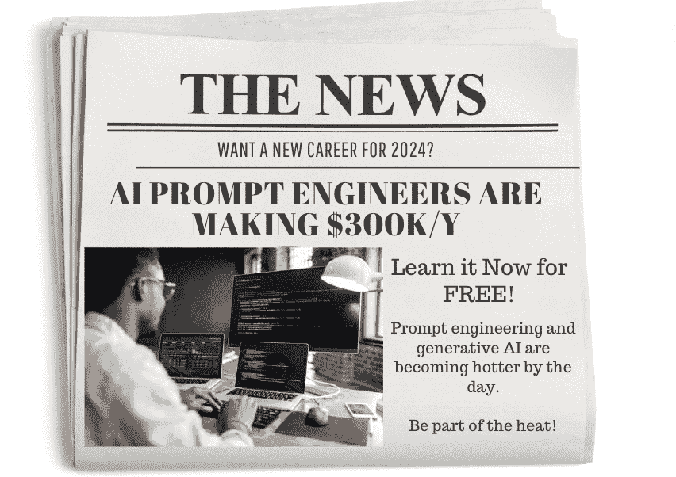

# AI 提示工程师年薪 $300k

> 原文：[`www.kdnuggets.com/ai-prompt-engineers-are-making-300ky`](https://www.kdnuggets.com/ai-prompt-engineers-are-making-300ky)

图片由作者提供

$300k/年。这可能是你看到的第一件事，你可能会想‘咦，怎么可能？’我问了自己完全一样的问题。但我并不感到惊讶。考虑到生成性 AI 在 2023 年的发展趋势，这注定是下一个人人争抢的热门职业。

如果你仍然不相信我，可以查看 Anthropics 的招聘信息 [这里](https://jobs.lever.co/Anthropic/e3cde481-d446-460f-b576-93cab67bd1ed)。

现在相信我了吗？

我会把这看作是肯定的答案，不再拖延，直接进入如何免费学习 AI 提示工程，并希望能为你争取一个新的高端职位！

# Open AI 提示工程指南

链接：[提示工程指南](https://platform.openai.com/docs/guides/prompt-engineering/strategy-write-clear-instructions)

让我们从目前在提示工程/生成性 AI 游戏中领先的公司开始——OpenAI。

OpenAI 提供了一份指南，其中将介绍策略战术，帮助你从大型语言模型如 GPT-4 中获得更好的结果。他们鼓励用户进行实验，通过反复试验找到最适合自己的方法！

他们通过一系列示例以及 6 种策略来帮助你获得更好的结果。

# 深度学习中的自然语言处理

链接：[深度学习中的自然语言处理](https://www.youtube.com/playlist?list=PLoROMvodv4rOSH4v6133s9LFPRHjEmbmJ)

知道如何提示模型以获得你想要的结果很棒，但更好的是当你理解它的工作原理时——即其内部细节。

由深度学习提供的课程，探讨了自然语言处理 (NLP) 的基础和应用，使用深度学习技术。因此，与其仅仅了解如何与计算机系统沟通，不如深入了解计算机系统如何理解和生成类似人类的语言。

# 学习提示

链接：[学习提示工程指南](https://learnprompting.org/docs/intro)

哦，又一个指南，这次更加全面！创始人们共同创建了一个关于如何使用生成性 AI 的全面且免费的指南。如果你是 AI 世界的新手，这份指南就是为你准备的。它特别针对那些希望了解生成性 AI 和提示工程的非技术读者。

如果你掌握了一些技术知识，并需要更具挑战性的内容，那么后面的模块将适合你。

# 提示工程大师课程

链接：[提示工程大师课程](https://promptengineering.org/prompt-engineering-course/)

如果你愿意订阅，Prompt Engineering Masterclass 的内容对你是免费的！这是一个不断发展的系列，分为多个章节文章。你将深入了解用于生成 AI 的高级提示工程技术。

你将从学习生成 AI 基础、介绍大型语言模型和提示工程开始，然后逐渐深入到更高级的主题，如提示工程技术、对话 AI 模型、AGI 和企业 GenAI，以及实际示例。

# 开发者的提示工程

链接: [开发者的提示工程](https://www.deeplearning.ai/short-courses/chatgpt-prompt-engineering-for-developers/)

DeepLearning.AI 提供的 1 小时免费课程，由 Isa Fulford 和 Andrew Ng 担任课程协调员。该课程专为开发者量身定制，你将学习如何使用 LLM 并构建新的强大应用。

使用 OpenAI API，你将学会创新，掌握最佳提示工程实践，并探索 LLM API 在各种任务中的应用。

# 提示工程指南

链接: [提示工程指南](https://www.promptingguide.ai/)

最后但同样重要的是，另一个提示工程指南。免费指南再多也不嫌多！

对 LLM（大语言模型）发展充满高度兴趣的 PromptingGuide.AI 创建了一个提示工程指南。你不仅可以掌握提示工程，还包含最新的论文、先进的提示技巧、学习指南等内容。

# 总结

离找到那份高薪新工作的目标还有 6 门课程！当然，掌握提示工程不仅仅是这样，你还需要将其付诸实践，创建一个优秀的作品集，尽力而为！

****[Nisha Arya](https://www.linkedin.com/in/nisha-arya-ahmed/)****是一位数据科学家、自由技术写作人，以及 KDnuggets 的编辑和社区经理。她特别关注提供数据科学职业建议或教程以及数据科学理论知识。Nisha 涉及广泛的主题，并希望探索人工智能如何有益于人类寿命的不同方式。作为一个热衷学习者，Nisha 致力于拓宽她的技术知识和写作技能，同时帮助他人。

### 主题更多信息

+   [Ploomber 与 Kubeflow：简化 MLOps](https://www.kdnuggets.com/2022/02/ploomber-kubeflow-mlops-easier.html)

+   [成功机器学习模型中的数据质量意义](https://www.kdnuggets.com/2022/03/significance-data-quality-making-successful-machine-learning-model.html)

+   [让智能文档处理更聪明：第一部分](https://www.kdnuggets.com/2023/02/making-intelligent-document-processing-smarter-part-1.html)

+   [从数据分析师到数据战略师：影响力职业路径](https://www.kdnuggets.com/2023/05/data-analyst-data-strategist-career-path-making-impact.html)

+   [做出预测：Python 中线性回归的初学者指南](https://www.kdnuggets.com/2023/06/making-predictions-beginner-guide-linear-regression-python.html)

+   [预测分析如何在技术领域革新决策制定](https://www.kdnuggets.com/how-predictive-analytics-is-revolutionizing-decisionmaking-in-tech)
