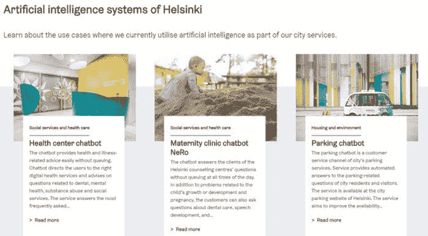
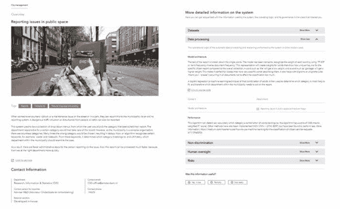
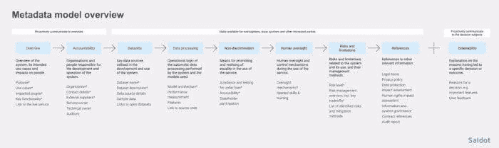

# AI 注册：终于，有了一个增加 AI/ML 透明度的工具

> 原文：[`www.kdnuggets.com/2020/12/ai-registers-transparency-ml.html`](https://www.kdnuggets.com/2020/12/ai-registers-transparency-ml.html)

评论

**由 [Natalia Nygren Modjeska](https://www.linkedin.com/in/nataliamodjeska/)，行业分析师，Infotech**。

透明度、可解释性和信任是当今 AI/ML 中的重要而紧迫的话题。没有人愿意面对一个在做出重要决策（例如，关于工作、医疗、国籍等）时的黑箱系统，特别是当这些决策不公平、有偏见或明显不利于我们时。大多数组织也同意 [消费者对 AI 以伦理和透明方式使用的信任和信心是释放其真正潜力的关键](https://www.weforum.org/agenda/2020/08/consumer-trust-ai-potential/)。

* * *

## 我们的前三大课程推荐

 1\. [Google 网络安全证书](https://www.kdnuggets.com/google-cybersecurity) - 快速进入网络安全职业轨道。

 2\. [Google 数据分析专业证书](https://www.kdnuggets.com/google-data-analytics) - 提升你的数据分析技能

 3\. [Google IT 支持专业证书](https://www.kdnuggets.com/google-itsupport) - 支持你所在组织的 IT

* * *

虽然有大量的 [描述和规定 AI 原则、框架](https://cyber.harvard.edu/publication/2020/principled-ai) 的文档，但直到现在，还没有实际工具能帮助实施透明度。

2020 年 9 月 28 日，赫尔辛基和阿姆斯特丹两市共同宣布启动他们的公共 AI 注册表。这两个注册表是与 [Saidot.ai](https://www.saidot.ai/) 合作开发的，这是一家创新的芬兰公司，专注于“为消费者服务带来透明度”（*同上*），据我所知，是该领域唯一的供应商。

公司的创意源于其创始人兼首席执行官 Meeri Haataja 的个人挫折，她 [“看到透明度在 AI 未来中的重要性，却找不到太多有意义的行动方式。”](https://medium.com/saidot/story-of-saidot-and-my-personal-pivot-to-ai-responsibility-2af05ba447)

### 什么是 AI 注册表？

赫尔辛基市将其定义为 [“一个可以查看城市使用的人工智能系统的窗口。”](https://ai.hel.fi/en/ai-register/) 阿姆斯特丹市称他们的系统为算法注册表，及 [“阿姆斯特丹市使用的人工智能系统和算法的概述。”](https://algoritmeregister.amsterdam.nl/en/ai-register/)

*来源：[`algoritmeregister.amsterdam.nl/en/ai-register/`](https://algoritmeregister.amsterdam.nl/en/ai-register/)*

*来源：[`ai.hel.fi/en/ai-register/`](https://ai.hel.fi/en/ai-register/)*

两个登记册都描述了城市如何使用人工智能/机器学习，这些应用程序如何影响公民及其日常生活，它们是如何构建的，使用了哪些数据和算法，在应用程序的设计、构建和部署过程中做出了哪些决策和假设，以及采用了哪些伦理原则来减轻偏见和风险。登记册还包括联系信息，包括电子邮件地址、电话号码，以及进一步询问或反馈的联系人或团队。

*来源：[`algoritmeregister.amsterdam.nl/en/reporting-issues-in-public-space/`](https://algoritmeregister.amsterdam.nl/en/reporting-issues-in-public-space/)*

人工智能登记册中的语言清晰易懂，面向没有任何人工智能/机器学习技术背景的普通公民。（一些技术信息也提供了，尽管有限，但可以通过上述联系信息获得更多信息。）

到目前为止，城市登记册中记录的人工智能应用程序数量较少：赫尔辛基市五个，阿姆斯特丹市四个，但更多的应用程序正在开发中。

### 人工智能登记册对政府和公民的好处

通过公开其应用程序背后的信息，政府提升了对人工智能使用的透明度和问责制。这有助于增加公民的信任，因为信任是任何政府的基础；[“政府只有在政府和人民之间存在信任时才能运作。”](https://uploads-ssl.webflow.com/5c8abedb10ed656ecfb65fd9/5f6f334b49d5444079726a79_AI%20Registers%20-%20White%20paper%201.0.pdf) 或者，正如赫尔辛基市首席数字官 Mikko Rusama 所说，[“没有信任，人工智能就没有用处。”](https://uploads-ssl.webflow.com/5c8abedb10ed656ecfb65fd9/5f6f334b49d5444079726a79_AI%20Registers%20-%20White%20paper%201.0.pdf)

对于公民而言，人工智能登记册有助于提高人工智能/机器学习素养。它们促进了公民的意识、参与和公共辩论，这些都是民主政府的基石。它们通过提高政府使用数据、纳税人资金以及新技术（如人工智能/机器学习）的透明度来建立信任。

因为，*最终*，我们都希望[负责任的人工智能能够使我们所有人受益，尊重多样性和人权，促进人类繁荣，维护人类自主性，并推动社会、经济和环境的可持续性](https://unesdoc.unesco.org/ark:/48223/pf0000373434)。

### 人工智能登记册对人工智能团队的好处

对于 AI 团队来说，AI 注册表提供了一种[“在你的 AI 组合中标准化透明度”的机制；](https://uploads-ssl.webflow.com/5c8abedb10ed656ecfb65fd9/5f6f334b49d5444079726a79_AI%20Registers%20-%20White%20paper%201.0.pdf) 一种“可以搜索和存档的方式来记录在开发、实施、管理和最终拆解算法过程中做出的决策和假设”，(*同上*)。

Saidot 的软件提供了[“预定义的模块化元数据模型，这些模型可以适应组织和行业特定的要求，同时确保不同版本之间的互操作性。”](https://www.saidot.ai/platform) 其产品包括一个后端平台、注册表本身以及一个用于发布注册表的界面（由公司托管）。

除了阿姆斯特丹和赫尔辛基市，公司还将芬兰航空、埃斯波市、芬兰财政部、社会保险机构以及司法部列为其客户和合作伙伴。

Saidot 继续积极开发其平台。[它正在考虑的新功能和方向](https://uploads-ssl.webflow.com/5c8abedb10ed656ecfb65fd9/5f6f334b49d5444079726a79_AI%20Registers%20-%20White%20paper%201.0.pdf)包括：

+   将 AI 注册表集成到客户的 AI 开发过程中，这将有助于将其扩展到通信之外，进入解决方案治理领域，从而巩固问责制；

+   使用 AI 注册表在设计和构思过程中早期捕捉公民反馈，以确认需求并实现共同设计和共同创作；

+   促进政府组织之间的信息共享，例如，帮助选择供应商。（注册表会披露是否有外部供应商参与以及他们是谁。）

### 超越政府：为什么你应该为你的 AI/ML 和数据科学应用程序采用 AI 注册表

信任不仅是政府存在的基本前提。在商业中，信任同样至关重要。你的组织存在的全部原因是因为你的客户、消费者、员工和合作伙伴。因此，无论你是刚开始涉足 AI/ML，还是在整个业务基础上运行 AI 和机器学习，让我们跟随阿姆斯特丹和赫尔辛基的例子——让我们记录并公开/与员工和合作伙伴分享我们如何使用 AI/ML 和数据科学。我们都将从这种公开中受益。而 Saidot.ai 的 AI 注册表软件使得实现透明度变得更加、更加容易。

要了解更多关于 AI 注册表和 Saidot 平台的信息：

+   阅读这份简短的白皮书“[公共 AI 注册表：实现 AI 透明性和政府使用 AI 中的公民参与](https://uploads-ssl.webflow.com/5c8abedb10ed656ecfb65fd9/5f6f334b49d5444079726a79_AI%20Registers%20-%20White%20paper%201.0.pdf)”。

+   查看 [阿姆斯特丹市算法登记册](https://algoritmeregister.amsterdam.nl/en/ai-register/) 和 [赫尔辛基市 AI 登记册](https://ai.hel.fi/en/ai-register/)。

+   联系 Saidot 参加他们的测试计划。

+   如果你在公共部门，你可以免费获得他们后台系统的一年访问权限。（根据我与公司 CEO 的对话，此优惠有效期至 2020 年 12 月 31 日。）

**简介：** [娜塔莉亚·莫杰斯卡](https://www.linkedin.com/in/nataliamodjeska/) 是 Info-Tech Research Group 的研究主任，她为客户提供有关如何伦理和负责任地部署 AI/ML 的建议。

**相关：**

+   [可解释性、解释性和机器学习——数据科学家需要知道什么](https://www.kdnuggets.com/2020/11/interpretability-explainability-machine-learning.html)

+   [当机器学习对你了解过多时](https://www.kdnuggets.com/2020/11/machine-learning-knows-too-much-about-you.html)

+   [保证隐私所需的数据保护技术](https://www.kdnuggets.com/2020/10/data-protection-techniques-guarantee-privacy.html)

### 更多相关内容

+   [终于有一本关于注意力的书了！](https://www.kdnuggets.com/2022/11/mlm-finally-book-attention.html)

+   [元数据如何提升安全性、质量和透明度](https://www.kdnuggets.com/2022/04/metadata-improves-security-quality-transparency.html)

+   [通过 LinkedIn 个人资料提高你的回拨率](https://www.kdnuggets.com/increase-your-callback-rate-with-a-linkedin-profile)

+   [你不知道的低代码工具的 7 个功能](https://www.kdnuggets.com/2022/09/7-things-didnt-know-could-low-code-tool.html)

+   [RAG 与 Finetuning：哪个是提升 LLM 应用的最佳工具？](https://www.kdnuggets.com/rag-vs-finetuning-which-is-the-best-tool-to-boost-your-llm-application)

+   [Nota AI 发布 NetPresso 模型搜索的测试版，他们的…](https://www.kdnuggets.com/2022/04/nota-ai-releases-beta-version-netpresso-model-search-hardwareaware-automl-tool.html)
