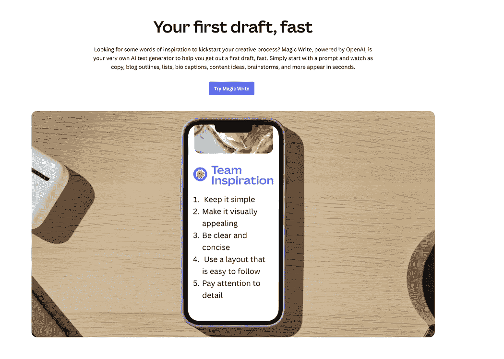
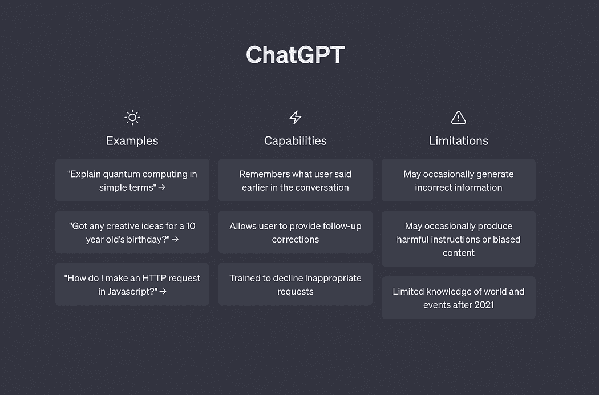
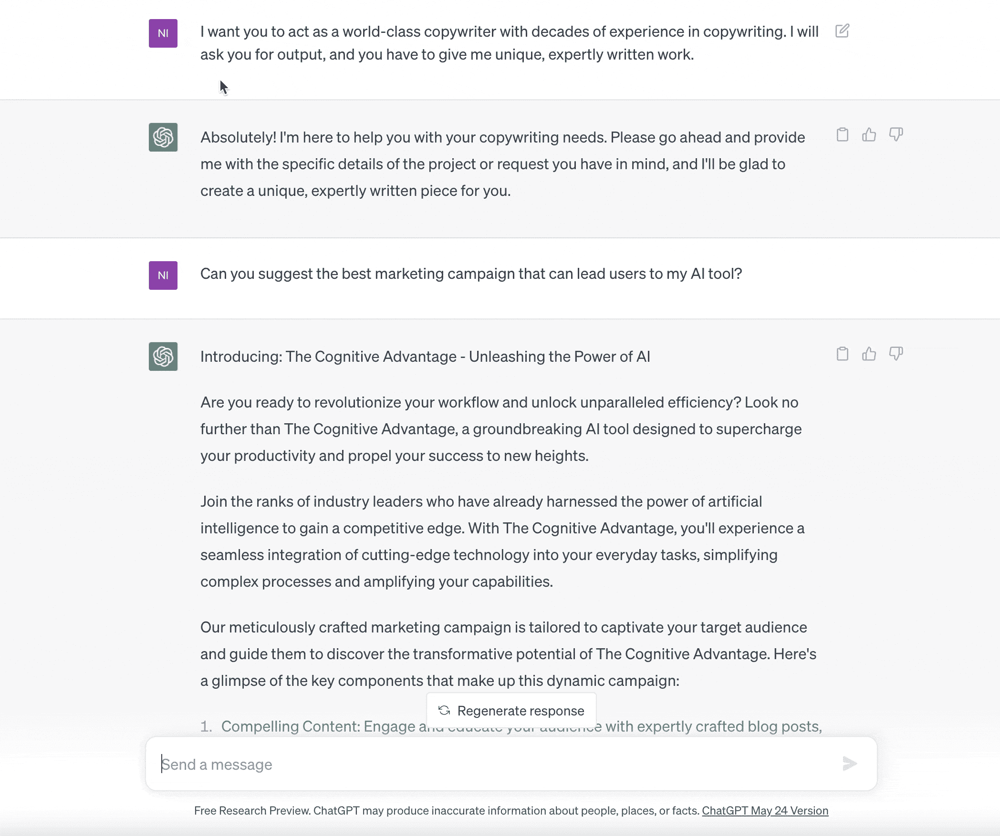
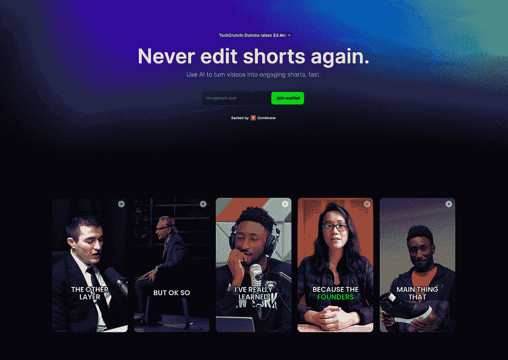
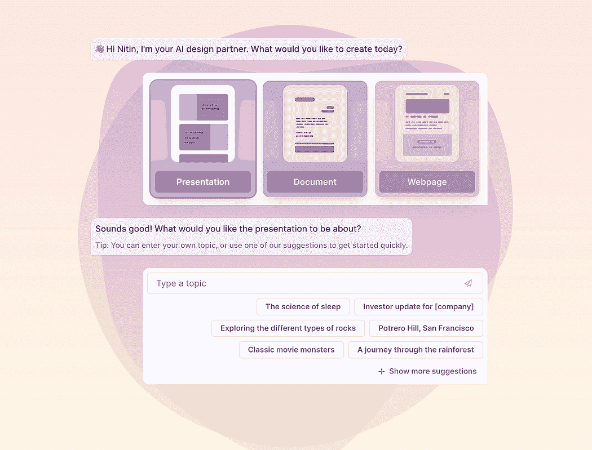

# 这里是我用来每月赚取 $10,000 的 AI 工具和技能——没有废话

> 原文：[`www.kdnuggets.com/2023/07/ai-tools-along-skills-make-10000-monthly-bs.html`](https://www.kdnuggets.com/2023/07/ai-tools-along-skills-make-10000-monthly-bs.html)

来源：[Pexels](https://www.pexels.com/photo/happy-woman-in-blue-long-sleeve-blouse-holding-money-7680637/)

说实话，通过将我的技能与 AI 结合起来，我每个月赚取超过 $10,000。白天我是专业程序员，但在空闲时间，我为不同的公司做自由职业，并在 Medium 等平台上撰写内容。

综合来看，这是一笔超过 $10,000 的丰厚收入。毫无疑问，我已经在编程和内容写作领域沉浸了超过 3 年，这就是我的专长所在。

事实是：你也拥有技能，或者有些隐藏的专长。猜猜看？我在这里帮助你将你的技能与 AI 的力量结合起来，提升你的收入。

话说回来，这里有一些 AI 工具，我用它们在几分钟内完成了繁琐的长时间工作。

激动人心吧？那么我们赶紧开始吧。

# 1\. Canva

之前，我使用 Canva 来完成各种任务，如创建社交媒体帖子、发票、简历、网站、演示文稿、视频、徽标等等。然而，随着 AI 技术的出现，Canva 通过将几个 AI 功能集成到其平台中，取得了显著的进步。

让我分享一些 Canva 提供的卓越 AI 功能：

+   Magic Write in Canva Doc：这个特定功能使用户能够轻松生成书面内容。它帮助快速且轻松地为各种用途撰写文本。

+   Magic Design：借助这个功能，用户可以亲眼见证 AI 的魔力。通过提供一个提示或创意，Canvas AI 算法会生成令人惊叹的设计，完全根据你的需求量身定制。它将创建视觉吸引人的设计的繁琐工作代劳，轻松完成。

+   Magic Eraser：厌倦了图像中杂乱的元素吗？这个 AI 驱动的功能来帮忙。只需几个简单的点击，你就可以神奇地去除图像中任何不需要的元素，确保图像干净且完美。

+   Magic Edit：需要在设计中添加或修改元素吗？这个功能让你可以毫不费力地完成这一任务。无论是要加入新元素还是调整现有元素，Canvas AI 驱动的 Magic Edit 功能都简化了这一过程。

这些只是 Canva 提供的一些 AI 功能的例子。通过利用这些尖端技术，我能够在几分钟内完成设计工作，节省了时间和精力。

如果你想深入了解这些功能，你可以在这篇 [帖子](https://medium.com/swlh/stop-designing-like-its-1999-use-canva-ai-features-that-will-blow-your-mind-c27ee615d5f7)中找到更详细的信息。

# 2\. ChatGPT

如果你一直关注我，你可能知道我已经使用了像 Bard、Perplexity 等各种 AI 聊天机器人几个月了。然而，谈到日常任务，我的首选是 ChatGPT。

ChatGPT 在提升我的技能和支持我跨不同领域方面非常有帮助。

作为一个独立创业者，我每天需要处理大量任务。最近，我甚至接受了学习如何营销产品和吸引投资者的挑战。上周，我完全独立创建了一个推介演示文稿。

这就是 ChatGPT 的便利之处。

我与 ChatGPT 使用的最有效的提示之一是：“我希望你充当一位拥有数十年经验的世界级 [职业名称]。我会要求你提供输出，你需要给我独特且专业的作品。”

使用这个提示，ChatGPT 扮演一个经验丰富的专家角色，随时准备为我提供有价值的见解，针对我询问的任何主题。

例如，当我使用这个提示时，我会收到超出我预期的卓越回复。你可以根据自己的职业定制提示，向 ChatGPT 询问你想要的任何问题。

ChatGPT 确实感觉像是随时可用的专家顾问，使我能够在需要时寻求指导和专业意见。它已成为我日常生活中不可或缺的工具。

# 3\. Dumme

我对创建 YouTube 频道并从中赚钱不感兴趣。因为我有很多方式来货币化我的技能。

然而，你们中的许多人可能仍然渴望创建自己的 YouTube 频道。但让我告诉你，这不是一件容易的事，随着时间的推移，它变得更加具有挑战性。而增加成功机会的最佳方式是，创建一系列高质量的短片以吸引订阅者。

在这里，像 [Dumme](https://dumme.com/) 这样的 AI 工具可以大有帮助。Dumme 是一款 AI 驱动的工具，专门设计用于将你的录像转换为引人入胜的短片，简化了这一过程。

你只需上传现有的视频，这个卓越的工具会自动识别出最激动人心的瞬间。它确保了视频的整体背景和结构得以保留，就像人类一样。

最棒的是，Dumme 通过 Dumme Creator Program 为创作者提供完全免费的服务。这是利用 AI 技术提升视频吸引力的绝佳机会，最终帮助你获得更多订阅者。

# 4\. Folk

你可能对 CRM 并不熟悉，但它是一个简单而强大的工具，用于管理客户关系和互动。它不仅仅适用于大型企业；即使是小型企业、创作者和个人创业者也可以从中受益。

CRM 允许你存储和管理重要的客户信息，如联系方式和潜在客户管理。特别是作为创作者或个人创业者，你会与各种人进行互动，如客户、顾客、合作者和潜在客户。而这正是 CRM 帮助你有效组织和管理这些联系人的地方。

如果你想为你的创意服务或产品生成潜在客户，CRM 也可以发挥重要作用。你可以从你的网站、社交媒体或其他渠道捕获潜在客户，并将其存储在 CRM 系统中。这使你能够跟进、培育潜在客户，并跟踪转化率。

作为创作者，你经常需要同时处理多个进行中的项目或任务。CRM 可以帮助你组织和跟踪任务、设定截止日期以及与客户或团队成员协作。这确保你能够掌握项目进展并按时完成交付。

此外，如果你有合作或伙伴关系的机会，或者提供不同的服务，CRM 可以帮助你管理和跟踪这些机会。

这还不是全部。让我向你介绍一下 [Folk](https://www.folk.app/)，一个拥有众多 AI 功能的 CRM 工具。它自动化繁琐的任务，并根据你的特定工作风格进行定制。由于其 AI 功能，它还能通过简化你的工作流程来提高效率。

但是，还有更多的功能！

为了简化你的生活，Folk 提供了多种功能。简单来说，它涵盖了从处理潜在客户和联系人到跟踪客户互动的所有内容。它是一个完整的 CRM 系统，旨在简化和改善你公司的运营。

# 5\. Dart

像我们这样的大多数人依赖于项目管理工具来有效地处理我们的进行中的项目和任务。正如我们所知道的，市场上充斥着各种项目管理工具，但有一个工具正在引起广泛关注：Dart。

[Dart](https://www.itsdart.com/) 的独特之处在于它不仅仅是一个普通的项目管理工具——它由 AI 驱动！他们利用强大的 GPT-4 AI 模型来帮助你处理各种项目管理任务。

最棒的是？Dart 完全免费供个人使用，而且你甚至可以邀请最多四个人加入你的团队。因此，无论你是独立工作还是与一小群朋友或同事合作，Dart 都绝对值得探索。

利用 Dart 的 AI 驱动功能，你可以期待超越传统项目管理工具的高级特性和帮助。

# 6. Gamma

你可能已经遇到过一些帮助创建网站、演示文稿和文档的 AI 工具。我过去也曾写过许多相关的文章。

然而，有一个工具是我始终依赖于创建这三者的：[Gamma](https://gamma.app/)。这个多功能工具使我能够轻松生成演示文稿、文档和网页。

同样，无论你是商业老板、设计师还是内容创作者，Gamma 都可以成为你生产高质量内容的首选解决方案。你只需输入一个主题名称或选择一个模板，提供一些额外的信息，Gamma 就会处理剩下的工作。

值得注意的是，Gamma 不仅限于演示文稿和文档；它还使你能够设计美丽的网页。该工具提供了一系列模板可供选择，确保你的内容脱颖而出。

最棒的是，Gamma 是免费的。你可以在没有任何成本的情况下利用其功能，使其成为任何需要强大内容创作工具的人的可选方案。

# 7. Numerous AI

作为一个独立创业者，我通常每月使用 Excel。

自从我开始作为网页开发者和内容创作者的旅程以来，Excel 一直是我非常宝贵的工具。我知道你们中的许多人也使用 Excel 来组织和处理数据。然而，我们大多数人对 Excel 提供的高效公式并不熟悉。

由于时间限制，对许多人来说，详细学习 Excel 的长时间课程并不可行。此外，由于我们并不总是使用 Excel，我们往往会忘记我们学过的公式。

为了克服这种情况，使用像[Numerous AI](https://numerous.ai/)这样的 AI 工具可以非常有帮助。该工具使用户能够生成公式、格式化和清理数据，并更快速有效地执行各种任务。

但是，Numerous AI 的功能不仅仅限于自动化 Excel 过程。

它还可以根据输入数据生成具体的句子，这对于创建报告或总结大数据集非常有用。此外，Numerous AI 还具有预测文本情感的能力。这个功能对于分析客户反馈或社交媒体帖子非常有价值，提供了对公众意见的洞察。

最后，许多 AI 甚至可以向用户提供反馈，帮助他们提高数据分析和决策能力。

# 8\. Flair

我经常依赖的最后一个工具是 [Flair AI](https://flair.ai/)。

这是一个令人惊叹的工具，使你能够轻松地制作引人注目的视觉内容。有了 Flair，你可以自由地创造你所设想的内容。

它的工作原理如下：你只需将产品照片拖到画布上。然后，你可以通过添加各种元素来增强视觉效果，以描绘出所需的场景。调整和完善，直到你对结果完全满意。完成后，你可以导出最终作品，并轻松与他人分享。

就这么简单！

**[Nitin Sharma](https://www.linkedin.com/in/nitinfab/)** 是一位敬业的开发者，热衷于创建初创公司和制作有价值的内容，以帮助个人提升技能和增加收入。凭借扎实的软件开发背景，Nitin 已经磨练了自己的技能，并在行业中积累了丰富的经验。作为一名独立创业者，他开始了创建初创公司的激动人心的旅程。凭借对市场需求的敏锐洞察力和开发创新解决方案的才华，他成功地为他的初创公司制定了一个与他赋能个人的热情相一致的愿景。除此之外，Nitin 的写作才华在 Medium 上的贡献中也得到了体现，他分享了旨在帮助他人提升技能和实现财务成功的深刻内容。随着超过 24,000 名关注者的不断增长，Nitin 的文章获得了显著的认可和忠实的读者群。

[原文](https://medium.com/the-ai-explorer/here-are-the-ai-tools-i-use-along-with-my-skills-to-make-10-000-monthly-no-bs-9d36e8a28f0f)。转载经许可。

### 更多相关话题

+   [想利用你的数据技能解决全球问题？这里是一些建议…](https://www.kdnuggets.com/2022/04/jhu-want-data-skills-solve-global-problems.html)

+   [利用你的数据科学技能创建 5 个收入来源](https://www.kdnuggets.com/2023/03/data-science-skills-create-5-streams-income.html)

+   [如何使用 ChatGPT 提升你的数据科学技能](https://www.kdnuggets.com/2023/03/chatgpt-improve-data-science-skills.html)

+   [无法找到数据科学工作？这是原因](https://www.kdnuggets.com/2022/01/unable-land-data-science-job.html)

+   [数据科学被高估了，这就是原因](https://www.kdnuggets.com/2022/06/data-science-overrated.html)

+   [AI 不是来取代我们的](https://www.kdnuggets.com/2023/02/ai-replace-us.html)
