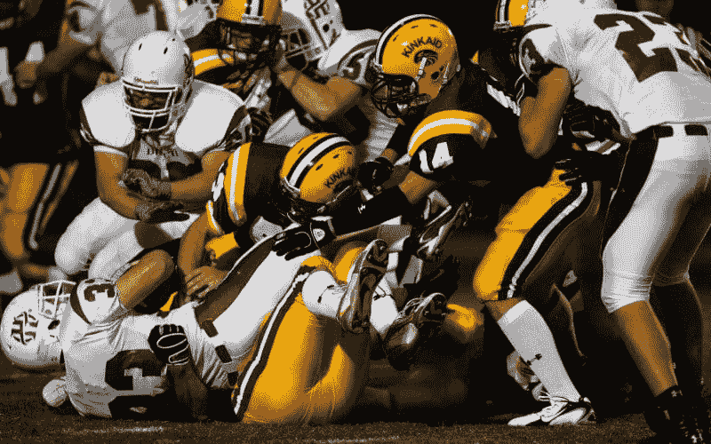
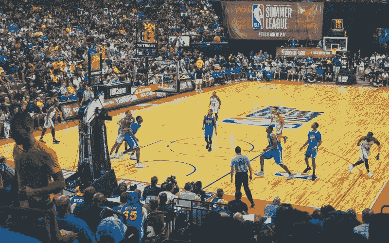

# AI 生成的体育精彩片段：不同的方法

> 原文：[`www.kdnuggets.com/2022/03/aigenerated-sports-highlights-different-approaches.html`](https://www.kdnuggets.com/2022/03/aigenerated-sports-highlights-different-approaches.html)

广播公司和体育联盟不遗余力地为观众提供最佳的体育内容。考虑到定期观看体育赛事的人数，无论是在电视上还是现场，视频内容制作人员尽最大努力制作引人注目的内容。

对观众注意力的竞争在球员离开场地后并未结束。现在，谁能最先发布精彩片段合集或比赛总结，谁就能占据优势。

* * *

## 我们的前三个课程推荐

 1\. [Google 网络安全证书](https://www.kdnuggets.com/google-cybersecurity) - 快速进入网络安全职业生涯。

 2\. [Google 数据分析专业证书](https://www.kdnuggets.com/google-data-analytics) - 提升你的数据分析能力

 3\. [Google IT 支持专业证书](https://www.kdnuggets.com/google-itsupport) - 支持你的组织 IT 需求

* * *

所以，让我们探讨一下媒体公司是如何借助人工智能做到这一点的。

# **体育精彩片段的制作方式**

在生成[体育视频精彩片段](https://cognitivemill.com/resources/blog/football-and-basketball-highlights-generation/)时，大部分过程仍然是手动操作。体育广播公司拥有大量编辑团队，为广播公司制作与体育相关的内容。

通常，过程如下：编辑获取整个比赛的录像以及指向难忘事件的数据流。然后他们会查看这些录像，剪辑出所有的进球、投篮和扣篮，以及一些戏剧性瞬间。

然后，编辑将剪辑汇总成一个连续的片段，添加图形、音乐和过渡效果。然后可以将其发布到社交媒体或在电视上播出，以吸引更多观众。

这种方法在生产效率上存在严重问题。

# **手动生成精彩片段的问题**

鉴于体育赛事的时长，编辑制作一个精彩片段视频需要几个小时。再加上体育赛季通常安排紧凑，赛事接连不断——你会面临大量的工作。

此外，编排视频可以为广播公司服务不同的目的，从在电视或互联网上回顾最佳时刻，给那些错过比赛的人看，到在社交媒体或广告中宣传。

所以，有时需要从一场比赛中制作多个体育视频亮点，这意味着编辑们需要在屏幕前花费更多时间。

问题是编辑们实际上没有很多时间可以使用：在媒体领域，第一个发布内容的通常会获得关注。虽然这些剪辑的质量非常重要，但如果剪辑发布迟了，那么质量就显得不重要了。

随着时间的推移，比赛与时间赛跑变得越来越困难：现在，任何球迷都可以拿出智能手机录制球员与裁判之间的来回对话，然后立即发布，并在几分钟内病毒传播。

所以，我们必须尽快工作。这就是人工智能发挥作用的地方。

# **自动体育亮点生成**

为加快体育内容生成的过程，媒体提供商正在寻找让 AI 自动分析比赛录像并挑选出值得高亮的时刻的方法。

针对日益增长的需求，科技公司正在采用 AI 和机器学习算法来精准确定体育比赛的最佳时刻。

现在，视频内容分析的最佳方法正在竞争中。让我们看看这些方法是什么。

## **音频分析**

这种方法不仅仅是识别场上发生的事情，还包括观众的反应。这种方法由 WSC Sports 使用。

通过分析声音，算法捕捉到任何异常情况，如观众欢呼或裁判与球员争论——并选择相应的剪辑纳入汇编中。

但这种方法对于观众声音较少的运动可能并不理想——例如，高尔夫比赛中没有欢呼的人群。

说到人群——有时即使应该有观众也没有。在 COVID 相关的封锁期间，体育赛事在没有观众的情况下举行。

即使在人群中，一些细微的时刻，比如教练与球队交流或吉祥物做自己事情的瞬间，可能不会被 AI 高亮。

## **重点选择**

找到体育赛事最佳时刻的另一种方法是使用视觉识别 API 来检测那些具有纪念性的特征：击掌、击拳、举手或观众站立。

这些 API 是公开可用的，由亚马逊和 IBM 提供。还有一些基于对象识别的专有解决方案，比如 AnyClip。

依靠数据分析，算法确定剪辑的必要长度，剪掉不必要的部分，并将视频拼接在一起。

图片体育亮点 6

考虑到媒体公司可能需要的汇编类型的丰富性，这种方法留下了大量未使用的内容。

如果广播公司想要制作一段游戏总结视频，他们必须从头开始训练 AI。吉祥物舞蹈合集？你最好有时间让算法学习这是什么。

## **场景级视频分析**

了解上述方法的缺陷，我们来研究一种能够迅速且准确地找出视频内容中的亮点的解决方案，同时不需要预先训练和额外的数据源。

CognitiveMill 的方法完全依赖于认知计算技术，以实现对视频内容的类人感知。这样，算法可以分析视频的每个场景，提取创建亮点所需的所有信息。

让我们来探讨一下为什么认知计算非常适合这个任务。它利用机器智能的概念并加以拓展：虽然人工智能允许机器学习和执行某些任务，但认知计算利用一系列技术模仿人脑的工作方式。因此，它能够应对更复杂的情况。

在视频分析方面，认知计算依赖于基于复杂计算机视觉技术的：

+   深度学习；

+   认知科学；

+   机器感知；

+   人类感知；

+   数学建模；

+   概率 AI；

+   数字图像处理。

这些技术确保了解决方案能够精确识别视频中最重要的部分。

该解决方案以库、模块、容器和管道的形式实现，可以重复使用。

这种方法无需外部数据源或音频分析。由认知计算驱动的系统可以分解视频，分析游戏动态、兴奋度和事件背景，模仿人脑的感知。

可以使用不同的模块组合来创建任何类型的认知自动化，并重建简化的人类认知模型。这不需要大量的训练来分析不同类型的剪辑视频，如：

+   各类运动的精彩视频；

+   锦标赛预告片；

+   游戏总结剪辑。

# **结论**

媒体行业的每个人都知道规则：早起的鸟儿有虫吃。

这不仅适用于新闻报道，还适用于广播公司、体育联盟和电视台的内容策略。尽快向观众提供高质量内容是这里的首要任务。

牢记这一点，媒体公司正转向技术，以寻找加快过程的方法，同时保持在制作体育亮点时的人脑精度。

在许多解决问题的方法中，准备工作最少的方法被证明是最有效的。因为如果 AI 缩短了编辑时间，却将其花费在下一个剪辑集的训练上，那就无所谓了。

在这方面，认知计算可能是一个不错的选择，因为它可以处理任何内容，无需准备，同时保持检测重要时刻的准确性。

**[帕维尔·萨斯科维奇](https://www.linkedin.com/in/pavel-saskovec-b9a575150/)** 是 **[AIHunters](https://aihunters.com/)** 的技术文档撰写员。帕维尔拥有广泛的经验，涵盖了许多技术相关的话题，其中大多数集中在技术如何帮助优化媒体行业的工作流程上。

### 更多相关内容

+   [使用 Python 进行自动化机器学习：不同方法的比较…](https://www.kdnuggets.com/2023/03/automated-machine-learning-python-comparison-different-approaches.html)

+   [5 种在 Python 中加载数据的不同方法](https://www.kdnuggets.com/2020/08/5-different-ways-load-data-python.html)

+   [终极指南：NLP 中不同的词嵌入技术](https://www.kdnuggets.com/2021/11/guide-word-embedding-techniques-nlp.html)

+   [现实世界中 NLP 应用的范围：一种不同的…](https://www.kdnuggets.com/2022/03/different-solution-problem-range-nlp-applications-real-world.html)

+   [数据挖掘与机器学习有何不同？](https://www.kdnuggets.com/2022/06/data-mining-different-machine-learning.html)

+   [了解不同数据可视化的工作原理](https://www.kdnuggets.com/2022/09/datacamp-learn-different-data-visualizations-work.html)
