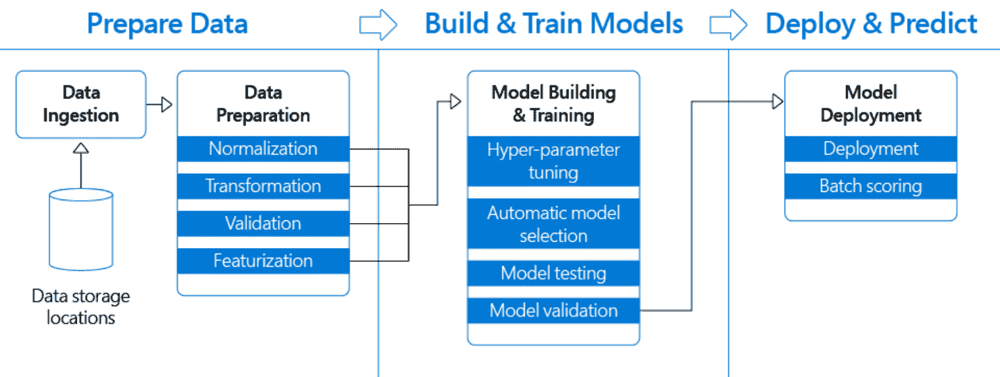
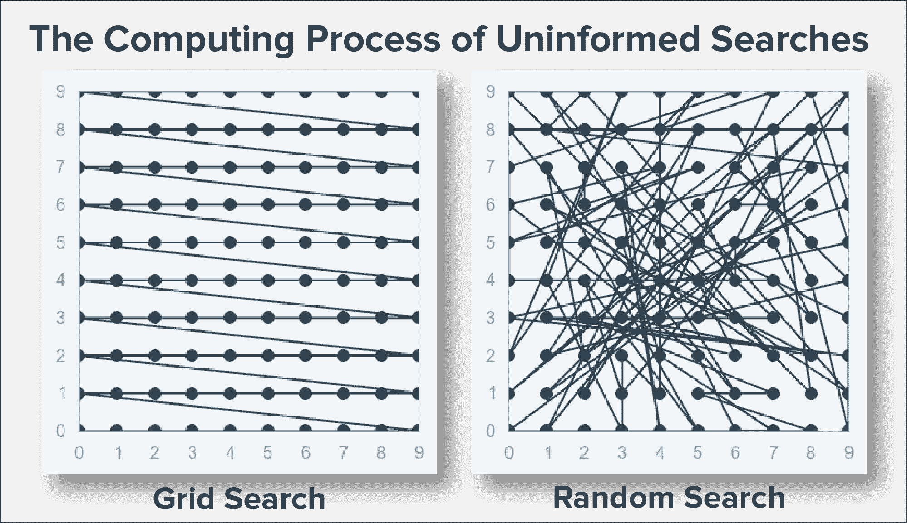
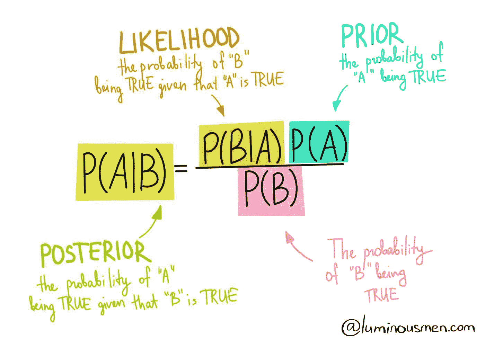
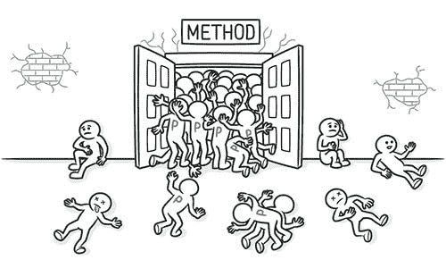
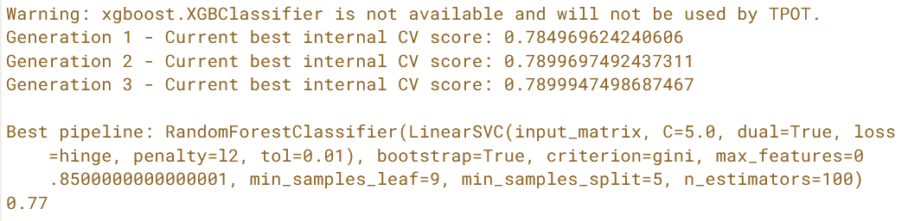

# 高级超参数优化/调优的算法

> 原文：[`www.kdnuggets.com/2020/11/algorithms-for-advanced-hyper-parameter-optimization-tuning.html`](https://www.kdnuggets.com/2020/11/algorithms-for-advanced-hyper-parameter-optimization-tuning.html)

评论

**由 [Gowrisankar JG](https://www.linkedin.com/in/gowrisankar-jg/)，Hexaware 的软件开发人员**

大多数专业的机器学习从业者遵循机器学习管道作为标准，以保持工作的高效性和流畅性。一个管道的创建是为了让数据从原始格式流向一些有用的信息。管道中所有子领域的模块对我们产生高质量的结果同样重要，其中之一是 *超参数调优*。

**一个通用的机器学习管道**

* * *

## 我们的前三个课程推荐

 1\. [谷歌网络安全证书](https://www.kdnuggets.com/google-cybersecurity) - 快速进入网络安全职业生涯

 2\. [谷歌数据分析专业证书](https://www.kdnuggets.com/google-data-analytics) - 提升你的数据分析技能

 3\. [谷歌 IT 支持专业证书](https://www.kdnuggets.com/google-itsupport) - 支持你的组织进行 IT 管理

* * *

我们大多数人知道，进行超参数调优的最佳方法是使用 [GridSearchCV](https://scikit-learn.org/stable/modules/generated/sklearn.model_selection.GridSearchCV.html) 或 [RandomSearchCV](https://scikit-learn.org/stable/modules/generated/sklearn.model_selection.RandomizedSearchCV.html) 来自 sklearn 模块。但除了这些算法，还有许多其他高级的超参数调优方法。这正是本文的重点，介绍高级超参数优化、迁移学习以及何时和如何使用这些算法来最大限度地发挥它们的作用。

两种算法，网格搜索和随机搜索，都是非信息搜索的实例。现在，让我们深入了解吧！！

### 非信息搜索

在这些算法中，每次超参数调优的迭代不会从之前的迭代中学习。这使我们能够并行化工作。然而，这并不高效，且消耗大量计算资源。

随机搜索从均匀分布中随机尝试一组超参数，遍历预设的列表/超参数搜索空间（迭代次数是定义的）。它适合测试广泛的值范围，通常能很快找到一个非常好的组合，但问题是，它不能保证给出最佳参数组合。

另一方面，网格搜索将提供最佳组合，但可能需要很多时间，且计算成本很高。

**网格和随机搜索的搜索模式**

看似网格搜索比随机搜索更好，但要记住，当维度很高时，我们需要搜索的组合数量是巨大的。例如，要对十个布尔（是/否）参数进行网格搜索，你将不得不测试 1024（2¹⁰）种不同的组合。这就是为什么有时会将随机搜索与聪明的启发式方法结合使用的原因。

### 为什么在网格搜索中引入随机性？[数学解释]

随机搜索更多是从随机搜索/优化的角度来看——我们在过程中引入噪声（或某种形式的随机性）的原因是为了可能*摆脱*糟糕的局部最小值。虽然这通常用于解释一般优化中的直觉（如更新参数的随机梯度下降，或基于温度的模型），我们可以将人类在元参数空间中的搜索视为一个更高级的优化问题。由于大多数人同意这些维度空间（相当高）会导致非凸优化形式，即使我们拥有之前研究中一些聪明的启发式方法，人类仍然可能会陷入局部最优解中。

因此，随机探索搜索空间可能会提供更好的覆盖率，更重要的是，它可能帮助我们找到更好的局部最优解。

迄今为止，在网格和随机搜索算法中，我们一直是在一次创建所有模型并在最后决定最佳模型之前合并它们的评分。

一种替代方法是按顺序构建模型，从每次迭代中学习。这种方法被称为***信息化搜索***。

### 信息化方法：粗到精调优

一种基本的信息化搜索方法。

**过程如下：**

1.  随机搜索

1.  在搜索空间中找到有前景的区域

1.  在较小的区域进行网格搜索

1.  继续直到获得最佳分数

你可以在网格搜索之前用随机搜索来替代（3）。

### 为什么粗到精？

*粗到精* *调优* 优化并利用了网格搜索和随机搜索的优势。

+   随机搜索的广泛搜索能力

+   一旦知道一个好的位置可能出现，进行更深入的搜索

无需浪费时间在没有良好结果的搜索空间上！！因此，这样可以更好地利用时间和计算资源，即我们可以快速迭代，同时性能也有所提升。

### 信息化方法：贝叶斯统计

最受欢迎的信息化搜索方法是贝叶斯优化。贝叶斯优化最初是为了优化黑箱函数而设计的。

这是一个基本的定理或规则，来自于*概率论与统计学*，如果你想复习和刷新这里使用的术语，可以参考 [this](https://towardsdatascience.com/basic-probability-theory-and-statistics-3105ab637213)。

> ***贝叶斯规则 | 定理***
> 
> 一种使用*新证据*来迭代更新我们对某些*outcome*的信念的统计方法。简单来说，它用于根据事件与另一事件的关联来计算事件的概率。

来源：[数据科学中的贝叶斯定理](https://luminousmen.com/post/data-science-bayes-theorem)

+   LHS 是在发生 B 的情况下 A 的概率。B 是一些新的证据。这被称为‘后验’。

+   RHS 是我们计算这个的方法。

+   P(A) 是‘先验’，是关于事件的初步假设。它不同于 P(A|B)，P(A|B) 是在新证据给定的情况下的概率。

+   P(B) 是‘边际似然’，即观察到这一新证据的概率。

+   P(B|A) 是‘似然’，即在我们关心的事件发生的情况下观察证据的概率。

**将贝叶斯规则的逻辑应用于超参数调优：**

1.  选择一个超参数组合

1.  构建一个模型

1.  获取新证据（即模型的得分）

1.  更新我们的信念，并在下一轮选择更好的超参数

> *贝叶斯超参数调优虽然相对较新，但在较大和更复杂的超参数调优任务中非常受欢迎，因为它们能在这种情况下很好地找到最佳*超参数组合。

### 注意

对于更复杂的情况，你可能需要深入探讨所有关于贝叶斯优化的细节。贝叶斯优化只能在连续的超参数上工作，而不能在分类超参数上工作。

### 使用 HyperOpt 进行贝叶斯超参数调优

HyperOpt 包使用贝叶斯优化的一种形式进行参数调优，允许我们为给定的模型获取最佳参数。它可以在非常大规模上优化具有数百个参数的模型。

[HyperOpt](http://hyperopt.github.io/hyperopt/): [**分布式超参数优化**](https://github.com/hyperopt/hyperopt)

想了解更多关于这个库和 HyperOpt 库的参数，可以随时访问 [*这里*](https://www.analyticsvidhya.com/blog/2020/09/alternative-hyperparameter-optimization-technique-you-need-to-know-hyperopt/)。另外可以访问 [*这里*](https://machinelearningmastery.com/hyperopt-for-automated-machine-learning-with-scikit-learn/) 进行快速教程，了解如何使用 HyperOpt 进行回归和分类。

### 介绍 HyperOpt 包。

要进行贝叶斯超参数调优，我们需要：

1.  设置领域：我们的网格，即搜索空间（略有变化）

1.  设置优化算法（默认：TPE）

1.  目标函数以最小化：“*1-准确率*”

> 了解使用的优化算法，TPE（Parzen 估计树）的原始论文

### 使用 HyperOpt 的示例代码 [ 随机森林 ]

HyperOpt 不使用网格上的点值，而是每个点代表每个超参数值的概率。在这里使用了简单的均匀分布，但如果你查看[文档](http://hyperopt.github.io/hyperopt/getting-started/search_spaces/)，你会发现还有更多选择。

**HyperOpt 在随机森林上的实现**

> 要真正看到这一点的实际效果，*尝试在更大的搜索空间中进行更多试验、更多交叉验证以及更大的数据集*。

### 有关 HyperOpt 的实际实现，请参考：

[1] [Xgboost 和神经网络的 Hyperopt 贝叶斯优化](https://medium.com/analytics-vidhya/hyperparameter-tuning-hyperopt-bayesian-optimization-for-xgboost-and-neural-network-8aedf278a1c9)

[2] [在 Python 中使用 HyperOpt 调优](http://www.17bigdata.com/python%E8%B0%83%E5%8F%82%E7%A5%9E%E5%99%A8hyperopt/)

> 好奇为何 XGBoost 在比赛中有很高的潜力吗？阅读下面的文章扩展你的知识！

[**XGBoost — 提升算法之皇后？**](https://levelup.gitconnected.com/xgboost-queens-of-boosting-algorithms-f270894c6aa5)

Kaggler 的 Favo 算法 | 了解 XGBoost 如何以及为何用于赢得 Kaggle 比赛

### 知识方法：遗传算法

***为什么这效果这么好？***

1.  它允许我们从之前的迭代中学习，就像贝叶斯超参数调整一样。

1.  它还有一个额外的优点，即具有一定的*随机性*。

1.  TPOT 将通过智能探索成千上万种可能的管道来自动化机器学习中最乏味的部分，以找到最适合你数据的管道。

### **一个用于遗传超参数调整的有用库：TPOT**

> **TPOT 是一个 Python 自动化机器学习工具，通过遗传编程优化机器学习管道。**
> 
> 将 TPOT 视为你的**数据科学助手**，用于高级优化。

管道不仅包括模型（或多个模型），还涉及特征和过程的其他方面。除此之外，它还会返回管道的 Python 代码给你！TPOT 设计为运行许多小时，以找到最佳模型。你应该拥有更大的种群和后代规模，并且需要更多的代数来找到一个好的模型。

### TPOT 组件（关键参数）

+   ***generations*** — 进行训练的迭代次数

+   ***population_size*** — 每次迭代后保留的模型数量

+   ***offspring_size*** — 每次迭代中生成的模型数量

+   ***mutation_rate*** — 施加随机性的管道比例

+   ***crossover_rate*** — 每次迭代中交配的管道比例

+   ***scoring*** — 确定最佳模型的函数

+   ***cv*** — 要使用的交叉验证策略

TPOT 分类器

我们将保持默认值***mutation_rate*** 和 ***crossover_rate***，因为在没有深入了解遗传编程的情况下，默认值是最好的选择。

### 注意：没有特定于算法的超参数？

由于 TPOT 是一个开源库，用于在 Python 中执行*AutoML*。

***AutoML ??***

自动化机器学习（AutoML）指的是自动发现性能良好的模型用于预测建模任务的技术，几乎无需用户参与。

**上述代码片段的输出**

当 TPOT 运行时间不足时，会显得相当不稳定。以下代码片段展示了 TPOT 的不稳定性。这里仅在下面的三段代码中更改了随机状态，但输出结果在选择管道，即模型及其超参数方面显示了显著差异。

你可以在输出中看到所选模型（在这种情况下是朴素贝叶斯的一个版本）在每一代中的得分，然后是最终模型选择的超参数的最终准确度。这是使用 TPOT 进行自动超参数调整的一个很好的初步示例。你现在可以在自己的项目中扩展这一点，构建出优秀的机器学习模型！

**要了解更多关于 TPOT 的信息：**

[1] [TPOT 在 Python 中的自动化机器学习](https://machinelearningmastery.com/tpot-for-automated-machine-learning-in-python/)

[2] 要获取更多关于 TPOT 的信息，请访问 [文档](http://epistasislab.github.io/tpot/using/)。

### 总结

在已知搜索中，每次迭代都从上一次学习，而在 Grid 和 Random 中，建模是一次完成的，然后选择最佳的。对于小数据集，GridSearch 或 RandomSearch 会更快且足够。

AutoML 方法提供了一个整洁的解决方案，以正确选择能够提高模型性能的超参数。

**探索的已知方法包括：**

1.  ‘粗到细’（迭代随机然后网格搜索）。

1.  贝叶斯超参数调整，通过模型性能的证据更新信念（HyperOpt）。

1.  遗传算法，通过世代演化模型（TPOT）。

希望你在进行 Python 超参数调整的未来工作中学到了一些有用的方法！

[**用 Go / Golang 在几分钟内创建 REST API**](https://medium.com/swlh/create-rest-api-in-minutes-with-go-golang-c4a2c6279721)

在这篇文章中，有一个简短的路由器比较，然后是创建 REST API 的详细步骤……

如果你对 Golang 的路由器感到好奇，并且想尝试一个简单的 Web 开发项目，我建议阅读上面的文章。

*欲了解更多我的信息文章，请在*[*medium*](https://medium.com/@jggowrisankar)*上关注我。*

如果你对数据科学/机器学习充满热情，可以在[*LinkedIn*](http://linkedin.com/in/gowrisankar-jg/)上添加我为好友。*

**参考文献**

[1] [贝叶斯超参数优化 — 入门指南](https://www.wandb.com/articles/bayesian-hyperparameter-optimization-a-primer)

[2] [如何制作不差劲的深度学习模型](https://nanonets.com/blog/hyperparameter-optimization/)

[3] [超参数优化算法](https://papers.nips.cc/paper/4443-algorithms-for-hyper-parameter-optimization.pdf)

[4] [Grid Search 和贝叶斯超参数优化](https://www.r-bloggers.com/2020/03/grid-search-and-bayesian-hyperparameter-optimization-using-tune-and-caret-packages/)

[5] [树结构 Parzen 估计器](https://optunity.readthedocs.io/en/latest/user/solvers/TPE.html)

[6] [知情搜索 - 超参数调优](https://learn.datacamp.com/courses/hyperparameter-tuning-in-python)

**个人简介：[Gowrisankar JG](https://www.linkedin.com/in/gowrisankar-jg/)** (**[@jg_gowrisankar](https://twitter.com/jg_gowrisankar)**) 对数据科学、数据分析、机器学习和#NLP 充满热情，并在 Hexaware 担任软件开发人员。

[原文](https://medium.com/analytics-vidhya/algorithms-for-advanced-hyper-parameter-optimization-tuning-cebea0baa5d6)。经许可转载。

**相关内容：**

+   自动化机器学习：免费电子书

+   数据科学、数据可视化和机器学习的顶级 Python 库

+   使用 PyCaret 2.0 构建你自己的 AutoML

### 更多相关内容

+   [超参数优化：10 个顶级 Python 库](https://www.kdnuggets.com/2023/01/hyperparameter-optimization-10-top-python-libraries.html)

+   [使用 Grid Search 和 Random Search 进行超参数调优](https://www.kdnuggets.com/2022/10/hyperparameter-tuning-grid-search-random-search-python.html)

+   [超参数调优：GridSearchCV 和 RandomizedSearchCV 解析](https://www.kdnuggets.com/hyperparameter-tuning-gridsearchcv-and-randomizedsearchcv-explained)

+   [3 种研究驱动的高级提示技术，以提高 LLM 效率…](https://www.kdnuggets.com/3-research-driven-advanced-prompting-techniques-for-llm-efficiency-and-speed-optimization)

+   [使用 TPOT 进行机器学习管道优化](https://www.kdnuggets.com/2021/05/machine-learning-pipeline-optimization-tpot.html)

+   [SQL 查询优化技术](https://www.kdnuggets.com/2023/03/sql-query-optimization-techniques.html)
