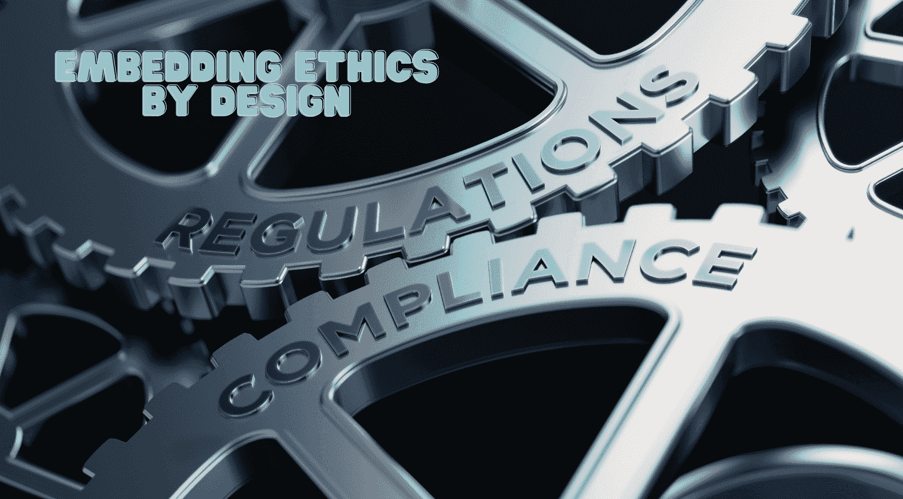

# 关于 AI 监管环境的所有信息

> 原文：[`www.kdnuggets.com/all-about-the-ai-regulatory-landscape`](https://www.kdnuggets.com/all-about-the-ai-regulatory-landscape)

图片来自 Canva

AI 正在以加速的速度发展，尽管可能性令人惊叹，但伴随而来的风险同样不容小觑，例如偏见、数据隐私、安全等。理想的方法是将伦理和负责任的指导方针嵌入到 AI 设计中。它应该被系统性地构建，以过滤风险，并仅保留技术利益。

* * *

## 我们的三大课程推荐

 1\. [谷歌网络安全证书](https://www.kdnuggets.com/google-cybersecurity) - 快速进入网络安全职业生涯。

 2\. [谷歌数据分析专业证书](https://www.kdnuggets.com/google-data-analytics) - 提升你的数据分析技能

 3\. [谷歌 IT 支持专业证书](https://www.kdnuggets.com/google-itsupport) - 支持你组织的 IT 需求

* * *

引用 [Salesforce](https://www.salesforce.com/company/intentional-innovation/ethics-by-design/):

> “伦理设计是将我们的伦理和人文使用指导原则有意嵌入设计和开发过程中的过程。”

但是，说起来容易做起来难。即使是开发人员也发现解读 AI 算法的复杂性，尤其是新兴能力，具有挑战性。

> “根据 [deepchecks](https://deepchecks.com/exploring-the-emergent-abilities-of-large-language-models) 的说法，‘如果在模型开发过程中没有明确训练或期望的能力，但随着模型规模和复杂性增加而显现出来，则被认为是 LLM 的新兴能力。’”

鉴于开发人员需要帮助理解算法的内部机制以及其行为和预测背后的原因，期望在短时间内让主管部门理解并加以监管是不现实的。

此外，跟上最新发展的步伐对每个人来说都是同样具有挑战性的，更不用说及时理解这些发展以制定合适的监管措施。

## 欧盟 AI 法案

这引导我们讨论欧盟 (EU) AI 法案——这一历史性举措涵盖了一整套规则，旨在促进值得信赖的 AI。

图片来自 Canva

[法律框架](https://www.europarl.europa.eu/doceo/document/TA-9-2023-0236_EN.html) 旨在“确保在支持创新和改善内部市场运作的同时，保护健康、安全、基本权利、民主和法治以及环境免受 AI 系统有害影响。”

欧盟以引入《通用数据保护条例》（GDPR）而闻名，如今还通过《人工智能法案》在人工智能监管方面引领潮流。

### 时间线

为了论证为何制定法规需要较长时间，我们来看一下《人工智能法案》的时间线，该法案首次由欧盟委员会于 2021 年 4 月提出，随后在 2022 年 12 月被欧盟理事会采纳。三大立法机构——欧盟委员会、理事会和议会的三方会谈已于 2024 年 3 月完成，预计《法案》将于 2024 年 5 月生效。

### 关切谁？

关于其适用的组织，《法案》不仅适用于欧盟内的开发者，还适用于将其[人工智能系统提供给欧盟用户的全球供应商。](https://cset.georgetown.edu/article/the-eu-ai-act-a-primer/)

### 风险等级划分

尽管所有风险并不相同，但《法案》包含了一种基于风险的方法，将应用程序分为四类——不可接受、高风险、有限和最小，根据它们对个人健康、安全或基本权利的影响。

风险等级划分意味着随着应用风险的增加，法规变得更加严格，需要更多的监管。它禁止那些带有不可接受风险的应用程序，如社会评分和生物识别监控。

不可接受的风险和高风险人工智能系统将在法规生效后六个月和三十六个月内实施。

## 透明度

从基本问题开始，定义什么构成人工智能系统至关重要。如果定义过于宽泛，会使大量传统软件系统也纳入监管范围，影响创新；而如果定义过于严格，则可能出现疏漏。

例如，一般用途的生成型人工智能应用程序或其基础模型必须提供必要的披露信息，如训练数据，以确保遵守《法案》。越来越强大的模型将需要额外的细节，如[模型评估、评估和减轻系统性风险以及事件报告。](https://www.europarl.europa.eu/news/en/press-room/20240308IPR19015/artificial-intelligence-act-meps-adopt-landmark-law)

在人工智能生成的内容和互动中，最终用户很难理解何时看到的是人工智能生成的回应。因此，当结果不是人工生成的或包含人工图像、音频或视频时，用户必须被通知。

## 监管还是不监管？

像人工智能这样的技术，特别是生成型人工智能，超越了边界，可能会改变今天企业的运作方式。《人工智能法案》的时机恰到好处，与生成型人工智能时代的到来相契合，而这一时代倾向于加剧风险。

凭借集体的智慧和头脑，确保人工智能安全应成为每个组织的议程。尽管其他国家正在考虑是否引入有关人工智能风险的新规定或修订现有规定，以应对来自先进人工智能系统的新挑战，人工智能法案作为治理人工智能的黄金标准，开创了其他国家跟随和合作的道路，将人工智能用于正当用途。

监管环境面临在国家之间领导科技竞赛的挑战，常被视为获得全球主导地位的障碍。

然而，如果必须进行竞争，那最好看到的是我们在争取让人工智能对每个人都更安全，并遵循黄金伦理标准以推出全球最值得信赖的人工智能。

****[Vidhi Chugh](https://vidhi-chugh.medium.com/)**是一位人工智能战略家和数字化转型领导者，她在产品、科学和工程的交汇点上工作，致力于构建可扩展的机器学习系统。她是获奖的创新领导者、作者和国际演讲者。她的使命是使机器学习普及化，并打破术语，让每个人都能参与到这一转型中。**

### 更多相关主题

+   [数据掩码：确保 GDPR 和其他监管合规性的核心](https://www.kdnuggets.com/2023/05/data-masking-core-ensuring-gdpr-regulatory-compliance-strategies.html)

+   [8 篇创新的 BERT 知识蒸馏论文改变了…](https://www.kdnuggets.com/2022/09/eight-innovative-bert-knowledge-distillation-papers-changed-nlp-landscape.html)

+   [如何使用 AIOps 管理复杂的 IT 环境](https://www.kdnuggets.com/2022/05/manage-complex-landscape-aiops.html)

+   [首个机器学习价值链景观](https://www.kdnuggets.com/2022/10/first-ml-value-chain-landscape-sequence.html)

+   [AI 驱动世界中的数据工程景观](https://www.kdnuggets.com/2023/05/data-engineering-landscape-aidriven-world.html)

+   [数据景观的演变](https://www.kdnuggets.com/2023/06/evolution-data-landscape.html)
