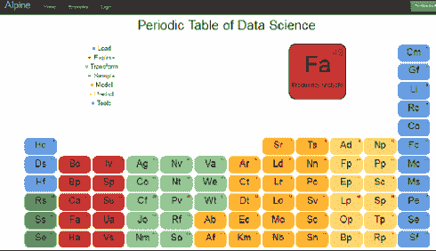

# Alpine 数据科学周期表

> 原文：[`www.kdnuggets.com/2014/02/alpine-data-science-periodic-table.html`](https://www.kdnuggets.com/2014/02/alpine-data-science-periodic-table.html)

在最近的 Strata 会议上（2014 年 2 月 11 日至 13 日在圣克拉拉），有许多创意赠品公司用来吸引潜在客户到他们的展位。

最巧妙的之一是 [Alpine 的数据科学周期表](http://alpinenow.com/blog/the-most-useful-strataconf-giveaway/)

它将数据科学操作员分为 7 类：

**加载**：Hc - 复制到 Hadoop，Ds - 数据集 ...

**探索**：Bc - 条形图，Bp - 箱线图 ...

**变换**：Ag - 聚合，Co - 收缩 ...

**样本**：Rs - 随机抽样，Ss - 分层抽样 ...

**模型**：Ar - 关联规则，Sr - SVM 回归 ...

**预测**：Ad - Adaboost 预测器，Np - 神经网络预测器 ...

**工具**：Cm - 混淆矩阵，Gf - 拟合优度 ...

 一个互动版本可以在 [`start.alpinenow.com/#/periodic-table`](http://start.alpinenow.com/#/periodic-table) 找到，它旨在与 Alpine Chorus 一起使用，你可以在 [这里](http://start.alpinenow.com/#/sign-up) 免费获取。

### 更多相关话题

+   [我们能用 T5 查询一个表格吗？](https://www.kdnuggets.com/2022/05/query-table-t5.html)

+   [停止学习数据科学以寻找目标，并通过寻找目标来 …](https://www.kdnuggets.com/2021/12/stop-learning-data-science-find-purpose.html)

+   [数据科学基础：你需要了解的 10 个关键技能](https://www.kdnuggets.com/2020/10/data-science-minimum-10-essential-skills.html)

+   [KDnuggets™ 新闻 22:n06, 2 月 9 日：数据科学编程](https://www.kdnuggets.com/2022/n06.html)

+   [数据科学定义幽默：奇特的名言合集](https://www.kdnuggets.com/2022/02/data-science-definition-humor.html)

+   [5 个数据科学项目来学习 5 个关键的数据科学技能](https://www.kdnuggets.com/2022/03/5-data-science-projects-learn-5-critical-data-science-skills.html)
