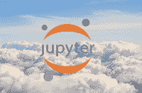
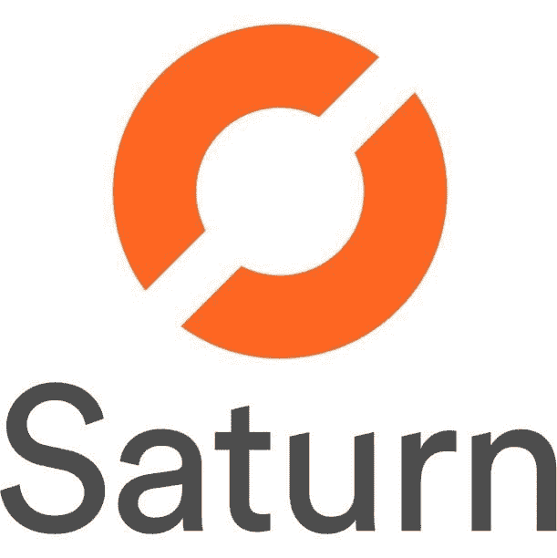

# 替代的云托管数据科学环境

> 原文：[`www.kdnuggets.com/2019/12/alternative-cloud-data-science-environments.html`](https://www.kdnuggets.com/2019/12/alternative-cloud-data-science-environments.html)

评论[来源](https://towardsdatascience.com/how-to-run-jupyter-notebooks-in-the-cloud-6ba14ca164da)

主要云服务提供商如 AWS、GCP 和 Azure 都提供使用 Jupyter 环境的数据科学环境。曾几何时，它们是需要强大计算和存储能力的数据科学家的唯一选择。多年来，新的替代提供商涌现，提供了一种独立的数据科学环境，托管在云端，供数据科学家分析、托管和分享他们的工作。

* * *

## 我们的前三个课程推荐

 1\. [Google 网络安全证书](https://www.kdnuggets.com/google-cybersecurity) - 快速进入网络安全职业道路。

 2\. [Google 数据分析专业证书](https://www.kdnuggets.com/google-data-analytics) - 提升您的数据分析技能

 3\. [Google IT 支持专业证书](https://www.kdnuggets.com/google-itsupport) - 支持您的组织 IT

* * *

以下 2 个提供商是那些想跳过整个云环境，寻找一个可以获得大存储空间和强大 CPU/GPU 性能的替代选择。

### Matrix DS

MatrixDS 提供一个数据科学环境，具有社交网络类型的界面，用于分享工作和接收对工作评价。用户可以轻松地添加其他人加入他们的项目，以便与同事合作。该平台还允许您像 GitHub 一样分叉其他人的项目，并具有私有和公开模式。我们可以直接在平台上上传文件，或从 GitHub、Amazon S3、Dropbox 或 Google Cloud 拉取文件。

用户可以选择启动虚拟机，每台虚拟机都有自己的语言环境，目前 MatrixDS 支持 R、Python 和 Julia 进行分析。对于可视化和展示，它支持 Shiny、Superset、Bokeh 等。

**要在 MatrixDS 中开始使用 Jupyter 环境：**

1.  注册一个免费账户开始使用。

1.  您将被带到“项目”页面，点击右上角的绿色按钮以开始一个新项目。为其命名并添加描述，然后点击“创建”。

1.  需要配置您的虚拟机，我们可以从 4GB 内存和 1 核 CPU 开始。

### Saturn Cloud

Saturn Cloud 是一个相对较新的服务，由[Hugo Shi](https://www.linkedin.com/in/hugo-shi/)于 2018 年共同创办，他也是 Anaconda 的共同创始人。Saturn Cloud 旨在成为一个平台，使我们可以成为数据科学家，而他们则可以成为数据工程师。他们的目标是为大众提供数据科学的 DevOps 服务，以便我们可以尽可能多地专注于分析阶段。

Saturn Cloud 使用 AWS 作为后端来托管他们的 Jupyter 环境，并为你和你的团队提供控制和预算成本的能力。它提供版本控制和与 Dask 的并行计算，以便与 NumPy、Pandas 和 Scikit Learn 等 Python 库兼容，而无需使用 Spark 或 Scala 等语言进行分布式计算。

**开始使用 Saturn Cloud：**

1.  第一步是注册并创建一个账户。

1.  要创建你的笔记本实例，请指定一个名称、存储、GPU 和 requirements.txt 文件以开始使用。

1.  点击 CREATE，你的服务器将启动，并且你的笔记本实例将准备就绪。

Saturn Cloud 最大的吸引力之一是其并行处理能力，可以加速任何数据科学操作。Saturn Cloud 已经撰写了一篇关于进行[使用 Dask 的并行处理](https://www.saturncloud.io/s/practical-guide-to-dask/)的文章。

这些服务正被越来越多的数据科学社区采用，作为传统云提供商的替代方案。有时，对于某些项目来说，可能不需要完整的云体验，因此这两个平台可以提供仅满足我们项目需求的服务，而不会在存储或计算能力上妥协。

**相关：**

+   2020 年数据科学的 4 大热门趋势

+   简便的一键 Jupyter 笔记本

+   使用 DC/OS 加速企业中的数据科学

### 更多相关话题

+   [来自 Anaconda 的新动态！数据科学培训与云托管笔记本](https://www.kdnuggets.com/2022/11/anaconda-new-anaconda-data-science-training-cloud-hosted-notebooks.html)

+   [Feature Store Summit 2023：部署 ML 的实际策略…](https://www.kdnuggets.com/2023/09/hopsworks-feature-store-summit-2023-practical-strategies-deploying-ml-models-production-environments)

+   [5 大数据科学替代职业路径](https://www.kdnuggets.com/5-top-data-science-alternative-career-paths)

+   [机器学习中的替代特征选择方法](https://www.kdnuggets.com/2021/12/alternative-feature-selection-methods-machine-learning.html)

+   [OpenChatKit：开源 ChatGPT 替代品](https://www.kdnuggets.com/2023/03/openchatkit-opensource-chatgpt-alternative.html)

+   [8 款开源 ChatGPT 和 Bard 替代品](https://www.kdnuggets.com/2023/04/8-opensource-alternative-chatgpt-bard.html)
