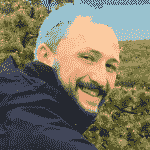

# 美国的下一个主题模型

> 原文：[`www.kdnuggets.com/2016/07/americas-next-topic-model.html`](https://www.kdnuggets.com/2016/07/americas-next-topic-model.html)

**由 Lev Konstantinovskiy，RaRe Technologies**。

“如何选择最佳主题模型？”是我们社区邮件列表上的头号问题。在 RaRe Technologies，我管理 Python 开源主题建模包 [gensim](https://github.com/RaRe-Technologies/gensim) 的社区。由于很多人正在寻找答案，我们最近发布了更新的 gensim 0.13.1，包含了几个新兴功能，可以评估您的模型是否有效，帮助您选择最佳主题模型。


***图 1**。顶部：四个选定主题的 15 个最可能的词汇。底部：根据词汇所属的主题着色的文本文档。摘自 [David M. Blei 的《潜在狄利克雷分配论文》](http://www.jmlr.org/papers/volume3/blei03a/blei03a.pdf)*

### 什么是主题建模？

主题建模是一种利用机器学习从非结构化文本中自动提取共同主题的技术。它是获取大量文本集合全局视图的好方法。

主题建模的快速回顾：一个主题是对词汇表的概率分布。例如，如果我们手动为《哈利·波特》系列书籍创建三个主题，我们可能会得到如下内容：

1.  (*麻瓜主题*) 50% “麻瓜”，25% “达斯利”，10% “常春藤”，5% “血脉污秽”...

1.  (*伏地魔主题*) 65% “伏地魔”，12% “死亡”，10% “魂器”，5% “蛇”...

1.  (*哈利主题*) 42% “哈利·波特”，15% “伤疤”，7% “魁地奇”，7% “格兰芬多”...

同样，我们可以将单个文档表示为对主题的概率分布。例如，《哈利·波特》第一本书的第一章介绍了达斯利一家，并让邓布利多讨论哈利父母的去世。如果我们把这一章当作一个文档，它可以被分解为这样的主题：40% 麻瓜主题，30% 伏地魔主题，剩下的 30% 是哈利主题。

当然，我们不想像这样手动提取主题和文档概率。我们希望机器利用我们的无标签文本集合作为唯一输入，自动完成这一任务。由于没有文档标注或人工注释，主题建模是一种无监督的机器学习技术。

另一个更实际的例子是将您的公司内部文档分成主题，为其内容提供全局视图，方便可视化和浏览：


***图 2**。使用主题模型创建公司内部文档的全局视图，并可通过主题（而非仅仅关键词）深入到单个文档中。*

### 隐狄利克雷分配 = LDA

当前最受欢迎的主题模型是[隐狄利克雷分配](https://en.wikipedia.org/wiki/Latent_Dirichlet_allocation)。要了解它是如何工作的，Edwin Chen 的[博客文章](http://blog.echen.me/2011/08/22/introduction-to-latent-dirichlet-allocation/)是一个非常好的资源。这个[链接](https://www.quora.com/What-is-a-good-explanation-of-Latent-Dirichlet-Allocation)包含了 LDA 的各种解释，这可能需要一些数学背景。David Blei 的这篇[论文](https://www.cs.princeton.edu/~blei/papers/Blei2012.pdf)总结了迄今为止开发的各种主题模型，是一个很好的参考。

如果你想深入了解一些 LDA 和向量空间代码，[gensim 教程](https://radimrehurek.com/gensim/tutorial.html)总是很有用的。

### 选择最佳主题模型：着色词汇

一旦你有了主题，下一步是确定它们是否有效。如果有效，那么你可以直接将它们插入你的集合浏览器或分类器中。如果无效，也许你应该再训练一下模型或使用不同的参数。

分析模型的一种方法是根据文档词汇所属的主题来着色。这一功能最近由我们的 2016 年 Google Summer of Code 学生 Bhargav 添加到 gensim 中。你可以查看此[笔记本](https://github.com/RaRe-Technologies/gensim/blob/develop/docs/notebooks/topic_methods.ipynb)中的 Python 代码。上面的图 1 是 David Blei 在原始 LDA 论文中的此功能的示例。

一个有趣的例子是‘银行’这个词，它可能指‘金融机构’或‘河岸’。一个好的主题建模算法可以根据上下文区分这两种含义。着色词汇是一种快速评估模型是否理解其含义以及是否有效的方法。

例如，我们在一个包含九个文档的玩具语料库上训练了两个主题模型。

```py
texts = [['river', 'bank', 'nature'],
         ['money', 'finance', 'bank', 'currency', 'up', 'down'],
         ['trading', 'computer', 'interface', 'system'],
         ['forest', 'nature', 'water', 'tree'],
         ['option', 'derivative', 'latency', 'bank', 'trading'],
         ['tree'],
         ['exchange', 'rate', 'option'],
         ['interest', 'rate', 'up'],
         ['field', 'forest', 'river']]

dictionary = Dictionary(texts)
corpus = [dictionary.doc2bow(text) for text in texts]
goodLdaModel = LdaModel(corpus=corpus, id2word=dictionary, iterations=50, num_topics=2)
badLdaModel = LdaModel(corpus=corpus, id2word=dictionary, iterations=1, num_topics=2)

```

一个 LDA 模型训练了 50 次迭代，另一个只训练了一次迭代。我们期望模型训练时间越长，效果越好。

你可能会注意到，上面的文本看起来不像我们习惯的文本，而实际上它们是 Python 列表。这是因为我们将它们转换为[词袋模型](https://en.wikipedia.org/wiki/Bag-of-words_model)表示形式。这就是 LDA 模型如何查看文本的方式。词序不重要，一些非常频繁的词会被移除。例如，'A bank of a fast river.' 在词袋模型格式中变成了['bank', 'river', 'fast']。

让我们看看这两个模型在区分‘河流银行’和‘金融银行’方面的效果。如果文档中的所有词汇都与自然相关，那么我们的多义词‘银行’应该被着色为‘蓝色’的自然主题颜色。

```py
bow_water = ['bank','water','river', 'tree']
color_words(goodLdaModel, bow_water)

```

`**银行 河流 水树**`

```py
color_words(badLdaModel, bow_water)

```

`**银行 河流 水树**`

好的模型成功地完成了这个任务，而差的模型认为这是一个‘金融银行’，并将其标记为红色。

### 选择最佳主题模型：pyLDAvis

我们还可以看出，经过更好训练的模型非常合适，因为它具有明确的自然和金融主题。下面的可视化来自 pyLDAvis，这是一个用于定性评估主题模型的出色可视化工具。你可以在这个 [Jupyter notebook](http://nbviewer.jupyter.org/github/dsquareindia/gensim/blob/a4b2629c0fdb0a7932db24dfcf06699c928d112f/docs/notebooks/topic_coherence_tutorial.ipynb) 中互动式地玩这个特定的可视化。Ben Mabey 在 [YouTube 上的演讲](https://www.youtube.com/watch?v=tGxW2BzC_DU&index=4&list=PLykRMO7ZuHwP5cWnbEmP_mUIVgzd5DZgH) 中也对 pyLDAvis 进行了很好的介绍。


***图 3**. pyLDAvis 中的好主题模型。右侧显示了红色突出显示的圆圈（主题）的最相关词汇。例如，‘bank’ 旁边的蓝色条表示词汇‘bank’在文档集合中出现的频率。红色部分的条表示‘bank’在选定主题中的频率。我们可以自信地将主题 #1 命名为金融主题，因为显示在其旁边的词汇正是我们在金融中期望看到的：‘bank’，‘trading’，‘option’ 和 ‘rate’。此外，‘bank’ 这个词在这个主题中出现的频率最高，因为它有一个大红条。*


***图 4**. pyLDAvis 中的差主题模型。一个主题中的词语彼此无关。让我们将训练了 50 次（9*50 = 450 个文档）的好模型与只训练了 1 次（九个文档）的差模型进行比较。差模型中的一个主题包含了彼此无关的词汇。‘tree’ 和 ‘trading’ 都出现在了同一主题 #2 的列表中。我们期望它们出现在不同的主题中：‘tree’ 与自然相关，而 ‘trading’ 应该与金融相关。所以这个主题模型是没有意义的。*

### 选择最佳主题模型：定量方法

现在有一个新的 gensim 功能，可以在没有手动可视化 pyLDAvis 或词汇着色的情况下自动选择最佳模型。它被称为‘主题一致性’。我们 [孵化器计划](http://rare-technologies.com/incubator/) 中的一名学生 Devashish，基于 [Michael Röder 等](http://svn.aksw.org/papers/2015/WSDM_Topic_Evaluation/public.pdf) 的论文在 Python 中实现了这个功能。

这里有一个有趣的转折。令人惊讶的是，模型拟合的数学严格计算（数据似然性、困惑度）并不总是与对模型质量的人工评价一致，正如在标题为 "[阅读茶叶：人类如何解读主题模型](https://papers.nips.cc/paper/3700-reading-tea-leaves-how-humans-interpret-topic-models)" 的论文中所展示的那样。但另一个[公式](http://palmetto.aksw.org/palmetto-webapp/)被发现与人类判断有很好的相关性。它被称为 'C_v 主题一致性'。它衡量主题词在语料库中共同出现的频率。当然，关键在于如何定义‘共同’。Gensim 支持包括 C_v 在内的几种主题一致性度量。你可以在这个 [Jupyter notebook](http://nbviewer.jupyter.org/github/dsquareindia/gensim/blob/a4b2629c0fdb0a7932db24dfcf06699c928d112f/docs/notebooks/topic_coherence_tutorial.ipynb) 中探索它们。

正如我们在上面的人工检查中预期的那样，训练了 50 轮的模型具有更高的一致性。现在你可以使用这个数字自动选择最佳模型。

```py
goodcm = CoherenceModel(model=goodLdaModel, texts=texts, dictionary=dictionary, coherence='c_v')
print goodcm.get_coherence()
0.552164532134

badcm = CoherenceModel(model=badLdaModel, texts=texts, dictionary=dictionary, coherence='c_v')
print badcm.get_coherence()
0.5269189184

```

### 结论

我们已经介绍了评估主题模型的三种方法——词汇着色、pyLDAvis 和主题一致性。你选择哪种方法取决于模型和主题的数量。如果你有少量模型和少量主题，那么可以在合理的时间内进行人工检查。特别是在你的特定领域中，词汇着色是一个重要的步骤。在其他情况下，人工检查是不切实际的。例如，如果你进行了 LDA 参数网格搜索并拥有大量模型，或者有数千个主题。在这种情况下，唯一的方法是通过自动主题一致性来找到最一致的模型，然后用词汇着色和 pyLDAvis 进行快速人工验证。

我希望你发现这些模型选择技术在你的 NLP 应用中有用！如果你对它们有任何问题，请在 [gensim 邮件列表](https://groups.google.com/forum/#!forum/gensim) 上告诉我们。我们还在 RaRe Technologies 提供 [NLP 咨询服务](http://rare-technologies.com/services/)。

**个人简介：Lev Konstantinovskiy**，自然语言处理专家，是一名 Python 和 Java 开发者。Lev 拥有丰富的金融机构工作经验，并且是 RaRe 的开源社区经理，包括 [gensim](https://github.com/RaRe-Technologies/gensim)，一个用于理解人类语言的开源机器学习工具包。Lev 在 [RaRe Technologies](http://rare-technologies.com) 担任开源布道者和研发职位。

**相关**：

+   HPE Haven OnDemand 文本提取 API 开发者备忘单

+   使用 Python 矿化 Twitter 数据 第一部分：数据收集

+   文本挖掘 101：主题建模

* * *

## 我们的三大课程推荐

 1\. [谷歌网络安全证书](https://www.kdnuggets.com/google-cybersecurity) - 快速进入网络安全职业轨道。

 2\. [谷歌数据分析专业证书](https://www.kdnuggets.com/google-data-analytics) - 提升你的数据分析技能

 3\. [谷歌 IT 支持专业证书](https://www.kdnuggets.com/google-itsupport) - 支持你的组织 IT 需求

* * *

### 更多相关话题

+   [主题建模方法：Top2Vec 与 BERTopic](https://www.kdnuggets.com/2023/01/topic-modeling-approaches-top2vec-bertopic.html)

+   [NExT-GPT 介绍：任意对任意的多模态大语言模型](https://www.kdnuggets.com/introduction-to-nextgpt-anytoany-multimodal-large-language-model)

+   [介绍 Falcon2：TII 的下一代语言模型](https://www.kdnuggets.com/introducing-falcon2-next-gen-language-model-by-tii)

+   [将数据科学职业提升到下一个层次](https://www.kdnuggets.com/2021/12/sas-advance-data-science-career-next-level.html)

+   [初级数据科学家：下一个层次](https://www.kdnuggets.com/2022/02/junior-data-scientist-next-level.html)

+   [你可能会在下次面试中遇到的 24 个 SQL 问题](https://www.kdnuggets.com/2022/06/24-sql-questions-might-see-next-interview.html)
