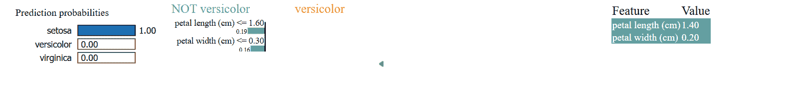

# 可解释 AI (XAI) 简介

> 原文：[`www.kdnuggets.com/an-introduction-to-explainable-ai-xai`](https://www.kdnuggets.com/an-introduction-to-explainable-ai-xai)


图片由编辑 | Midjourney

AI 系统在我们日常生活中越来越普遍，做出的决策可能难以理解。可解释 AI (XAI) 旨在使这些决策更加透明和易于理解。本文介绍了 XAI 的概念，探讨了其技术，并讨论了它在各个领域的应用。

* * *

## 我们的前三个课程推荐

 1\. [谷歌网络安全证书](https://www.kdnuggets.com/google-cybersecurity) - 快速开启网络安全职业生涯

 2\. [谷歌数据分析专业证书](https://www.kdnuggets.com/google-data-analytics) - 提升你的数据分析技能

 3\. [谷歌 IT 支持专业证书](https://www.kdnuggets.com/google-itsupport) - 支持你的组织的 IT

* * *

## 什么是可解释 AI (XAI)？

传统的 AI 模型就像“黑箱”。它们使用复杂的算法而不解释其工作原理。这使得理解其结果变得困难。

XAI 旨在使过程透明。它帮助人们了解和理解 AI 为什么做出特定的选择。它使用简单的模型和视觉辅助工具来解释这一过程。

## 可解释性的重要性

AI 系统的可解释性有许多重要原因。以下列出了一些最重要的原因。

1.  **信任**：透明的过程有助于确保决策公平。这帮助用户信任并接受结果。

1.  **公平性**：透明的过程可以防止不公平或歧视性的结果。它们防止可能存在偏见的结果。

1.  **问责**：可解释性允许我们审查决策。

1.  **安全性**：XAI 有助于识别和修复错误。这对于防止有害结果至关重要。

## 可解释 AI 技术

#### 模型无关方法

这些技术适用于任何 AI 模型。

+   **LIME（Local Interpretable Model-agnostic Explanations）**：LIME 简化复杂模型以进行个体预测。它创建一个更简单的模型，以展示输入的小变化如何影响结果。

+   **SHAP（SHapley Additive exPlanations）**：SHAP 利用博弈论为每个特征分配重要性评分。它展示了每个特征如何影响最终预测结果。

#### 模型特定方法

这些技术专门针对特定类型的 AI 模型。

+   **决策树**：决策树通过将数据分支来做出决策。每个分支代表一个基于特征的规则，而叶子节点显示结果。

+   **基于规则的模型**：这些模型使用简单的规则来解释其决策。每个规则概述了导致结果的条件。

#### 特征可视化

该技术使用可视化工具显示不同特征如何影响人工智能决策。

+   **显著性图**：显著性图突出显示图像中影响人工智能预测的重要区域。

+   **激活图**：激活图展示了在决策过程中神经网络的哪些部分是活跃的。

## 使用 LIME 进行**可解释人工智能**

我们将探讨如何使用`LIME`来解释模型的决策。

代码使用`LIME`库。它解释了随机森林模型的预测。这个示例使用了鸢尾花数据集。

首先确保库已经安装：

```py
pip install lime
```

然后尝试以下代码。

```py
import lime
import lime.lime_tabular
import numpy as np
import pandas as pd
from sklearn.ensemble import RandomForestClassifier
from sklearn.datasets import load_iris

# Load dataset and train model
iris = load_iris()
X, y = iris.data, iris.target
model = RandomForestClassifier()
model.fit(X, y)

# Create LIME explainer
explainer = lime.lime_tabular.LimeTabularExplainer(X, feature_names=iris.feature_names, class_names=iris.target_names, discretize_continuous=True)

# Explain a prediction
i = 1
exp = explainer.explain_instance(X[i], model.predict_proba, num_features=2)
exp.show_in_notebook(show_table=True, show_all=False) 
```

输出：



输出分为三个部分：

1.  **预测概率**：指的是模型为给定输入实例分配给每个类别的概率。这些概率显示了模型的信心。它们反映了每个可能结果的可能性。

1.  **特征重要性**：该组件显示了局部模型中每个特征的重要性。它表明每个特征在特定实例的预测中影响了多少。

1.  **局部预测解释**：输出的这一部分展示了模型如何为特定实例做出预测。它分解了哪些特征是重要的以及它们如何影响结果。

## XAI 的应用领域

#### 医疗保健

人工智能系统通过分析医学影像和患者数据显著提高了诊断准确性。它们可以识别图像中的模式和异常。然而，它们的真正价值在于**可解释人工智能**（XAI）。XAI 澄清了人工智能系统如何做出诊断决策。这种透明性帮助医生理解人工智能为何做出某些结论。XAI 还解释了每个治疗建议背后的原因。这有助于医生设计治疗计划。

#### 金融

在金融领域，**可解释人工智能**用于信用评分和欺诈检测。在信用评分方面，XAI 解释了信用评分的计算方式。它显示了哪些因素影响一个人的信用 worthiness。这有助于消费者了解他们的评分，并确保金融机构的公平性。在欺诈检测中，XAI 解释了为什么交易被标记。它显示了检测到的异常，帮助调查人员发现并确认潜在的欺诈行为。

#### 法律

在法律领域，**可解释人工智能**帮助使人工智能决策变得清晰和易于理解。它解释了人工智能在预测犯罪或确定案件结果等领域如何得出结论。这种透明性帮助律师和法官了解人工智能推荐的生成过程。它还确保法律过程中使用的人工智能工具公平且无偏见。这促进了法律决策中的信任和责任感。

#### 自主车辆

在自动驾驶中，解释性人工智能（XAI）对安全性和法规非常重要。XAI 提供实时解释，说明车辆如何做出决策。这有助于用户理解和信任系统的行动。开发者可以利用 XAI 来提高系统的性能。XAI 还通过详细说明驾驶决策的制定过程来支持监管批准，确保技术符合公共道路的安全标准。

## XAI 中的挑战

1.  **复杂模型**：一些 AI 模型非常复杂。这使得它们很难解释。

1.  **准确性与解释性**：更准确的模型使用复杂的算法。模型的性能和解释的易用性之间往往存在权衡。

1.  **缺乏标准**：没有一种单一的方法来解释 AI。不同的行业应用需要不同的方法。

1.  **计算成本**：详细的解释需要额外的资源。这可能使过程变得缓慢和昂贵。

## 结论

解释性人工智能是一个关键领域，解决了 AI 决策过程中的透明性需求。它提供了各种技术和方法，使复杂的 AI 模型更具可解释性和理解性。随着 AI 的不断发展，XAI 的开发和实施将在建立信任、确保公平性以及推动不同领域 AI 的负责任使用中发挥重要作用。

**[Jayita Gulati](https://www.linkedin.com/in/jayitagulati1998/)** 是一位机器学习爱好者和技术作家，致力于构建机器学习模型。她拥有利物浦大学计算机科学硕士学位。

### 更多相关内容

+   [用最先进的深度学习进行解释性预测和即时预测](https://www.kdnuggets.com/2021/12/sota-explainable-forecasting-and-nowcasting.html)

+   [为对话解释解释性人工智能](https://www.kdnuggets.com/2022/10/explaining-explainable-ai-conversations.html)

+   [解释性人工智能：揭示模型决策的 10 个 Python 库](https://www.kdnuggets.com/2023/01/explainable-ai-10-python-libraries-demystifying-decisions.html)

+   [弥合人类理解与机器学习之间的差距：…](https://www.kdnuggets.com/2023/06/closing-gap-human-understanding-machine-learning-explainable-ai-solution.html)

+   [使用 PyCaret 在 Python 中进行聚类的介绍](https://www.kdnuggets.com/2021/12/introduction-clustering-python-pycaret.html)

+   [数据科学的基础数学：奇异值分解的可视化介绍…](https://www.kdnuggets.com/2022/06/essential-math-data-science-visual-introduction-singular-value-decomposition.html)
