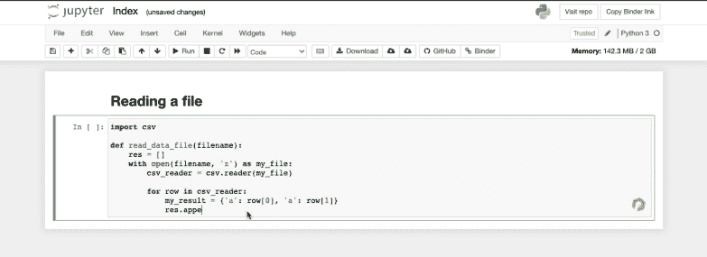

# 分析 Jupyter 笔记本中的 Python 代码

> 原文：[`www.kdnuggets.com/2021/10/analyze-python-code-jupyter-notebooks.html`](https://www.kdnuggets.com/2021/10/analyze-python-code-jupyter-notebooks.html)

评论

**作者 [Julien Delange](https://www.linkedin.com/in/juli1/)，Codiga 首席执行官**

## 摘要

Jupyter 笔记本不支持传统的代码分析工具，这使得发现错误变得更加困难。我们提出了一种新工具，将现代代码分析技术与 Jupyter 笔记本集成，帮助开发者在编写代码时发现错误。

## 为什么验证 Python 代码？

Python 成为最受欢迎的编程语言（在 [TIOBE 指数](https://www.tiobe.com/tiobe-index/)中排名第 1）。即使是这样一个受欢迎的语言也可能容易出错，特别是因为其特性（解释型语言，动态类型）由于其控制流由缩进定义。在 [2018 年的研究](https://developers.slashdot.org/story/18/01/01/0242218/which-programming-languages-are-most-prone-to-bugs)中，Python 被发现是最容易出错的语言之一（与 C++、C 和 Objective-C 一起）。与其他编程语言一样，Python 有其自身的陷阱，开发者应该避免（并且这些问题已经在多年来得到了修复）。

因此，使用代码分析工具检查代码并检测潜在错误始终是一个良好的实践。主要目的是帮助你在将代码交付生产环境之前找到潜在错误。同时，它还帮助你遵循良好的编码规范。

## 现有生态系统

大多数集成开发环境（IDE）都带有一些代码分析功能，用于验证代码的语法。例如，[PyCharm](https://www.jetbrains.com/pycharm/) 提供了语法和语义问题检查的分析功能。还有多种开源工具可以从语义（例如 [pylint](https://pylint.org/)）、安全（例如 [bandit](https://github.com/PyCQA/bandit)）或风格（例如 [black](https://github.com/psf/black)）的角度检查 Python 代码。这些工具通常通过自定义插件和扩展集成到 IDE 中。

然而，静态分析工具未与 Jupyter 笔记本集成，开发者无法从这些工具的分析中受益。

## 在 Jupyter 笔记本中检查代码

作为定期使用 Jupyter 进行数据分析的 Python 开发者，我们希望将这些工具带入 Jupyter 生态系统，并帮助开发者快速捕捉错误。我们实现了一个 [Chrome 插件](https://chrome.google.com/webstore/detail/codiga/dbkhkhonmelajjempmoadocgneoadjge)，它可以在开发者编写代码时分析 Jupyter 笔记本中的 Python 代码，并报告所有问题。

该工具执行静态分析器，如 [Pylint](https://pylint.org/) 和 [Bandit](https://github.com/PyCQA/bandit)，以检测 Python 代码中的语法、语义和安全错误，并将错误直接报告到 Jupyter 笔记本中。该插件目前兼容 Jupyter 笔记本，并将很快支持 Google Colab 或 AWS Sagemaker 等其他平台。

## 结论

Python 是当今最受欢迎的编程语言，但编写无瑕疵的 Python 代码非常困难。幸运的是，存在多种工具可以帮助开发人员检测次优代码。通过将这些工具与 Jupyter 笔记本接口，我们的 Chrome 扩展帮助开发人员在编写代码时检测问题，并在将代码投入生产前快速修复它们。

## 资源

+   [Jupyter 笔记本的 Chrome 扩展](https://chrome.google.com/webstore/detail/codiga/dbkhkhonmelajjempmoadocgneoadjge)

+   [扩展的代码在 GitHub 上](https://github.com/codeinspectorio/chrome-extension)

+   [Pylint](https://pylint.org/)

+   [Bandit](https://github.com/PyCQA/bandit)

**个人简介： [朱利安·德朗日](https://www.linkedin.com/in/juli1/)** 是 Codiga（前身为 Code Inspector）的 CEO，该公司帮助开发人员更快地编写更好的代码。朱利安是一位经验丰富的软件开发人员，曾在 Twitter、Amazon Web Services 工作，并且是 MIT Press 出版的《技术债务》( [Technical Debt](https://techdebt-book.com/) )一书的作者。

**相关：**

+   计算机视觉的开源数据集

+   机器学习与深度学习大全开放书籍

+   Albumentations 概述：用于高级图像增强的开源库

* * *

## 我们的前三大课程推荐

 1\. [Google 网络安全证书](https://www.kdnuggets.com/google-cybersecurity) - 快速进入网络安全职业轨道

 2\. [Google 数据分析专业证书](https://www.kdnuggets.com/google-data-analytics) - 提升你的数据分析技能

 3\. [Google IT 支持专业证书](https://www.kdnuggets.com/google-itsupport) - 支持你的组织 IT

* * *

### 更多相关内容

+   [拖放分析：无代码数据科学的崛起](https://www.kdnuggets.com/drag-drop-analyze-the-rise-of-nocode-data-science)

+   [2022 年前 5 名免费云笔记本](https://www.kdnuggets.com/2022/04/top-5-free-cloud-notebooks-2022.html)

+   [来自 Anaconda 的新动态！数据科学培训和云托管笔记本](https://www.kdnuggets.com/2022/11/anaconda-new-anaconda-data-science-training-cloud-hosted-notebooks.html)

+   [数据科学的前 7 名免费云笔记本](https://www.kdnuggets.com/top-7-free-cloud-notebooks-for-data-science)

+   [金融中的 Python：在 Jupyter Notebook 中进行实时数据流](https://www.kdnuggets.com/python-in-finance-real-time-data-streaming-within-jupyter-notebook)

+   [通过整合 Jupyter 和 KNIME 缩短实施时间](https://www.kdnuggets.com/2021/12/cutting-implementation-time-integrating-jupyter-knime.html)
