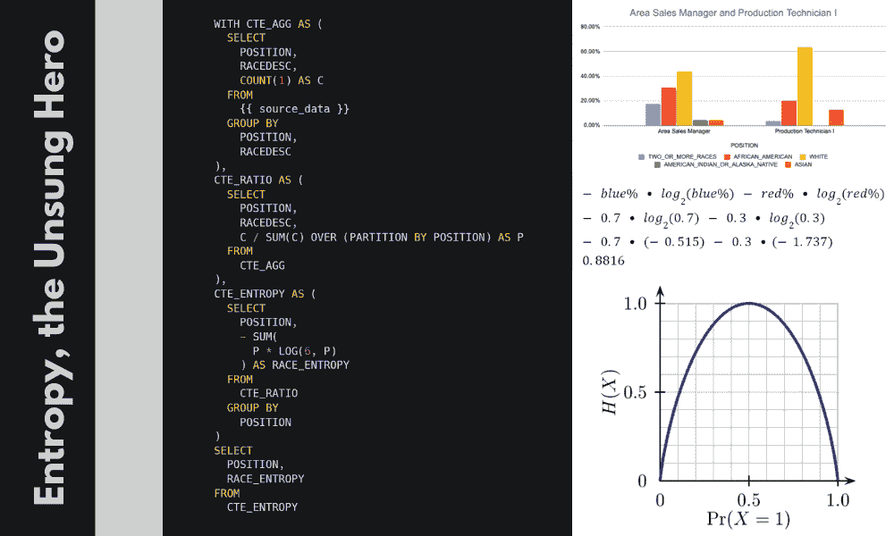
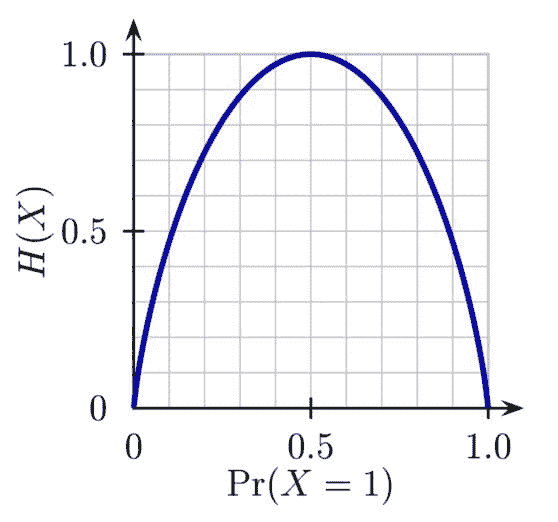
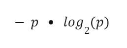
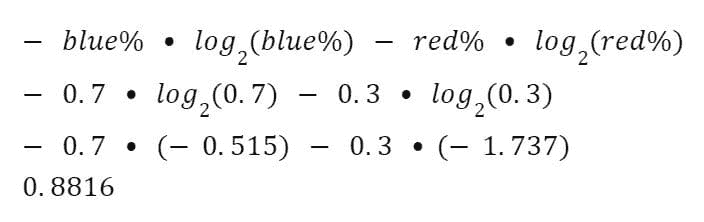
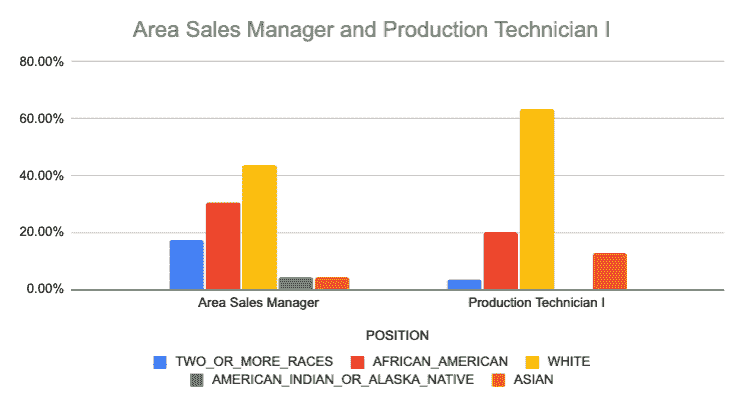

# 用 SQL 分析多样性与包容性

> 原文：[`www.kdnuggets.com/2022/11/analyzing-diversity-inclusion-sql.html`](https://www.kdnuggets.com/2022/11/analyzing-diversity-inclusion-sql.html)



图片来源：编辑

# 介绍

* * *

## 我们的前三个课程推荐

 1\. [谷歌网络安全证书](https://www.kdnuggets.com/google-cybersecurity) - 快速进入网络安全职业轨道

 2\. [谷歌数据分析专业证书](https://www.kdnuggets.com/google-data-analytics) - 提升你的数据分析技能

 3\. [谷歌 IT 支持专业证书](https://www.kdnuggets.com/google-itsupport) - 支持你所在组织的 IT

* * *

在过去 3-5 年中，与多样性、公平性和包容性相关的职位急剧增加已得到充分记录。DEI 分析师可能会花时间追踪、分析并回答诸如以下问题，

+   薪资在性别之间有何差异？

+   我们的部门在种族多样性方面的排名如何？

+   哪些职位和头衔最不具多样性？

虽然 DEI 分析师关注的问答类型与业务分析师不同，但他们仍然使用相同的技术技能和方法。

受保护的类别通常是**分类**的：性别、种族、民族和年龄（通常年龄被分为几个类别）

**数值**数据，如薪资，可以在受保护类别之间进行汇总

+   平均值

+   中位数

+   最小值

+   最大值

当你分析**分类**变量与**数值**变量的组合时，SQL 使其变得相当简单：

```py
SELECT 
  ethnicity, 
  AVG(salary) as AVG_SALARY, 
  MEDIAN(salary) as MEDIAN_SALARY 
FROM 
  HRDATA 
GROUP BY 
  ethnicity 
```

| 种族 | 平均薪资 | 中位薪资 |
| --- | --- | --- |
| 白人 | $68,513 | $60,050 |
| 非洲裔美国人 | $67,691 | $55,114 |
| 亚洲 | $68,842 | $65,632 |

那么，分析**分类**变量与**分类**变量的结合有哪些方法呢？标准选项非常有限：

+   众数（最常见）

+   计数唯一值

```py
SELECT 
  department, 
  COUNT(1) AS employees, 
  COUNT(DISTINCT ethnicity) AS DISTINCT_ETHNICITY, 
  MODE(ethnicity) AS MOST_COMMON_ETHNICITY 
FROM 
  HRDATA 
GROUP BY 
  ethnicity
```

| 部门 | 员工数 | 不同性别 | 最常见性别 |
| --- | --- | --- | --- |
| 销售 | 100 | 2 | 男性 |
| IT | 100 | 2 | 男性 |

初看起来，各部门似乎非常相似。但你如何区分：

+   销售部门有**99**名男性员工和**1**名女性员工

+   IT 部门有**51**名男性员工和**49**名女性员工。

我们肯定会认为后者更加多样化，但如何使用 SQL 快速得知这一点呢？

我在这里教你一种被低估的聚合函数，叫做**熵**，它将帮助我们准确量化每个部门的多样性。

| 部门 | 员工数 | 不同性别 | 最常见性别 | **熵** |
| --- | --- | --- | --- | --- |
| 销售 | 100 | 2 | 男性 | **0.08** |
| IT | 100 | 2 | 男性 | **0.99** |

不幸的是，这不是简单地执行 `SELECT Department, ENTROPY(ethnicity)` 这么简单，但我会教你 SQL 逻辑，并将其添加到开源的 [SQL Generator 5000](https://app.rasgoml.com/sql) 中，以便你随时生成所需的 SQL。

# 一些示例 HR 数据

[Rich Huebner 博士](https://www.linkedin.com/in/RichHuebner/) 在 [Kaggle.com](https://www.kaggle.com/datasets/rhuebner/human-resources-data-set) 提供了一些示例 HR 数据，我们可以用来探索分析多样性的一些方法。

让我们开始查询数据，将职位与种族进行比较。我们将从基础开始：计数、唯一计数和众数。

```py
SELECT 
  POSITION, 
  COUNT(1) AS employees, 
  COUNT(DISTINCT RACEDESC) AS DISTINCT_RACE, 
  MODE(RACEDESC) AS MOST_COMMON_RACE 
FROM HR_DATA
 WHERE DATEOFTERMINATION IS NULL /*active employees*/
GROUP BY 
  POSITION
ORDER BY 2 DESC 
```

看结果，三个最受欢迎的职位在多样性方面似乎非常相似：

# Entropy 来拯救我们

那么，我们如何按多样性对这三个部门进行排名呢？这就是 Entropy 的作用。

## 什么是 Entropy？

在继续之前，让我们花一分钟时间了解 Entropy 是什么，以及我们如何解释它。Entropy 的概念根植于信息理论的深层研究，并在机器学习、热力学和密码学等多个领域有广泛应用。因此，如果你查阅定义，它可能会令人困惑。

然而，Entropy 最简单的定义是类似于：*Entropy 是一个用来描述事物多样性的数值度量*。

想象一个只有两种颜色的弹珠袋：红色和蓝色。

现在，想象我们统计了袋子中的弹珠，发现有 99 个蓝色弹珠和仅 1 个红色弹珠。这种情况的多样性不高，因此袋子的 Entropy 很低。

接下来，想象一个包含 50 个蓝色和 50 个红色弹珠的袋子。这个袋子非常多样化，实际上已经不能再多样化了。一个包含 51 个蓝色和 49 个红色弹珠的袋子则稍微 *少* 一些多样性。因此，这个袋子的 Entropy 很高。

因此，

+   一个包含 100 个蓝色弹珠和 0 个蓝色弹珠的袋子是最不具多样性的： Entropy = 0

+   一个包含 50 个蓝色弹珠和 50 个红色弹珠的袋子是最具多样性的： Entropy = 1

因此，Entropy 在 50/50 时达到最大值 1。以下是 Entropy 随着弹珠蓝色百分比变化的常见图示：



版权： [`commons.wikimedia.org/wiki/File:Binary_entropy_plot.png`](https://commons.wikimedia.org/wiki/File:Binary_entropy_plot.png)

要计算 Entropy，我们需要计算每种颜色的百分比，并记住公式：



然后，对于一个 70% 是蓝色弹珠的袋子，我们构造公式如下：



当你将其扩展到超过 2 种选择时，你只需将对数的底数更改为匹配可能性数量即可。

# 使用 SQL

这是一个 SQL 处理起来相当简单而高效的操作。

最终结果向我们展示了，尽管两个职位都不完全多样化，但区域销售经理的多样化程度高于生产技术员。

我们可以通过将其绘制在图表上来直观地确认这一点。



# 结论

熵是一种描述多样性的有用方法。它允许你通过将这些类别与受保护的类别（如种族或性别）结合，来对部门、职位或公司进行排序或排名。尽管这种函数在大多数 RDMBS 中并不存在，我们可以轻松构建 SQL 来计算它。我认为，对于从事多样性、公平性和包容性工作的人来说，在审视其组织的劳动力时，使用这些计算是很重要的。此外，作为在数据领域工作了大部分职业生涯的人，看到 SQL 的力量在所有数据驱动的团队中都有效，从传统的数据分析师到 DEI 分析师，真的很棒。

**[Josh Berry](https://www.linkedin.com/in/joshberry022/)** ([**@Twitter**](https://mobile.twitter.com/itsamejoshabee)) 负责 Rasgo 的面向客户的数据科学工作，自 2008 年起从事数据和分析行业。Josh 在 Comcast 工作了 10 年，期间建立了数据科学团队，并且是内部开发的 Comcast 特性库的关键负责人之一——这是市场上首批特性库之一。在离开 Comcast 后，Josh 在 DataRobot 领导了面向客户的数据科学团队。在闲暇时间，Josh 会对一些有趣的主题进行复杂分析，比如棒球、F1 赛车、住房市场预测等。

### 更多相关内容

+   [用微调的 SciBERT NER 模型和 Neo4j 分析科学文章](https://www.kdnuggets.com/2021/12/analyzing-scientific-articles-finetuned-scibert-ner-model-neo4j.html)

+   [利用智能分析未来成功的概率…](https://www.kdnuggets.com/2022/02/analyzing-probability-future-success-intelligence-node-attributes-evolution-model.html)

+   [掌握数据分析的力量：四种数据分析方法](https://www.kdnuggets.com/2023/03/master-power-data-analytics-four-approaches-analyzing-data.html)

+   [数据分析：四种有效的数据分析方法及其应用…](https://www.kdnuggets.com/2023/04/data-analytics-four-approaches-analyzing-data-effectively.html)

+   [用 SQL 查询你的 Pandas 数据框](https://www.kdnuggets.com/2021/10/query-pandas-dataframes-sql.html)

+   [SQL 数据准备备忘单](https://www.kdnuggets.com/2021/05/data-preparation-sql-cheat-sheet.html)
