# 使用 Intelligence Node 的属性演变模型分析未来成功概率

> 原文：[`www.kdnuggets.com/2022/02/analyzing-probability-future-success-intelligence-node-attributes-evolution-model.html`](https://www.kdnuggets.com/2022/02/analyzing-probability-future-success-intelligence-node-attributes-evolution-model.html)

快时尚的时代和不断演变的消费者购买趋势使品牌在预测未来购买行为和寻找可能需求的产品方面变得更加具有挑战性和复杂性。Intelligence Node 对庞大的在线和竞争对手数据的访问以及专有的人工智能分析使其在基于多个因素理解趋势和分析数据方面具有优势，从而**基于历史数据和产品属性** **预测未来成功的概率**。

在这篇文章中，我们将阐明由 Intelligence Node 分析团队建立的未来成功概率模型。

* * *

## 我们的前三个课程推荐

 1\. [谷歌网络安全证书](https://www.kdnuggets.com/google-cybersecurity) - 加速进入网络安全职业生涯。

 2\. [谷歌数据分析专业证书](https://www.kdnuggets.com/google-data-analytics) - 提升你的数据分析技能

 3\. [谷歌 IT 支持专业证书](https://www.kdnuggets.com/google-itsupport) - 支持组织的 IT 需求

* * *

未来成功概率模型最初被开发为**反应模型**，后来演变为**有限记忆模型**。考虑到模型的应用以及‘心智理论’系统的未来发展，我们可以进行转变，使预测‘意识到实际影响情感和行为的变量’。我们可以开始将零售市场（可以进一步细分为不同的群体）视为具有自身情感和情绪的个体……这让人想起了[本杰明·格雷厄姆](https://en.wikipedia.org/wiki/Benjamin_Graham)创造的‘市场先生’[寓言](https://en.wikipedia.org/wiki/Allegory)。

## 深入探讨未来成功概率模型

Intelligence Node 的未来成功概率模型包含 4 个关键步骤。每个步骤对生成可以用来推测某一产品在未来 6 到 12 个月内成功概率的历史行为数据都至关重要。

## 方法论

**第 1 步：分析历史数据**

+   趋势/属性的演变可能有多种可能的结果。通过分析历史数据，我们可以估计未来成功的概率。

**第 2 步：跟踪既定和新兴的产品属性**

+   属性可以是库驱动的（已建立）或机器驱动的（新兴）。跟踪属性在一段时间内的表现可以帮助我们理解它们未来进展的概率

**第 3 步：评估关键指标的表现**

+   对于每个趋势/属性，我们评估货架份额、时间排名和权力排名（子组件包括评论速度、销售速度、产品可见性、产品生命周期动态等）

**第 4 步：分析未来成功的概率**

+   基于对历史回顾以及当前市场动态的信号 KPI 的叠加分析，我们可以识别出未来成功概率较高的趋势/属性

## 第 1 步：分析历史数据

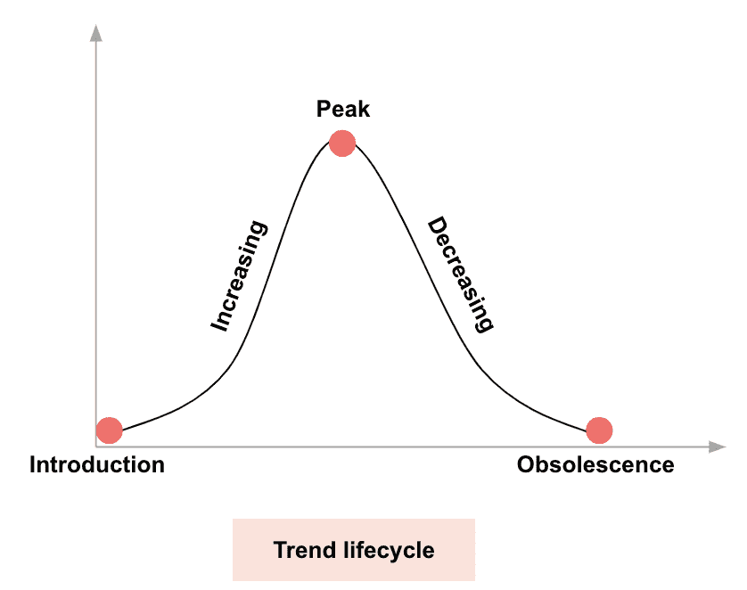

历史数据是确定未来趋势和产品成功概率的关键因素。通过了解产品过去的表现、其在产品生命周期中的位置以及观众的接受程度，可以对其未来的成功（以及类似趋势的未来成功）获得见解，前提是结合其他关键决定因素。**趋势/属性的演变可能有多种可能的结果**，分析历史数据可以帮助估计各种情况的未来成功概率。

## 第 2 步：跟踪已建立和新兴的产品属性

通过分析机器驱动的属性（及相似的关键词），我们可以识别市场趋势。以下是‘回收牛仔裤’关键词的例子，我们将了解如何使用机器驱动的方法来识别相似的关键词/属性：

### 第 1 步：挖掘产品副本中的关键词

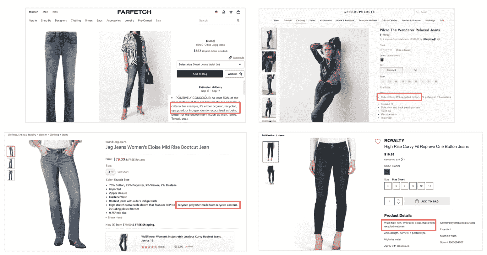

我们利用全面的属性库从所有竞争对手的产品名称/描述中捕获重复的关键词（计算机视觉也被部署以确保最大覆盖率）。

### 第 2 步：过滤属性值

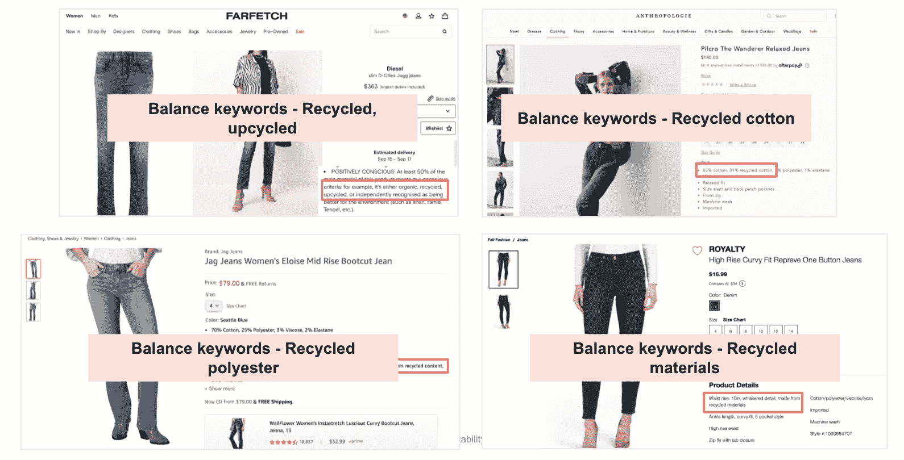

我们从属性库中过滤出现有的属性值，并分析平衡关键词（Transformer 模型被部署 + BERT 的自定义实现提取句子向量并使用它们来训练一个全连接前馈神经网络）。

### **第 3 步：对平衡关键词进行零样本聚类**

我们运行一个定制的零样本聚类模型（该模型被编程以识别和调整其内部偏差）以创建“逻辑”聚类。

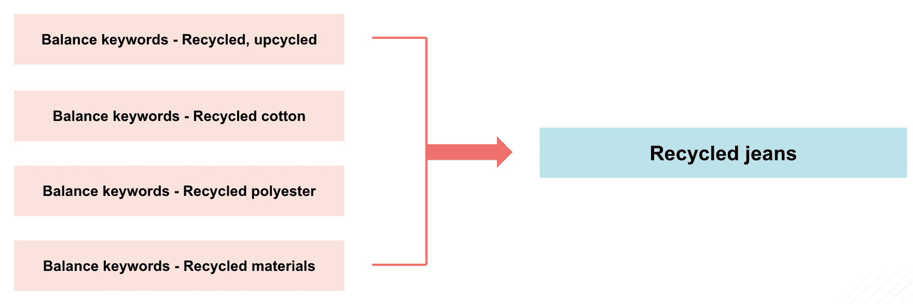

### 第 4 步：识别相似的关键词/属性

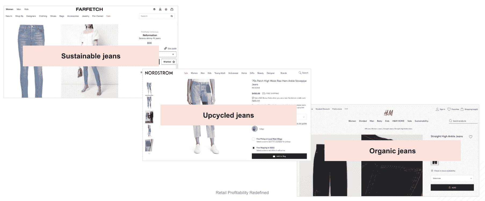

此外，该模型（定制开发的 NN 测量上下文相似度）寻找可能围绕初始主题（例如环境意识）展开的相似关键词。

## 第三步：评估关键指标的表现

评估关键指标是未来成功概率模型中最重要的步骤之一。在此步骤中，**我们分析如货架份额、时间排名和权重排名等指标**，以全面评估产品表现并推断其未来成功的概率：

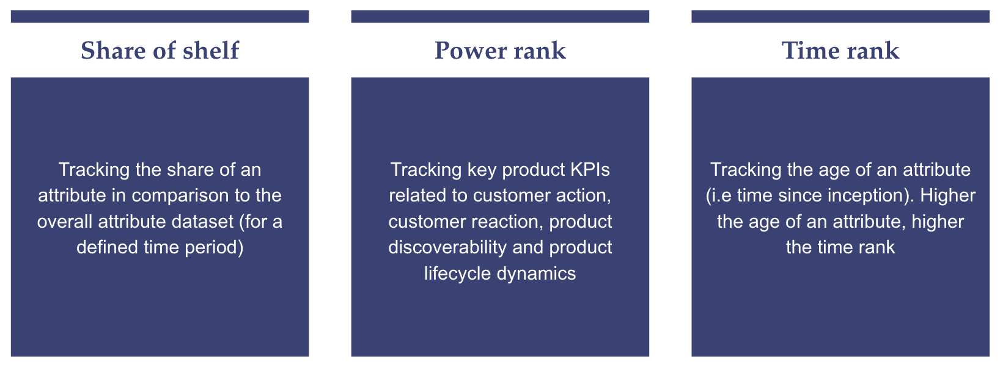

**货架份额**：跟踪某一属性与整体数据的比较份额

“数字货架份额”是指产品在关键词/属性查询中获得的可见性百分比。

**示例：**

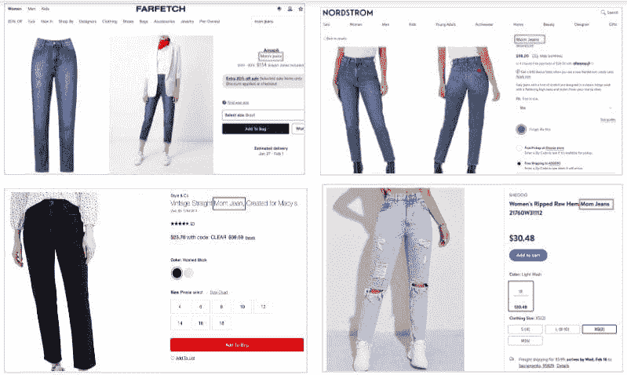

****权重排名:** 一个重要标准，综合信号 KPI 如下：**

**a. 客户反应**（产品评价和评分的数量及速度）

我们通过计算**网站上客户评价的总数以及这些评价的速度**（这些评价发布的时间距离现在有多近）来跟踪这一 KPI，以分析属性级别的客户情感。

**示例：**

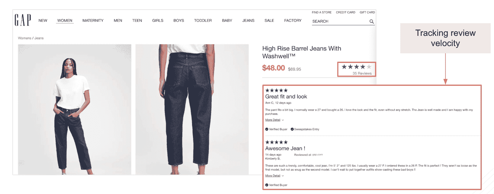

在上述示例中，我们跟踪了 GAP 高腰桶形牛仔裤的评论数量和评论速度。

**b. 客户行动**（跟踪销售速度和产品在不同领域的可见性）

我们的“智能配方抓取”算法可以**通过从多个来源抓取库存数量来跟踪销售速度**，包括产品页面、购物车、Amazon 购买框等，并分析库存水平在某一时间段内的消耗频率。

示例：

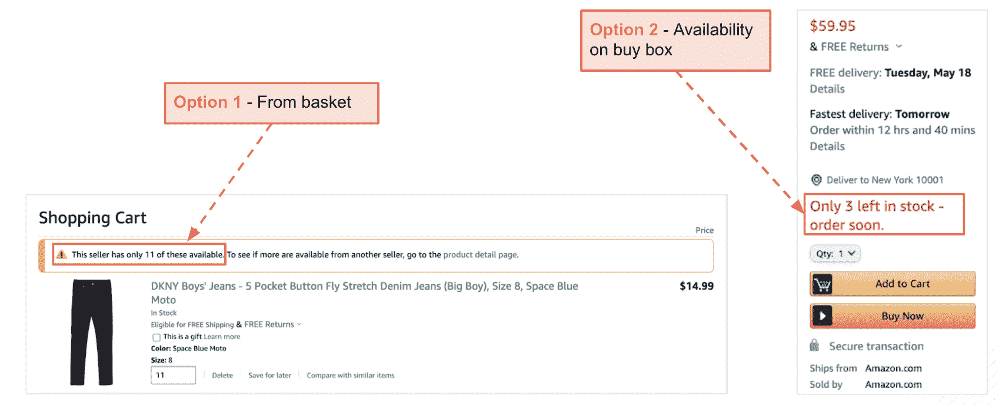

**c. 客户发现性**（使用目标竞争对手领域的搜索算法跟踪产品的可搜索性和受欢迎程度）

从可搜索性角度来看，我们**跟踪竞争对手领域的前 100 款产品**并分析每个属性的份额。

**示例：**

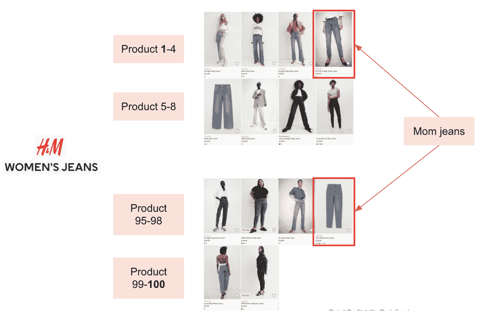

例如，“妈妈牛仔裤”占 H&M 前 100 款产品中的 26%。

我们还跟踪 Google 趋势上每周/每月的属性受欢迎程度。这些数据是**“实际搜索兴趣”的直接反映**，覆盖定义的区域。

**d. 产品生命周期**

我们可以通过跟踪属性层面的关键产品活动来分析产品生命周期动态，例如**产品促销、折扣比率、产品亲和力、产品可用性、补货率、产品缺货的平均时间等**。

**示例：**

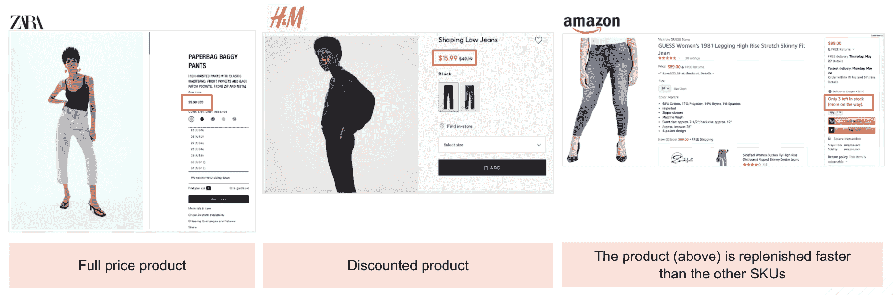

### 3. 时间排名：跟踪属性的年龄

我们可以跟踪每个属性的年龄（自创立以来的时间）。这可以**帮助早期识别新趋势**，并揭示市场中的衰退趋势。

示例

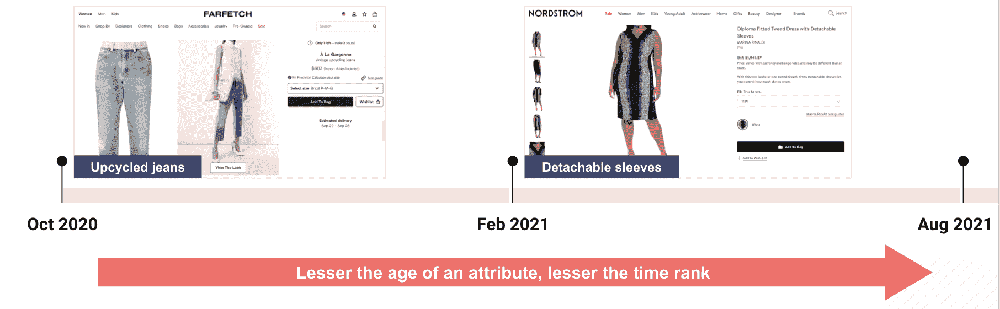

## 第 4 步：分析未来成功的概率

基于第 3 步中涵盖的所有指标的历史表现，我们可以识别出在未来具有高成功概率或可能脱离趋势的趋势/属性。**通过这项分析，制造商和品牌可以提前 6-12 个月计划**生产或订购哪些产品，哪些 SKU 需要备货或投资，以及哪些产品可以停产，以优化库存储存和仓储，节省成本和开销，并以计划性和数据驱动的方式满足消费者需求。

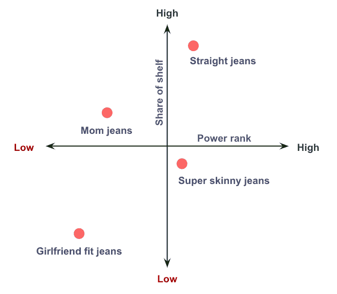

在上述示例中，我们分析了‘直筒牛仔裤’在过去 24 个月的关键指标表现。通过应用我们的分析方法，我们可以预测直筒牛仔裤在未来几个月的成功概率。

## 数据分析为零售企业解答的问题

如本文所述的未来成功概率模型，**是一种基于一系列预设指标和属性的市场驱动方法，用于识别特定产品属性的未来趋势和成功概率**。它基于可靠的实时和历史数据、深入的数据分析、直观的智能以及市场和消费者趋势，回答了许多涉及关键业务领域的主要问题。让我们看看未来成功概率模型能够回答的一些问题：

+   我应该关注哪些新趋势？

+   我应该如何调整既定趋势以最大化成功的机会？

+   既定趋势是否在增强？

+   既定趋势是否在减弱？

## 最后总结：面向未来的零售数据驱动分析

当前零售和消费者偏好的变化速度使得零售企业必须利用先进的零售技术和 AI 分析的力量。零售企业的成功将主要取决于它们在将数据作为战略决策工具的有效性。利用高级分析将帮助零售商获得洞察，以识别未来趋势和消费者偏好，为零售业务的未来做准备，并做出数据驱动的决策，从而对未来结果产生积极影响。这正是 Intelligence Node 最新的未来成功概率模型旨在为零售生态系统提供的。它是一种解决方案，将通过分析和提取大量数据、参数和属性的洞察，赋能品牌、零售商和制造商，提供**可操作的对未来可能性的洞察** - 使他们能够精准地做出制造、采购、定价和产品组合决策。

**[Yasen Dimitrov](https://www.linkedin.com/in/yasen-g-dimitrov-b6b7904/)** 是 **[Intelligence Node](https://www.intelligencenode.com/)** 的联合创始人兼首席分析官，该平台通过专利 AI 提供 99% 的数据准确性。

### 更多相关主题

+   [从人工智能到机器学习再到…](https://www.kdnuggets.com/2022/08/evolution-artificial-intelligence-machine-learning-data-science.html)

+   [使用精调的 SciBERT NER 模型和 Neo4j 分析科学文章](https://www.kdnuggets.com/2021/12/analyzing-scientific-articles-finetuned-scibert-ner-model-neo4j.html)

+   [使用 SQL 分析多样性与包容性](https://www.kdnuggets.com/2022/11/analyzing-diversity-inclusion-sql.html)

+   [掌握数据分析的力量：四种数据分析方法](https://www.kdnuggets.com/2023/03/master-power-data-analytics-four-approaches-analyzing-data.html)

+   [数据分析：四种数据分析方法及其如何…](https://www.kdnuggets.com/2023/04/data-analytics-four-approaches-analyzing-data-effectively.html)

+   [从 Oracle 到 AI 数据库：数据存储的演变](https://www.kdnuggets.com/2022/02/oracle-databases-ai-evolution-data-storage.html)
