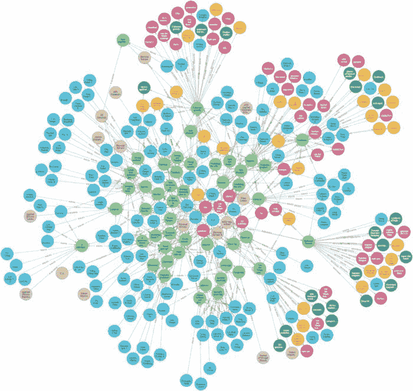
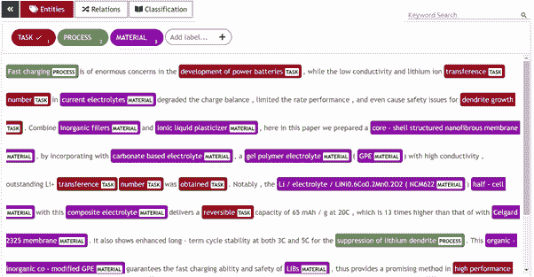
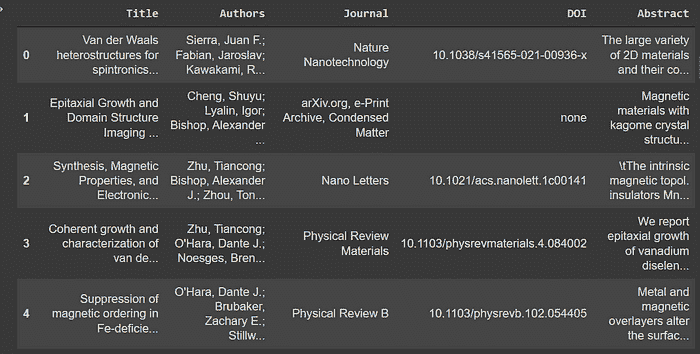
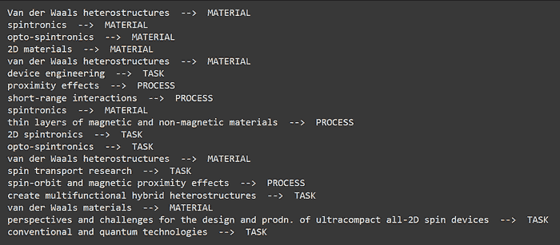
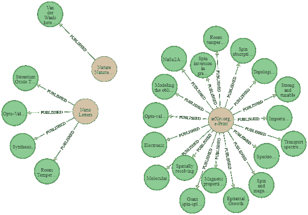
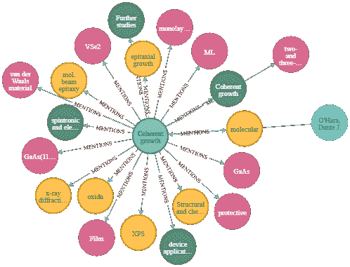
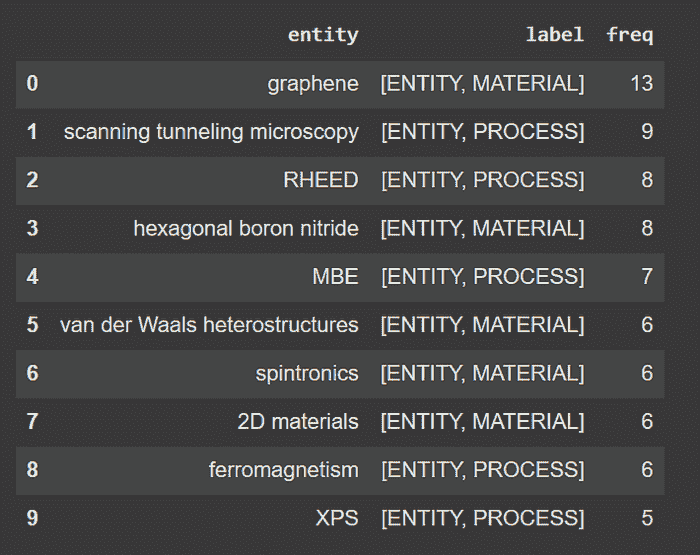
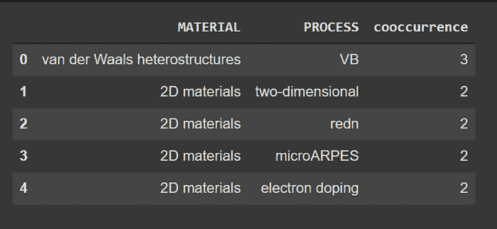
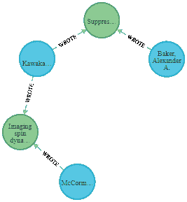

# 使用微调的 SciBERT NER 模型和 Neo4j 分析科学文章

> 原文：[`www.kdnuggets.com/2021/12/analyzing-scientific-articles-finetuned-scibert-ner-model-neo4j.html`](https://www.kdnuggets.com/2021/12/analyzing-scientific-articles-finetuned-scibert-ner-model-neo4j.html)

评论

**由 [Khaled Adrani](https://www.linkedin.com/in/khaled-adrani/)，UBIAI**



作者提供的图片：科学文章的知识图谱

据[估计](https://ncses.nsf.gov/pubs/nsb20206/)，每年发表约 180 万篇文章，分布在大约 28,000 个期刊中。出版物的产出在过去十年中每年增长了 4%，从 2008 年到 2018 年从 180 万增长到 260 万。但实际上谁在阅读这些论文呢？[根据 2007 年的一项研究](https://www.smithsonianmag.com/smart-news/half-academic-studies-are-never-read-more-three-people-180950222/)，阅读这些论文的人并不多：一半的学术论文仅由作者和期刊编辑阅读。手动分析文章是繁琐且耗时的。因此，为研究人员提供一个能够快速提取和分析文章信息的工具，将对加速新发现产生巨大的影响。

知识图谱 KG 是快速和高效分析信息的理想解决方案。它们表示现实世界实体（如对象和概念）之间的网络，并提供它们之间的关系。这些信息通常存储在图形数据库中，并以图形结构可视化。然而，手动构建知识图谱是一项耗时的任务。幸运的是，随着机器学习和自然语言处理的最新进展，命名实体识别（NER）得到了救援。

在本文中，我们将使用 Neo4j 图形数据库和微调的 SciBERT 模型分析科学摘要数据集。之后，我们将查询数据以回答一些问题，作为我们对该语料库的分析。本文假设你具有 NLP 和 Neo4j 的基本知识。

**模型训练**

我们将使用的 NER 模型基于 SciBERT，并通过对材料、过程和任务的注释进行了微调：

+   材料：表示摘要中提到的任何材料

+   过程：表示实验中使用的过程或方法

+   任务：表示要进行的研究任务

对于注释部分，我们使用了[UBIAI 文本注释工具](https://ubiai.tools/)，并将注释导出为 IOB 格式，如下所示：



作者提供的图片：UBIAI 文本注释工具

有关如何使用 UBIAI 生成训练数据和微调 NER 模型的更多信息，请查看以下文章：

+   [介绍 UBIAI：适用于 NLP 应用的易用文本注释工具](https://chatbotslife.com/introducing-ubiai-easy-to-use-text-annotation-for-nlp-applications-74a2401fa725?gi=61b6ebb7114d)

+   [如何使用 spaCy 3 对 BERT Transformer 进行联合实体和关系提取分类器的训练](https://towardsdatascience.com/how-to-train-a-joint-entities-and-relation-extraction-classifier-using-bert-transformer-with-spacy-49eb08d91b5c)

+   [如何使用 spaCy 3 对 BERT Transformer 进行微调](https://towardsdatascience.com/how-to-fine-tune-bert-transformer-with-spacy-3-6a90bfe57647)

**设置**

我们将在 Google Collaboratory 上工作。显然，我们将使用 Python。我们挂载了包含数据集和模型的 Google 云端硬盘。我们还需要安装各种依赖项。

```py
#Mount google drive
from google.colab import drive
drive.mount(‘/content/drive’)
!pip install  neo4j
!pip install -U spacy
!pip install -U pip setuptools wheel
!python -m spacy download en_core_web_trf
!wget https://developer.nvidia.com/compute/cuda/9.2/Prod/local_installers/cuda-repo-ubuntu1604-9-2-local_9.2.88-1_amd64 -O cuda-repo-ubuntu1604-9-2-local_9.2.88-1_amd64.deb
!dpkg -i cuda-repo-ubuntu1604-9-2-local_9.2.88-1_amd64.deb
!apt-key add /var/cuda-repo-9-2-local/7fa2af80.pub
!apt-get update
!apt-get install cuda-9.2
!pip install torch==1.7.1+cu92 torchvision==0.8.2+cu92 torchaudio==0.7.2 -f https://download.pytorch.org/whl/torch_stable.html
!pip install -U spacy[cuda92,transformers]
```

让我们加载我们的 NER 模型：

```py
import spacy
nlp = spacy.load("/content/drive/MyDrive/Public/model_science/model-best")
```

**数据准备**

数据集包含了主要作者撰写并发表在各种科学期刊上的科学文章的摘要。我们还对这些文章中提到的实体感兴趣。因此，你可以清楚地看到我们的图谱将如何结构化。让我们加载数据并查看一些示例：

```py
import pandas as pd
path = "/content/drive/MyDrive/Public/Database_ABI_updated.csv"
df = pd.read_csv(path)[["Title","Authors","Journal","DOI","Abstract"]]
df.head()
```



我们数据集的一个样本

为了构建我们的知识图谱，我们将添加作者、期刊和具有其属性的文章，然后添加它们之间的现有关系。

我们从提取作者列表开始。需要进行一些预处理。每篇文章通常有多个作者，因此我们将包含作者姓名的字符串转换为列表。我们还需要通过对实体进行哈希来生成 ids。

```py
import hashlib
ls = list(df.Authors)
ls_authors = []
for e in ls:
  sep = ";"
if ";" in e:
  sep = ";"
else:
   sep = ","
ls_authors.extend(e.split(sep))
print(len(ls_authors))
ls_authors = list(set(ls_authors))
print(len(ls_authors))
def hash_text(text):
   return hashlib.sha256(str(text).encode('utf-8')).hexdigest()
authors = []
for e in ls_authors:
authors.append({"name":e,"id":hash_text(e)})
```

下面是获取所有期刊列表的代码：

```py
journals = []
for j in list(df.Journal.unique()):
   journals.append({"name":j,"id":hash_text(j)})
journals[0]
```

对于这些文章，我们将把数据框转换为字典列表。每篇文章将把其字典的属性作为图谱中的属性（例如名称、作者列表等）。

```py
import copy
records = df.to_dict("records")
def extract_authors(text):
   ls_authors = []
   sep = ";"
   if ";" in text:
     sep = ";"
   else:
     sep = ","
   ls_authors.extend(text.split(sep))
   return ls_authors
articles = copy.deepcopy(records)
for r in articles:
    r["Authors"] = extract_authors(r['Authors'])
```

为了从每篇文章中提取实体，我们将其标题和摘要结合起来作为待分析的文本。同时，我们通过将其文本内容进行哈希来添加其自身的 id：

```py
for article in articles:
  article["text"]= article["Title"]+" "+article["Abstract"]
  article["id"] = hash_text(article["text"])
article
```

现在，这个函数作为一个可重用的代码来处理文档列表对我很有帮助。我们的实体标签是：

+   过程

+   材料

+   任务

```py
def extract_ents(articles,nlp):
  texts = []
  for article in articles:
    texts.append(article["text"])
  docs = list()
  for doc in nlp.pipe(texts, disable=["tagger", "parser"]):
    dictionary=dict.fromkeys(["text", "annotations"])
    dictionary["text"]= str(doc)
    dictionary['id'] =  hash_text(dictionary["text"])
    annotations=[]
    for e in doc.ents:
      ent_id = hash_text(e.text)
      ent = {"start":e.start_char,"end":e.end_char, "label":e.label_.upper(),"text":e.text,"id":ent_id}
    annotations.append(ent)
    dictionary["annotations"] = annotations
    docs.append(dictionary)
  return docs
docs = extract_ents(articles,nlp)
```

让我们看看从第一篇文章中提取的实体是什么：

```py
for e in docs[0]['annotations']:
  print(e['text'],' --> ',e['label'])
```



文章中存在的实体示例

最后，我们将每个字典添加到文章列表中其适当的文章字典中：

```py
for i in range(len(docs)):
  articles[i]['annotations'] = copy.deepcopy(docs[i]['annotations'])
```

**创建知识图谱**

数据准备已经完成。现在是时候使用 Neo4j 插入和操作这些数据了！

我们定义了一个函数，用于与我们的[Neo4j Aura 数据库](https://neo4j.com/cloud/aura/)进行通信。

```py
from neo4j import GraphDatabase
import pandas as pd
uri ="your uri here"
user="your username here"
password='your password here'
driver = GraphDatabase.driver(uri,auth=(user, password))
def neo4j_query(query, params=None):
  with driver.session() as session:
    result = session.run(query, params)
    return pd.DataFrame([r.values() for r in result],    columns=result.keys())
```

这些是我们用来填充数据库的查询，它们非常直接。

```py
#create journals
neo4j_query("""
UNWIND $data as journal
MERGE (j:JOURNAL {id:journal.id})
SET j.name = journal.name
RETURN count(j)
""",{"data":journals})
#create authors
neo4j_query("""
UNWIND $data as author
MERGE (a:AUTHOR {id:author.id})
SET a.name = author.name
RETURN count(a)
""",{"data":authors})
#create articles
neo4j_query("""
UNWIND $data as row
MERGE (a:ARTICLE{id:row.id})
ON CREATE SET a.title = row.Title, a.DOI = row.DOI, a.abstract = row.Abstract,
a.authors = row.Authors, a.journal=row.Journal
RETURN count(*)
""", {'data': articles})
# Match articles with their authors
neo4j_query("""
MATCH (a:ARTICLE)
WITH a
UNWIND a.authors as name
MATCH (author:AUTHOR) where author.name = name
MERGE (author)-[:WROTE]->(a)
""")
# Match articles with their journals
neo4j_query("""
MATCH (a:ARTICLE)
WITH a
MATCH (j:JOURNAL) where j.name = a.journal
MERGE (j)-[:PUBLISHED]->(a)
""")
```



作者提供的图像：三本期刊及其发表的文章

添加实体有点棘手。这个查询由三部分组成：

+   首先，我们将数据库中的每个文章节点与我们文章列表中的字典进行匹配。UNWIND 帮助我们遍历列表，每次获取一篇文章。

+   其次，对于每个实体，我们如果它不存在则创建它，或者使用 MERGE 来匹配它。之后，实体将与当前文章连接。

+   最后，我们为每个实体添加标签 PROCESS、MATERIAL 或 TASK，标签的值已经包含在一个同名属性中。然后我们继续删除该属性。

```py
# Add entities (Material, Process, Task) and match them with any article that mentions them.
neo4j_query("""
UNWIND $data as row
MATCH (a:ARTICLE) where row.id = a.id
WITH a, row.annotations as entities
UNWIND entities as entity
MERGE (e:ENTITY {id:entity.id})
ON CREATE SET
e.name = entity.text,
e.label = entity.label
MERGE (a)-[m:MENTIONS]->(e)
ON CREATE SET m.count = 1
ON MATCH SET m.count = m.count + 1
WITH e as e
CALL apoc.create.addLabels( id(e), [ e.label ] )
YIELD node
REMOVE node.label
RETURN node
""", {'data': articles})
```



作者提供的图片：一篇文章及其连接的节点

**摘要分析**

最终，我们来到了最有趣的部分！

假设你是一名自然语言处理（NLP）专家，与一位物理学专家合作。他希望你分析他认为非常有趣的几篇科学论文的摘要。他给你四个问题：

1) 最受欢迎的材料和过程

2) 最受欢迎的作者

3) 材料和过程之间的最高共现

4) 两个给定作者之间的最短路径

让我们使用 Neo4j 来回答这些问题！

要找出在整个语料库中最受欢迎的材料和过程，我们需要计算一个实体与期刊的关系数，以查看它们出现了多少次：

```py
neo4j_query("""
MATCH (e) where e:PROCESS OR e:MATERIAL
MATCH (e)-[]-(a:ARTICLE)-[]-(j:JOURNAL)
RETURN e.name as entity, labels(e) as label, count(*) as freq ORDER by freq DESC LIMIT 10
""")
```



我们语料库中的十大热门材料和过程

最受欢迎的作者可以使用相同的推理来获得，以下是查询语句：

```py
neo4j_query("""
MATCH (a:AUTHOR)-[]-(ar:ARTICLE)-[]-(j:JOURNAL)
RETURN a.name as author, count(*) as freq
ORDER BY freq DESC
LIMIT 10
""")
```

现在，共现分析是计算文档中一对实体的出现次数。例如，我们想知道某个过程和某种材料在同一篇文章中一共提到了多少次。

```py
neo4j_query("""
MATCH (m:MATERIAL)<-[:MENTIONS]-(a:ARTICLE)-[:MENTIONS]->(p:PROCESS)
WHERE id(m) < id(p)
RETURN m.name as MATERIAL, p.name as PROCESS, count(*) as cooccurrence
ORDER BY cooccurrence
DESC LIMIT 5
""")
```



共现分析输出

我们可以看到，材料范德华异质结构和术语 VB 在整个语料库中一共提到了三次。VB 是价带（Valence Band）的缩写，表示电子可以跃迁到导带的最高能量，它在范德华结构中扮演着重要角色。通过我们的知识图谱，我们在没有任何先验知识的情况下语义上发现了这种相关性！这样的分析可以帮助我们发现科学概念之间的新连接和未曾发现的关联。

最后，我们希望找到两个给定作者之间的最短路径，为此，我们将每个作者与他们各自的 ID 匹配，使用预定义的函数 shortestPath 作为输入，然后得到结果。我们直接在 Neo4j 浏览器上运行了这个查询，以便获得图形图片。

```py
MATCH (a1:AUTHOR ),
(a2:AUTHOR ),
p = shortestPath((a1)-[*]-(a2))
where a1.id = '6a2552ac2861474da7da6ace1240b92509f56a6ec894d3e166b3475af81e65ae' AND a2.id='3b7d8b78fc7b097e2fd29c2f12df0abc90537971e2ac5c774d677bcdf384a3b7'
RETURN p
```



作者提供的图片：两个给定作者之间的最短路径

有趣的是，我们可以预测这两位作者可能需要一个共同的文章来进行研究，或者他们实际上可以以某种形式合作。可视化有意义的关系在做出明智决策时至关重要。

**结论**

这展示了将命名实体识别与知识图谱结合在文本挖掘中的力量。我们没有深入细节，因为我们想更多地展示处理文本语义分析的工作流程。希望你已经学到了一些东西，未来我们将深入探讨更多内容！

如果你有任何问题或想为你的具体情况创建自定义模型，请在下方留言或通过电子邮件联系 admin@ubiai.tools。

在 Twitter 上关注我们 [@UBIAI5](https://twitter.com/UBIAI5)

**简介：[Khaled Adrani](https://www.linkedin.com/in/khaled-adrani/)** 是一名计算机科学工程师及 UBIAI 实习生。

[原文](https://medium.com/ubiai-nlp/analyzing-scientific-documents-with-fine-tuned-scibert-ner-model-and-neo4j-133015a29418)。经许可转载。

**相关：**

+   使用 AWS 云上的 ML 构建无服务器新闻数据管道

+   关键短语提取的元学习

+   NLP 中不同词嵌入技术的终极指南

* * *

## 我们的前三大课程推荐

 1\. [谷歌网络安全证书](https://www.kdnuggets.com/google-cybersecurity) - 快速开启网络安全职业生涯。

 2\. [谷歌数据分析专业证书](https://www.kdnuggets.com/google-data-analytics) - 提升你的数据分析技能

 3\. [谷歌 IT 支持专业证书](https://www.kdnuggets.com/google-itsupport) - 支持你的组织进行 IT 相关工作

* * *

### 更多相关话题

+   [通过智能分析未来成功的概率……](https://www.kdnuggets.com/2022/02/analyzing-probability-future-success-intelligence-node-attributes-evolution-model.html)

+   [数据分析：分析数据的四种方法及如何……](https://www.kdnuggets.com/2023/04/data-analytics-four-approaches-analyzing-data-effectively.html)

+   [使用 SQL 分析多样性与包容性](https://www.kdnuggets.com/2022/11/analyzing-diversity-inclusion-sql.html)

+   [掌握数据分析的力量：分析数据的四种方法](https://www.kdnuggets.com/2023/03/master-power-data-analytics-four-approaches-analyzing-data.html)

+   [任何模型：图像分割的基础模型](https://www.kdnuggets.com/2023/07/segment-anything-model-foundation-model-image-segmentation.html)

+   [可解释的预测和实时预测的最新深度学习方法](https://www.kdnuggets.com/2021/12/sota-explainable-forecasting-and-nowcasting.html)
