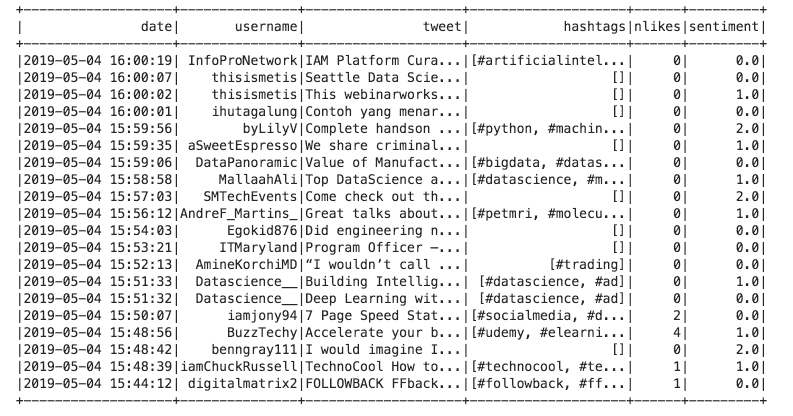
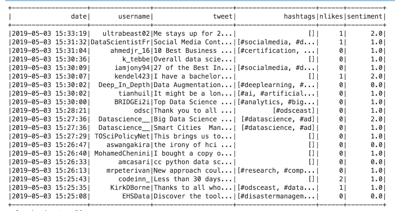
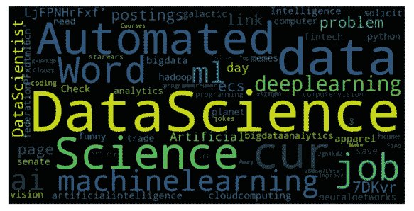

# 使用 Spark、Optimus 和 Twint 进行几分钟内的推文分析

> 原文：[`www.kdnuggets.com/2019/05/analyzing-tweets-nlp-spark-optimus-twint.html/2`](https://www.kdnuggets.com/2019/05/analyzing-tweets-nlp-spark-optimus-twint.html/2)

 comments

### 直接将情感添加到 Spark 数据框中


将这段代码转换为 Spark 代码很简单。这段代码可以帮助你转换其他代码。所以让我们开始导入 Spark 的用户定义函数模块：

```py

from pyspark.sql.functions import udf

```

然后我们将把上面的代码转换为一个函数：

```py

def apply_blob(sentence):
    temp = TextBlob(sentence).sentiment[0]
    if temp == 0.0:
        return 0.0 # Neutral
    elif temp >= 0.0:
        return 1.0 # Positive
    else:
        return 2.0 # Negative

```

之后我们将把函数注册为 Spark UDF：

```py

sentiment = udf(apply_blob)

```

那么，要将函数应用于整个数据框，我们需要写：

```py

clean_tweets.withColumn("sentiment", sentiment(clean_tweets['tweet'])).show()

```

我们将看到：



### 情感分析，好的程序员方式（使代码模块化）


这实际上不是优质代码。让我们将其转换为函数，以便反复使用。

第一部分是设置一切：

```py

%load_ext autoreload
%autoreload 2

# Import twint
import sys
sys.path.append("twint/")

# Set up TWINT config
import twint
c = twint.Config()

# Other imports
import seaborn as sns
import os
from optimus import Optimus
op = Optimus()

# Solve compatibility issues with notebooks and RunTime errors.
import nest_asyncio
nest_asyncio.apply()

# Disable annoying printing

class HiddenPrints:
    def __enter__(self):
        self._original_stdout = sys.stdout
        sys.stdout = open(os.devnull, 'w')

    def __exit__(self, exc_type, exc_val, exc_tb):
        sys.stdout.close()
        sys.stdout = self._original_stdout

```

最后一部分是一个类，它将移除 Twint 的自动打印，因此我们只看到数据框。

上述所有内容可以总结为这些函数：

```py

from textblob import TextBlob
from pyspark.sql.functions import udf
from pyspark.sql.types import DoubleType

# Function to get sentiment
def apply_blob(sentence):
    temp = TextBlob(sentence).sentiment[0]
    if temp == 0.0:
        return 0.0 # Neutral
    elif temp >= 0.0:
        return 1.0 # Positive
    else:
        return 2.0 # Negative

# UDF to write sentiment on DF
sentiment = udf(apply_blob, DoubleType())

# Transform result to pandas
def twint_to_pandas(columns):
    return twint.output.panda.Tweets_df[columns]

def tweets_sentiment(search, limit=1):
    c.Search = search
    # Custom output format
    c.Format = "Username: {username} |  Tweet: {tweet}"
    c.Limit = limit
    c.Pandas = True
    with HiddenPrints():
        print(twint.run.Search(c))

    # Transform tweets to pandas DF
    df_pd = twint_to_pandas(["date", "username", "tweet", "hashtags", "nlikes"])

    # Transform Pandas DF to Optimus/Spark DF
    df = op.create.data_frame(pdf= df_pd)

    # Clean tweets
    clean_tweets = df.cols.remove_accents("tweet") \
                 .cols.remove_special_chars("tweet")

    # Add sentiment to final DF
    return clean_tweets.withColumn("sentiment",    sentiment(clean_tweets['tweet']))

```

所以要获取推文并添加情感，我们使用：

```py
df_result = tweets_sentiment("data science", limit=1)
```

```py
df_result.show()
```



就这样 :)

让我们看看情感的分布：

```py

df_res_pandas = df_result.toPandas()
sns.distplot(df_res_pandas['sentiment'])
sns.set(rc={'figure.figsize':(11.7,8.27)})

```


### 使用 Twint 做更多事情

要查看如何做，请访问：[`amueller.github.io/word_cloud/auto_examples/masked.html`](https://amueller.github.io/word_cloud/auto_examples/masked.html)

我们可以做更多的事情，这里我将展示如何创建一个简单的函数来获取推文，以及如何从中构建词云。

所以要从简单的搜索中获取推文：

```py

def get_tweets(search, limit=100):
    c = twint.Config()
    c.Search = search
    c.Limit = limit
    c.Pandas = True
    c.Pandas_clean = True

with HiddenPrints():
        print(twint.run.Search(c))
    return twint.output.panda.Tweets_df[["username","tweet"]]
```

有了这个，我们可以非常轻松地获取数千条推文：

```py

tweets = get_tweets("data science", limit=10000)

tweets.count() # 10003
```

要生成词云，我们只需这样做：

```py

from wordcloud import WordCloud, STOPWORDS, ImageColorGenerator
import matplotlib.pyplot as plt
%matplotlib inline

text = tweets.tweet.values

# adding movie script specific stopwords
stopwords = set(STOPWORDS)
stopwords.add("https")
stopwords.add("xa0")
stopwords.add("xa0'")
stopwords.add("bitly")
stopwords.add("bit")
stopwords.add("ly")
stopwords.add("twitter")
stopwords.add("pic")

wordcloud = WordCloud(
    background_color = 'black',
    width = 1000,
    height = 500,
    stopwords = stopwords).generate(str(text))
```

我添加了一些在推文中常见的停用词，这些词对分析没有影响。要显示它，我们使用：

```py

plt.imshow(wordcloud, interpolation=’bilinear’)
plt.axis(“off”)
plt.rcParams[‘figure.figsize’] = [10, 10]

```

你将得到：



美观但不算太多。如果我们想要好的代码，我们需要模块，所以，让我们将其转换为函数：

```py

def generate_word_cloud(tweets):

    # Getting the text out of the tweets
    text = tweets.tweet.values

    # adding movie script specific stopwords
    stopwords = set(STOPWORDS)
    stopwords.add("https")
    stopwords.add("xa0")
    stopwords.add("xa0'")
    stopwords.add("bitly")
    stopwords.add("bit")
    stopwords.add("ly")
    stopwords.add("twitter")
    stopwords.add("pic")

wordcloud = WordCloud(
        background_color = 'black',
        width = 1000,
        height = 500,
        stopwords = stopwords).generate(str(text))

    plt.imshow(wordcloud, interpolation='bilinear')
    plt.axis("off")
    plt.rcParams['figure.figsize'] = [10, 10]

```

然后我们只需运行：

```py

tweets = get_tweets("artificial intelligence", limit=1000)
generate_word_cloud(tweets)

```


### 自己试试


使用这个库你可以做更多的事情。其他一些函数：

+   `twint.run.Search()` - 使用搜索过滤器获取推文（普通）；

+   `twint.run.Followers()` - 获取 Twitter 用户的粉丝；

+   `twint.run.Following()` - 获取谁关注了一个 Twitter 用户；

+   `twint.run.Favorites()` - 获取 Twitter 用户喜欢的推文；

+   `twint.run.Profile()` - 从用户的个人资料中获取推文（包括转发）；

+   `twint.run.Lookup()` - 从用户的资料中获取信息（简介、位置等）。

实际上，你可以从终端使用它。为此，只需运行：

```py

pip3 install --upgrade -e git+https://github.com/twintproject/twint.git@origin/master#egg=twint

```

然后只需进入 twint 文件夹：

```py

cd src/twint

```

最后，你可以例如运行：

```py

twint -u TDataScience --since 2019-01-01 --o TDS.csv --csv

```

我在这里获取了今年[TDS 团队](https://medium.com/@TDSteam)的所有推文（目前 845 条）。如果你需要，可以下载 CSV 文件：

[**FavioVazquez/twitter_optimus_twint**](https://github.com/FavioVazquez/twitter_optimus_twint/blob/master/TDS.csv) 

*使用 Twint、Optimus 和 Apache Spark 分析推文。 - FavioVazquez/twitter_optimus_twint*

### 奖励（结果的扩展）


我们来获取 10000 条推文并分析它们的情感，为什么不呢。为此：

```py

df_result = tweets_sentiment("data science", limit=100000)

df_result.show()
```

实际上，这个过程花了将近 10 分钟，所以请采取必要的预防措施。从 CLI 获取推文可能更快，然后只需应用函数。我们来看看我们有多少条推文：

```py
df_results.count()
```

我们有 10031 条带有情感的推文！你也可以用它们来训练其他模型。

感谢阅读这篇文章，希望它能帮助你理解数据科学以及你当前的工作。如果你想了解更多关于我的信息，可以关注我的推特：

[**Favio Vázquez (@FavioVaz) | Twitter**](https://twitter.com/FavioVaz)

*最新推文来自 Favio Vázquez (@FavioVaz)。数据科学家。物理学家和计算工程师。我有…* [twitter.com](https://twitter.com/faviovaz)

**个人简介：[Favio Vazquez](https://www.linkedin.com/in/faviovazquez/)** 是一名物理学家和计算机工程师，专注于数据科学和计算宇宙学。他热衷于科学、哲学、编程和音乐。他是西班牙语数据科学出版物 Ciencia y Datos 的创始人。他喜欢新的挑战，和优秀的团队合作，并解决有趣的问题。他参与了 Apache Spark 的合作，帮助改进 MLlib、Core 和文档。他热爱将自己的知识和专业技能应用于科学、数据分析、可视化和自动学习，以帮助世界变得更美好。

[原始](https://towardsdatascience.com/analyzing-tweets-with-nlp-in-minutes-with-spark-optimus-and-twint-a0c96084995f)。经许可转载。

**相关：**

+   使用 Optimus 进行数据科学第二部分：设置你的 DataOps 环境

+   使用 Optimus 进行数据科学第一部分：简介

+   Optimus v2：轻松实现敏捷数据科学工作流

* * *

## 我们的前三大课程推荐

 1\. [Google 网络安全证书](https://www.kdnuggets.com/google-cybersecurity) - 快速入门网络安全职业生涯。

 2\. [Google 数据分析专业证书](https://www.kdnuggets.com/google-data-analytics) - 提升你的数据分析技能

 3\. [谷歌 IT 支持专业证书](https://www.kdnuggets.com/google-itsupport) - 支持您组织中的 IT

* * *

### 了解更多相关主题

+   [使用微调的 SciBERT NER 模型和 Neo4j 分析科学文章](https://www.kdnuggets.com/2021/12/analyzing-scientific-articles-finetuned-scibert-ner-model-neo4j.html)

+   [数据分析：四种数据分析方法及其有效应用](https://www.kdnuggets.com/2023/04/data-analytics-four-approaches-analyzing-data-effectively.html)

+   [利用智能分析未来成功的可能性……](https://www.kdnuggets.com/2022/02/analyzing-probability-future-success-intelligence-node-attributes-evolution-model.html)

+   [使用 SQL 分析多样性与包容性](https://www.kdnuggets.com/2022/11/analyzing-diversity-inclusion-sql.html)

+   [掌握数据分析的力量：四种数据分析方法](https://www.kdnuggets.com/2023/03/master-power-data-analytics-four-approaches-analyzing-data.html)

+   [用 Hugging Face 和 Gradio 在 5 分钟内构建 AI 聊天机器人](https://www.kdnuggets.com/2023/06/build-ai-chatbot-5-minutes-hugging-face-gradio.html)
